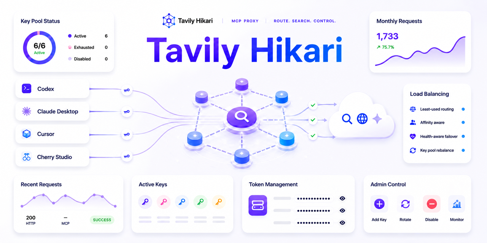

# Tavily Hikari

[](https://github.com/IvanLi-CN/tavily-hikari/releases)
[](https://github.com/IvanLi-CN/tavily-hikari/actions/workflows/ci.yml)
[](rust-toolchain.toml)
[](web/package.json)
[](https://ivanli-cn.github.io/tavily-hikari/)



Tavily Hikari 是一个面向 MCP (Model Context Protocol) 的 Tavily 代理层，基于 Rust + Axum 构建，具备多密钥轮询、匿名透传与细粒度审计能力。后端通过 SQLite 维护密钥状态与请求日志，前端使用 React + Vite 提供实时的可视化运维界面，可直接查看 Key 健康、告警与历史流量。

## 文档站与 Storybook

- 公开文档站：[ivanli-cn.github.io/tavily-hikari](https://ivanli-cn.github.io/tavily-hikari/)
- Storybook：[ivanli-cn.github.io/tavily-hikari/storybook.html](https://ivanli-cn.github.io/tavily-hikari/storybook.html)
- 本地 docs-site：`cd docs-site && bun install --frozen-lockfile && bun run dev`
- 本地 Storybook：`cd web && bun install --frozen-lockfile && bun run storybook`

## Worktree Bootstrap 合同

- 先在 primary worktree 运行一次 `bun install --frozen-lockfile`。root `prepare` 会安装 shared `post-checkout` hook，并在 `PATH` 上存在 `lefthook` 二进制时一并刷新 commit hooks。
- linked worktree 第一次 checkout 现在会自动执行 best-effort bootstrap：从 primary worktree `copy-missing` root `.env` / `.env.*`，补齐缺失的 root / `web` / `docs-site` Bun 依赖，并执行一次 `cargo fetch --locked` 预热。
- 自动路径永远不会阻断 checkout；缺少 `lefthook`、`bun`、`cargo` 或 source env 文件时只会打印 warning。
- 需要显式修复时运行 `bun run worktree:setup`。它会强制重跑同一套恢复步骤；只有在工具已存在但对应恢复命令本身失败时才会报错退出。
- 这套合同明确不恢复 `*.db`、`web/dist`、`web/storybook-static`、`downloads/`、浏览器 cache、Playwright 安装态或其他运行期产物。

## 功能亮点

- **多密钥轮询 + 亲和**：SQLite 记录每个 Key 的最近使用时间，并为访问令牌（access token）维护一个短期“亲和”关系——在一段时间窗口内，同一 token 会优先命中同一把 Tavily API key；亲和关系失效或 Key 状态变化（耗尽/禁用）时，再通过全局“最久未使用”策略在健康 Key 间重新分配，以尽量均衡磨损。
- **短 ID 与密钥密级隔离**：每个 Tavily Key 会生成 4 位 nanoid，对外只暴露短 ID；真实 Key 仅管理员 API/Web 控制台可读取。
- **健康巡检**：一旦收到 Tavily 432（额度耗尽）会把 Key 标记为 `exhausted`，并在下一个 UTC 月初或管理员恢复后重新上阵。
- **高匿透传**：仅透传 `/mcp` 与静态资源，自动清洗 `X-Forwarded-*` 等敏感头并重写 `Origin/Referer`，细节见 [`docs/high-anonymity-proxy.md`](docs/high-anonymity-proxy.md)。
- **可视化运维**：`web/` 单页应用展示实时统计、请求日志、管理员操作入口，支持复制真实 Key、软删除/恢复等动作。
- **管理路由升级**：管理端采用 URL Path 路由（如 `/admin/dashboard`、`/admin/tokens/:id`、`/admin/keys/:id`），不再使用旧 hash 子路由。
- **用户控制台 Path 路由**：用户控制台现使用 `/console`、`/console/dashboard`、`/console/tokens` 与 `/console/tokens/:id`；首页 token 引导仍刻意保留 `/#<token>` / `/#<token-id>` hash 兼容，避免把完整 token 带入 path/query 日志面。
- **完整审计**：`request_logs` 表保留 method/path/query、状态码、错误信息、透传/丢弃头部等字段，方便回溯配额损耗与异常请求。
- **生产级 CI/CD**：GitHub Actions 对代码格式、lint、单元测试把关；发版由 PR intent label 驱动（打 tag + GitHub Release + 推送 `ghcr.io` 镜像）。

## 组件与数据流

```
Client → Tavily Hikari (Axum) ──┬─> Tavily upstream (/mcp)
                                ├─> SQLite (api_keys, request_logs)
                                └─> Web SPA (React/Vite, served via /)
```

- 后端：Rust 2024 edition、Axum、SQLx、Tokio；负责 CLI、Key 生命周期、请求透传/审计、静态资源托管。
- 数据层：SQLite 单文件库，包含 `api_keys`（状态、短 ID、配额字段）与 `request_logs`（请求/响应/错误）。
- 前端：React 18 + TanStack Router + Tailwind CSS + shadcn/ui（Radix）+ Vite 5；构建后输出 `web/dist`，由后端静态挂载或通过 Vite Dev Server 代理到 `http://127.0.0.1:58087`。

## 快速开始

### 本地运行

```bash
# 1. 启动代理（示例绑定高位端口，本地开发显式放开管理员接口）
DEV_OPEN_ADMIN=true cargo run -- --bind 127.0.0.1 --port 58087

# 2. （可选）启动前端 Dev Server
cd web && bun install --frozen-lockfile && bun run --bun dev -- --host 127.0.0.1 --port 55173

# 3. 通过管理员接口注册 Tavily key（仅本地开发模式）
curl -X POST http://127.0.0.1:58087/api/keys \
  -H "Content-Type: application/json" \
  -d '{"api_key":"key_a"}'
```

服务启动后可访问 `http://127.0.0.1:58087/health` 验证状态，或在浏览器打开 `http://127.0.0.1:55173` 使用控制台。所有 Tavily key 建议通过管理员 API 或 Web 控制台录入，避免把敏感密钥写入环境变量。

### Docker 部署

CI 在发布时会产出 `ghcr.io/ivanli-cn/tavily-hikari:<tag>` 镜像，可直接运行：

```bash
docker run --rm \
  -p 8787:8787 \
  -v $(pwd)/data:/srv/app/data \
  ghcr.io/ivanli-cn/tavily-hikari:latest
```

镜像已包含 `web/dist`，默认监听 `0.0.0.0:8787` 并把 SQLite 数据写入 `/srv/app/data/tavily_proxy.db`（可通过挂载卷持久化）。容器启动后同样需通过管理员接口或前端控制台为代理注册 Tavily key。

### 二进制发布

GitHub Release 现在会附带 Linux `tar.gz` 二进制包，分别覆盖 `linux/amd64` 与 `linux/arm64`，并同步提供 `SHA256` 校验文件。该二进制把 Web 界面一并内嵌进程序里，运行时不再需要单独的 `web/dist` 目录。

### Docker Compose

仓库内提供了一个最小化的 [`docker-compose.yml`](docker-compose.yml)，用于长期运行或一次性 POC：

```bash
docker compose up -d

# 以管理员身份注入首批 Tavily key
curl -X POST http://127.0.0.1:8787/api/keys \
  -H "X-Forwarded-User: admin@example.com" \
  -H "X-Forwarded-Admin: true" \
  -H "Content-Type: application/json" \
  -d '{"api_key":"key_a"}'
```

- 服务会自动使用 `ghcr.io/ivanli-cn/tavily-hikari:latest`，将 8787 端口暴露到宿主机。
- 通过 `tavily-hikari-data` 卷持久化 `/srv/app/data/tavily_proxy.db`，容器重启不会丢数据。
- 其他 CLI 参数可通过 compose 文件的 `environment` 字段覆写（例如自定义 upstream 或端口）。

若需要运行自定义镜像，可在 compose 文件里将 `image` 替换为 `build: .` 并在本地构建 `web/dist` 后执行 `docker compose up --build`。

## CLI / 环境变量

| Flag / Env                                                                          | 说明                                                                                                                         |
| ----------------------------------------------------------------------------------- | ---------------------------------------------------------------------------------------------------------------------------- |
| `--keys` / `TAVILY_API_KEYS`                                                        | Tavily API key 列表（可选），支持逗号分隔或多次传参，仅用于一次性导入或开发场景；生产环境推荐通过管理员 API/前端控制台录入。 |
| `--upstream` / `TAVILY_UPSTREAM`                                                    | Tavily MCP 上游端点，默认 `https://mcp.tavily.com/mcp`；支持带 path prefix 的反代 URL。                                      |
| `--bind` / `PROXY_BIND`                                                             | 监听地址，默认 `127.0.0.1`。                                                                                                 |
| `--port` / `PROXY_PORT`                                                             | 监听端口，默认 `8787`。建议开发期使用高位端口（如 `58087`）。                                                                |
| `--db-path` / `PROXY_DB_PATH`                                                       | SQLite 文件路径，默认 `tavily_proxy.db`。                                                                                    |
| `--log-format` / `RUNTIME_LOG_FORMAT`                                               | 运行期日志格式，默认 `json`；需要本地 `grep`/迁移期排障时可显式切到 `text`。                                                 |
| `--static-dir` / `WEB_STATIC_DIR`                                                   | Web 静态目录，若缺省且存在 `web/dist` 会自动挂载。                                                                           |
| `--forward-auth-header` / `FORWARD_AUTH_HEADER`                                     | 指定 ForwardAuth 注入的“用户标识”请求头（如 `Remote-Email`）。                                                               |
| `--forward-auth-admin-value` / `FORWARD_AUTH_ADMIN_VALUE`                           | 匹配到该值时视为管理员，可访问 `/api/keys/*` 接口。                                                                          |
| `--forward-auth-nickname-header` / `FORWARD_AUTH_NICKNAME_HEADER`                   | 可选，提供 UI 展示的昵称头（如 `Remote-Name`）。                                                                             |
| `--admin-mode-name` / `ADMIN_MODE_NAME`                                             | 当缺少昵称头时用于覆盖前端显示的管理员名称。                                                                                 |
| `--admin-auth-forward-enabled` / `ADMIN_AUTH_FORWARD_ENABLED`                       | 是否启用旧版 ForwardAuth 管理员校验（默认 `false`；完整旧版 header 配置会为兼容自动启用）。                                  |
| `--admin-auth-builtin-enabled` / `ADMIN_AUTH_BUILTIN_ENABLED`                       | 是否启用内置管理员登录（cookie 会话）（默认 `false`）。                                                                      |
| `--admin-auth-builtin-password-hash` / `ADMIN_AUTH_BUILTIN_PASSWORD_HASH`           | 内置管理员口令哈希（PHC 字符串，推荐）。                                                                                     |
| `--admin-auth-builtin-password` / `ADMIN_AUTH_BUILTIN_PASSWORD`                     | 内置管理员登录口令（不推荐，优先使用口令哈希）。                                                                             |
| `--dev-open-admin` / `DEV_OPEN_ADMIN`                                               | 仅限本地调试的开关，跳过管理员校验（默认 `false`）。                                                                         |
| `--linuxdo-oauth-enabled` / `LINUXDO_OAUTH_ENABLED`                                 | 是否启用 Linux DO Connect OAuth2 用户登录（默认 `false`）。                                                                  |
| `--linuxdo-oauth-client-id` / `LINUXDO_OAUTH_CLIENT_ID`                             | Linux DO OAuth2 客户端 ID（`connect.linux.do` 应用）。                                                                       |
| `--linuxdo-oauth-client-secret` / `LINUXDO_OAUTH_CLIENT_SECRET`                     | Linux DO OAuth2 客户端密钥。                                                                                                 |
| `--linuxdo-oauth-authorize-url` / `LINUXDO_OAUTH_AUTHORIZE_URL`                     | OAuth2 授权端点（默认 `https://connect.linux.do/oauth2/authorize`）。                                                        |
| `--linuxdo-oauth-token-url` / `LINUXDO_OAUTH_TOKEN_URL`                             | OAuth2 换 token 端点（默认 `https://connect.linux.do/oauth2/token`）。                                                       |
| `--linuxdo-oauth-userinfo-url` / `LINUXDO_OAUTH_USERINFO_URL`                       | OAuth2 用户信息端点（默认 `https://connect.linux.do/api/user`）。                                                            |
| `--linuxdo-oauth-scope` / `LINUXDO_OAUTH_SCOPE`                                     | OAuth scope（默认 `user`）。                                                                                                 |
| `--linuxdo-oauth-redirect-url` / `LINUXDO_OAUTH_REDIRECT_URL`                       | 本服务的前端回调地址（例如 `https://tavily.ivanli.cc/console/oauth/linuxdo/callback`）。                                     |
| `--linuxdo-oauth-refresh-token-crypt-key` / `LINUXDO_OAUTH_REFRESH_TOKEN_CRYPT_KEY` | 用于加密落库 LinuxDo refresh token（32 字节原文，或可解码为 32 字节的 base64/base64url）。                                   |
| `--linuxdo-oauth-user-sync-enabled` / `LINUXDO_OAUTH_USER_SYNC_ENABLED`             | 是否启用 LinuxDo 离线每日用户同步调度器（默认 `true`）。                                                                     |
| `--linuxdo-oauth-user-sync-at` / `LINUXDO_OAUTH_USER_SYNC_AT`                       | LinuxDo 离线每日同步时间，按服务器本地时区解释，格式固定 `HH:mm`（默认 `06:20`）。                                           |
| `--linuxdo-credit-enabled` / `LINUXDO_CREDIT_ENABLED`                               | 是否启用 Linux.do Credit 充值支付流程（默认 `false`）。                                                                      |
| `--linuxdo-credit-client-id` / `LINUXDO_CREDIT_CLIENT_ID`                           | Linux.do Credit 应用 Client ID。                                                                                             |
| `--linuxdo-credit-client-secret` / `LINUXDO_CREDIT_CLIENT_SECRET`                   | Linux.do Credit 应用 Client Secret。                                                                                         |
| `--linuxdo-credit-merchant-private-key` / `LINUXDO_CREDIT_MERCHANT_PRIVATE_KEY`     | Linux.do Credit LDC 创建订单签名使用的 Ed25519 商户私钥。                                                                    |
| `--linuxdo-credit-submit-url` / `LINUXDO_CREDIT_SUBMIT_URL`                         | Linux.do Credit LDC 提交订单端点（默认 `https://credit.linux.do/epay/pay/submit.php`）。                                     |
| `--linuxdo-credit-notify-url` / `LINUXDO_CREDIT_NOTIFY_URL`                         | 可选的订单级回调地址，通常为 `https://<你的 Hikari 域名>/api/linuxdo-credit/notify`。                                        |
| `--linuxdo-credit-return-url` / `LINUXDO_CREDIT_RETURN_URL`                         | 可选的支付后浏览器返回地址，通常为 `https://<你的 Hikari 域名>/console/dashboard`。                                          |
| `--linuxdo-credit-test-price-enabled` / `LINUXDO_CREDIT_TEST_PRICE_ENABLED`         | 是否启用 `1 LDC` 购买 `1` 个自然月积分的测试档位（默认 `false`）。                                                           |
| `--user-session-max-age-secs` / `USER_SESSION_MAX_AGE_SECS`                         | 用户登录会话 cookie 的有效期（秒，默认 `1209600`，即 14 天）。                                                               |
| `--oauth-login-state-ttl-secs` / `OAUTH_LOGIN_STATE_TTL_SECS`                       | OAuth 一次性 state 的有效期（秒，默认 `600`）。                                                                              |

首次运行会自动建表。若在 CLI/环境变量里显式传入 `--keys` 或 `TAVILY_API_KEYS`，会同步 `api_keys` 表：**在列表中**的 Key 会被新增或恢复为 `active`；**不在列表中**的 Key 会被标记为 `deleted`。默认推荐通过管理员 API/前端控制台维护 Key 集合。

- `TAVILY_UPSTREAM` 按完整的 MCP 端点解释；如果反代保留了 path prefix，配置值里需要包含最终的 `/mcp` 路径。
- `TAVILY_USAGE_BASE` 可以带 path prefix；Hikari 会在这个 prefix 后继续追加 `/search`、`/extract`、`/crawl`、`/map`、`/research`、`/research/{id}` 与 `/usage`。

## HTTP API 速览

| Method   | Path                   | 说明                                                               | 认证         |
| -------- | ---------------------- | ------------------------------------------------------------------ | ------------ |
| `GET`    | `/health`              | 健康检查，返回 200 代表代理可用。                                  | 无           |
| `GET`    | `/api/summary`         | 汇总成功/失败次数、活跃 Key 数、最近活跃时间。                     | 无           |
| `GET`    | `/api/keys`            | 列出 4 位短 ID、状态、请求统计。                                   | 管理员       |
| `GET`    | `/api/logs?page=1`     | 最近请求日志（分页返回，默认每页 20 条），包含状态码与错误。       | 管理员       |
| `POST`   | `/api/tavily/search`   | Tavily `/search` 的代理入口，供 Cherry Studio 等 HTTP 客户端使用。 | Hikari Token |
| `POST`   | `/api/keys`            | 管理员接口，新增或“反删除”一个 Key。Body: `{ "api_key": "..." }`   | 管理员       |
| `DELETE` | `/api/keys/:id`        | 管理员接口，软删除指定短 ID。                                      | 管理员       |
| `GET`    | `/api/keys/:id/secret` | 管理员接口，返回真实 Tavily Key。                                  | 管理员       |

管理员身份由 Passkey、内置管理员会话、显式启用的旧版 ForwardAuth 或本地 `DEV_OPEN_ADMIN` 判断；控制台仅在管理员会话下显示“复制原始 Key”按钮。

### Cherry Studio 接入示例

Tavily Hikari 通过 `/api/tavily/search` 为 Tavily HTTP API 提供代理与密钥池能力，Cherry Studio 这类直接调用 Tavily HTTP 的客户端只需要改动 Base URL 与 API 密钥来源即可迁移到 Hikari。

- Base URL：`https://<你的 Hikari 域名>/api/tavily`
- API 密钥：在 Tavily Hikari 控制台为当前用户生成的访问令牌 `th-<id>-<secret>`

以 Cherry Studio 为例，可按以下步骤配置：

1. 在 Tavily Hikari **用户总览页**中创建访问令牌（例如 `th-xxxx-xxxxxxxxxxxx`），复制该 token。
2. 打开 Cherry Studio → 设置 → **网络搜索（Web Search）**。
3. 将搜索服务商设置为 **Tavily (API key)**。
4. 将 **API 地址 / API URL** 设置为 `https://<你的 Hikari 域名>/api/tavily`，本地开发时通常为 `http://127.0.0.1:58087/api/tavily`。
5. 将 **API 密钥 / API key** 填写为步骤 1 中复制的 Hikari 访问令牌（完整的 `th-xxxx-xxxxxxxxxxxx`），而不是 Tavily 官方 API key。
6. 可按需在 Cherry 中调整结果数、是否附带答案/日期等选项。

> 安全提醒：不要在 Cherry Studio 中直接填写 Tavily 官方 API key，推荐始终通过 Hikari 颁发的访问令牌间接访问 Tavily。

### CLI + Agent Skills 接入

使用 GitHub Release 资产安装 wrapper，并显式传入你的 Hikari origin 与 Hikari 访问令牌：

```bash
curl -fsSL "https://github.com/IvanLi-CN/tavily-hikari/releases/latest/download/install-tvly-hikari.sh" | bash -s -- \
  --base-url "https://<你的 Hikari 域名>" \
  --token "th-<id>-<secret>"
```

之后通过 Hikari 运行官方 Tavily CLI 命令：

```bash
tvly-hikari search "latest AI agent news" --json
tvly-hikari extract https://example.com --json
tvly-hikari crawl https://example.com/docs --json
tvly-hikari map https://example.com/docs --json
tvly-hikari research "compare MCP and CLI agent search" --json
```

可选安装 Agent Skills：

```bash
npx skills add https://github.com/IvanLi-CN/tavily-hikari --global
```

`tvly-hikari` 会把 Hikari token 以 `0600` 权限写入
`~/.config/tavily-hikari-cli/config.json`，并为官方 `tvly` 注入
`TAVILY_API_BASE_URL=https://<你的 Hikari 域名>/api/tavily` 与
`TAVILY_API_KEY=th-<id>-<secret>`。这里的 token 不是 Tavily 官方 API key。

更完整的 HTTP 代理设计、字段说明与验收标准见 [`docs/tavily-http-api-proxy.md`](docs/tavily-http-api-proxy.md)。

## 密钥生命周期 & 审计

- **额度感知**：当 Tavily 返回 432 时会自动将 Key 标记为 `exhausted`，轮询器将跳过该 Key，直到 UTC 月初或手动恢复。
- **调度算法**：优先选择最久未使用的 `active` Key；若全部被禁用则按照禁用时间回退，避免请求被直接拒绝。
- **日志字段**：`request_logs` 记录 method/path/query、上游响应体、状态码、错误堆栈、透传/丢弃头部，便于配额排障。
- **运行日志与审计分层**：`request_logs` / token logs 继续承担业务审计与 owner-facing 查询；进程级 runtime logging 默认改为 `tracing` 的 JSON 行输出，写入 stderr，供容器/平台侧聚合。
- **默认 JSON，显式 text 回退**：默认使用 `RUNTIME_LOG_FORMAT=json`；只有在本地 grep、迁移窗口或临时排障时，才显式设置 `RUNTIME_LOG_FORMAT=text`（或 `--log-format text`）。
- **稳定字段契约**：运行日志稳定字段包括 `component`、`event`，以及按场景补充的 `operation`、`job_type`、`attempt`、`backoff_ms`、`path`、`method`、`err` 等；不会输出完整 Tavily key、Hikari token secret、cookie 或原始敏感头。
- **过滤方式不变**：继续使用 `RUST_LOG` 控制日志级别；JSON 模式建议配合 `jq`，text 回退模式建议配合 `rg`/`grep`。
- **匿名策略**：详见 [`docs/high-anonymity-proxy.md`](docs/high-anonymity-proxy.md)，包括允许/丢弃的头部列表、主机名改写策略等。

## 管理员认证

生产部署优先使用 Passkey 管理员登录。这样管理员信任边界保留在 Hikari 内部，不依赖反代转发的用户身份请求头：

```bash
export ADMIN_AUTH_PASSKEY_ENABLED=true
export NODE_ID=tavily-node-a
export NODE_PUBLIC_SCHEME=https
export NODE_PUBLIC_HOST=tavily-node-a.example.com
```

部署后，在服务器上创建一次性注册 URL：

```bash
tavily-hikari admin passkey reset-url --base-url https://tavily-node-a.example.com
```

打开输出的 URL 一次，注册第一个管理员 Passkey。

在 HA 中，Passkey 是节点本地数据。每个节点都要配置不同的 `NODE_ID` 和
`NODE_PUBLIC_*` 域名；先升级当前 `full_master`，再滚动升级 standby/recovery 节点。必须在目标
节点本地执行 reset 命令，使用该节点的 HTTPS 域名并分别登记。`ADMIN_PASSKEY_RP_ID` 与
`ADMIN_PASSKEY_RP_ORIGIN` 仍可显式覆盖自动推导；`--base-url` 的 origin 必须与实际 RP origin
完全一致，否则命令会拒绝生成链接。

### 旧版 ForwardAuth 配置

ForwardAuth 支持保留给明确受控的可信网络，但默认关闭，不应作为公网后台唯一信任边界。如需启用，可通过环境变量/CLI 配置：

```bash
export ADMIN_AUTH_FORWARD_ENABLED=true
export FORWARD_AUTH_HEADER=Remote-Email
export FORWARD_AUTH_ADMIN_VALUE=xxx@example.com
export FORWARD_AUTH_NICKNAME_HEADER=Remote-Name
```

- 已同时配置 `FORWARD_AUTH_HEADER` 和 `FORWARD_AUTH_ADMIN_VALUE` 的既有部署会为兼容继续自动启用 ForwardAuth；新部署使用该模式时应显式设置 `ADMIN_AUTH_FORWARD_ENABLED=true`。
- `FORWARD_AUTH_HEADER` 指定哪一个请求头携带用户邮箱或 ID。
- 当该头的值等于 `FORWARD_AUTH_ADMIN_VALUE` 时，会授予管理员权限，从而允许访问 `/api/keys` 相关接口。
- 若启用 ForwardAuth，必须确保边缘代理在认证前清理所有客户端传入的身份头；不要把仅依赖身份头的 Hikari 直接暴露到公网。
- `FORWARD_AUTH_NICKNAME_HEADER`（可选）会透传到前端，用于显示操作员昵称；缺省时可在 `ADMIN_MODE_NAME` 中设置固定昵称。
- 本地快速验证可以临时设置 `DEV_OPEN_ADMIN=true`，生产环境务必保持默认的安全策略。

## 内置管理员登录

Hikari 也可以开启内置管理员登录页，并通过 HttpOnly cookie 会话保护管理接口：

```bash
export ADMIN_AUTH_BUILTIN_ENABLED=true
echo -n 'change-me' | cargo run --quiet --bin admin_password_hash
export ADMIN_AUTH_BUILTIN_PASSWORD_HASH='<phc-string>'
# 仅当上游代理边界可信时才显式开启 ForwardAuth：
# export ADMIN_AUTH_FORWARD_ENABLED=true
```

- 开启内置登录且浏览器未登录时，首页会出现“管理员登录”按钮。
- 登录成功会设置 HttpOnly cookie（`hikari_admin_session`），并解锁 `/admin` 与所有管理员接口。
- 生产环境优先使用 Passkey；内置密码登录更适合作为自托管/小规模部署的 break-glass 路径。
  - 不要在环境变量里存放明文口令；优先使用 `ADMIN_AUTH_BUILTIN_PASSWORD_HASH`（PHC 字符串）并设置强口令。

部署示例（Caddy 作为网关）：见 `examples/forwardauth-caddy/`。

## Linux DO OAuth 登录（用户侧）

Tavily Hikari 现可独立于管理员体系，提供 Linux DO Connect OAuth2 登录能力。

```bash
export LINUXDO_OAUTH_ENABLED=true
export LINUXDO_OAUTH_CLIENT_ID='<你的-linuxdo-client-id>'
export LINUXDO_OAUTH_CLIENT_SECRET='<你的-linuxdo-client-secret>'
export LINUXDO_OAUTH_REDIRECT_URL='https://tavily.ivanli.cc/console/oauth/linuxdo/callback'
export LINUXDO_OAUTH_REFRESH_TOKEN_CRYPT_KEY='<32字节密钥或base64>'
export LINUXDO_OAUTH_USER_SYNC_ENABLED=true
export LINUXDO_OAUTH_USER_SYNC_AT='06:20'
```

- 首页行为：
  - 未登录时，首页 ① 区域显示 **使用 Linux DO 登录** 按钮。
  - 登录成功后，① 自动隐藏，并在 ② 自动填充该用户绑定的 `th-...` token。
- Callback 承接行为：
  - LinuxDo 应把浏览器重定向到 `/console/oauth/linuxdo/callback`，而不是旧的后端 callback 路径。
  - callback 页保持在 `/console` 壳内，先展示“正在与 LinuxDo 通信”的过渡态，再把 `code` + `state` 提交到 `POST /auth/linuxdo/finalize`。
  - finalize 成功后会设置用户会话 cookie，并自动进入 `/console`。
  - provider 拒绝、state 无效/过期、前端超时、上游失败等情况都会留在 callback 页，并固定提供“重新连接 LinuxDo / 返回首页”两个 CTA。
  - 如果命中暂停注册分流，finalize 会跳转到 `/registration-paused`，而不是停留在通用错误卡片。
- Token 绑定策略：
  - 首次 Linux DO 登录会自动创建并绑定 1 个 Hikari 访问令牌。
  - 后续登录复用同一绑定，不重复创建。
  - 若绑定 token 被禁用或删除，`/api/user/token` 会返回错误（`404` 或 `409`），不会自动重建。
- 额度策略：
  - 新用户首次登录时不再自动获得内置基础额度。
  - 新账户的有效额度只来自系统标签或用户标签。
  - 若新建账户没有任何发放额度的标签，则会保持 `0/0/0/0`，直到管理员补充标签或追加基础额度账本记录。
- 离线资料同步：
  - LinuxDo 登录成功后，Hikari 会把最新的非空 `refresh_token` 以密文形式持久化。
  - 服务默认每天按服务器本地时区 `06:20` 执行一次离线同步，为所有已有 refresh token 的 LinuxDo 账号刷新资料，并复用现有逻辑重绑唯一的 `linuxdo_l*` 系统标签。
  - `LINUXDO_OAUTH_REFRESH_TOKEN_CRYPT_KEY` 支持两种形式：恰好 32 字节的原始文本，或能解码成 32 字节的 base64/base64url 字符串。
  - 若加密密钥缺失或无效，用户登录流程不受影响，但 refresh token 落库与 LinuxDo 每日同步会进入 no-op。
  - 旧账号如果是在 refresh token 落库前创建的，不会被自动补齐；这类用户需要重新登录一次，之后才会纳入每日同步。
  - 若同步时遇到 `invalid_grant`、网络错误或 userinfo 不匹配，系统会保留旧等级、旧会话与当前 `linuxdo_l*` 标签，等待下次成功同步或用户重新登录。
- 新增接口：
  - `GET /auth/linuxdo`
  - `POST /auth/linuxdo/finalize`
  - `GET /auth/linuxdo/callback`（仅诊断用途；不再作为正式登录完成路径）
  - `GET /api/user/token`
  - `POST /api/user/logout`

## Linux.do Credit 充值支付

Tavily Hikari 可以让已登录的 Linux DO 用户通过 Linux.do Credit LDC 支付购买额外自然月额度。充值订单会绑定到当前登录用户，因此需要先启用 Linux DO OAuth 登录。

```bash
export LINUXDO_CREDIT_ENABLED=true
export LINUXDO_CREDIT_CLIENT_ID='<你的-linuxdo-credit-client-id>'
export LINUXDO_CREDIT_CLIENT_SECRET='<你的-linuxdo-credit-client-secret>'
export LINUXDO_CREDIT_MERCHANT_PRIVATE_KEY='<ed25519-private-key>'
export LINUXDO_CREDIT_NOTIFY_URL='https://<你的 Hikari 域名>/api/linuxdo-credit/notify'
export LINUXDO_CREDIT_RETURN_URL='https://<你的 Hikari 域名>/console/dashboard'
```

- `LINUXDO_CREDIT_MERCHANT_PRIVATE_KEY` 用于签名官方 LDC 创建订单请求。后端接受 Ed25519 私钥的 base64、base64url、hex seed，或 PKCS#8 DER/PEM。
- `LINUXDO_CREDIT_NOTIFY_URL` 必须能被 Linux.do Credit 公网访问。支付成功的签名通知会把 pending 订单置为 paid，并幂等展开额度权益。
- `LINUXDO_CREDIT_RETURN_URL` 是用户支付完成后的浏览器落点；返回用户控制台后可刷新订单状态。
- `LINUXDO_CREDIT_SUBMIT_URL` 默认指向官方 Linux.do Credit LDC 提交端点，通常不需要修改。
- `LINUXDO_CREDIT_TEST_PRICE_ENABLED=true` 会开放 `1 LDC` 购买 `1` 个自然月积分的测试档位，正式收费时应保持关闭。

进程带支付凭据启动后，进入管理端系统设置并打开“启用充值功能”。调试期间可先关闭“开放非管理员充值”，只用管理员会话验证链路；确认无误后再打开给普通用户。关闭“启用充值功能”时，用户控制台不会展示充值入口，后端也会拒绝创建新订单，但仍会继续接收已支付订单的回调。

## 前端控制台

- 构建产物位于 `web/dist`，可由后端直接托管或独立静态站点部署。
- 通过 React + TanStack Router 实现实时仪表盘：Key 列表、状态筛选、请求日志流式刷新。
- shadcn/ui（Radix）+ Tailwind 提供组件与深浅色主题，Iconify 提供图标，自带版本号展示（`scripts/write-version.mjs` 会把版本写入构建结果）。
- 开发期 `bun run dev`（通过 `web/bunfig.toml` 强制走 Bun runtime）会把 `/api`、`/mcp`、`/health` 请求代理到后端，减少 CORS 与鉴权配置成本。

## 界面截图

面向用户与管理员的主要界面截图如下：

### MCP 客户端配置（Codex CLI）


### 管理后台（中文）


### 用户仪表盘（User Dashboard）


## MCP 客户端

Tavily Hikari 实现了标准的 MCP（HTTP 传输 + Bearer Token 认证），可与主流客户端配合使用：

- [Codex CLI](https://developers.openai.com/codex/cli/reference/)
- [Claude Code CLI](https://www.npmjs.com/package/@anthropic-ai/claude-code)
- [VS Code — 使用 MCP 服务器](https://code.visualstudio.com/docs/copilot/customization/mcp-servers)
- [GitHub Copilot — GitHub MCP Server](https://docs.github.com/en/copilot/how-tos/provide-context/use-mcp/set-up-the-github-mcp-server)
- [Claude Desktop](https://claude.com/download)
- [Cursor](https://cursor.com/)
- [Windsurf](https://windsurf.com/)
- 任何支持 HTTP + Bearer Token 的 MCP 客户端

示例（Codex CLI — `~/.codex/config.toml`）：

```
experimental_use_rmcp_client = true

[mcp_servers.tavily_hikari]
url = "https://<your-host>/mcp"
bearer_token_env_var = "TAVILY_HIKARI_TOKEN"
```

设置环境变量并验证：

```
export TAVILY_HIKARI_TOKEN="<token>"
codex mcp list | grep tavily_hikari
```

## 开发与测试

- **Rust**：固定使用 1.91.0（见 `rust-toolchain.toml`）。
  - `cargo fmt` / `cargo clippy -- -D warnings` / `cargo test --locked --all-features`。
  - `cargo run -- --help` 查看完整 CLI。
- **仓库工具链**：使用 Bun（通过 `.bun-version` 固定版本）。
  - `bun install --frozen-lockfile`
  - `bun run hooks:install`
  - `bun run worktree:setup`
  - `bun run test:worktree-bootstrap`
- **前端**：使用 Bun（通过 `.bun-version` 固定版本）；推荐 `bun install --frozen-lockfile`；`bun run build` 会在 Bun runtime 下串行执行 `tsc -b` 与 `vite build`（见 `web/bunfig.toml`）。
- **Git Hooks**：运行 `bun install --frozen-lockfile` 或 `bun run hooks:install` 会安装 shared `post-checkout` hook；若 `PATH` 上存在 `lefthook` 二进制，还会一并刷新 `cargo fmt`、`cargo clippy`、`bunx --bun dprint fmt` 与 `bunx --bun commitlint --edit` 提交 hooks。
- **无 Node 验证**：可运行 `bun run validate:no-node-runtime`，确认在前置失败 `node` shim 的情况下，仓库关键构建与 hook 路径仍可通过。
- **CI**：`.github/workflows/ci.yml` 负责 linked worktree bootstrap smoke、lint、测试、PR 构建与集成 smoke。
- **Label Gate**：`.github/workflows/label-gate.yml` 强制 PR 必须且只能有 1 个 intent label（`type:*`）与 1 个 channel label（`channel:*`）。
- **Release**：`.github/workflows/release.yml` 在 main CI 通过后触发，负责打 tag / 创建 Release / 发布 Linux 二进制包 / 推送 GHCR 镜像。发布完成通过 workflow 结果与摘要提供，不回写源 PR 评论。

## 发版（PR Label）

本仓库使用 PR label 决定“是否发版 + bump 级别”：

- 每个 PR 必须且只能有 1 个 intent label：`type:patch` / `type:minor` / `type:major` / `type:docs` / `type:skip`。
- 每个 PR 必须且只能有 1 个 channel label：`channel:stable` / `channel:rc`。
- PR 合并到 `main` 且 CI 通过后：
  - `type:patch|minor|major`：计算下一版本并发布 tag（稳定：`vX.Y.Z`；预发布：`vX.Y.Z-rc.<sha7>`），同时创建 GitHub Release、推送 GHCR 镜像（稳定：`latest`、`vX.Y.Z`；预发布：仅 `vX.Y.Z-rc.<sha7>`，不推进 `latest`）。发布完成通过 workflow 结果与摘要提供，不回写源 PR 评论。
  - `type:docs|skip`：不发版（不打 tag / 不推镜像）。
- 同一次 release run 中，前端 `web/dist` 只会构建一次，再复用给 Docker 镜像与 Linux 二进制发布 job。
- 如果 release 在首次 attempt 命中了瞬时 Docker Hub / BuildKit 拉取故障，repo-local notifier 会自动重跑一次 failed Docker jobs，并抑制第一次 Telegram 告警；若重跑后仍失败，则后续 attempt 会正常告警。
- 如果某个 commit 无法映射到“恰好一个 PR”，则会保守跳过发版（避免误发）。

## 生产部署提示

1. 仅开放 `/mcp`、`/api/*`、静态资源；其余路径默认 404，若前面挂有 Nginx/Cloudflare，确保不要把 `/mcp` 之外的入口暴露到上游。
2. 结合 Passkey 或其他可信管理员边界限制管理接口；普通用户不应看见真实 Key。
3. 若需更强匿名性，请按照 [`docs/high-anonymity-proxy.md`](docs/high-anonymity-proxy.md) 的头部清洗策略部署，并确认 `Origin/Referer` 已被改写。
4. 建议把 SQLite 放在持久卷或外部存储中，并定期导出 `request_logs` 以满足审计合规。

## 附加资料

- [`docs/high-anonymity-proxy.md`](docs/high-anonymity-proxy.md)：高匿名场景下的头部处理策略。
- `Dockerfile`：多阶段构建示例，可参考自定义镜像流程。
- `web/README`（如存在）：更细的前端说明。

## License

Distributed under the [MIT License](LICENSE)。在使用、复制或分发时请保留许可声明。
