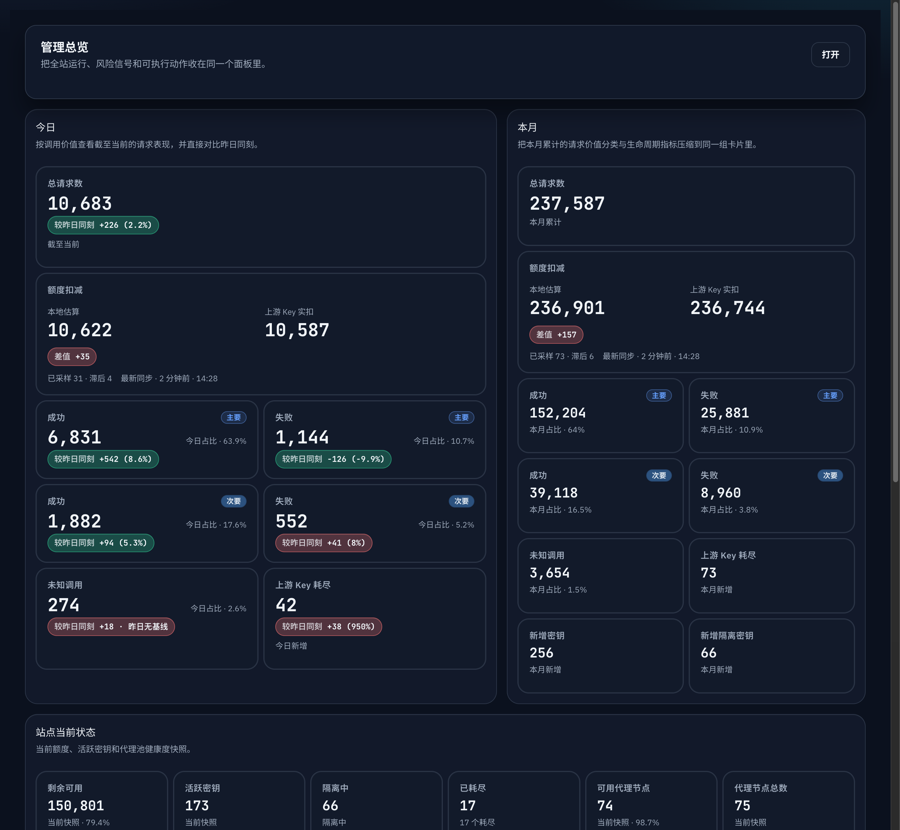
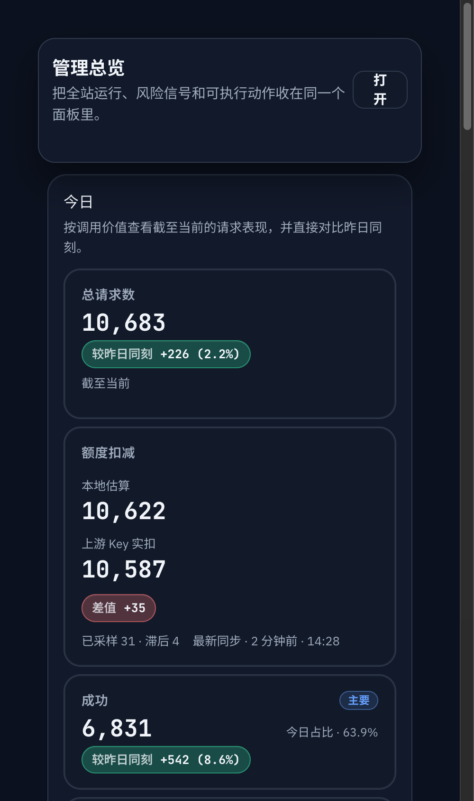
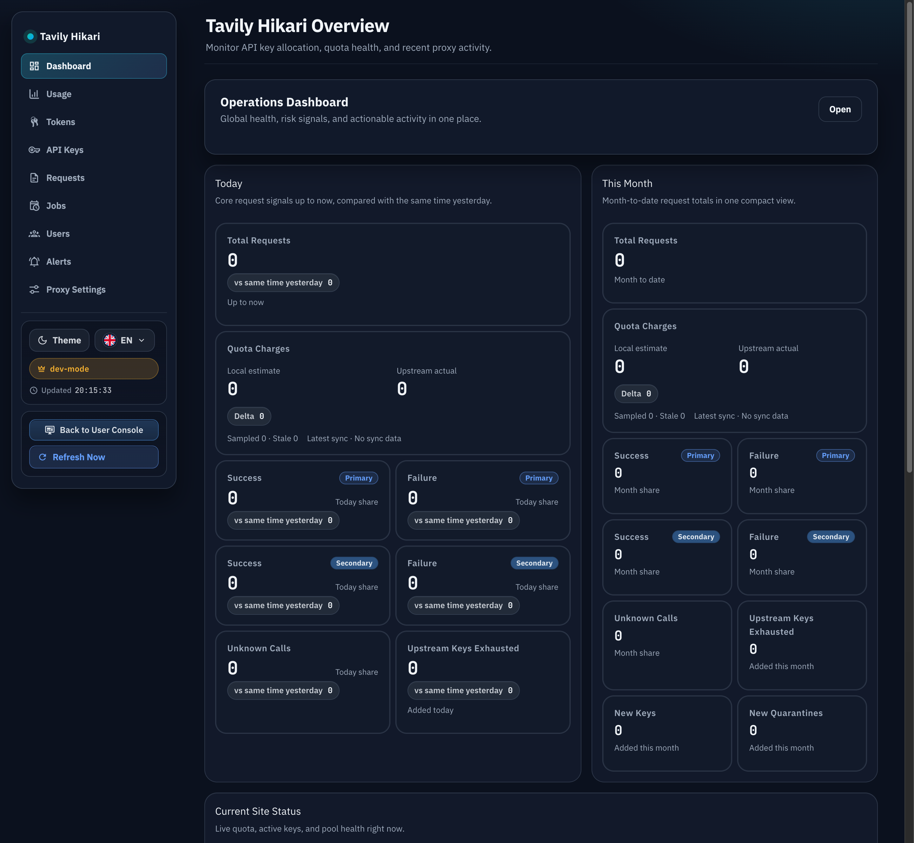
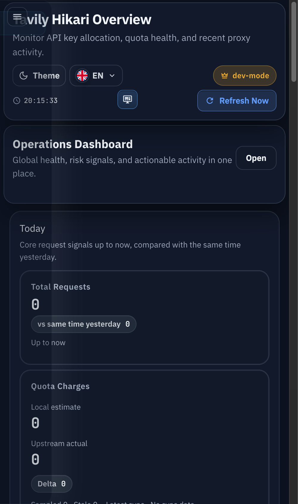

# Admin 仪表盘额度扣减卡与自适应同步（#3tyrc）

## 状态

- Status: 已实现，待 PR 收口
- Created: 2026-04-03
- Last: 2026-04-03

## 背景

- 当前 `/admin/dashboard` 的 `今日 / 本月` 总览已经把 `总请求数` 放到首行，但运营仍看不到“本地记账 credits”与“上游实际 quota 扣减”之间的对应关系。
- 现有 `quota_sync` 只维护 `api_keys.quota_limit / quota_remaining / quota_synced_at` 的当前快照，没有历史样本，无法计算今日/本月的上游实际扣减。
- 当前同步调度偏向低频校准：每小时扫一轮，再同步超过 24h 未刷新的 key。它能控制资源消耗，但不足以支撑“今日实际扣减”的可信展示。

## Goals

- 在 `今日` 与 `本月` 总览中新增专用“额度扣减”卡，固定展示 `本地估算`、`上游 Key 实扣`、`差值` 与 `同步覆盖/新鲜度`。
- 为 quota sync 增加按 key 的历史快照样本，支持周期窗口内的 quota 差分聚合。
- 将 quota sync 拆成热/冷两档：活跃 key 提频、冷 key 维持 24h 校准，平衡折算精度与资源消耗。
- 保持 `GET /api/summary/windows` 与 admin SSE `snapshot.summaryWindows` 同步扩容，前端只消费统一后端契约。

## Non-goals

- 不引入 Tavily 上游账号归属建模，也不做账号级去重。
- 不调整 `/console`、Key 详情页或其它非 dashboard 视图。
- 不访问 Tavily 生产端点；所有验证继续使用本地 mock/stub upstream。

## 数据契约

### DB

- 新增 `api_key_quota_sync_samples`：
  - `id INTEGER PRIMARY KEY AUTOINCREMENT`
  - `key_id TEXT NOT NULL`
  - `quota_limit INTEGER NOT NULL`
  - `quota_remaining INTEGER NOT NULL`
  - `captured_at INTEGER NOT NULL`
  - `source TEXT NOT NULL`
- 索引：
  - `(key_id, captured_at DESC)`
  - `(captured_at DESC, key_id)`
- 每次手动或自动 quota sync 时，样本落库与 `api_keys.quota_*` 当前快照更新必须同事务完成。

### `GET /api/summary/windows`

- `today / yesterday / month` 继续保留既有请求量与生命周期字段。
- 每个窗口新增 `quota_charge`：
  - `local_estimated_credits`
  - `upstream_actual_credits`
  - `sampled_key_count`
  - `stale_key_count`
  - `latest_sync_at`

### admin SSE `snapshot`

- `summaryWindows` 返回与 `GET /api/summary/windows` 完全一致的 `quota_charge` 字段。
- 变更检测必须覆盖 `quota_charge` 任一字段变化，避免总览卡片冻结。

## 统计口径

- `local_estimated_credits`：按窗口聚合本地已记账 `business_credits`，只统计已完成计费落账的数据。
- `upstream_actual_credits`：按 key 对 `api_key_quota_sync_samples` 做时间排序，使用相邻样本的 `max(previous_remaining - current_remaining, 0)` 求和；窗口首个样本需要回看窗口开始前最近一条样本作为基线。
- 额度回升、月切换或管理员手工修正导致的反向差值一律按 `0` 处理，不允许展示负扣减。
- `sampled_key_count`：窗口内至少出现过 1 个同步样本的 key 数。
- `stale_key_count`：当前仍应参与同步的 key 中，未满足当前 freshness 目标的数量。
- freshness 目标：
  - 热 key：`last_used_at >= now - 2h` 时要求 `quota_synced_at >= now - 15m`
  - 冷 key：其它非删除/非隔离/非 exhausted key 维持 `quota_synced_at >= now - 24h`

## 调度策略

- 保留冷路径 `quota_sync`：
  - 每小时检查一次
  - 只同步超过 24h 未刷新或从未同步的非删除/非隔离 key
  - 保持 `0..300s` 抖动
- 新增热路径 `quota_sync/hot`：
  - 每 5 分钟检查一次
  - 只同步 `last_used_at >= now - 2h` 且 `quota_synced_at < now - 15m` 的非删除/非隔离/非 exhausted key
  - 单 key 抖动 `0..60s`
  - 顺序执行，不做 fan-out 并发
- `scheduled_jobs` 继续可见，并保留 key 维度可追踪性。

## 展示约束

- `今日` 与 `本月` 的 `总请求数` 固定为第一行全宽卡。
- 新增 `额度扣减` 卡固定为第二行全宽卡，独立于现有单值指标卡。
- `QuotaChargeCard` 固定展示：
  - `本地估算`
  - `上游 Key 实扣`
  - `差值`
  - `已采样 / stale / 最新同步`
- 本次 follow-up 明确替代旧的“本月固定 6 张卡”约束，后续以“首行总请求数 + 第二行额度扣减 + 其余指标网格”作为新布局标准。

## 验收标准

- `今日` 与 `本月` 的 `总请求数`、`额度扣减` 均独占各自一整行；桌面/移动端无横向滚动。
- `GET /api/summary/windows` 与 admin SSE `summaryWindows` 返回 `quota_charge`，前端不额外拼接。
- `upstream_actual_credits` 对跨窗口基线、额度回升、月切换都不会重复扣减或出现负数。
- 热路径只覆盖近期活跃 key；冷路径仍控制在 24h 级校准，不退化成全量高频轮询。
- Storybook 提供稳定证据，浏览器实机复核真实 `/admin/dashboard` 与 Storybook 都通过。

## 里程碑

- [x] M1: spec 冻结与索引登记
- [x] M2: quota sync 样本表、写入与窗口聚合完成
- [x] M3: 热/冷双路径调度完成
- [x] M4: DashboardOverview 新卡与布局完成
- [x] M5: Storybook、浏览器验收、快车道收口完成

## 风险与假设

- 假设当前仓库没有稳定的上游账号唯一标识，因此“上游实际扣减”只能按 key 差值汇总。
- 风险：若某把 key 在窗口内完全没有同步样本，即使本地有请求也无法精确计算其上游实际扣减；需要通过 `sampled/stale` 明确暴露覆盖度，而不是伪装成完整结果。
- 风险：SQLite 上新增样本写入与窗口聚合后，dashboard SSE 查询频率会提高，需要保证查询路径有索引且避免全表扫描。

## Visual Evidence

- 证据绑定：
  - `HEAD=9de1c428c421bbc70cbcb95c2f4e822ac4ad7941`
  - 视觉证据目标源：`storybook_canvas + mock_ui`
  - 空白裁剪：已执行 `trim_whitespace.py`，四张图均因 `ambiguous_border` fail-open 保持原始构图。
- Storybook 桌面截图：

- Storybook 移动端截图：

- 真实 `/admin/dashboard` 桌面截图：

- 真实 `/admin/dashboard` 移动端截图：

- 桌面端验证：
  - Storybook `clientWidth=1425 / scrollWidth=1425`，无横向滚动。
  - 真实 `/admin/dashboard` `clientWidth=1425 / scrollWidth=1425`，无横向滚动。
- 移动端验证：
  - Storybook `clientWidth=485 / scrollWidth=485`，无横向滚动。
  - 真实 `/admin/dashboard` `clientWidth=485 / scrollWidth=485`，无横向滚动。
- 备注：
  - Storybook 稳定展示了 `今日 / 本月` 的总请求数首行全宽与额度扣减次行全宽布局。
  - 当前本地 dev 数据库缺少真实 quota 历史，因此真实 `/admin/dashboard` 中额度扣减卡显示为 `0`，符合当前测试环境预期。
