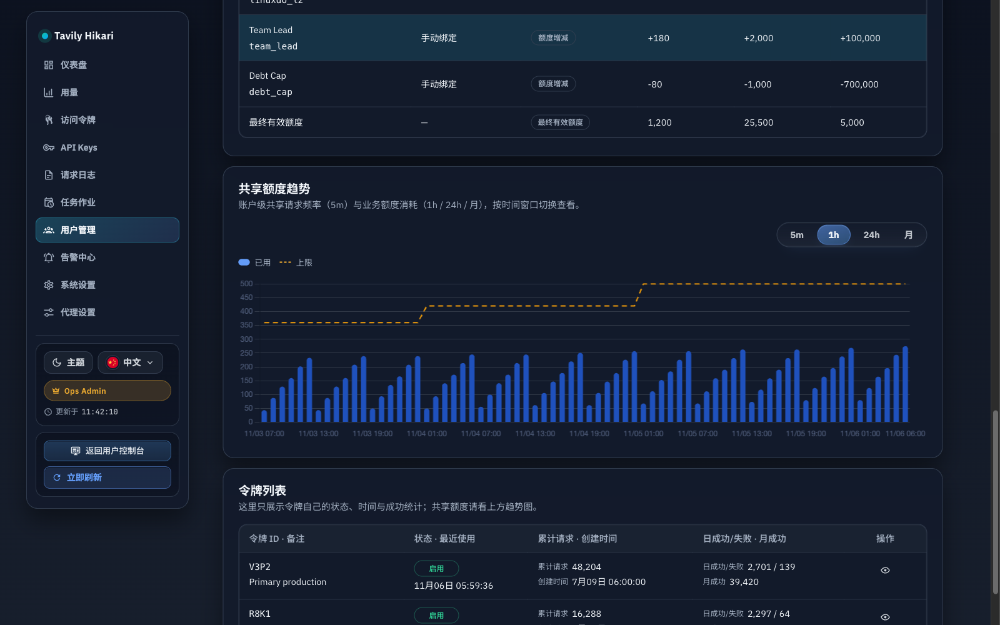
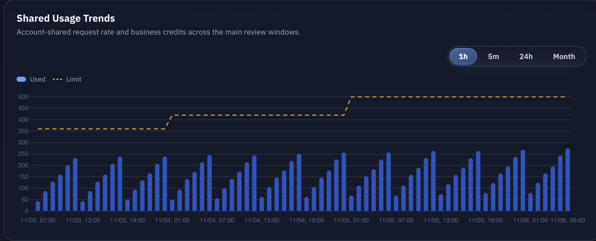
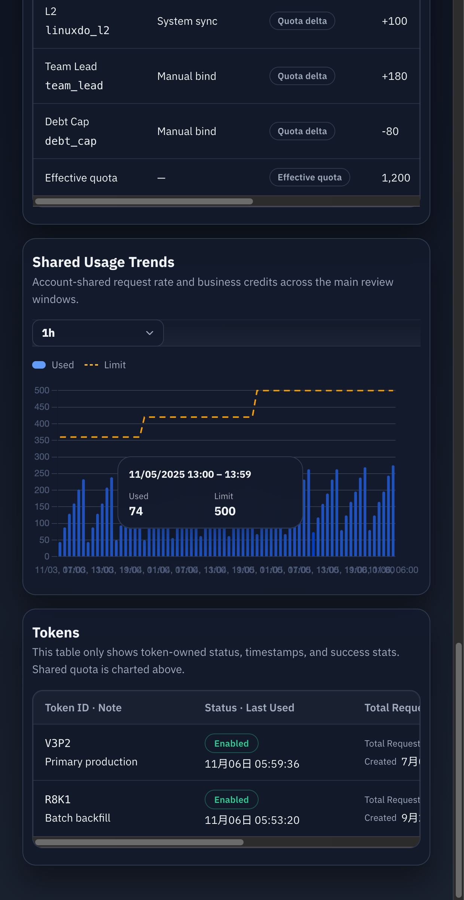
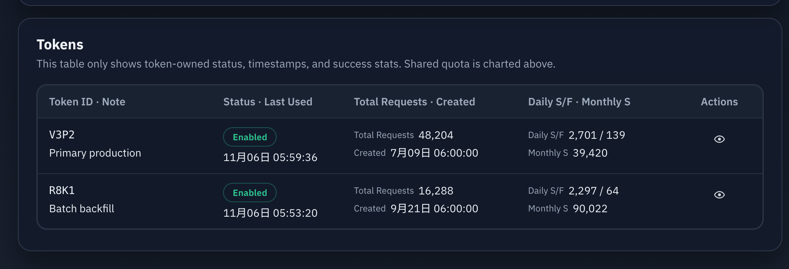
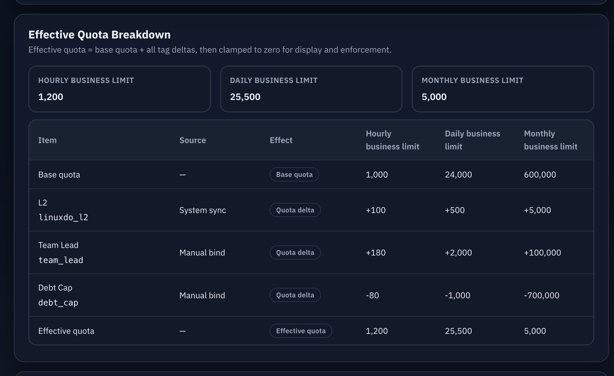
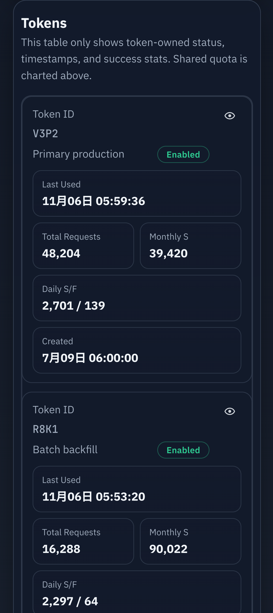
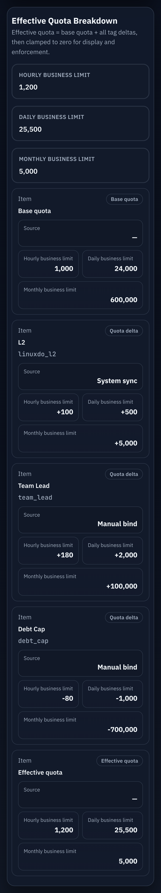
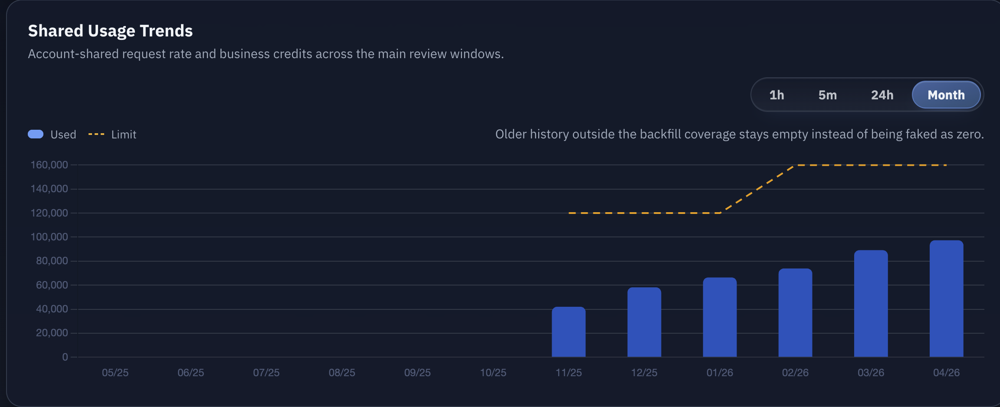

# Admin 用户详情共享额度趋势与 Token 列表语义纠偏（#3zky1）

## 状态

- Status: 进行中（快车道）
- Created: 2026-04-23
- Last: 2026-04-23

## 背景

- 当前 `/admin/users/:id` 的 token 列表把账户共享额度直接展示在 token 行内，容易让运营误以为这些额度属于单个 token。
- 用户详情页缺少账户级共享额度的趋势视图，无法快速判断 5 分钟限流、1 小时额度、24 小时额度与月度额度的消耗节奏。
- 现有临时 bucket 与即时扫日志不适合支撑最近 7 天 / 12 个月的稳定图表，因此需要持久化 rollup 读模型。
- 图表上限线若直接复用“当前额度”，会把账户历史额度变更抹平，无法正确解释历史 bucket 的真实阈值。

## Goals

- 在用户详情页新增独立的“共享额度趋势”面板，位于有效额度拆解之后、token 列表之前。
- 共享趋势使用 `5m / 1h / 24h / 月` 四个 tab，默认仍激活 `1h`，并按需加载数据。
- 后端新增用户级共享额度趋势接口 `GET /api/users/:id/usage-series`，返回稳定 bucket 序列、当前 limit 与按 bucket 回放的历史 `limitValue`。
- 新增持久化 rollup 表 `account_usage_rollup_buckets`，分别承载账户共享请求频率与业务 credits 聚合。
- 新增额度历史快照表，按时间回放请求限流与账户有效额度。
- 用户详情 token 列表只展示 token 自有字段，移除账户共享额度字段，新增 `累计请求` 与 `创建时间`。

## Non-goals

- 不修改 token 详情页自身的额度趋势接口或展示口径。
- 不伪造不可考的更早额度历史；在无法确认的时间段内，limit 线显示缺口（`null`）而不是平铺当前值。
- 不伪造超出可追溯窗口的月度历史；历史缺口使用 `null` 呈现无数据。

## 范围

### In scope

- 后端持久化 rollup 表、bounded rebuild、retention cleanup 与用户详情趋势接口。
- 用户详情页新增共享额度趋势卡片、tabs 懒加载缓存、limit 虚线与空/错/部分历史态。
- 用户详情 token 列表的字段调整、i18n 文案更新、Storybook 画布与截图证据。

### Out of scope

- 用户控制台与 token 详情页的额度语义。
- 历史 limit 回放、任意新的 token 级统计口径、额外图表库引入。

## 数据契约

### `account_usage_rollup_buckets`

- 主键：`(user_id, metric_kind, bucket_kind, bucket_start)`
- `metric_kind`:
  - `request_count`
  - `business_credits`
- `bucket_kind`:
  - `five_minute`
  - `hour`
  - `day`
  - `month`
- `value` 为整数累计值。

### `request_rate_limit_snapshots`

- 字段：
  - `changed_at`
  - `limit_value`
- 用于按时间回放 5 分钟共享请求频率的历史上限。

### `account_quota_limit_snapshots`

- 字段：
  - `user_id`
  - `changed_at`
  - `hourly_any_limit`
  - `hourly_limit`
  - `daily_limit`
  - `monthly_limit`
- 保存用户当时的**有效额度**快照（base quota + 当前绑定标签影响后的结果）。

### 写入路径

- 每次已认证请求命中已绑定用户时，累加 `request_count/five_minute`。
- 每次账户计费结算完成时，累加 `business_credits/hour|day|month`。
- 全局请求频率阈值变更时，追加 `request_rate_limit_snapshots`。
- 用户有效额度发生变化时（基础额度、标签绑定、标签定义或系统标签同步影响），追加 `account_quota_limit_snapshots`。

### 回填路径

- `business_credits/*`：从 `auth_token_logs` 中 `billing_subject=account:<user_id>` 的历史已计费记录精确回填。
- `request_count/five_minute`：仅回填最近 24 小时内能 best-effort 归属到账户的请求。
- rebuild 必须可重复执行且幂等：先清理覆盖窗口后重写，再更新 coverage meta。
- 历史 limit 快照的补种同样必须幂等：
  - 若没有历史快照，则以当前持久化状态推导一个 `known_since` 后写入当前有效额度；
  - 更早且不可证明的区间保持 `null`；
  - 请求频率若从未设置过自定义值，则默认值可视为长期有效。

### 保留策略

- `five_minute`：至少保留 48 小时
- `hour`：至少保留 8 天
- `day`：至少保留 400 天
- `month`：至少保留 24 个月

## API 契约

### `GET /api/users/:id/usage-series?series=<key>`

- admin-only。
- `series` 允许：
  - `rate5m`
  - `quota1h`
  - `quota24h`
  - `quotaMonth`
- 响应：
  - `limit: number`
  - `points: Array<{ bucketStart: number, value: number | null, limitValue: number | null }>`

### 统计窗口

- `rate5m`：最近 24 小时，5 分钟粒度，共 288 个 bucket；`limit` 为当前全局 `requestRate.limit`，`points[].limitValue` 使用 `changed_at < bucket_end` 的最新请求频率快照。
- `quota1h`：最近 72 小时，按小时 bucket；`limit` 为当前账户 `effectiveQuota.hourlyLimit`，`points[].limitValue` 使用 `changed_at < bucket_end` 的最新小时额度快照。
- `quota24h`：最近 7 天，按本地日 bucket；`limit` 为当前账户 `effectiveQuota.dailyLimit`，`points[].limitValue` 使用 `changed_at < bucket_end` 的最新日额度快照。
- `quotaMonth`：最近 12 个月，按 UTC 月 bucket；`limit` 为当前账户 `effectiveQuota.monthlyLimit`，`points[].limitValue` 使用 `changed_at < bucket_end` 的最新月额度快照。
- 若 bucket 无聚合值：
  - `bucketStart >= coverage_start` => 返回 `0`
  - `bucketStart < coverage_start` => 返回 `null`
- 若 bucket 无可追溯的历史 limit 快照：
  - `limitValue` 返回 `null`
  - 前端应显示缺口而不是平铺当前上限

### `GET /api/users/:id`

- `tokens[]` 仅返回 token 自有字段：
  - `tokenId`
  - `enabled`
  - `note`
  - `createdAt`
  - `lastUsedAt`
  - `totalRequests`
  - `dailySuccess`
  - `dailyFailure`
  - `monthlySuccess`
- 移除共享 `requestRate`、`hourlyAny*`、`quota*` 字段。

## UI 规格

- 用户详情页新增“共享额度趋势”区块，放在用户级额度/拆解之后、token 列表之前。
- tabs 文案简写：`5m / 1h / 24h / 月`，默认 `1h`。
- 首屏只请求 `quota1h`；其他 tab 首次点开才请求，二次切回复用缓存。
- 图表使用现有 `SegmentedTabs` + `chart.js`：
  - 主数据使用柱状图
  - limit 使用独立虚线 dataset，数据源为 `points[].limitValue`
- 月度历史缺口显示为无数据提示，不伪装成 `0`。
- token 列表说明文案需明确：这里只展示 token 自己的状态、时间与成功统计，共享额度请看上方趋势图。

## 验收标准

- 用户详情首屏默认展示 `1h` 图，且只请求一次 `quota1h`。
- 切换到 `5m / 24h / 月` 时才触发对应接口请求，二次切回不重复请求。
- 四张图都带明显的上限虚线；虚线必须按 bucket 对应的历史 `limitValue` 绘制，不能整图平铺当前 limit。
- token 列表不再出现任何账户共享额度字段或易误导文案。
- `quotaMonth` 对不可追溯月份返回 `null`，前端显示缺口/提示，而不是伪造 `0`。
- `cargo test`、`cargo clippy -- -D warnings`、`cd web && bun test`、`cd web && bun run build`、`cd web && bun run build-storybook` 全部通过。
- Storybook 与真实 `/admin/users/:id` 浏览器复核完成，并在本 spec 记录最终视觉证据。

## Quality Gates

- `cargo test`
- `cargo clippy -- -D warnings`
- `cd web && bun test`
- `cd web && bun run build`
- `cd web && bun run build-storybook`

## Visual Evidence

### 共享额度趋势时间窗口顺序

- asset: `docs/specs/3zky1-admin-user-shared-usage-charts/assets/user-detail-shared-usage-tabs-order.png`
- source_type: `storybook_canvas`
- story_id_or_title: `admin-pages--user-detail`
- target_program: `mock-only`
- capture_scope: `browser-viewport`
- requested_viewport: `1600x1000`
- viewport_strategy: `devtools-emulate`
- submission_gate: `approved`
- evidence_note: 共享额度趋势 tab 已按时间尺度调整为 `5m / 1h / 24h / 月`；默认激活仍为 `1h`，说明文案明确区分 5m 请求频率与 1h/24h/月业务额度；空白裁剪脚本返回 `ambiguous_border`，因此按原图保留；证据绑定当前实现提交。

### 共享额度趋势（默认 1h）

- asset: `docs/specs/3zky1-admin-user-shared-usage-charts/assets/user-detail-shared-usage-default.png`
- source_type: `storybook_canvas`
- story_id_or_title: `admin-pages--user-detail`
- target_program: `mock-only`
- capture_scope: `element`
- requested_viewport: `none`
- viewport_strategy: `storybook-viewport`
- submission_gate: `pending-owner-approval`
- evidence_note: 当前 Storybook 用户详情默认落在 `1h` tab，图中业务额度柱状值上方的虚线使用 `points[].limitValue` 按 bucket 回放历史额度快照，而不是整图平铺当前 limit；已检查空白裁剪，无需额外裁切；证据绑定 `e9f9df93e4b7a0f0493769d2979c8bfa8707599f`。

### 共享额度趋势浮层明细

- asset: `docs/specs/3zky1-admin-user-shared-usage-charts/assets/user-detail-shared-usage-tooltip.png`
- source_type: `storybook_canvas`
- story_id_or_title: `admin-pages--user-detail-shared-usage-tooltip`
- target_program: `mock-only`
- capture_scope: `browser-viewport`
- requested_viewport: `none`
- viewport_strategy: `storybook-viewport`
- submission_gate: `pending-owner-approval`
- evidence_note: 该截图已按当前 Storybook 暗色主题重新覆盖旧图；为同时保留图表与浮层的相对位置关系，这里使用浏览器视口截图而不是元素裁切；悬浮或点击图表时会弹出浮层，显示对应 bucket 的详细时间、已用值与历史 limit 快照值，且阴影已收敛为深色投影，不再出现发白发亮的重阴影。

### 暗色主题浮层定位与阴影收敛

- asset: `docs/specs/3zky1-admin-user-shared-usage-charts/assets/user-detail-shared-usage-tooltip-position-fixed.png`
- source_type: `storybook_canvas`
- story_id_or_title: `admin-pages--user-detail-shared-usage-tooltip`
- target_program: `mock-only`
- capture_scope: `browser-viewport`
- requested_viewport: `none`
- viewport_strategy: `storybook-viewport`
- submission_gate: `pending-owner-approval`
- evidence_note: 该证据已按当前 Storybook 暗色主题重新截图并覆盖旧图：浮层继续保持无尾巴、贴近指针的定位，同时阴影改为深色投影，不再出现暗色主题下发白发亮的重阴影；空白裁剪脚本返回 `ambiguous_border`，因此按原图保留，证据绑定 `e9f9df93e4b7a0f0493769d2979c8bfa8707599f`。

### Token 列表语义纠偏

- asset: `docs/specs/3zky1-admin-user-shared-usage-charts/assets/user-detail-token-table.png`
- source_type: `storybook_canvas`
- story_id_or_title: `admin-pages--user-detail`
- target_program: `mock-only`
- capture_scope: `element`
- requested_viewport: `none`
- viewport_strategy: `storybook-viewport`
- submission_gate: `pending-owner-approval`
- evidence_note: Token 列表已移除账户共享额度列，替换为 token 自有的 `累计请求` 与 `创建时间`，并保留状态、最近使用、日成功/失败、月成功等字段；桌面表格列宽已收紧，Storybook proof 中对应 section 的 `scrollWidth <= clientWidth`，不再依赖横向滚动条；已检查空白裁剪，无需额外裁切。

### 有效额度拆解表格无横向滚动

- asset: `docs/specs/3zky1-admin-user-shared-usage-charts/assets/user-detail-quota-breakdown-table.png`
- source_type: `storybook_canvas`
- story_id_or_title: `admin-pages--user-detail`
- target_program: `mock-only`
- capture_scope: `element`
- requested_viewport: `none`
- viewport_strategy: `storybook-viewport`
- submission_gate: `pending-owner-approval`
- evidence_note: Effective Quota Breakdown 桌面表格改为固定列宽且允许必要换行，现已在默认 Storybook 用户详情中完整收纳 6 列内容；Storybook play 同时校验该 section 的 `scrollWidth <= clientWidth`，避免再次出现底部横向滚动条。

### Token 列表紧凑卡片列表

- asset: `docs/specs/3zky1-admin-user-shared-usage-charts/assets/user-detail-token-table-compact.png`
- source_type: `storybook_canvas`
- story_id_or_title: `admin-pages--user-detail-compact`
- target_program: `mock-only`
- capture_scope: `element`
- requested_viewport: `390x844`
- viewport_strategy: `devtools-emulate`
- submission_gate: `pending-owner-approval`
- evidence_note: 在 `sm` / compact 布局下，Token 列表改为更自然的卡片列表：状态 badge 回到身份信息区，不再单独占一个大块；指标区仅保留最近使用、请求量与成功统计，阅读顺序更接近常规信息卡。Storybook compact story 已验证 `.admin-main-content.is-compact-layout` 激活、桌面表格隐藏，且卡片 `scrollWidth <= clientWidth`，避免移动端横向滚动。

### 有效额度拆解紧凑卡片列表

- asset: `docs/specs/3zky1-admin-user-shared-usage-charts/assets/user-detail-quota-breakdown-compact.png`
- source_type: `storybook_canvas`
- story_id_or_title: `admin-pages--user-detail-compact`
- target_program: `mock-only`
- capture_scope: `element`
- requested_viewport: `390x844`
- viewport_strategy: `devtools-emulate`
- submission_gate: `pending-owner-approval`
- evidence_note: 在 `sm` / compact 布局下，有效额度拆解表改为更高密度的卡片列表：effect badge 固定在头部，source 与三档额度分别收纳进紧凑信息块和指标卡；Storybook compact story 已验证桌面表格隐藏、卡片显示，且卡片容器不再产生横向滚动。

### 月度额度历史缺口

- asset: `docs/specs/3zky1-admin-user-shared-usage-charts/assets/user-detail-shared-usage-monthly-gap.png`
- source_type: `storybook_canvas`
- story_id_or_title: `admin-pages--user-detail-monthly-gap`
- target_program: `mock-only`
- capture_scope: `element`
- requested_viewport: `none`
- viewport_strategy: `storybook-viewport`
- submission_gate: `pending-owner-approval`
- evidence_note: 月度图保留不可追溯历史缺口，并在卡片内明确提示“空白不是 0”；缺口同时覆盖业务消耗与历史 limit 快照都不可考的 bucket，满足 `quotaMonth` 的 `null` bucket 呈现要求；已检查空白裁剪，无需额外裁切；证据绑定 `e9f9df93e4b7a0f0493769d2979c8bfa8707599f`。

