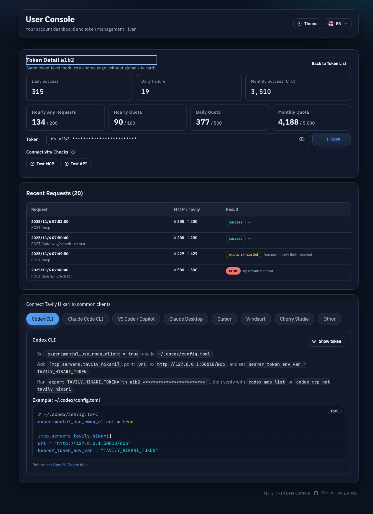
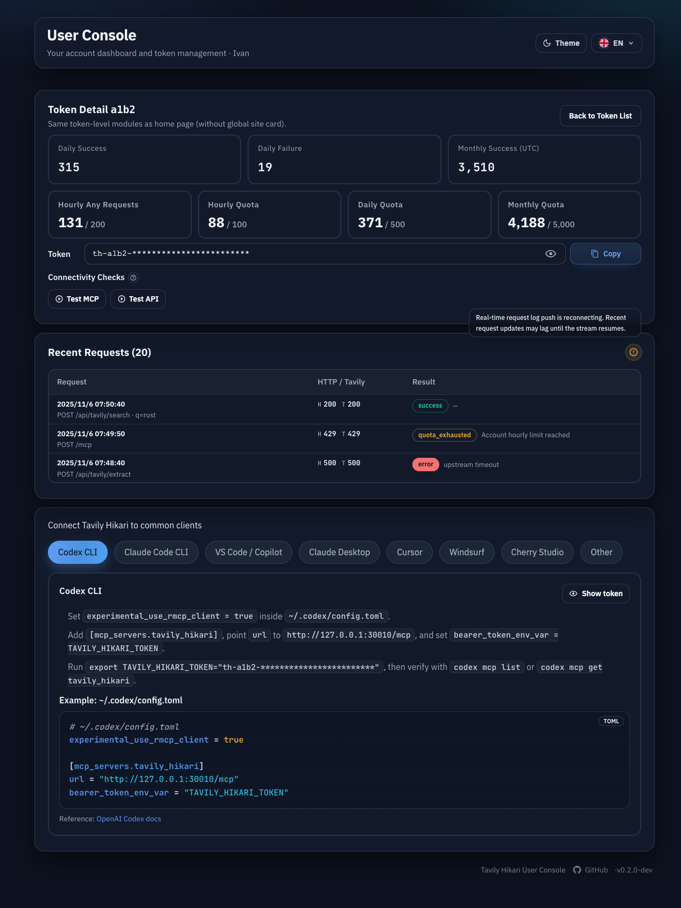

# Global MCP 429 Recovery And User Token Live Logs

## Goal

Reduce repeated upstream `429` failures for all MCP follow-up requests without changing MCP wire
contracts or session pinning, and expose live request-log snapshots on the user token detail page.

## Scope

- Apply MCP follow-up recovery globally for every client that uses `/mcp`.
- Keep `initialize` placement global and health-aware without adding probe-only routing.
- Keep every MCP session pinned to its original upstream key.
- Add a user-owned SSE endpoint for `/console#/tokens/:id` live request logs.

## Non-Goals

- No probe-only headers, query params, or placement hints.
- No session migration after `429`.
- No local short-circuiting or skipped billable calls.
- No changes to HTTP `/api/tavily/*` request selection semantics.

## Backend Changes

### MCP Session State

Persist session-level retry metadata in `mcp_sessions`:

- `rate_limited_until`
- `last_rate_limited_at`
- `last_rate_limit_reason`

These fields must survive restarts and be included in the session binding model.

### Global Follow-Up Recovery

For any MCP request that carries a valid proxy `mcp-session-id`:

1. Serialize upstream dispatch per proxy session so only one follow-up request is in flight for a
   pinned session.
2. Before sending upstream, respect any active `rate_limited_until` window.
3. If the upstream responds with `429`:
   - parse `Retry-After`
   - persist the wait window on the same session
   - wait on the same session and same upstream key
   - retry the same request exactly once
4. If the retry succeeds, clear `rate_limited_until` and keep the historical rate-limit fields.
5. If the retry fails with another `429`, return the real failure to the client and keep the
   waiting window for later requests.

### New-Session Placement

Continue using the existing stable affinity pool and pinning model, but rank new-session candidates
with these priorities:

1. active MCP-init cooldown
2. recent upstream `429` heat
3. recent shared billable pressure
4. same-subject active MCP session count
5. LRU
6. stable rank

### User Token Events SSE

Add `GET /api/user/tokens/:id/events`:

- requires LinuxDo user session
- returns `404` for non-owner access
- streams `snapshot` events containing:
  - `token`
  - `logs`
- emits `ping` while no new token log has appeared
- reuses the existing user token detail and sanitized log views

## Frontend Changes

On `/console#/tokens/:id`:

- open `EventSource` against `/api/user/tokens/:id/events`
- refresh token detail metrics and recent request rows from `snapshot`
- show a warning icon with a problem bubble when live push is unavailable
- keep MCP probe requests on the normal `/mcp` flow with no special treatment

## Validation

- New MCP sessions avoid recently rate-limited keys when healthier pool peers exist.
- Same-session follow-up requests are serialized upstream.
- Upstream `429 + Retry-After` causes one same-session retry after waiting.
- Successful retry returns success to the client without moving the session.
- `/api/user/tokens/:id/events` enforces `401`/`404` correctly and streams updated snapshots.
- `/console#/tokens/:id` updates recent request logs live through SSE.

## Visual Evidence

- source_type: `storybook_canvas`
  story_id_or_title: `User Console/UserConsole · Token Detail Live Logs`
  state: `live logs connected`
  evidence_note: verifies `/console#/tokens/:id` keeps the request list updating from streamed snapshots without adding a persistent visible status badge.

- source_type: `storybook_canvas`
  story_id_or_title: `User Console/UserConsole · Token Detail Push Warning`
  state: `push unavailable warning bubble`
  evidence_note: verifies the recent-requests header shows only a warning icon when push is unavailable and the bubble explains the exact problem.

