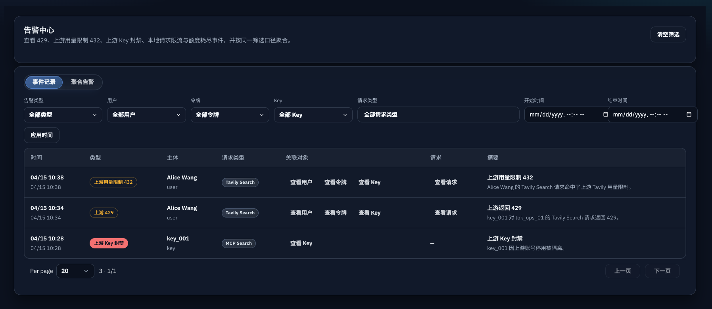
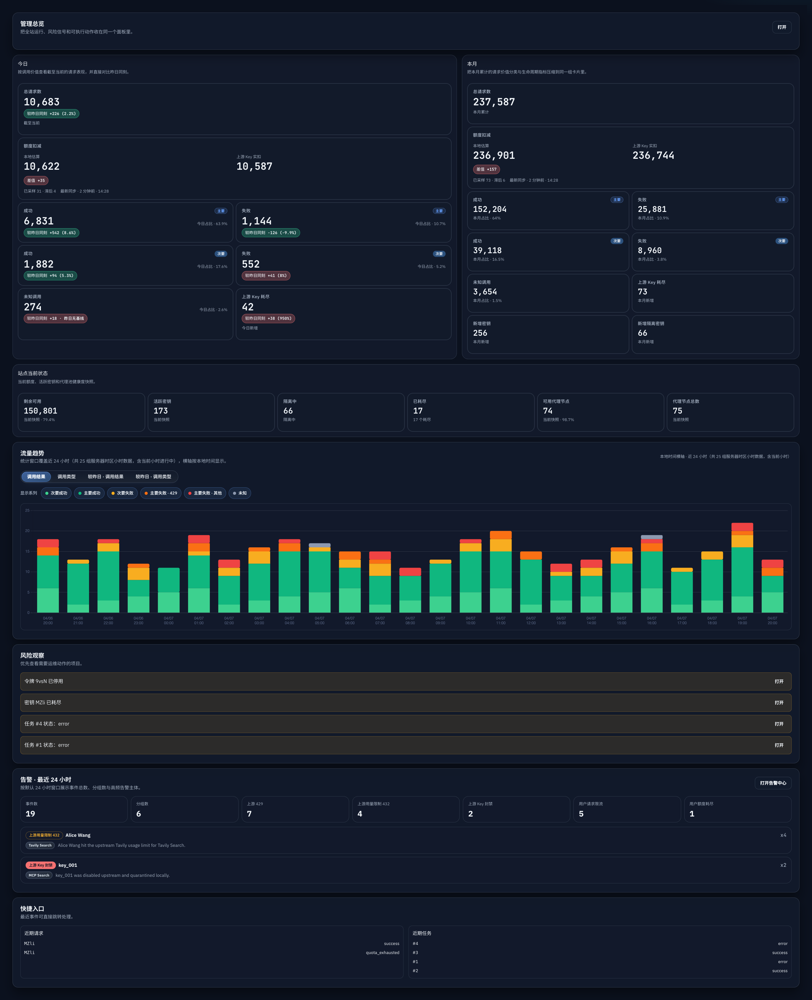

# Admin 告警中心与 24h 仪表盘告警摘要（#9tbyq）

## 状态

- Status: 进行中（快车道）
- Created: 2026-04-18
- Last: 2026-04-18

## 背景

- 当前 `/admin/alerts` 仍是占位骨架页，运营无法集中查看 429、上游 Key 封禁、用户限流、用户额度耗尽等高频风险。
- 现有管理员页面已经分别持有请求日志、Key 维护记录、用户与令牌详情，但缺少一层“告警读模型”把这些离散事件收束成可筛选、可跳转的事件流与聚合视图。
- `/admin/dashboard` 已具备近 24h 运营摘要，但尚未展示“近期告警总量 / 分组量 / 类型分布 / Top groups”，导致运营需要切换多个模块才能确认异常规模。
- 当前仓库已经记录了告警所需的关键事实：`auth_token_logs`、`request_logs`、`api_key_maintenance_records`。本轮应优先复用这些现有表，而不是再引入新的写侧告警表。

## Goals

- 把 `/admin/alerts` 替换为真实告警中心，并提供双 Tab：`事件记录` + `聚合告警`。
- 固定支持 5 类告警：
  - `upstream_rate_limited_429`
  - `upstream_usage_limit_432`
  - `upstream_key_blocked`
  - `user_request_rate_limited`
  - `user_quota_exhausted`
- 基于现有日志与维护记录派生告警读模型，支持共享筛选、分页、URL 状态同步，以及用户 / 令牌 / Key / 请求关联跳转。
- 为 `/api/dashboard/overview` 增加最近 24 小时告警摘要，使仪表盘与告警中心默认口径一致，并支持一键进入同口径视图。
- 为 Web UI 补齐 Storybook 稳定入口、页面/交互覆盖与视觉证据。

## Non-goals

- 不引入告警规则配置、阈值编辑、通知渠道。
- 不引入 incident ack / resolve / open / closed 生命周期。
- 不为告警新增独立写侧持久化表，也不做历史重放修复工具。
- 不对现有 requests 模块做大规模架构改造。

## 告警分类规则

### `upstream_rate_limited_429`

- 来源：`auth_token_logs.failure_kind = 'upstream_rate_limited_429'`。
- 关联：
  - `auth_token_logs.request_log_id` -> 请求详情
  - `auth_token_logs.api_key_id` -> Key
  - `auth_token_logs.token_id` -> 令牌
  - 若令牌已绑定用户，则补出用户

### `upstream_key_blocked`

- 来源：`api_key_maintenance_records` 中与上游 Key 封禁/撤销相关的记录。
- 本轮默认识别 `reason_code IN ('account_deactivated', 'key_revoked', 'invalid_api_key')`。
- 关联优先使用 maintenance record 上的：
  - `key_id`
  - `auth_token_id`
  - `auth_token_log_id`
  - `request_log_id`
  - `actor_user_id`

### `user_request_rate_limited`

- 来源：`auth_token_logs.result_status = 'quota_exhausted' AND counts_business_quota = 0`。
- 表示用户/令牌命中了本地 request-rate 429，而不是业务额度扣减耗尽。
- 关联优先使用：
  - `token_id`
  - `api_key_id`
  - `request_log_id`
  - token owner -> user

### `upstream_usage_limit_432`

- 来源：`auth_token_logs.result_status = 'quota_exhausted' AND request_logs.tavily_status_code = 432`。
- 语义：表示上游 Tavily 对当前请求返回 usage-limit / plan-limit 432。
- 这是上游额度门禁，不等于本地用户业务额度耗尽。
- 关联优先使用：
  - `token_id`
  - `COALESCE(auth_token_logs.api_key_id, request_logs.api_key_id)` -> Key
  - `request_log_id`
  - token owner -> user

### `user_quota_exhausted`

- 来源：`auth_token_logs.result_status = 'quota_exhausted' AND counts_business_quota = 1 AND request_logs.tavily_status_code IS DISTINCT FROM 432`。
- 表示用户/令牌命中了本地业务额度耗尽，不包含上游 Tavily 432。
- 关联优先使用：
  - `token_id`
  - `api_key_id`
  - `request_log_id`
  - token owner -> user

## 聚合口径

- 聚合分组仅针对“当前筛选窗口内”的结果，无状态、无持久化，不引入 ack / resolve。
- group key 固定为：
  - `alert_type`
  - 主体：`user` 优先，其次 `token`；Key 级告警固定使用 `key`
  - `request_kind_key`
- `聚合告警` Tab 默认按 `lastSeen DESC` 排序，至少展示：
  - `count`
  - `firstSeen`
  - `lastSeen`
  - `latestEvent`
  - 主体、Key、request kind、类型

## URL 与页面行为

### `/admin/alerts`

- URL 查询串是视图真相源。
- 支持：
  - `view=events|groups`
  - `type=<alert_type>`
  - `since=<iso8601>`
  - `until=<iso8601>`
  - `userId=<user_id>`
  - `tokenId=<token_id>`
  - `keyId=<key_id>`
  - `requestKinds=<request_kind_key>`（可重复）
  - `page=<n>`
- 默认：
  - `view=events`
  - 时间窗口 = 最近 24 小时
  - 其它筛选为空
- 事件 Tab 与聚合 Tab 共享同一组筛选。
- 关联跳转：
  - 用户 -> 现有 user detail route
  - 令牌 -> 现有 token detail route
  - Key -> 现有 key detail route
  - 请求 -> 告警中心内请求详情抽屉

## API / 数据契约

### `GET /api/alerts/catalog`

- 仅管理员可访问。
- 返回：
  - `retentionDays`
  - `types[]`
  - `requestKindOptions[]`
  - `users[]`
  - `tokens[]`
  - `keys[]`

### `GET /api/alerts/events`

- 仅管理员可访问。
- 入参：
  - `page`
  - `per_page`
  - `type`
  - `since`
  - `until`
  - `user_id`
  - `token_id`
  - `key_id`
  - `request_kind`
- 返回：
  - `items[]`
  - `total`
  - `page`
  - `perPage`

### `GET /api/alerts/groups`

- 仅管理员可访问。
- 入参与 `events` 一致。
- 返回：
  - `items[]`
  - `total`
  - `page`
  - `perPage`

### `GET /api/dashboard/overview`

- 新增 `recentAlerts`：
  - `windowHours`
  - `totalEvents`
  - `groupedCount`
  - `countsByType`
  - `topGroups[]`
- 默认口径固定为最近 24 小时。
- `recentAlerts` 与 `/api/alerts/*` 默认 24 小时查询结果必须一致。

## 展示约束

- `事件记录` Tab 默认按时间倒序。
- 告警类型需要在 UI 中展示稳定标签与 tone。
- 共享筛选至少覆盖：
  - 告警类型
  - 时间范围
  - 用户
  - 令牌
  - Key
  - request kind
- 仪表盘新增 24h 告警摘要卡，至少展示：
  - 总事件数
  - 总分组数
  - 五类计数
  - Top groups
  - 进入 `/admin/alerts` 的 CTA

## 验收标准

- `/admin/alerts` 不再渲染占位 skeleton，而是渲染真实告警中心。
- 5 类告警分类正确，且能从现有日志/维护记录稳定派生。
- `upstream_usage_limit_432` 必须在查询时把历史与新增 Tavily 432 事件从 `user_quota_exhausted` 中重新归类出来。
- `user_quota_exhausted` 仅保留给真实本地业务额度耗尽。
- 事件记录与聚合告警可在同一组筛选下切换，并保持 URL 状态同步。
- 聚合分组符合“告警类型 + 主体（user 优先，否则 token；key 级告警用 key）+ request kind”的口径。
- 关联跳转可用：用户 / 令牌 / Key 进入详情页，请求进入当前页抽屉。
- `/admin/dashboard` 新增最近 24 小时告警摘要，并与 `/admin/alerts` 默认 24h 视图口径一致。
- 后端验证至少包含：
  - `cargo test`
  - `cargo clippy -- -D warnings`
- 前端验证至少包含：
  - `cd web && bun test`
  - `cd web && bun run build`
  - `cd web && bun run build-storybook`
- Storybook 与浏览器实页都能复核 `/admin/dashboard` 与 `/admin/alerts` 的新展示面。

## 实现里程碑

- [x] M1: spec / contract 冻结并登记索引
- [x] M2: 后端告警读模型、catalog / events / groups API、dashboard recentAlerts 完成
- [x] M3: 前端告警中心、共享筛选、请求详情抽屉、dashboard 摘要完成
- [ ] M4: Storybook、浏览器验收与视觉证据完成
- [ ] M5: 快车道 PR 收口到 merge-ready

## 风险与开放点

- `upstream_key_blocked` 的识别依赖现有 `reason_code` 取值，若后续出现新的上游封禁原因，需要同步扩充白名单。
- 事件来自不同源表，时间、请求关联、token owner 可能存在部分缺失；前端需允许关联缺省而不是把整行吞掉。
- 仪表盘摘要与告警中心的口径一致性依赖同一后端聚合逻辑，避免分别实现两份计算。

## Visual Evidence

- Storybook 受控渲染：
  - `admin-components-alertscenter--events-default`：事件记录默认视图直接展示 `upstream_usage_limit_432`，并保留共享筛选、关联跳转与请求详情入口。

    

  - `admin-components-dashboardoverview--zh-dark-evidence`：24h 告警摘要卡展示 5 类计数，其中明确包含 `上游用量限制 432`、`用户额度耗尽` 与进入告警中心 CTA。

    

- Chrome DevTools 实页复核：
  - 当前 `chrome-devtools` MCP 在本地会话中持续返回 `Network.enable timed out`，因此真实浏览器复核仍待阻塞解除后补跑。

## 101 验证 Runbook

在 101 部署 hotfix 后，按以下顺序做只读验证：

1. 解析部署目标并确认 stack：

   ```bash
   /Users/ivan/.codex/skills/srv-101-ops/scripts/resolve-target --json
   ```

2. 读取远端部署真相源：

   ```bash
   ssh 192.168.31.11 'sed -n "1,160p" /home/ivan/srv/AGENTS.md'
   ssh 192.168.31.11 'sed -n "1,160p" /home/ivan/srv/README.md'
   ssh 192.168.31.11 'sed -n "1,220p" /home/ivan/srv/ai/tavily-hikari.md'
   ```

3. 确认容器健康与版本：

   ```bash
   ssh 192.168.31.11 'docker compose -f /home/ivan/srv/ai/docker-compose.yml ps ai-tavily-hikari'
   ssh 192.168.31.11 'docker exec ai-tavily-hikari curl -fsS http://127.0.0.1:8787/api/version'
   ssh 192.168.31.11 'docker exec ai-tavily-hikari curl -fsS http://127.0.0.1:8787/health'
   ```

4. 验证历史 432 告警已重分类：

   ```bash
   ssh 192.168.31.11 "docker exec ai-tavily-hikari curl -fsS 'http://127.0.0.1:8787/api/alerts/events?per_page=50&type=upstream_usage_limit_432' | jq '.items[] | select(.request.id == 972534 or .request.id == 971163 or .request.id == 956970) | {type, request: .request.id, key: .key.id, title}'"
   ```

   期望：
   - `type == "upstream_usage_limit_432"`
   - `key.id` 已从 `request_logs.api_key_id` 回填
   - 不再显示为 `user_quota_exhausted`

5. 验证 dashboard recentAlerts 已包含新类型：

   ```bash
   ssh 192.168.31.11 "docker exec ai-tavily-hikari curl -fsS http://127.0.0.1:8787/api/dashboard/overview | jq '.recentAlerts.countsByType[] | select(.type == \"upstream_usage_limit_432\")'"
   ```

6. 验证 stale affinity 自愈：

   ```bash
   ssh 192.168.31.11 "docker exec ai-tavily-hikari sqlite3 /srv/app/data/tavily_proxy.db \"select user_id, api_key_id from user_primary_api_key_affinity where user_id='yjPBlIKQ4csL'; select token_id, api_key_id from token_primary_api_key_affinity where token_id='exlD';\""
   ```

   若池中仍存在 active 替代 key，则下一次 billable 请求后应看到 `EWmw` 被重绑为新的 active key（例如 `4hOe`）；若池中没有任何 active key，则允许继续停留在 degraded exhausted fallback。

## Change log

- 2026-04-18: 初始化 spec，冻结 Admin 告警中心、告警读模型、24h 仪表盘摘要、共享 URL 语义与验证门禁。
- 2026-04-22: 热修复补充 `upstream_usage_limit_432`，明确 Tavily 432 通过查询层重分类，不再误报为 `user_quota_exhausted`；同时要求 affinity 仅粘 active key，成功请求需回写 primary affinity。
