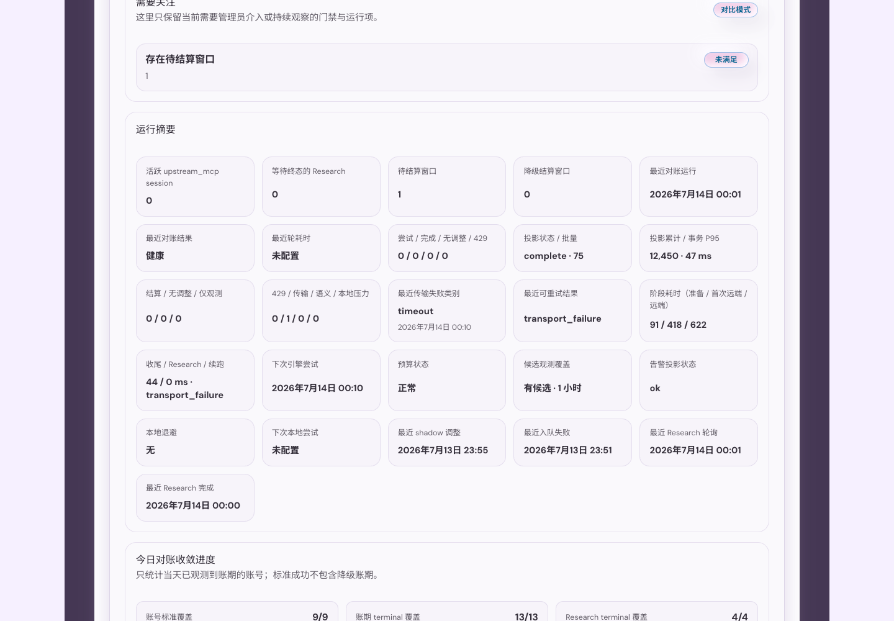
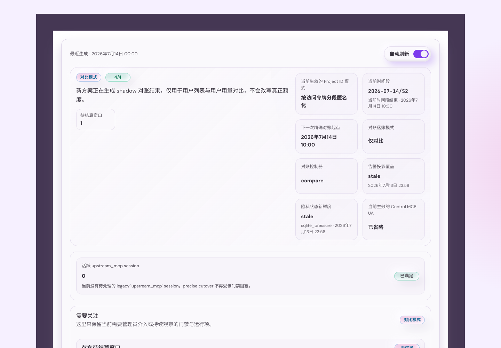
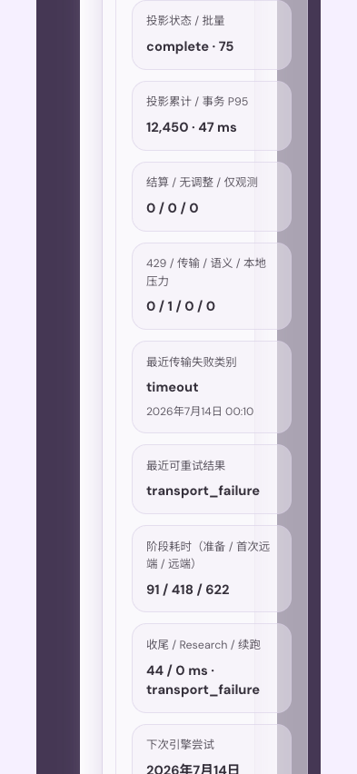
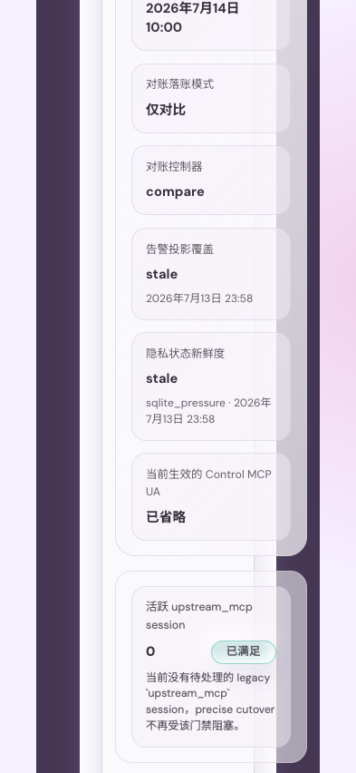
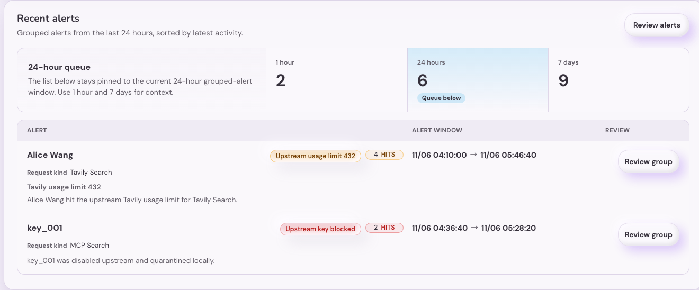
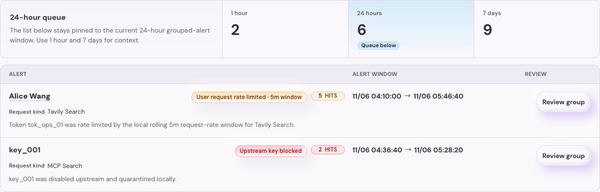
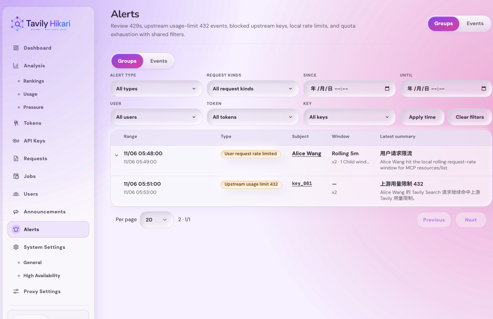

# Admin 告警中心与 24h 仪表盘告警摘要（#9tbyq）

## 背景

- 当前 `/admin/alerts` 仍是占位骨架页，运营无法集中查看 429、上游 Key 封禁、用户限流、用户额度耗尽等高频风险。
- 现有管理员页面已经分别持有请求日志、Key 维护记录、用户与令牌详情，但缺少一层“告警读模型”把这些离散事件收束成可筛选、可跳转的事件流与聚合视图。
- `/admin/dashboard` 已具备近 24h 运营摘要，但尚未展示“近期告警总量 / 分组量 / 类型分布 / Top groups”，导致运营需要切换多个模块才能确认异常规模。
- 当前仓库已经记录了告警所需的关键事实：`auth_token_logs`、`request_logs`、`api_key_maintenance_records`。本轮应优先复用这些现有表，而不是再引入新的写侧告警表。

## Goals

- 把 `/admin/alerts` 替换为真实告警中心，并提供双 Tab：`事件记录` + `聚合告警`。
- 固定支持 5 类告警：
  - `upstream_rate_limited_429`
  - `upstream_usage_limit_432`
  - `upstream_key_blocked`
  - `user_request_rate_limited`
  - `user_quota_exhausted`
- 基于现有日志与维护记录派生告警读模型，支持共享筛选、分页、URL 状态同步，以及用户 / 令牌 / Key / 请求关联跳转。
- 为 `/api/dashboard/overview` 增加最近 24 小时告警摘要；仪表盘摘要固定 24h，CTA 显式进入同口径 `聚合告警` 时间切片，而直接打开告警中心默认展示 retention 内全部历史。
- 将仪表盘“近期告警”收口为“顶部三窗聚合计数 + 下方 24h 聚合列表”：顶部展示最近 `1h / 24h / 7d` 的聚合告警条数，下方列表固定展示最近 `24h`、最多 `10` 条聚合告警，并显示连续区间时间。
- 为 Web UI 补齐 Storybook 稳定入口、页面/交互覆盖与视觉证据。
- 管理员 Events、Groups 与 Catalog 在 projection 不完整或 SQLite 压力下只返回同一规范查询键
  的 last-good 结果，并标记 `coverage`、`observedAt`、`staleReason`；没有可复用快照时返回
  `503 Retry-After: 1`，不得在读取路径启动原始告警 CTE。
- Alerts 读取使用独立的 SQLite read session：获取连接最多 `100ms`，同一只读 snapshot 内的
  coverage 与 projection 读取由 `250ms` 原生 deadline 约束。它不是 bulk admission，也不允许
  handler 外层 timeout 或 raw-pool fallback 重新引入无界等待。
- 默认 catalog、events `1/20` 与 groups `1/20` 是 canonical keys，由 `AppState` 唯一拥有的
  background warm controller 以 `AdminAlertsCacheWarm` 短读片构建。三项必须来自同一完整
  projection generation 才能一起发布；任一 defer、取消或 generation 变化都丢弃 staged
  值并保留 last-good。warm admission 只要求一个 bounded read slot、前台速率不超过 `5 rps`
  且最近 `5s` 无 SQLite contention；不预热或保留第二条连接，前台 checkout/等待者会产生
  typed defer，失败按 `5s/5s/30s` 退避。冷启动且没有连接等待者时允许第一条 bounded read
  惰性建立连接；HTTP 对 canonical key 只读 exact-key
  cache：同 generation 为 fresh，generation 落后但未过期为 stale，cold/过期为
  `503 Retry-After: 1`，绝不触发重建。
  默认 Events `1/20` 的 canonical slice 直接从投影表的
  `(occurred_at DESC, row_sort_id DESC)` 索引读取计数和页面，并在 Rust 解码已物化的
  `payload_json`；只有带筛选的非 canonical 查询才保留 JSON CTE 语义。若该直接页在生产形状
  快照上仍超过 `250ms`，必须先提交 `EXPLAIN QUERY PLAN` 证据再另立投影/索引任务，不能提高
  读预算或恢复 raw fallback。
  Canonical HTTP 的 fresh、stale 与 cold payload 响应不计入 synthetic SQLite 前台活动；已配置
  passkey 的 session lookup 与实际进入 bounded database fallback 的 noncanonical 读取仍计量；
  前者在开始获取 SQLite 连接之前计量，避免 cache-only 重试自行阻止 warm admission，同时不隐藏
  真实 SQLite 读取。

## Non-goals

- 不引入告警规则配置、阈值编辑、通知渠道。
- 不引入 incident ack / resolve / open / closed 生命周期。
- 不为告警新增独立写侧持久化表，也不做历史重放修复工具。
- 不对现有 requests 模块做大规模架构改造。

## Related ADRs

- [ADR 0002: Scoped SQLite and Remote Admission](../../adr/0002-scoped-sqlite-and-remote-admission.md)

## 告警分类规则

### `upstream_rate_limited_429`

- 来源：`auth_token_logs.failure_kind = 'upstream_rate_limited_429'`。
- 关联：
  - `auth_token_logs.request_log_id` -> 请求详情
  - `auth_token_logs.api_key_id` -> Key
  - `auth_token_logs.token_id` -> 令牌
  - 若令牌已绑定用户，则补出用户

### `upstream_key_blocked`

- 来源：`api_key_maintenance_records` 中与上游 Key 封禁/撤销相关的记录。
- 本轮默认识别 `reason_code IN ('account_deactivated', 'key_revoked', 'invalid_api_key')`。
- 关联优先使用 maintenance record 上的：
  - `key_id`
  - `auth_token_id`
  - `auth_token_log_id`
  - `request_log_id`
  - `actor_user_id`

### `user_request_rate_limited`

- 来源：`auth_token_logs.result_status = 'quota_exhausted' AND counts_business_quota = 0`。
- 表示用户/令牌命中了本地 request-rate 429，而不是业务额度扣减耗尽。
- 关联优先使用：
  - `token_id`
  - `api_key_id`
  - `request_log_id`
  - token owner -> user

### `upstream_usage_limit_432`

- 来源：`auth_token_logs.result_status = 'quota_exhausted' AND request_logs.tavily_status_code = 432`。
- 语义：表示上游 Tavily 对当前请求返回 usage-limit / plan-limit 432。
- 这是上游额度门禁，不等于本地用户业务额度耗尽。
- 关联优先使用：
  - `token_id`
  - `COALESCE(auth_token_logs.api_key_id, request_logs.api_key_id)` -> Key
  - `request_log_id`
  - token owner -> user

### `user_quota_exhausted`

- 来源：`auth_token_logs.result_status = 'quota_exhausted' AND counts_business_quota = 1 AND request_logs.tavily_status_code IS DISTINCT FROM 432`。
- 表示用户/令牌命中了本地业务额度耗尽，不包含上游 Tavily 432。
- 关联优先使用：
  - `token_id`
  - `api_key_id`
  - `request_log_id`
  - token owner -> user

## 事件源与聚合口径

- `事件记录` Tab 数据源固定为 `GET /api/alerts/events`，其读侧 projection 由现有 `auth_token_logs`、`request_logs`、`api_key_maintenance_records`、`user_token_bindings`、`users` 组合得出。
- 聚合分组仅针对“当前筛选窗口内”的结果，无状态、无持久化，不引入 ack / resolve。
- `upstream_rate_limited_429`、`upstream_usage_limit_432`、`upstream_key_blocked` 继续沿用兼容分组：
  - `alert_type`
  - 主体：`user` 优先，其次 `token`；Key 级告警固定使用 `key`
  - `request_kind_key`
- `user_request_rate_limited` 与 `user_quota_exhausted` 改为母子语义聚合：
  - 原始告警事件 -> 子窗口（触发限制的原时间窗口实例）-> 母区间（多个连续子窗口组成的连续受限范围）
  - grouped 主表只展示 `母 -> 子` 两层；原始告警事件从子行的内联明细 / 抽屉入口查看
  - `user_request_rate_limited`：
    - 子窗口基于滚动 `5m` request-rate 语义
    - 同一主体在一次原始 5 分钟窗口里的多条限流事件归入同一子窗口
    - 相邻子窗口若空档不超过 `5m`，则继续归入同一母区间
  - `user_quota_exhausted`：
    - 子窗口基于原始 `hour | day | month` 语义
    - `hour` 为滚动 60 分钟窗口，`day` 为本地自然日窗口，`month` 为 UTC 自然月窗口
    - 同一原窗口实例内不再按 `request_kind` 拆分子窗口
    - 连续窗口链再向上聚成母区间，不同窗口类型不混组
- `聚合告警` Tab 默认按 `lastSeen DESC` 排序。母行至少展示主体、受限类型、连续区间、子窗口数、总命中次数、最新命中时间与最新摘要；展开后子行展示原时间窗口实例与原始告警入口。

## URL 与页面行为

### `/admin/alerts`

- URL 查询串是视图真相源。
- Header tabs、页面内 tabs 与窄屏 tabs 的显示顺序统一为 `聚合告警` 在前、`事件记录` 在后，但 `view=groups|events` 查询语义与默认值不变。
- 支持：
  - `view=events|groups`
  - `type=<alert_type>`
  - `since=<iso8601>`
  - `until=<iso8601>`
  - `userId=<user_id>`
  - `tokenId=<token_id>`
  - `keyId=<key_id>`
  - `requestKinds=<request_kind_key>`（可重复）
  - `page=<n>`
- 默认：
  - `view=groups`
  - 未显式传 `since` / `until` 时返回 retention 内全部历史
  - 其它筛选为空
- 事件 Tab 与聚合 Tab 共享同一组筛选。
- 关联跳转：
  - 用户 -> 现有 user detail route
  - 令牌 -> 现有 token detail route
  - Key -> 现有 key detail route
  - 请求 -> 告警中心内请求详情抽屉

## API / 数据契约

### `GET /api/alerts/catalog`

- 仅管理员可访问。
- 返回：
  - `retentionDays`
  - `types[]`
  - `requestKindOptions[]`
  - `users[]`
  - `tokens[]`
  - `keys[]`

### `GET /api/alerts/events`

- 仅管理员可访问。
- 入参：
  - `page`
  - `per_page`
  - `type`
  - `since`
  - `until`
  - `user_id`
  - `token_id`
  - `key_id`
  - `request_kind`
- 返回：
  - `items[]`
  - `total`
  - `page`
  - `perPage`
- 未显式传 `since` / `until` 时返回 retention 内全部历史。

### `GET /api/alerts/groups`

- 仅管理员可访问。
- 入参与 `events` 一致。
- 返回：
  - `items[]`
  - `total`
  - `page`
  - `perPage`
  - `groupingKind`
  - `semanticWindowKind`
  - `semanticWindowMinutes`
  - `semanticWindowStart`
  - `semanticWindowEnd`
  - `semanticWindowKey`
  - `childCount`
  - `eventCount`
  - `children[]`
  - `childEvents[]`
- 未显式传 `since` / `until` 时返回 retention 内全部历史。

### `GET /api/dashboard/overview`

- 新增 `recentAlerts`：
  - `windowHours`
  - `totalEvents`
  - `groupedCount`
  - `groupedCountWindows[]`
  - `countsByType`
  - `topGroups[]`
- 默认口径固定为最近 24 小时。
- `groupedCountWindows[]` 固定返回 `1h / 24h / 168h` 三个聚合告警计数；`topGroups[]` 固定仍为最近 24 小时聚合结果，且 dashboard 读取前 `10` 条。
- `recentAlerts` 不改变 `/api/alerts/*` direct-open 默认口径；仪表盘 CTA 需要显式携带 `24h + view=groups`。

## 展示约束

- `事件记录` Tab 默认按时间倒序。
- 告警类型需要在 UI 中展示稳定标签与 tone。
- 共享筛选至少覆盖：
  - 告警类型
  - 时间范围
  - 用户
  - 令牌
  - Key
  - request kind
- 仪表盘“近期告警”改为：
  - 顶部三张聚合计数卡：最近 `1 小时 / 24 小时 / 7 天`
  - 下方固定 `24h` 聚合告警列表，最多 `10` 条
  - 每条列表至少展示告警类型、主体、命中数、连续区间 `firstSeen -> lastSeen`、请求类型（若有）与最新摘要
  - 当主体是用户且存在 `userId` 时，主体名称必须可点击并进入现有 `/admin/users/:id` 用户详情。
  - 告警类型 badge 只承载分类和必要窗口：本地 request-rate 告警可展示 `5m` 窗口；request kind 与上游 Key 封禁原因摘要不得进入类型 badge。
  - Dashboard 聚合摘要不展示 latest title；行内说明只保留 request kind（若有）与最新 summary。
  - `user_request_rate_limited` 最新摘要必须说明具体本地限流窗口，例如 rolling `5m` request-rate window，不能只写泛化的 local rolling window。
  - 进入 `/admin/alerts` 的 CTA

## 验收标准

- `/admin/alerts` 不再渲染占位 skeleton，而是渲染真实告警中心。
- 5 类告警分类正确，且能从现有日志/维护记录稳定派生。
- `upstream_usage_limit_432` 必须在查询时把历史与新增 Tavily 432 事件从 `user_quota_exhausted` 中重新归类出来。
- `user_quota_exhausted` 仅保留给真实本地业务额度耗尽。
- 事件记录与聚合告警可在同一组筛选下切换，并保持 URL 状态同步。
- `事件记录` 继续保持 raw alerts 列表与现有排序逻辑，数据源不变。
- `user_request_rate_limited` 与 `user_quota_exhausted` 的 grouped 口径符合“母区间 -> 子窗口”的语义，不再按 `request_kind` 作为主拆分键。
- `request_kind` 若需要展示，仅作为子窗口明细或原始事件属性出现。
- 关联跳转可用：用户 / 令牌 / Key 进入详情页，请求进入当前页抽屉。
- `/admin/dashboard` 新增最近 24 小时告警摘要；CTA 可直接进入同口径 grouped 视图，而 `/admin/alerts` direct-open 默认展示全部历史。
- `/api/dashboard/overview.recentAlerts.groupedCountWindows` 固定返回 `1h / 24h / 168h` 三项，且仪表盘顶部只展示这三张聚合计数卡。
- 仪表盘“近期告警”下方只展示聚合记录，不再展示旧的“事件数 / 分组数 / 类型分布”卡组。
- 每条仪表盘聚合记录必须展示连续区间 `firstSeen -> lastSeen`，不得缺失告警时间。
- 仪表盘用户主体点击后进入对应用户详情页；非用户主体保持原详情入口，不新增无效跳转。
- 仪表盘告警类型 badge 不得承载非必要信息；`user_request_rate_limited` 可显示 `5m` 窗口，但不得把 request kind 拼进 badge；上游 Key 封禁不得把原因摘要拼进 badge。
- 仪表盘聚合记录不得展示 `latestEvent.title` 作为独立说明行，避免与类型 badge 和 summary 重复。
- `user_request_rate_limited` 的事件、分组与 dashboard 摘要必须包含 token、request kind 与 rolling `5m` request-rate window。
- 后端验证至少包含：
  - `cargo test`
  - `cargo clippy -- -D warnings`
- 前端验证至少包含：
  - `cd web && bun test`
  - `cd web && bun run build`
  - `cd web && bun run build-storybook`
- 浏览器实页可复核 `/admin/dashboard` 与 `/admin/alerts` 的新展示面；owner-facing 视觉证据以真实页面视口为准。

## 风险与开放点

- `upstream_key_blocked` 的识别依赖现有 `reason_code` 取值，若后续出现新的上游封禁原因，需要同步扩充白名单。
- 事件来自不同源表，时间、请求关联、token owner 可能存在部分缺失；前端需允许关联缺省而不是把整行吞掉。
- 仪表盘摘要与告警中心的口径一致性依赖同一后端聚合逻辑，避免分别实现两份计算。

## Visual Evidence

- 当前实现 SHA `0325ae57` 的 Storybook 状态证据：
  - `source_type=storybook_canvas`, `target_program=mock-only`, `capture_scope=browser-viewport`, `requested_viewport=1440x1000`, `viewport_strategy=storybook-viewport`, `state=transport-known`。证明管理员对账卡片显示脱敏传输类别、观察时间、retryable outcome 和阶段耗时。

    PR: include

    

  - `source_type=storybook_canvas`, `target_program=mock-only`, `capture_scope=browser-viewport`, `requested_viewport=1440x1000`, `viewport_strategy=storybook-viewport`, `state=stale-sqlite-pressure`。证明同一页面显示告警投影 stale、隐私状态 stale、sqlite pressure 和最近观察时间。

    PR: include

    

  - `source_type=storybook_canvas`, `target_program=mock-only`, `capture_scope=browser-viewport`, `requested_viewport=393x852`, `viewport_strategy=storybook-viewport`, `state=transport-known-mobile`。

    PR: include

    

  - `source_type=storybook_canvas`, `target_program=mock-only`, `capture_scope=browser-viewport`, `requested_viewport=393x852`, `viewport_strategy=storybook-viewport`, `state=stale-sqlite-pressure-mobile`。

    PR: include

    

- Storybook canvas 组件证据：
  - `Admin/Components/DashboardOverview / RecentAlertsDesktopEvidence` 提供稳定桌面证据，近期告警区已重做为“24h 队列导语 + 三窗聚合计数 + 聚合告警队列表格”。
  - 顶部概览区只保留最近 `1 小时 / 24 小时 / 7 天` 三窗聚合计数，并用 `24h` 窗口显式标注当前队列口径。
  - 下方 `24h` 聚合列表改为 `告警 / 告警区间 / 查看` 三列骨架；请求类型与命中数并回主体行内元信息，每条记录都展示连续区间 `firstSeen -> lastSeen`、主体与最新摘要。
  - 审计收口后，命中数 badge 已复用共享 badge 尺寸契约，行尾 `Review group` CTA 降为更安静的次级操作，避免与连续区间信息抢视觉层级。
  - 分组查看按钮具备主体化可访问名称，且窄屏表头仍保留在无障碍语义树中，不再因为 `display: none` 丢失表格关系。
  - 用户主体 `Alice Wang` 以轻量可聚焦按钮呈现，可跳转用户详情；本地 request-rate 告警摘要明确写出 `rolling 5m request-rate window` 与请求类型，告警类型 badge 仅保留分类与 `5m window`，不重复展示 request kind 或上游封禁原因，也不再单独展示 `latestEvent.title`。

    

    

- Storybook page fallback 证据：
  - `Admin/Pages / Alerts` 的 header tabs 与页面内 tabs 顺序已统一为 `聚合告警 -> 事件记录`。
  - 默认激活态仍为 `view=groups`，仅调整展示顺序，不改变查询语义。

    

- Chrome DevTools 复核：
  - `iframe.html?id=admin-components-dashboardoverview--recent-alerts-desktop-evidence` 已确认近期告警区显示 `Last 1 hour / Last 24 hours / Last 7 days` 三窗计数，以及 `Alert window` 连续区间文案。
  - `iframe.html?id=admin-pages--alerts` 已确认顶部 header tabs 与页面内 segmented tabs 都以 `Groups` 在前、`Events` 在后。

## 101 验证 Runbook

在 101 部署 hotfix 后，按以下顺序做只读验证：

1. 解析部署目标并确认 stack：

   ```bash
   /Users/ivan/.codex/skills/srv-101-ops/scripts/resolve-target --json
   ```

2. 读取远端部署真相源：

   ```bash
   ssh 192.168.31.11 'sed -n "1,160p" /home/ivan/srv/AGENTS.md'
   ssh 192.168.31.11 'sed -n "1,160p" /home/ivan/srv/README.md'
   ssh 192.168.31.11 'sed -n "1,220p" /home/ivan/srv/ai/tavily-hikari.md'
   ```

3. 确认容器健康与版本：

   ```bash
   ssh 192.168.31.11 'docker compose -f /home/ivan/srv/ai/docker-compose.yml ps ai-tavily-hikari'
   ssh 192.168.31.11 'docker exec ai-tavily-hikari curl -fsS http://127.0.0.1:8787/api/version'
   ssh 192.168.31.11 'docker exec ai-tavily-hikari curl -fsS http://127.0.0.1:8787/health'
   ```

4. 验证 `/api/alerts/groups` 与 `/api/alerts/events` 都可读，且 grouped 查询不再报 SQLite 语法错误：

   ```bash
   ssh 192.168.31.11 "docker exec ai-tavily-hikari curl -fsS -H 'x-forward-user: admin' 'http://127.0.0.1:8787/api/alerts/events?page=1&per_page=20' | jq '.total'"
   ssh 192.168.31.11 "docker exec ai-tavily-hikari curl -fsS -H 'x-forward-user: admin' 'http://127.0.0.1:8787/api/alerts/groups?page=1&per_page=20' | jq '.total'"
   ```

   期望：
   - 两个接口都返回 `200`
   - `groups` 不再返回 `database error: (code: 1) near "(": syntax error`
   - `groups.total` 能稳定返回非 0 的聚合结果

5. 验证历史 432 告警已重分类：

   ```bash
   ssh 192.168.31.11 "docker exec ai-tavily-hikari curl -fsS -H 'x-forward-user: admin' 'http://127.0.0.1:8787/api/alerts/events?per_page=50&type=upstream_usage_limit_432' | jq '.items[] | select(.request.id == 972534 or .request.id == 971163 or .request.id == 956970) | {type, request: .request.id, key: .key.id, title}'"
   ```

6. 验证 dashboard recentAlerts 已包含新类型：

   ```bash
   ssh 192.168.31.11 "docker exec ai-tavily-hikari curl -fsS http://127.0.0.1:8787/api/dashboard/overview | jq '.recentAlerts.countsByType[] | select(.type == \"upstream_usage_limit_432\")'"
   ```

7. 验证 stale affinity 自愈：

   ```bash
   ssh 192.168.31.11 "docker exec ai-tavily-hikari sqlite3 /srv/app/data/tavily_proxy.db \"select user_id, api_key_id from user_primary_api_key_affinity where user_id='yjPBlIKQ4csL'; select token_id, api_key_id from token_primary_api_key_affinity where token_id='exlD';\""
   ```

   若池中仍存在 active 替代 key，则下一次 billable 请求后应看到 `EWmw` 被重绑为新的 active key（例如 `4hOe`）；若池中没有任何 active key，则允许继续停留在 degraded exhausted fallback。
