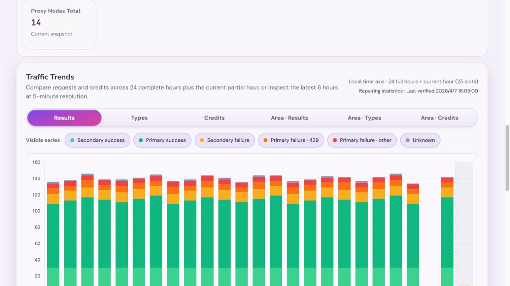
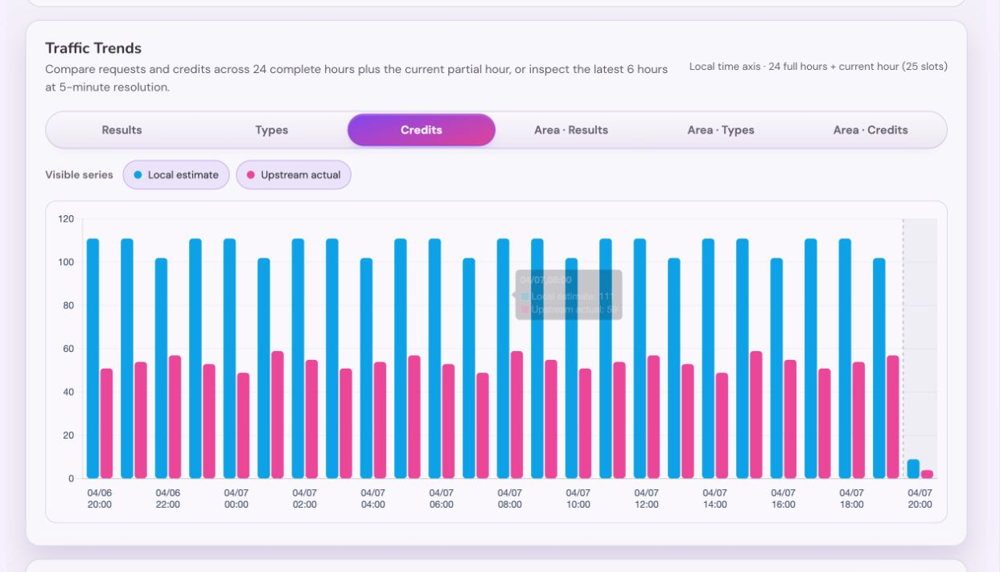
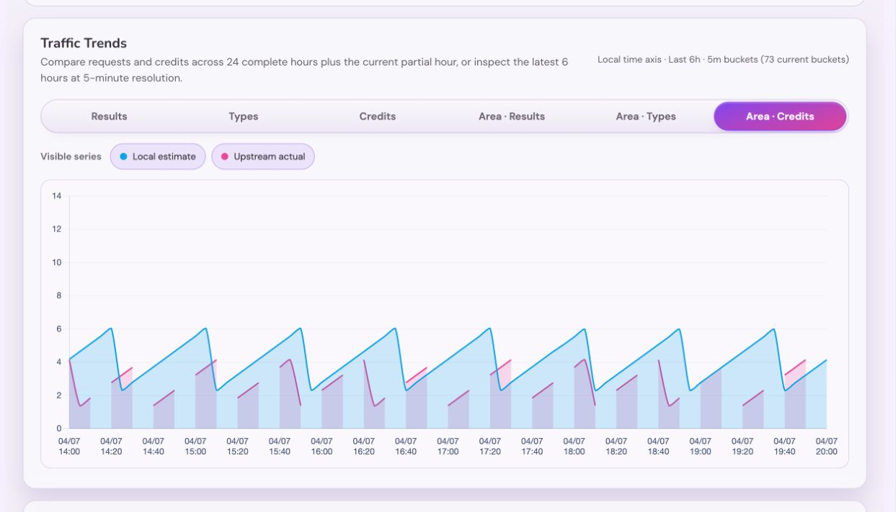

# Admin 仪表盘请求趋势图表（#h2698）

## 背景

- `/admin/dashboard` 的 `Traffic Trends` 需要同时回答请求结构和积分消耗两类问题，避免运营在仪表盘与明细日志之间来回切换。
- 本地已落账积分与上游额度样本具有不同的完整性：前者连续，后者只在存在可计算样本时有值，图表必须忠实表达这种差异。
- 仪表盘已经有 `overview` fetch 与 admin `/api/events` SSE snapshot，同步契约适合继续承载这块小时级图表数据。

## Goals

- 在管理员仪表盘现有 `Traffic Trends` 区域内，用单一 stacked bar 图表面板替换旧 sparkline。
- 后端统一返回有限的**服务器本地时区对齐**5 分钟桶，并保证**最新一桶就是当前本地 5 分钟进行中**；前端将三张面积图固定展示最近 6 小时实时窗口，三张柱状图固定展示滚动 25 个小时槽。
- 图表固定支持 6 种视图：
  - 调用结果
  - 调用类型
  - 积分
  - 面积图 · 调用结果
  - 面积图 · 调用类型
  - 面积图 · 积分
- 图表数据通过 `GET /api/dashboard/overview` 与 admin `/api/events` snapshot 共享同一契约，不新增单独 dashboard polling 接口。

## Non-goals

- 不延长 `request_logs` 的长期保留期，也不提供管理员任意日期全量重建按钮。
- 不修改 public/user console 页面与 `/mcp` 外部协议。
- 不把调用类型拆到每个单独工具名；v1 只统计 `protocol × billing` 四类。

## 数据契约

### `DashboardHourlyRequestWindow`

- `bucketSeconds = 300`
- `visibleBuckets = 73`
- `retainedBuckets = 589`
- `buckets[]` 按时间升序排列，最新一桶允许是“当前服务器本地 5 分钟进行中”：
  - `bucketStart`
  - `secondarySuccess`
  - `primarySuccess`
  - `secondaryFailure`
  - `primaryFailure429`
  - `primaryFailureOther`
  - `unknown`
  - `mcpNonBillable`
  - `mcpBillable`
  - `apiNonBillable`
  - `apiBillable`
  - `localEstimatedCredits`
  - `upstreamActualCredits`（`number | null`；无可计算上游样本时为 `null`）

### `GET /api/dashboard/overview`

- 在现有 payload 中新增 `hourlyRequestWindow`。
- 旧 `trend` 字段可保留为兼容字段，但 dashboard 前端不再用它作为主图表来源。
- `hourlyRequestWindow` 服务 `Traffic Trends` 的实时面积图与小时柱状图；`本月` 摘要卡及其 `previous-month comparison line` 必须继续走专用月度日粒度序列契约，禁止再从该窗口推断整月趋势。

### admin `/api/events` snapshot

- `snapshot.overview.hourlyRequestWindow` 与 `GET /api/dashboard/overview` 完全一致。
- SSE 变更检测必须覆盖小时窗口锚点变化与小时桶内容变化，避免整点翻小时后图表不刷新。

## 统计完整性与自愈

- `request_logs` 是保留期内本地请求统计的事实源。审计必须使用既有
  `(visibility, created_at, id)` 索引分页读取，固定每个工作项的源数据 fence；不得在请求热路径新增
  写入，也不得在启动阶段重建原始日志。
- 审计工作项最多读取 500 条日志或消耗 150ms 读取预算。高密度时间片必须将游标和累计结果持久化，未
  完成前不得写入任何部分 rollup。
- 聚合完成后才允许打开短写事务，精确替换受影响的分钟 rollup。写入目标为 100ms；超过 250ms 必须记
  录慢操作并延后下一片。SQLite `busy` / `locked` 或预算耗尽必须保持工作项和缺口，退避后重试。
- 替换前必须在 100ms 内尝试 flush 已在内存中的请求统计，并安装按源 fence 划分的 coalescer 修复栅栏。
  栅栏内已被源聚合覆盖的迟到增量在替换成功后丢弃；fence 后的增量暂存、重新入队并重审，不得重复累加。
- 热窗口首次扫描优先；历史片仅在首次热窗口完成后启动，之后最多每 60 秒插入一片。循环重审只把当前
  5 分钟工作项标为待验证，不能把整段已验证热窗口重新显示为缺口。
- 已封存日的逐片回审同样最多每 60 秒执行一次，且不得抢占新闭合或首次热窗口片。源行更新 guard 被取消时
  必须使对应片的版本失效，强制重新读取，不能将可能已提交的旧行改动标为已验证。
- 每个本地日结束且分钟桶已验证时，写入日级 seal。源日志仍保留时，迟到数据修复会同步刷新对应日级
  rollup 与 seal；源日志过期后，seal 成为日级恢复基线。原始日志 GC 在删除候选日之前必须确认 seal
  存在且与分钟、日级 rollup 完全一致；只含被抑制日志的日期不参与 dashboard 统计，也不得要求 seal
  或永久阻塞 GC。
- `hourlyRequestWindow.unverifiedBucketStarts` 表示与未验证分钟范围相交的 5 分钟槽；前端必须把这些槽
  渲染为缺口。完整性状态尚未创建时，整个返回窗口都必须是缺口；已验证的零值仍然显示为零。
- overview 与 SSE snapshot 同时返回 `rollupIntegrity`：`healthy`、`repairing` 或 `degraded`，以及最后
  验证时间、下次尝试时间和未验证桶数量。修复连续两小时无法推进时应进入既有 job-failure 告警视图。
- 请求统计 coalescer 的关闭顺序是：停止接受新连接、等待在途请求、标记 shutdown、唤醒并等待 flush
  worker。应用 drain 上限为 20 秒，Compose stop grace period 为 30 秒。这个保护只覆盖进程终止尾部，连续
  缺口始终由完整性审计发现和修复。

## 统计口径

- 5 分钟桶窗口：
  - 以**服务器本地时区当前 5 分钟边界**作为当前未封口桶起点，并将该边界换算成 UTC epoch `bucketStart`
  - 返回 `[currentFiveMinuteStart - 588*5m, currentFiveMinuteStart]` 的 589 个 5 分钟桶，其中最后一桶就是当前 5 分钟
  - 后端已返回的 bucket 可为 0 值；前端不得为缺失 bucket 自行补 0、插值或伪造 bucket，缺失时间槽位必须保持空缺不渲染。
- “主要 / 次要”直接复用现有 `request_value_bucket`：
  - `valuable -> primary`
  - `other -> secondary`
  - `unknown -> unknown`
- 调用结果分类：
  - `secondarySuccess` = `other + success`
  - `primarySuccess` = `valuable + success`
  - `secondaryFailure` = `other + (error | quota_exhausted)`
  - `primaryFailure429` = `valuable + failure_kind=upstream_rate_limited_429`
  - `primaryFailureOther` = `valuable + (error | quota_exhausted) - primaryFailure429`
  - `unknown` = `unknown + any result_status`
- 调用类型分类固定为：
  - `mcpNonBillable`
  - `mcpBillable`
  - `apiNonBillable`
  - `apiBillable`
- 积分口径：
  - `localEstimatedCredits` 复用 `dashboard_request_rollup_buckets.local_estimated_credits`，按图表桶聚合本地已落账业务积分。
  - `upstreamActualCredits` 复用额度扣减卡的 quota 样本差分口径：按 Key 读取窗口前最近基线与窗口内样本，将 `max(previousRemaining - currentRemaining, 0)` 归入当前样本所在的 5 分钟桶。
  - 只有存在至少一个可由前序样本计算的差分时，上游实扣桶才返回数值；没有可计算样本时返回 `null`，不得伪装成 `0`、插值或均摊。
  - 小时积分图将小时内已有的 5 分钟上游实扣值求和；整小时没有任何可计算值时仍为 `null`。
- 柱状图与面积图窗口：
  - 三张面积图直接使用 `hourlyRequestWindow.visibleBuckets=73` 对应的最新滚动窗口，不再用 `summaryWindows.today_*` 二次裁剪。
  - 面积图窗口固定表示“72 个完整 5 分钟桶 + 1 个当前 5 分钟槽位”，即最近 6 小时实时运行情况。
  - 三张柱状图固定展示滚动 25 个小时槽：`latestHourStart - 24h` 到 `latestHourStart`，即 24 个完整小时加 1 个当前未满小时槽。
  - 当前未满小时只聚合已经返回的 5 分钟桶，不额外补齐未来分钟；最后一槽的 plot-area 使用灰色背景，并在前一小时与当前小时之间绘制竖向虚线分界。

## 展示约束

- `Traffic Trends` 外层 panel、标题区与整体 dashboard 排布保持不变，只替换内部内容。
- 图表默认显示：
  - 结果图：`次要成功 → 主要成功 → 次要失败 → 主要失败·429 → 主要失败·其他 → unknown`
  - 类型图：`MCP 非计费 → MCP 计费 → API 非计费 → API 计费`
- 面积图沿用结果/类型两组 series 与颜色体系，使用真正的 stacked area 读结构占比和波峰变化：
  - 首个可见 series 填充到 `origin`，后续可见 series 填充到前一个可见 dataset，禁止所有 series 同时回填到零基线造成重叠面积。
  - 用户隐藏中间 series 后，面积图必须按剩余可见 series 重新连续堆叠，不为隐藏层保留视觉空腔。
  - Chart.js filler propagation 必须关闭，避免相邻目标在隐藏/缺失时被插件自动传播到非预期层。
  - 面积图轮廓线只允许轻微平滑，避免小时桶数据被过度抹圆。
- 绝对图与面积图默认全选全部 series。
- 结果图与类型图继续使用多选显示/隐藏；两张积分图固定提供 `本地估算 / 上游实扣` 两个多选 series，并共享显隐状态。
- 结果维度的 series 可见性在结果柱状图和结果面积图之间共享；类型维度同理。
- `积分` 使用两根独立并排柱，禁止堆叠；`面积图 · 积分` 使用两层从零基线开始的半透明重叠面积，禁止堆叠或显示两者合计。
- 前端需要记忆上次选中的图表模式与 series 组合，并在下次重新打开管理台时恢复。
- 桶统计口径按**服务器本地时区**对齐，但 UI 文案必须明确区分：
  - 三张面积图：最近 6 小时、5 分钟粒度
  - 三张柱状图：最近 24 个完整小时 + 当前未满小时，小时粒度
  - 横轴日期/时间标签按浏览器本地时间显示。
- 图表渲染必须把“时间槽位”和“已有 bucket 数据”分开：时间槽位可用于展示完整范围，bucket 缺失时数据值为 `null` 或等价空值，不渲染柱/点/线段。
- API / MCP 配色必须复用请求记录界面的语义色族；结果图复用 success / warning / destructive / neutral 语义，不新造一套与现有 UI 脱节的颜色体系。

## 验收标准

- 管理员仪表盘首页能直接看到请求趋势图表，不再显示旧 sparkline 卡片。
- `/api/dashboard/overview` 与 `/api/events` snapshot 都包含 `hourlyRequestWindow`，且 dashboard 切到该路由后可实时刷新。
- `hourlyRequestWindow.bucketSeconds = 300`、`retainedBuckets = 589`、`visibleBuckets = 73`，且最新一桶必须等于 `currentFiveMinuteStart`。
- 5 分钟桶最后一组必须是当前服务器本地 5 分钟进行中；横轴标签则按浏览器本地时间展示同一批 bucket。
- 当固定范围内缺少 bucket 时，对应柱/点/线段保持空缺，不得补 0、不插值、不自行生成 bucket。
- 主绝对图展示滚动 25 个小时槽，5 分钟桶按小时聚合，不退化为面积图的 6 小时窗口，最后一槽必须以灰色背景和竖向虚线标识当前未满小时。
- 两张面积图共享同一滚动 73 组横轴，并支持与同维度柱状图共享 series 显隐状态。
- 结果图与类型图的默认堆叠顺序、默认可见系列和面积图行为与本 spec 一致。
- 六个 tab 固定顺序为 `调用结果 / 调用类型 / 积分 / 面积图 · 调用结果 / 面积图 · 调用类型 / 面积图 · 积分`，不再显示两张较昨日图。
- 积分柱图每小时显示本地估算与上游实扣两根独立柱；积分面积图独立重叠显示两项，并在无上游样本处断线。
- 管理台重新打开后，会恢复上一次选中的图表模式与 series 显示状态。
- 旧偏好中的 `resultsDelta` 与 `typesDelta` 分别迁移为 `credits` 与 `creditsArea`。
- 当所有可见系列被隐藏时，图表区域显示明确 empty state，而不是坏图或空白画布。
- Storybook 覆盖 6 个图表模式、toggle 行为与空数据场景，并提供最终视觉证据。

## 风险与假设

- 趋势图读路径依赖 `dashboard_request_rollup_buckets(bucket_secs=60)`，5 分钟窗口由分钟 rollup 汇总而来，不扫 `request_logs` 原始宽表；若后续扩展更多 breakdown，需继续保持 rollup 写入与 bounded rebuild 的幂等性。
- 风险：如果 admin SSE 的变更签名没有覆盖 5 分钟锚点，边界切换时图表可能在“无新日志”场景下停留旧窗口。
- 风险：`mcp:batch` 的计费/非计费判定依赖 request body 解析；rollup 写入与 rebuild 必须复用现有 canonicalization 规则，否则会和请求日志页面口径漂移。

## Visual Evidence

- source_type: storybook_canvas
  target_program: mock-only
  capture_scope: browser-viewport
  requested_viewport: default desktop canvas
  viewport_strategy: storybook-viewport
  margin_policy: trim_only
  evidence_surface: page
  sensitive_exclusion: N/A
  submission_gate: approved
  story_id_or_title: `admin-components-dashboardoverview--integrity-repairing`
  state: `repairing`
  evidence_note: 未验证的 5 分钟槽在小时聚合后仍为空缺；同时显示统计修复状态和最后验证时间，未将缺口伪装为零流量。
  PR: include
  image:
  

- source_type: storybook_canvas
  target_program: mock-only
  capture_scope: browser-viewport
  requested_viewport: none
  viewport_strategy: storybook-viewport
  margin_policy: trim_only
  evidence_surface: page
  sensitive_exclusion: N/A
  submission_gate: approved
  story_id_or_title: `admin-components-dashboardoverview--credits-mode`
  state: `credits`
  evidence_note: 验证“积分”使用滚动 25 个小时槽，本地估算与上游实扣按每小时两根独立柱并排展示，tooltip 只列出两项原值。
  PR: include
  image:
  

- source_type: storybook_canvas
  target_program: mock-only
  capture_scope: browser-viewport
  requested_viewport: none
  viewport_strategy: storybook-viewport
  margin_policy: trim_only
  evidence_surface: page
  sensitive_exclusion: N/A
  submission_gate: approved
  story_id_or_title: `admin-components-dashboardoverview--credits-area-mode`
  state: `credits-area`
  evidence_note: 验证“面积图 · 积分”使用最近 6 小时、73 个 5 分钟槽；两项从零基线半透明重叠，上游未采样区间保持断线。
  PR: include
  image:
  
