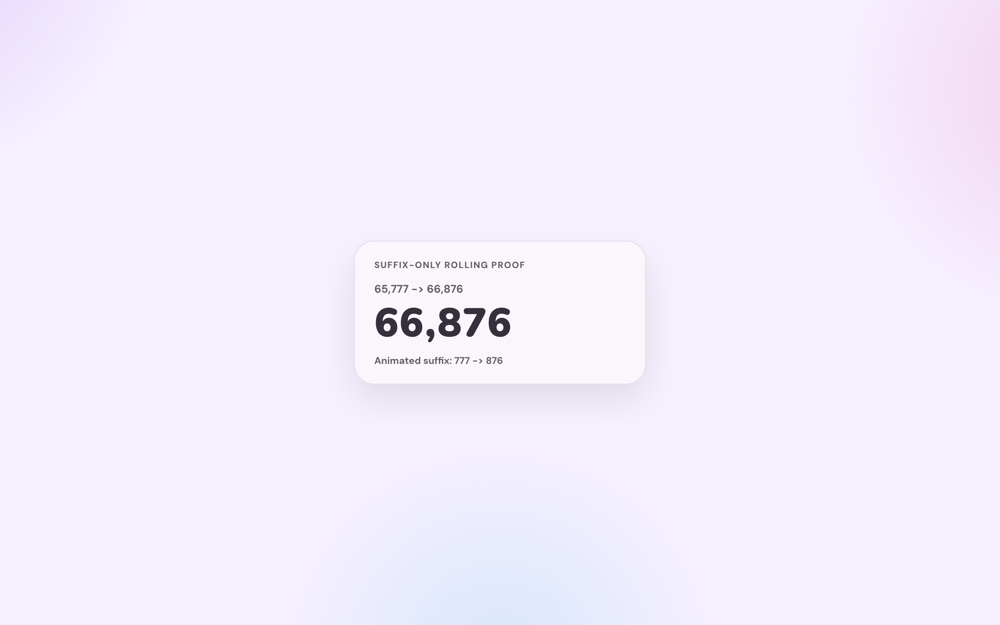

# Admin：仪表盘实时总览升级（#97m7a）

## 背景

- 当前 `/admin/dashboard` 顶部摘要区已经拆成 `今日 / 本月 / 站点当前状态` 三块，但仍然偏静态，SSE 只负责局部 summary/logs 更新，overview 还依赖前端额外节流补拉。
- 运营视角还缺少 key 生命周期指标：本月新增多少密钥、多少密钥进入隔离，无法在总览首屏直接判断补充速度与风险增长速度。
- 站点当前状态仍缺少代理池健康度摘要，也没有针对超大额度/积分数字做稳定排版，导致大数场景下卡片容易被省略号裁切。
- 参考 `codex-vibe-monitor` 后，当前仪表盘还可以进一步增强玻璃层次、卡片主次与数字视觉密度，但不应偏离现有 Tavily Hikari 管理端主题。

## Goals

- 将 dashboard 顶部总览升级为真正的实时总览：admin SSE `snapshot` 一次性携带顶部概览所需数据，前端优先消费 SSE，断线时才回退 polling。
- 在 `本月` 块补入 `新增密钥` 与 `新增隔离密钥` 两项月度生命周期指标。
- 将 `站点当前状态` 整体放到 `今日 + 本月` 下方，并扩展为 6 项：`剩余可用 / 活跃密钥 / 隔离中 / 已耗尽 / 可用代理节点 / 代理节点总数`。
- 为 `api_keys` 增加持久化 `created_at` 字段，使部署后的新增密钥统计精确；历史数据采用最佳努力回填。
- 按 `codex-vibe-monitor` 的信息分层方向增强顶部视觉表现：更清晰的玻璃感、渐变氛围、卡片分组与大数字展示。
- 确保大数字不会默认被 `...` 裁切，必要时通过字号缩放、双行或更宽布局保持信息完整。

## Non-goals

- 不调整公开首页 `/`、用户控制台 `/console` 或代理设置模块本身的管理交互。
- 不变更 forward proxy 调度算法、节点可用性判定逻辑或 `/api/summary` 现有即时摘要字段语义。
- 不为历史密钥新增来源级精确追溯能力；旧数据月新增数允许存在小误差。
- 不重构 dashboard 趋势图、风险看板、行动中心的数据口径，只做与新总览一致的视觉收口。

## 数据契约

### `GET /api/summary/windows`

- 继续仅管理员可访问。
- 保留现有：
  - `today`: `{ total_requests, success_count, error_count, quota_exhausted_count, upstream_exhausted_key_count }`
  - `yesterday`: `{ total_requests, success_count, error_count, quota_exhausted_count, upstream_exhausted_key_count }`
  - `month`: `{ total_requests, success_count, error_count, quota_exhausted_count, upstream_exhausted_key_count }`
- `quota_exhausted_count` 继续保持请求级语义，不改变请求日志、Token/Key 详情与其它既有消费者；dashboard 总览耗尽卡统一读取 `upstream_exhausted_key_count`。
- 扩展 `month`：
  - `new_keys`: 本月新增密钥数，基于 `api_keys.created_at >= local_month_start` 统计；生命周期统计不因后续软删除或状态变化而回退。
  - `new_quarantines`: 本月新增隔离密钥数，基于 `api_key_quarantines.created_at >= local_month_start` 统计当前月新建隔离记录数量。

### `GET /api/events` admin `snapshot`

- 继续仅管理员可访问，事件名仍为 `snapshot`。
- 负载从仅包含 `summary + keys + logs` 扩展为：
  - `summary`: 现有 `/api/summary` 即时快照。
  - `summaryWindows`: 对齐扩展后的 `/api/summary/windows`。
  - `siteStatus`: 顶部“站点当前状态”所需快照数据，字段至少包含：
    - `remainingQuota`
    - `totalQuotaLimit`
    - `activeKeys`
    - `quarantinedKeys`
    - `exhaustedKeys`
    - `availableProxyNodes`
    - `totalProxyNodes`
  - `forwardProxy`: 供顶部总览直接消费的代理池摘要；不必内嵌完整 24h buckets。
  - `keys`, `logs`: 保持现有首屏行为，避免破坏下游依赖。

### `GET /api/stats/forward-proxy/summary`

- 仅管理员可访问。
- 返回 dashboard overview 所需的轻量代理摘要：
  - `availableNodes`
  - `totalNodes`
- 该接口只能复用已存在的 runtime snapshot 聚合，不允许为了两个计数生成完整节点多窗口统计或 24h buckets。

## 统计与口径约束

- `api_keys.created_at` 为新的持久字段：
  - 新增 key 时必须写入当前 UTC 秒级时间戳。
  - schema 迁移时，为历史行做最佳努力回填；只允许使用不可变证据（如最早 request log、最早 quarantine 记录），无法证明时保留 `0`，但不得阻塞启动。
  - 回填必须是一次性迁移，不能在后续重启时根据“迁移后新出现的日志/隔离记录”再次改写旧 key 的 `created_at`。
- `new_keys` 统计基于 `api_keys.created_at`，不是基于 request log 首次使用时间。
- `new_quarantines` 统计基于 `api_key_quarantines.created_at`，同一个 key 在当前月多次“新增隔离记录”计入多条记录；若当前实现只允许一个 active quarantine，则仍按记录数聚合。
- `upstream_exhausted_key_count` 统计基于 `api_key_maintenance_records` 中 `source='system'`、`operation_code='auto_mark_exhausted'`、`reason_code='quota_exhausted'` 的记录，并按窗口内 `COUNT(DISTINCT key_id)` 聚合。
- `upstream_exhausted_key_count` 只认系统自动把上游 Key 标记为 exhausted 的维护事件；管理员手动标记、以及本地 token/account quota 拦截不进入该口径。
- `api_key_quarantines` 必须为月度隔离统计提供 `created_at` 前导索引，避免 admin SSE 的周期性 month lifecycle 查询退化成全表扫描。
- `可用代理节点数` 定义为 `ForwardProxyLiveStatsResponse.nodes` 中 `available && !penalized` 的数量。
- `代理节点总数` 定义为 `ForwardProxyLiveStatsResponse.nodes.len()`。
- SSE 变更检测必须覆盖：summary 值变化、month lifecycle 指标变化、代理节点摘要变化、最近日志变化。

## 展示与交互约束

- 顶部总览顺序固定为：
  1. `今日`
  2. `本月`
  3. `站点当前状态`（位于前两者下方，不再与本月并列竖排）
- 桌面端保留“今日主块更突出”的层级，但 `本月` 与 `站点当前状态` 应在视觉上形成一体化总览区，而非彼此割裂的小侧栏。
- `今日` 与 `本月` 的耗尽卡统一使用 dashboard 专用标签 `上游 Key 耗尽`；`今日` 固定显示 `今日新增` 并继续与“较昨日同刻”做数量对比，`本月` 固定显示 `本月新增` 且不再显示请求占比副标题。
- `本月` 固定展示 6 个指标：`总请求数 / 成功 / 错误 / 上游 Key 耗尽 / 新增密钥 / 新增隔离密钥`。
- `站点当前状态` 固定展示 6 个指标：`剩余可用 / 活跃密钥 / 隔离中 / 已耗尽 / 可用代理节点 / 代理节点总数`。
- 大数显示规则：
  - 顶部主指标禁止默认 `ellipsis` 裁切完整值。
  - 数值容器允许 `clamp()` 字号、断点收缩、双行分母展示或卡片变宽。
  - 任意断点下都不得引入横向滚动。
- SSE 连接可用时，不再为 dashboard 顶部总览单独触发节流补拉；只允许保留断线/首屏/权限失败时的兜底加载。
- 首屏若 SSE 快照先于 overview HTTP 返回，前端必须保留较新的 overview 快照，同时继续接收同一轮 HTTP 返回的 tokens / recent jobs 补充数据。
- admin SSE 在瞬时查询失败（如 SQLite busy）时应保活并等待下个轮询周期重试，不因单次 overview 查询失败主动断开长连接。
- `tokens / recent jobs` 风险区不能依赖 overview 的一次性 HTTP 返回或 SSE 断线后的兜底刷新；在 SSE 正常时也必须继续轻量补拉，避免首屏后状态静止。
- dashboard signals（tokens / recent jobs）的异步补拉也必须具备请求代次保护与 last-good 保留语义：较旧响应不得覆盖较新快照，单次失败不得把已有风险区直接清空。
- 当 admin SSE 连续进入 snapshot 构建失败/查询降级时，服务端应发出可识别的 degraded 信号，前端据此临时恢复 HTTP fallback polling，避免“连接在线但总览冻结”。
- 进入 degraded/fallback 时必须立即执行一次 HTTP 兜底刷新，而不是等待下一次 30s 轮询周期。
- degraded 不能只是把连接状态置为 unhealthy；前端还必须主动重建 SSE，确保服务端恢复但数据暂时未变化时也能重新回到 healthy 状态。

## 验收标准

- `/admin/dashboard` 顶部总览在 SSE 收到新 `snapshot` 后直接刷新 `今日 / 本月 / 当前状态`，不依赖额外 overview 补拉才能看到 lifecycle 或代理节点变化。
- `/api/summary/windows` 与 admin SSE `summaryWindows` 都返回 `upstream_exhausted_key_count`，并继续保留请求级 `quota_exhausted_count` 兼容字段。
- `/api/summary/windows` 返回的 `month` 包含 `new_keys` 与 `new_quarantines`，空窗口时返回 `0`。
- 历史库升级后新插入 key 的 `created_at` 必须准确写入；旧数据存在最佳努力回填且不会导致迁移失败。
- `今日` 的 `上游 Key 耗尽` 主值等于“今日自动标记 exhausted 的唯一上游 Key 数”，并使用 `今日新增` 副标题；比较值等于相对昨日同刻的唯一 Key 数差。
- `本月` 区稳定显示 6 张卡片，其中 `上游 Key 耗尽` 使用 `本月新增` 副标题且不再显示请求占比。
- `站点当前状态` 稳定显示 6 张卡片，并展示代理节点可用摘要。
- 在大数字场景下，如 `49,482 / 120,000`、六位以上总量或更大分母，卡片仍能完整读到关键值。
- `cargo test`、`cargo clippy -- -D warnings`、`cd web && bun run build`、`cd web && bun run build-storybook` 通过。
- 浏览器实机验证 `/admin/dashboard`：
  - SSE 首屏后无需额外 overview 补拉即可刷新顶部总览；
  - 桌面与移动端无横向滚动；
  - 大数字显示稳定。

## 风险与开放点

- 历史 `api_keys` 行缺少原始创建时间，回填只能做到“稳定近似”而不是绝对精确；需要在实现与最终说明中明确这一点。
- 现有 admin SSE `snapshot` 已被 dashboard 首屏与基础 summary/logs 使用，扩容时必须保持向后兼容字段，避免破坏其他消费路径。
- forward proxy live stats 是独立接口，若每次 SSE 都完整抓取重负载统计，会增加后台开销；总览只应抽取顶层节点摘要。

## Visual Evidence

- source_type: `storybook_canvas`; story_id_or_title: `Admin/Components/DashboardOverview/ZhDarkEvidence`; state: `upstream exhausted lifecycle cards`; evidence_note: 验证中文总览中的今日/本月耗尽卡已经统一使用 `上游 Key 耗尽` 标签，并分别显示 `今日新增` / `本月新增`，同时耗尽卡不再展示请求占比副标题。
  

- source_type: `storybook_canvas`; target_program: `mock-only`; story_id_or_title: `Components/RollingNumber/CarryChainSuffixOnly`; state: `suffix-only carry chain`; evidence_note: 验证共享 `RollingNumber` 在 `65,777 -> 66,876` 场景中只滚动最右侧三位分组，逗号左侧高位直接更新。
  
