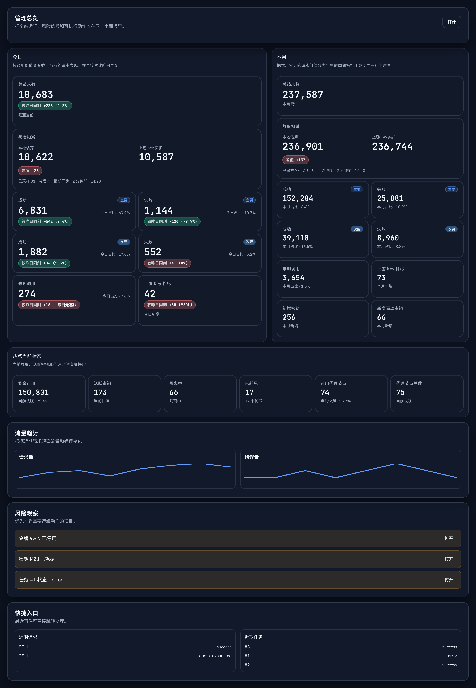
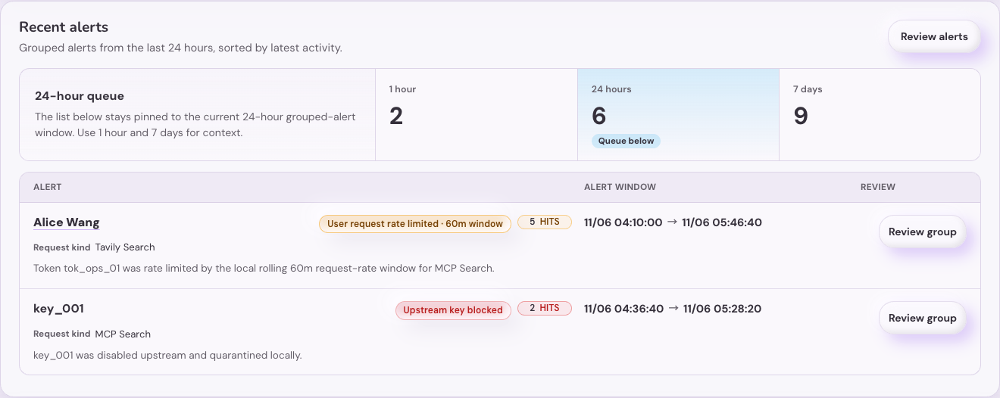

# Admin：管理仪表盘总览加载去重与轻量快照（#66t8u）

## 背景

- 当前 `/admin/dashboard` 首屏会并行触发 `loadData()` 与 dashboard 专用 overview 请求，两条链路都会拉 `summary`，同时还会连带触发 token page、token groups、recent logs、jobs 等额外请求。
- admin SSE `snapshot` 与首屏 HTTP bootstrap 维护了两套相近但不一致的数据拼装逻辑，既增加后端重复查询，也让前端在同一时间窗口里处理多份重叠数据。
- `/api/summary/windows` 需要扫描 `request_logs` 与配额样本；在 dashboard 首屏、SSE `compute_signatures()` 与 `snapshot` 生成阶段重复执行时，会放大停顿感和后台压力。随着日志增长，这条路径已经成为 dashboard 首屏的主要瓶颈。
- dashboard 可见风险区实际只展示前 5 项，但后端此前仍会为 dashboard 拉分页 keys、分页 logs、facets 与更多不需要的全量数据。

## Goals

- 新增 dashboard 专用轻量聚合接口，首屏只请求一份最小可用 overview 快照。
- 让 admin SSE `snapshot` 与 overview HTTP 复用同一套 payload 构造逻辑，减少重复查询与字段漂移。
- 将 dashboard 期间摘要改为读取专用 rollup 表，避免再对 `request_logs` 做大范围实时聚合。
- 让 dashboard 小时图与 `summary_windows` 共用近实时 rollup 数据源，保证当前小时写入后无需等待后台 job 即可反映到 overview 与 SSE snapshot。
- 将 dashboard 风险区所需的 `exhausted keys / recent logs / recent jobs / disabled tokens` 改为后端轻量子集查询，不再走分页 + facets + 全量 token 扫描。
- 保持 dashboard 可见功能和核心数据口径不变：期间摘要、当前状态、风险观察、近期请求、近期任务都继续可用。

## Non-goals

- 不修改 `/api/summary`、`/api/jobs`、`/api/logs`、`/api/keys` 现有对其它页面的语义。
- 不调整 dashboard 卡片视觉结构、文案层级或风险排序逻辑。
- 不修改 `/api/dashboard/overview`、admin SSE `snapshot` 的外部返回 shape。
- 不改变 `summary_windows` 的业务口径；仅将数据来源从原始 `request_logs` 扫描切到 dashboard 专用 rollup。

## Related ADRs

- [ADR 0002: Scoped SQLite and Remote Admission](../../adr/0002-scoped-sqlite-and-remote-admission.md)

## 接口与数据契约

### `GET /api/dashboard/overview`

- 仅管理员可访问。
- 返回 dashboard 首屏真正需要的最小快照：
  - `summary`
  - `summaryWindows`
  - `hourlyRequestWindow`
  - `monthSeries`
  - `siteStatus`
  - `forwardProxy`
  - `trend`
  - `exhaustedKeys`
  - `recentLogs`
  - `recentJobs`
  - `disabledTokens`
  - `tokenCoverage`
  - `recentAlerts`
- `summary` 与 `summaryWindows` 结构必须继续与既有接口保持一致。
- `tokenCoverage` 仅允许：
  - `ok`
  - `truncated`
  - `error`

### admin SSE `snapshot`

- `snapshot` 必须复用 `GET /api/dashboard/overview` 的同一份 payload 构造逻辑。
- 顶层保留：
  - `summary`
  - `summaryWindows`
  - `hourlyRequestWindow`
  - `monthSeries`
  - `siteStatus`
  - `forwardProxy`
  - `trend`
- 顶层新增：
  - `exhaustedKeys`
  - `recentLogs`
  - `recentJobs`
  - `disabledTokens`
  - `tokenCoverage`
  - `recentAlerts`
- 为兼容历史 dashboard 客户端，继续保留 `keys` 与 `logs` 字段，但其内容改为与 `exhaustedKeys` / `recentLogs` 同步的轻量子集，不再返回旧的全量分页载荷。

### dashboard 轻量查询约束

- exhausted keys：
  - 只取 `status=exhausted` 的前 5 项。
  - 不计算 facets。
- recent logs：
  - 直接复用 summary log 视图，仅取前 5 条。
  - 不返回请求体/响应体。
- recent jobs：
  - 仅取最近 5 条任务。
- disabled tokens：
  - 查询 `enabled = 0 AND deleted_at IS NULL`。
  - 实际查询前 6 条，响应只返回前 5 条。
  - 若存在第 6 条，则 `tokenCoverage = truncated`。

## 行为约束

- dashboard route 首屏加载拆成两层：
  - shell data：`profile`、`version`
  - module data：dashboard overview
- dashboard route 不再通过通用 `loadData()` 拉 `summary`、token page 或 token groups。
- `loadDashboardOverview()` 必须收敛为单请求模型，只调用 `fetchDashboardOverview()`。
- 流量趋势图默认绝对柱状图必须使用滚动 25 个小时槽：24 个完整小时加当前未满小时，并以当前可见小时桶为右边界；前 4 个数据点不得再固定为自然日今日起点。
- 绝对“调用结果”和“调用类型”图必须用灰色 plot-area 背景标识最后一个当前未满小时槽，并在前一小时与当前小时之间绘制竖向虚线分界；该视觉标识不得改变 payload、数值聚合、series 顺序或 tooltip 数据。
- SSE 正常可用时，dashboard 活态增量更新只依赖 `snapshot`；不得再保留独立的 30 秒 dashboard signals polling。
- SSE `compute_signatures()` 不得直接执行 freshness SQL，也不得调用会触发 flush-on-read 的
  `summary_windows` / month-series 热路径；它只能消费 shared snapshot freshness，并通过同一个
  singleflight loader 请求后台刷新。
- SSE 断线或 degraded 后，fallback polling 只能刷新 shell data + overview，不得回退到 `loadData()` 与 `loadDashboardOverview()` 双通路并发。
- 手动刷新 dashboard 时，也只能触发 shell data + overview 的一次刷新。
- `summary_windows` 与 `hourlyRequestWindow` 必须在日志写入的同一事务路径内保持近实时更新；不得依赖单独的异步 materialize job 才能看到当前小时变化。
- `summaryWindows.month` 的**次数类指标**按服务器时区自然月统计；仅 `quota_charge`（本月积分消耗）继续按 UTC 自然月统计，避免与现有积分审计口径漂移。

## 性能约束

### 分层刷新预算

- admin SSE 的 2 秒循环只比较内存中的 dirty generation；完整 freshness probe 与 snapshot
  rebuild 在业务变化后最短间隔为 10 秒。
- HTTP 与 SSE 共用同一个 singleflight snapshot。并发刷新、刷新超时或可选数据源失败时优先返回
  last-good；只有没有 last-good 的冷启动允许一次有界同步构建。
- warm cache 到期后，第一个 HTTP/SSE 读取也必须立即返回 last-good；freshness probe 与 payload rebuild
  由唯一后台 owner 完成，下一次 SSE tick 或 HTTP 读取再观察新 snapshot。
- 无业务变化时最多每 60 秒执行一次安全 freshness probe，响应结构与 SSE 事件结构保持不变。
- recent-alert 候选读取使用 ready 后后台创建的 partial time index；索引维护不得阻塞服务 ready。
- 本轮 HA/对账状态扩展不改变 dashboard 的 10 秒最短重建和 60 秒无变化 probe 合同；状态模块
  复用已有 last-good snapshot，不得因新增诊断字段恢复高频重查询。

- 新增内部表 `dashboard_request_rollup_buckets`：
  - 主键 `(bucket_start, bucket_secs)`
  - `bucket_secs=60` 用于 UTC 分钟桶
  - `bucket_secs=86400` 用于本地日桶
  - 字段至少覆盖 `total/success/error/quota_exhausted`、`valuable/other/unknown` 分类、`mcp/api × billable/non_billable` 分类、`local_estimated_credits`、`updated_at`
- `summary_windows` 与 `hourlyRequestWindow` 读路径必须优先查 rollup，不再重扫 `request_logs`。
- dashboard overview / snapshot 对这两块数据不再使用 2 秒 TTL 缓存；当前小时写入后下一次请求或 snapshot 必须直接可见。
- dashboard overview HTTP 与 admin SSE `snapshot` 必须经同一个 shared snapshot loader；同一 freshness wave 内只允许构建一份 overview，再由 HTTP / SSE 共用。
- shared snapshot 的 freshness 至少覆盖：
  - `summary` 计数与 `summary.last_activity`
  - `forwardProxy` 节点可用数 / 总数
  - `recent_request_logs_signature` 与 request-log retention 口径
  - `pending_dashboard_rollup_signature`
  - `exhaustedKeys` ID 子集
  - `recentJobs` 签名子集
  - `disabledTokens` ID 子集与 `tokenCoverage`
  - `recentAlerts` 聚合结果
  - `latest_dashboard_quota_sync_sample_at`
  - 当前小时 anchor
- 为避免同一波刷新里的重复构建，可以保留极短的 singleflight grace；但它只能用来折叠并发读，不能替代 freshness 失效判定。
- `monthSeries` 稳态必须读取 `dashboard_request_rollup_buckets` 与轻量生命周期查询；只有尚未物化的极短 minute tail 允许走有界 fallback，且不得退化成整月 `observability.request_logs` 宽窗重扫。
- dashboard HTTP / SSE overview 逻辑不得再触发：
  - logs facets 聚合
  - keys 分页 facets 聚合
  - dashboard 首屏全量 token 扫描
- 首屏进入 dashboard 时，不应再出现两次 `/api/summary` 的并发拉取。
- forward proxy overview / live stats 对 `forward_proxy_attempts` 的 1m / 15m / 1h / 1d / 7d 统计必须使用单次 7d bounded scan 派生所有窗口，避免同一请求重复扫描 attempts 表。
- forward proxy 窗口统计在同一 manager 内使用短 TTL + singleflight 风格缓存，避免管理端刷新周期内 settings/live stats 反复触发同一 7d scan；响应 shape 与统计口径保持不变。
- dashboard 与管理端列表共享 SQLite worker 时，重读接口必须使用有界并发保护，避免 dashboard overview 被其它 admin 慢查询拖入 worker 饱和。
- 全局 request-log catalog 读取已从 shared heavy-read 保护中拆出，并改为 rollup-backed 查询；dashboard overview 不得通过 legacy `/api/logs` 重新引入 request log facets 宽表扫描。
- shared snapshot 的 cache-hit freshness contract 必须保持 cheap token 路径：
  - 允许读取 `summary` 计数签名、`dashboard_request_rollup_buckets` freshness、`latest_dashboard_quota_sync_sample_at`、`dashboard_stale_key_count`
  - 允许读取轻量 recent-log/job/token signatures 与独立 recent-alerts freshness token
  - 不得在 cache-hit freshness probe 上执行 quota sample window/baseline CTE
  - 不得在 cache-hit freshness probe 上执行 alerts grouped CTE
- `summaryWindows.quota_charge` 必须保持原有返回 shape，但其重型 sample delta 计算要从 shared snapshot critical path 中拆出到独立 quota cache；cheap freshness 仅由 sample token、窗口边界与 stale-key 计数驱动。
- quota sample token 使用 append-only sample 的主键与时间 watermark；一次 freshness probe 触发的
  payload build 必须复用该 token，不能再次查询 token。60 秒 safety probe 仅在 token 或其他
  bounded revision 改变时重建，dirty build 仍由 10 秒 singleflight 合并。
- `recentAlerts` 必须保留在 overview payload 内，但要使用独立 recent-alerts cache；core overview 不得因为 alerts grouped query 慢或临时错误而阻塞整包重建，必要时返回上一份 last-good 聚合结果。
- `/api/alerts/events` 与 `/api/alerts/groups` 必须优先以 `auth_token_logs` 为数据面，只在字段缺失且存在 `request_log_id` 时按需回退 `observability.request_logs`，避免再依赖 request body JSON 提取来完成 request-kind 分组与过滤。

## 验收标准

- `GET /api/dashboard/overview` 未认证返回 `403`，管理员访问返回完整 overview 结构。
- overview 中 `summary`、`summaryWindows` 的值与现有接口保持一致。
- overview 中 `disabledTokens`、`exhaustedKeys`、`recentLogs`、`recentJobs` 都遵守轻量 limit。
- 当禁用 token 数量超过 5 条时，`tokenCoverage = truncated` 且响应只返回前 5 条。
- admin SSE `snapshot` 继续刷新 dashboard 所需字段，但 `keys` / `logs` 兼容别名只承载轻量子集。
- dashboard 首屏不再重复触发 summary/bootstrap 双重加载。
- 新写入一条 request log 后，不等待后台 job，`summaryWindows.today` 与 `summaryWindows.month` 的请求计数和 `local_estimated_credits` 即可反映到 overview / snapshot。
- SSE 正常时，dashboard 不再维持旧的 30 秒 signals polling；SSE 断线后 fallback polling 只刷新 shell data + overview。
- `cargo test`、`cargo clippy -- -D warnings`、`cd web && bun test src/api.test.ts src/admin/dashboardHourlyCharts.test.ts`、`cd web && bun run build`、`cd web && bun run build-storybook` 通过。
- dashboard cache-hit freshness probe 不再执行 quota sample heavy CTE，也不再执行 alerts grouped CTE；相应回归测试必须直接断言 baseline-only backfill 不会触发 shared snapshot rebuild。
- `recentAlerts`、`summaryWindows.quota_charge` 与 alerts events/groups 的外部返回 shape 保持不变，但内部必须改为独立缓存 / auth-token-first 读路径。

## 风险与开放点

- 本次优化引入 dashboard 专用 rollup 表，后续若要扩展更多 dashboard 维度，需继续维持写入同事务 upsert 与 bounded rebuild 的幂等性。
- `snapshot` 仍保留兼容别名 `keys` / `logs`；若后续确认没有其它消费者，可再做一次协议瘦身。
- dashboard 现有 Storybook 证据主要证明 UI 结构保留，不直接证明网络负载下降；性能收益仍以接口去重、payload 收缩与查询复用为主。

## Visual Evidence

- source_type: `storybook_canvas`; story_id_or_title: `Admin/Components/DashboardOverview/ZhDarkEvidence`; state: `dashboard overview preserved after lightweight bootstrap refactor`; evidence_note: 验证 dashboard 在改为单一 overview bootstrap、SSE 复用 payload 与风险区轻量子集后，今日/本月/当前状态、风险观察与快捷入口仍保持既有可见结构；默认流量趋势绝对柱状图展示滚动 25 个小时槽，最后当前未满小时槽使用灰底与竖向虚线标识。
  PR: none
  
- source_type: `storybook_canvas`; target_program: `mock-only`; capture_scope: `element`; story_id_or_title: `Admin/Components/DashboardOverview/RecentAlertsBusinessHourWindow`; state: `recent alerts 60m badge`; evidence_note: 验证 Recent alerts 分组卡片在最新事件属于 rolling `60m` business-call cap 时，徽标优先显示真实 `60m window`，不再沿用旧的 `5m window` 分组元数据；该证据绑定本次 dashboard 文案修复实现。
  PR: none
  

## Current Boundary

- The reconciliation and HA diagnostic additions continue to use the existing snapshot payload;
  they do not add dashboard freshness queries or alter the ten-second rebuild and sixty-second
  unchanged-probe contract.
