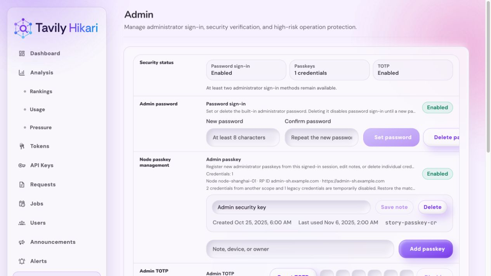
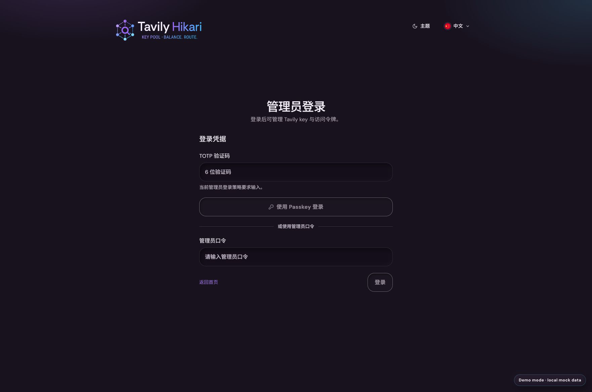
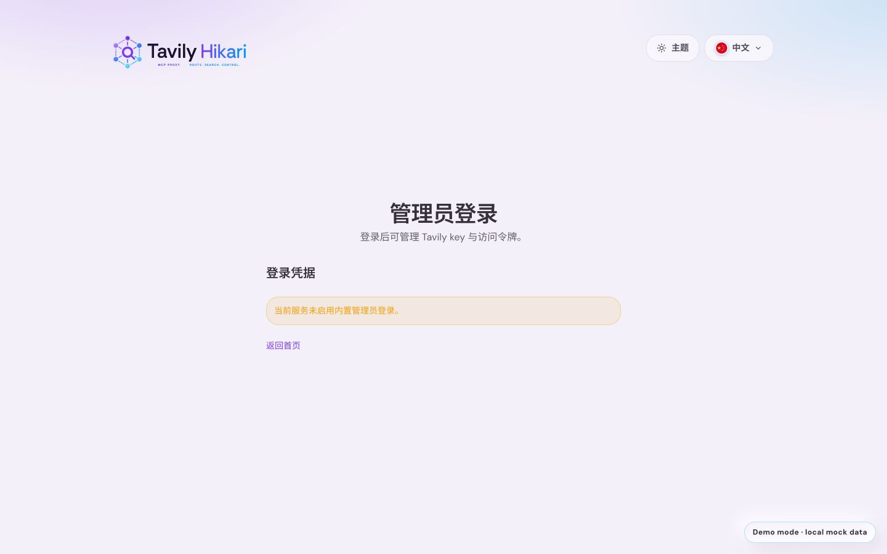
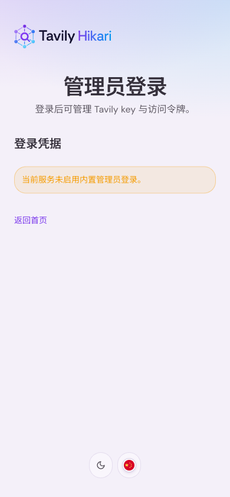
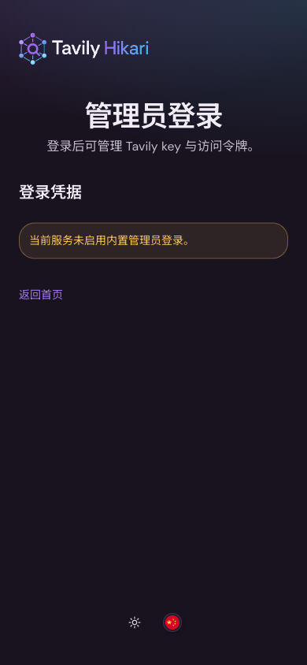
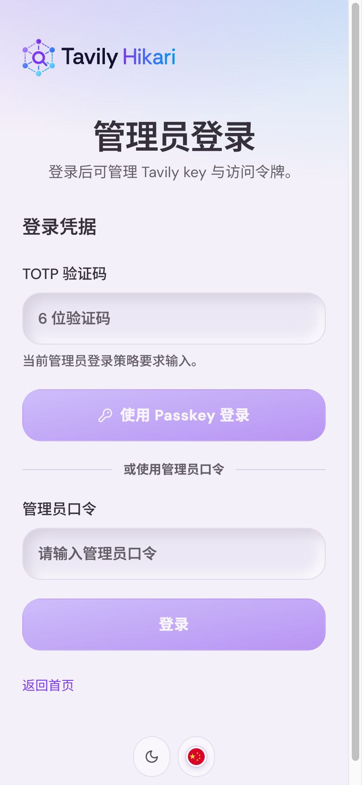
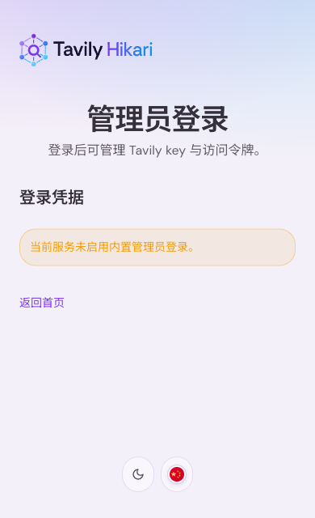
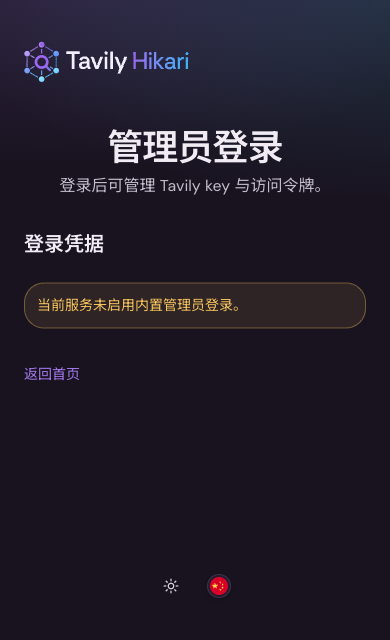

# 管理员 Passkey 登录（#tx26z）

> 当前有效规范以本文为准；实现覆盖与当前状态见 `./IMPLEMENTATION.md`，关键演进原因见 `./HISTORY.md`。

## 背景 / 问题陈述

- 管理员登录历史上支持 ForwardAuth 与内置单密码登录。
- ForwardAuth 依赖反代注入用户标识头，不适合作为公网后台的唯一信任边界。
- 内置单密码没有设备绑定和抗钓鱼能力，也不适合作为长期生产主路径。
- 项目需要一个由管理员本人设备持有私钥的登录方式，并保留本地运维可恢复能力，避免锁死后台。

## 目标 / 非目标

### Goals

- 支持管理员使用 passkey 登录 `/admin`。
- 支持通过本地 CLI 生成一次性 passkey reset/enroll URL。
- reset URL 成功注册新 passkey 后必须单次消费，且可撤销旧 passkey 与旧 admin session。
- passkey challenge、credential、reset token、admin session 必须服务端持久化。
- Passkey 状态必须按规范化的 `node_id + RP ID + RP origin` 本地作用域隔离。
- 生产认证不得依赖 `FORWARD_AUTH_HEADER` 这类可由错误反代配置伪造的用户头。

### Non-goals

- 不实现多管理员、多角色或用户名密码账号体系。
- 不把 ForwardAuth 重新作为公网管理员登录方案。
- 不提供远程公开 API 来生成 reset URL。
- 不在本主题中实现 LinuxDo OAuth 管理员登录。
- 不支持跨节点 Passkey 登录回退或由主节点代发其他节点的 reset URL。

## 范围（Scope）

### In scope

- Rust 后端 WebAuthn/passkey 登录和注册 API。
- SQLite schema 与 store API。
- admin session 持久化和 cookie 鉴权接入。
- CLI reset URL 生成工具。
- 节点本地 Passkey 管理、作用域失配状态和滚动升级运维契约。
- 前端 `/login` passkey 登录和 reset enrollment UI。
- Storybook 状态入口与视觉证据。

### Out of scope

- EdgeOne/Zero Trust 配置自动化。
- 多账号 passkey 管理 UI。
- 用户侧 passkey 登录。

## 需求（Requirements）

### MUST

- MUST 使用 WebAuthn/passkey 作为管理员生产主登录能力。
- MUST 通过显式 RP ID 与 origin 配置约束 passkey；未显式配置时优先从 `NODE_PUBLIC_*` 推导，缺失时才回退 `EDGEONE_DOMAIN`。
- MUST 将 WebAuthn registration/authentication state 存在服务端，并设置 TTL。
- MUST 将 credential、credential counter、reset token、challenge 与 admin session 绑定到规范化的本节点 scope。
- MUST 保留不匹配的本地 scope；只有当前 scope 可列出、认证和恢复会话，恢复完全相同的配置后原凭据自动可用。
- MUST 将升级前无 scope 的全局记录标为 legacy，legacy 记录不可认证且需要在每个节点重新登记。
- MUST 在认证成功后按 WebAuthn 结果更新 credential counter。
- MUST 让 reset token 单次可用、过期失效、成功后不可重放。
- MUST 提供 CLI 生成 reset URL，CLI 需要直接访问目标 SQLite DB，且 `--base-url` origin 必须与当前 scope 的 RP origin 完全一致。
- MUST 保持内置密码登录为显式启用的 break-glass 能力，不作为 passkey 必需依赖。

### SHOULD

- SHOULD 在 reset 注册成功后撤销旧 passkey 与旧 admin session。
- SHOULD 提供清晰的 profile capability 字段，例如 `passkeyAuthEnabled`。
- SHOULD 记录 passkey 注册、登录和 reset 消费的结构化日志，避免写入密钥材料。
- SHOULD 允许所有 HA 角色完成本节点 Passkey 的登记、reset、备注、删除与会话撤销；内置密码、登录 TOTP 与业务写入继续受 `full_master` 栅栏保护。
- SHOULD 从 HA baseline、outbox 和触发器中排除 Passkey 表，并兼容丢弃旧节点传来的对应资源。

### COULD

- COULD 后续增加 passkey 管理 UI，用于查看/撤销单个 credential。

## 功能与行为规格（Functional/Behavior Spec）

### Core flows

- 管理员访问 `/login` 时，前端请求 `/api/admin/passkey/authentication/start` 获取 challenge，再调用浏览器 `navigator.credentials.get`，最后提交 `/api/admin/passkey/authentication/finish`。
- 后端验证成功后写入持久化 admin session，并设置 `hikari_admin_passkey_session` HttpOnly cookie。
- 运维人员在服务器上运行 CLI reset-url 子命令，生成带 token 的 URL。
- 管理员打开 reset URL 后，前端请求 registration challenge，浏览器创建 passkey，后端验证并保存 credential，消费 reset token。
- reset 注册成功后，默认撤销旧 passkey 与旧 admin session，并要求管理员使用新 passkey 重新登录。
- 每个节点从本地命令行生成 reset URL，并在自己的 HTTPS 域名完成登记；`full_master` 先升级，再滚动升级其他节点。

### Edge cases / errors

- 无 passkey credential 时，普通 passkey 登录 start 返回不可用错误；reset URL 是 bootstrap 入口。
- reset token 过期、已消费或不存在时，前端显示不可继续注册。
- WebAuthn origin/RP ID 不匹配时必须拒绝。
- 节点、RP ID 或 RP origin 不匹配当前 scope 时，保留的凭据、reset token、challenge 与 session 必须暂时不可用；重新匹配后自动恢复。
- credential counter 异常时必须拒绝认证，并记录可审计日志。
- 服务重启不能让已持久化的 admin session 全部丢失。

## 接口契约（Interfaces & Contracts）

### 接口清单（Inventory）

| 接口（Name）                                          | 类型（Kind） | 范围（Scope） | 变更（Change） | 契约文档（Contract Doc） | 负责人（Owner） | 使用方（Consumers） | 备注（Notes）                        |
| ----------------------------------------------------- | ------------ | ------------- | -------------- | ------------------------ | --------------- | ------------------- | ------------------------------------ |
| `/api/admin/passkey/authentication/start`             | HTTP API     | external      | New            | None                     | backend         | web login           | 创建 passkey 登录 challenge          |
| `/api/admin/passkey/authentication/finish`            | HTTP API     | external      | New            | None                     | backend         | web login           | 完成 passkey 登录并设置 admin cookie |
| `/api/admin/passkey/reset/:token/registration/start`  | HTTP API     | external      | New            | None                     | backend         | web reset page      | 创建 reset 注册 challenge            |
| `/api/admin/passkey/reset/:token/registration/finish` | HTTP API     | external      | New            | None                     | backend         | web reset page      | 完成 passkey 注册并消费 reset token  |
| `tavily-hikari admin passkey reset-url`               | CLI          | internal      | New            | None                     | ops             | operator            | 本地生成一次性 reset URL             |
| `/api/profile`                                        | HTTP API     | external      | Modify         | None                     | backend         | public/admin web    | 增加 passkey capability              |

### 契约文档（按 Kind 拆分）

- None

## 验收标准（Acceptance Criteria）

- Given 没有 admin cookie 且没有 ForwardAuth
  When 访问 `/admin`
  Then 请求被拒绝。

- Given 已存在 admin passkey
  When 使用浏览器 passkey 登录成功
  Then `/api/profile` 返回 `isAdmin=true`，并可访问 admin-only API。

- Given CLI 生成 reset URL
  When 首次打开并完成 passkey 注册
  Then token 被消费，新 passkey 可用于登录。

- Given reset URL 已使用或已过期
  When 再次使用同一个 URL
  Then 后端拒绝注册。

- Given 认证返回的 credential counter 不合法
  When 后端完成 authentication finish
  Then 后端拒绝登录且不创建 admin session。

- Given 节点域名或 RP 配置临时错误
  When 当前 scope 与已登记 scope 不匹配
  Then 管理端不列出该凭据且认证、reset、challenge、session 都不可使用；恢复完全相同配置后凭据自动恢复。

- Given 任意非 `full_master` HA 角色
  When 管理员在本节点登记、reset、修改、删除 Passkey 或撤销其 session
  Then 本节点操作成功，其他管理员写入仍保持受限。

## 验收清单（Acceptance checklist）

- [x] 核心路径的长期行为已被明确描述。
- [x] 关键边界/错误场景已被覆盖。
- [x] 涉及的接口/契约已写清楚或明确为 `None`。
- [x] 相关验收条件已经可以用于实现与 review 对齐。

## 非功能性验收 / 质量门槛（Quality Gates）

### Testing

- Unit tests: scope 隔离、legacy 禁用、token TTL/消费、counter 更新。
- Integration tests: passkey API 的成功、失败、重放拒绝、cookie session。
- E2E tests: 可控浏览器/fixture 验证 reset 页面与登录页面行为。

### UI / Storybook (if applicable)

- Stories to add/update: 登录页 passkey 可用、未配置、reset 注册、token 过期/错误，以及管理员设置页的本节点 scope 与作用域失配状态。
- Docs pages / state galleries to add/update: admin login state gallery。
- `play` / interaction coverage to add/update: reset token 错误和登录按钮状态。
- Visual regression baseline changes (if any): passkey login/reset UI 截图。
- 登录页品牌位使用 `BrandLockup variant="responsive"`：可用品牌容器宽度 `>=260px` 显示完整 lockup，较窄容器显示无副标语 compact lockup；不得维护第二套页面级移动 Logo 分支。

### Quality checks

- Rust: `cargo fmt`, targeted `cargo test`, `cargo clippy -- -D warnings`。
- Web: `bun run build` and Storybook smoke where feasible.

## Visual Evidence

PR: include

本节点 Passkey scope 失配状态。

- `2026-08-01` 登录页品牌位（ui_demo，mock-only，`trim_only`）：

  绝对定位品牌区显式保持 `260px` 可用宽度，桌面端显示完整 lockup；窄容器仍由组件切换到紧凑版本。

  

- 无文字标记参数化彩色对照：[relay-mesh-mark-parametric-color-comparison.png](./assets/relay-mesh-mark-parametric-color-comparison.png)
- 无文字标记参数化二值几何对齐：[relay-mesh-mark-geometry-mono-comparison.png](./assets/relay-mesh-mark-geometry-mono-comparison.png)
- 等径外围节点与镜像虚线修正版：[relay-mesh-mark-corrected-preview.png](./assets/relay-mesh-mark-corrected-preview.png)
- 完整文字版真矢量标识：[relay-mesh-lockup-vector-full.png](./assets/relay-mesh-lockup-vector-full.png)
- 无底部小字真矢量标识：[relay-mesh-lockup-vector-compact.png](./assets/relay-mesh-lockup-vector-compact.png)
- 暗色完整文字版真矢量标识：[relay-mesh-lockup-vector-full-dark.png](./assets/relay-mesh-lockup-vector-full-dark.png)
- 暗色无底部小字真矢量标识：[relay-mesh-lockup-vector-compact-dark.png](./assets/relay-mesh-lockup-vector-compact-dark.png)
- 桌面端无卡片登录布局：[admin-login-no-methods-desktop.png](./assets/admin-login-no-methods-desktop.png)
- 移动端无卡片布局与参数化矢量标记：[admin-login-parametric-mark-mobile.png](./assets/admin-login-parametric-mark-mobile.png)
  当前桌面端完整文字版登录布局。
  

当前移动端紧凑文字版登录布局。

当前移动端暗色紧凑文字版登录布局。

移动端完整 TOTP、Passkey 与管理员口令流程，页脚图标在内容之后保持间距。

短屏移动端将主题与语言图标置于登录内容之后，避免与凭据区域重叠。

短屏移动端暗色布局保持相同的内容与页脚间距。

- Passkey 登录状态：[admin-login-passkey.png](./assets/admin-login-passkey.png)
- Reset 注册状态：[admin-login-reset.png](./assets/admin-login-reset.png)
- Reset URL 注册模式：[admin-login-reset-enrollment.png](./assets/admin-login-reset-enrollment.png)
- Reset 注册完成后重新登录提示：[admin-login-reset-registered.png](./assets/admin-login-reset-registered.png)
- 管理员安全设置页：[admin-security-page.png](./assets/admin-security-page.png)
- 管理员安全操作确认弹窗：[admin-security-confirmation-inline.png](./assets/admin-security-confirmation-inline.png)
- 管理端 TOTP 6 格验证码输入：[admin-totp-six-digit-input.png](./assets/admin-totp-six-digit-input.png)
- 系统设置下的代理设置子菜单：[admin-system-settings-proxy-subnav.png](./assets/admin-system-settings-proxy-subnav.png)

## Related PRs

- None
