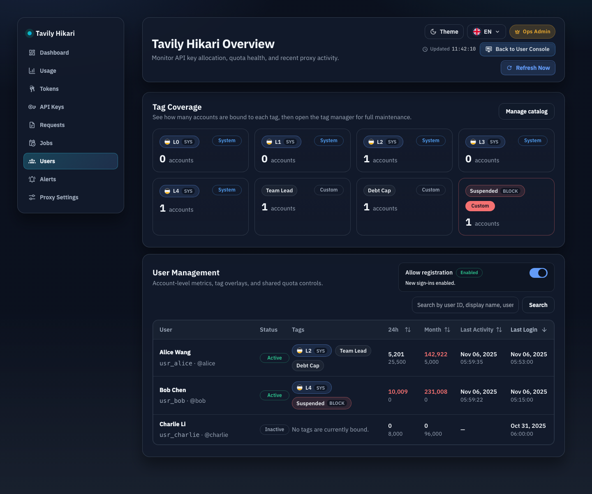
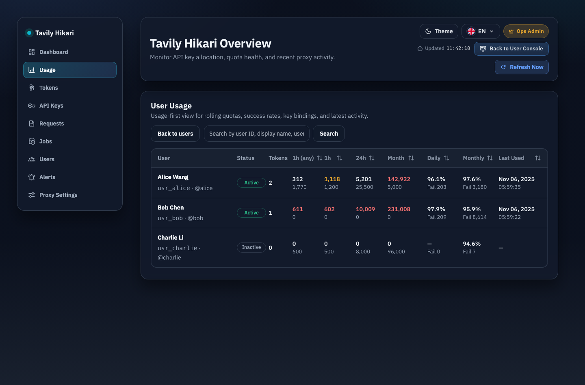

# Admin 用户列表排序与紧凑双行布局（#rwspk）

## 背景 / 问题陈述

- `/admin/users` 目前仍按后端默认 `last_login_at DESC` 返回分页结果，列表上的额度、成功/失败与时间列都不支持显式排序。
- 现有实现先分页、再逐行补齐 dashboard summary，导致任何前端排序都只能作用于当前页，也会触发明显的 N+1 查询。
- 用户列表桌面表格依赖 `min-width: 1240px` 与 `white-space: nowrap`，在常见桌面宽度下需要横向滚动才能看全列。
- 成功/失败与时间列当前都是单行密集展示，不利于在不滚动的前提下压缩宽度。

## 目标 / 非目标

### Goals

- 为用户列表增加服务端排序，覆盖 `5m 限流`、`业务请求 1h`、`24h`、`月度`、`日成功/失败`、`月成功/失败`、`最近活动`、`最近登录`。
- 排序基于“过滤后的全量用户集合”，先聚合、排序，再分页，避免只排当前页。
- 列表响应新增 `monthlyFailure`，并用成功率 + 失败数取代现有成功数展示。
- 桌面表格改成紧凑双行单元格：
  - 额度列：第一行用量，第二行额度。
  - 成功/失败列：第一行成功率，第二行失败数。
  - 时间列：第一行日期，第二行时间；中文日期固定为 `YYYY-MM-dd`。
- 列表 URL、详情页返回、标签页往返都保留 `q / tagId / page / sort / order`。
- 桌面断点下去掉用户列表横向滚动条。

### Non-goals

- 不改用户详情里的 token 子表月度成功列语义，也不为 token 子表新增 `monthlyFailure`。
- 不重做移动端卡片结构，只要求列表语义与数据保持一致。
- 不把本次排序能力扩展到其他 admin 模块。

## 范围（Scope）

### In scope

- `src/store/mod.rs`
  - 提供过滤后的全量用户 identity 查询。
  - 提供按 `user_id` 聚合的 bulk log metrics（`daily_success` / `daily_failure` / `monthly_success` / `monthly_failure` / `last_activity`）。
- `src/tavily_proxy/mod.rs`
  - 提供批量 `user_dashboard_summaries_for_users` 聚合入口。
- `src/server/handlers/admin_resources.rs`
  - 扩展 `/api/users` 的 `sort/order` 查询参数。
  - 用 bulk summary + 服务端排序重写用户列表接口。
  - 管理员列表与详情响应新增 `monthlyFailure`。
- `web/src/api.ts`
  - 扩展 admin users TS contract 与 `fetchAdminUsers` 参数。
- `web/src/admin/routes.ts`
  - 用户列表上下文持久化新增 `sort/order`。
- `web/src/AdminDashboard.tsx`
  - 表头排序交互、双行单元格、无横向滚动布局、列表状态持久化。
- `web/src/i18n.tsx`
  - 用户列表月度列标题改为 `月成功/失败` / `Monthly Rate/F`。
- `web/src/admin/AdminPages.stories.tsx`
  - 用户列表故事补齐 `monthlyFailure` 与双行紧凑布局。

### Out of scope

- token detail、public/user console 侧的月失败展示。
- 任何 SQL pushdown 优化、缓存层或新的后台索引。

## 接口契约（Interfaces & Contracts）

- `GET /api/users`
  - 新增 `sort`：`requestRateUsed | businessCalls1hUsed | dailyCreditsUsed | monthlyCreditsUsed | dailySuccessRate | monthlySuccessRate | lastActivity | lastLoginAt`
  - 新增 `order`：`asc | desc`
  - 当 `sort` 缺失时，保持默认排序 `lastLoginAt DESC, userId ASC`。
- 对外列标签语义同步为：
  - `requestRateUsed` => `5m 限流`
  - `businessCalls1hUsed` => `业务请求 1h`
  - `dailyCreditsUsed` => `每日积分限额`
  - `monthlyCreditsUsed` => `每月积分限额`
- `/api/users` 响应
  - `AdminUserSummaryView` 与 `AdminUserDetailView` 新增 `monthlyFailure`。
- 排序语义
  - 额度列：先比用量，再比额度，最后按 `userId ASC`。
  - 成功/失败列：先比成功率 `success / (success + failure)`；零样本始终排最后；再用失败数与 `userId ASC` 打破平局。
  - 时间列：`None` 始终排最后。

## 验收标准（Acceptance Criteria）

- Given 管理员在 `/admin/users` 点击可排序表头
  When 同一列表头连续点击
  Then 排序状态按 `desc -> asc -> clear` 循环；clear 后恢复默认 `最近登录 DESC`。

- Given 用户列表有搜索词或标签筛选
  When 后端返回结果
  Then 排序作用于“过滤后的全量命中集”，不是仅当前页。

- Given 管理员查看 `日成功/失败` 或 `月成功/失败`
  When 列表渲染完成
  Then 第一行显示成功率，第二行显示失败数，成功数不再直接展示。

- Given 当前语言为中文
  When 渲染 `最近活动` 或 `最近登录`
  Then 第一行是 `YYYY-MM-dd`，第二行是 `HH:mm:ss`；空值显示 `—`。

- Given 桌面断点下打开 `/admin/users`
  When 表格完整渲染
  Then 用户列表表格 wrapper 不出现横向滚动条。

- Given 管理员从用户列表进入用户详情或标签目录再返回
  When 页面重新打开用户列表
  Then `q / tagId / page / sort / order` 全部保持不变。

## 测试与证据

- `cargo test admin_resources_tests -- --nocapture`
- `cargo test`
- `cd web && bun test`
- `cd web && bun run build`
- `cd web && bun run build-storybook`
- 浏览器验收：`/admin/users` 排序、双行时间格式、无横向滚动

## Visual Evidence

- source_type: storybook_canvas
  target_program: mock-only
  capture_scope: browser-viewport
  sensitive_exclusion: N/A
  submission_gate: pending-owner-approval
  story_id_or_title: Admin/Pages/Users
  state: compact list with direct user-detail entry
  evidence_note: proves the users table no longer uses a dedicated Actions column and keeps the first-line display name as the only clickable detail entry.
  image:
  

- source_type: storybook_canvas
  target_program: mock-only
  capture_scope: browser-viewport
  sensitive_exclusion: N/A
  submission_gate: pending-owner-approval
  story_id_or_title: Admin/Pages/UsersUsage
  state: usage overview with direct user-detail entry
  evidence_note: proves the usage table keeps quota and success metrics in the dedicated view while allowing the first-line user name to open the user detail page.
  image:
  
