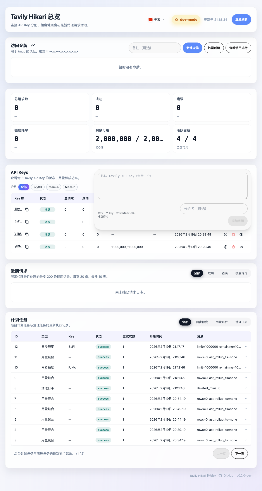
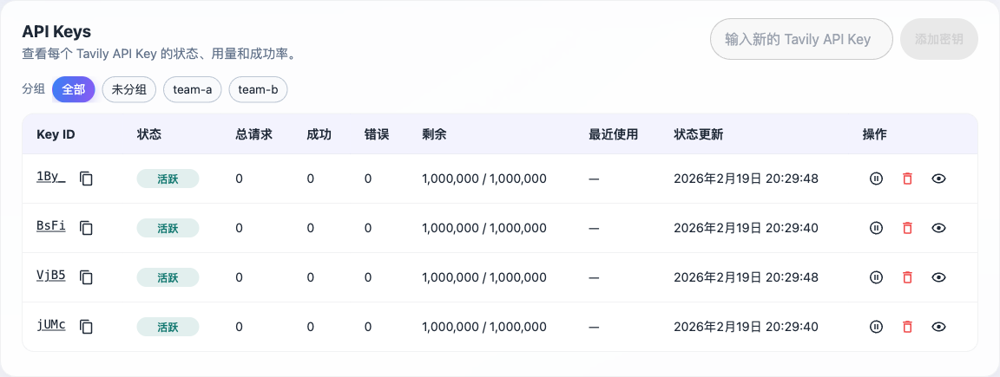

# Admin / API Keys 分组录入与筛选（5zcj3）

## 背景

当前 `/admin` 的 API Keys 批量录入仅支持粘贴多行 key 并导入，但无法为 keys 归类分组，也缺少类似 Access Tokens
的分组筛选控件。随着 key 数量增加，运维与排查成本上升。

## 目标

- 录入：在 API Keys 批量导入浮层中新增「分组」输入框（可选），用于为本次导入的所有 key 写入分组。
- 自动完成：分组输入框提供浏览器原生自动完成（`datalist`），候选来自当前已存在的 key 分组。
- 持久化：后端 `api_keys` 表新增 `group_name` 字段，并通过 Admin API 保存与返回。
- 筛选：在 API Keys 表格上方新增分组筛选 chips（All / Ungrouped / Named groups），交互与 Access Tokens 分组一致。

## 非目标

- 不新增单个 key 的「编辑分组/移动分组」独立 UI。
- 不引入新的服务端分页/过滤接口：keys 仍由 `GET /api/keys` 一次性返回，前端本地计算分组与筛选。
- 不改变 key 的启用/禁用/删除逻辑与语义。

## 范围（In / Out）

### In scope

- 后端：
  - SQLite schema：`api_keys.group_name`（TEXT NULL）。
  - Admin API：
    - `GET /api/keys` 响应新增 `group` 字段（`string | null`）。
    - `POST /api/keys/batch` 请求新增可选 `group` 字段，并按默认行为写入。
    - `POST /api/keys` 请求新增可选 `group` 字段（与 batch 语义保持一致）。
- 前端：
  - `web/src/AdminDashboard.tsx`：批量导入浮层新增分组输入框（含 `datalist`），并新增 keys 分组筛选 chips。
  - `web/src/api.ts`：补齐类型与请求体。
  - `web/src/i18n.tsx`：新增文案。

### Out of scope

- Key Details 页面增加分组展示/编辑。
- 后端新增分组列表接口（前端直接从 keys 列表计算）。

## 默认行为（关键口径）

- `group` 存储为 trim 后的字符串；空/全空白视为未分组（存 `NULL`）。
- 批量导入带 `group` 时：
  - `created` / `undeleted`：写入该 `group`。
  - `existed`：仅当该 key 当前分组为空（`NULL` 或空白）时写入；不覆盖已有非空分组。
- 前端筛选：
  - `All`：显示全部 keys（未删除）。
  - `Ungrouped`：显示 `group` 为空（`NULL`/空白）的 keys。
  - Named group：显示 `group === 分组名（trim 后精确匹配）` 的 keys（大小写敏感，保持与 tokens 一致）。

## 验收标准（Given / When / Then）

### 批量导入：分组输入框可用

- Given 管理员打开 `/admin` 且 API Keys 批量导入浮层已展开
  - When 点击浮层底部的分组输入框
  - Then 分组输入框可获得焦点并可正常输入（不会被强制跳回 textarea）

### 自动完成

- Given 已存在至少一个有分组的 API key
  - When 在分组输入框中输入该分组前缀
  - Then 浏览器自动完成候选中出现该分组（`datalist`）

### 保存与返回

- Given 在批量导入中填写多行 API key 并指定分组 `team-a`
  - When 点击「添加密钥」并导入成功
  - Then `GET /api/keys` 返回每个新建 key 的 `group == "team-a"`

### 不覆盖已有分组（安全默认）

- Given 某 key 已存在且分组为 `old`
  - When 通过 batch 再次导入该 key 并指定分组 `new`
  - Then 该 key 的分组仍为 `old`

### UI 分组筛选

- Given `/admin` 页面已加载且存在多个分组
  - When 点击某个分组 chip
  - Then 表格仅显示该分组 keys；点击 `Ungrouped` 仅显示未分组 keys；点击 `All` 恢复显示全部

## 测试计划

- 自动化最小验证：
  - `cargo test`
  - `cd web && npm run build`
- 手动回归：
  - `/admin` → API Keys：展开批量导入浮层，验证分组输入框可用、候选可选、提交后 chips 与筛选正常。

## 风险与备注

- `ensure_api_keys_primary_key()` 会重建 `api_keys` 表：必须同步扩展新表列集合，否则可能导致历史数据（quota、deleted_at、group）丢失。
- 批量导入浮层目前有“点击区域强制聚焦 textarea”的策略：新增 input 后需更新 guard，避免交互回归。

## Visual Evidence

Batch overlay group input:

API Keys group filter chips:

