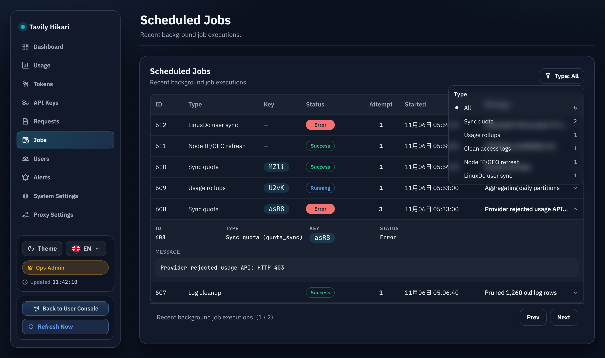

# LinuxDO 用户状态离线每日同步（#ax7jx）

## 状态

- Status: 已实现（待审查）
- Created: 2026-04-08
- Last: 2026-04-08

## 背景 / 问题陈述

- 当前 LinuxDO 用户等级与状态只会在用户重新登录时更新；用户离线期间，`oauth_accounts.trust_level` 与系统标签可能长期滞后。
- 现有实现没有持久化 LinuxDO `refresh_token`，因此服务无法在用户离线后主动刷新用户资料。
- 如果不补齐离线同步，用户在 LinuxDO 升级/降级、被停用、或昵称头像变更后，Hikari 端的展示与额度标签会继续沿用旧状态。

## 目标 / 非目标

### Goals

- 登录成功时安全持久化 LinuxDO `refresh_token`，供离线同步使用。
- 每天服务器本地时区 `06:20` 自动批量刷新 LinuxDO 用户资料。
- 定时同步与登录回调共享同一套 profile upsert / 标签同步逻辑。
- 同步失败时保留旧等级、旧标签与现有本地会话，仅记录失败摘要与 job 结果。
- 管理端 Jobs 列表可读显示每日同步任务类型。

### Non-goals

- 新增手动触发同步的 HTTP API 或管理台按钮。
- 扩展到 LinuxDO 之外的 provider 通用离线同步框架。
- 为历史未持有 `refresh_token` 的用户自动补发授权；这类用户仅在下次重新登录后纳入每日同步。
- 同步失败时自动清空 LinuxDO 等级标签或强制用户重登录。

## 范围（Scope）

### In scope

- CLI / ENV 新配置：refresh token 加密密钥、每日同步开关、每日同步时间。
- SQLite `oauth_accounts` 扩展：refresh token 密文与同步元数据字段。
- LinuxDO token refresh + userinfo 拉取逻辑与错误处理。
- 每日 `06:20` 本地时区 scheduler 与 `scheduled_jobs` 记录。
- Admin Jobs 文案、README / README.zh-CN、相关测试与视觉证据。

### Out of scope

- 管理员鉴权或用户侧 token 生命周期策略改造。
- 更改 `/api/jobs` 的接口形状或新增独立 jobs 筛选组。
- 自动处理 refresh token 已失效账户的重新授权流程。

## 需求（Requirements）

### MUST

- 必须新增 `--linuxdo-oauth-refresh-token-crypt-key` / `LINUXDO_OAUTH_REFRESH_TOKEN_CRYPT_KEY`。
- 必须新增 `--linuxdo-oauth-user-sync-enabled` / `LINUXDO_OAUTH_USER_SYNC_ENABLED`，默认 `true`。
- 必须新增 `--linuxdo-oauth-user-sync-at` / `LINUXDO_OAUTH_USER_SYNC_AT`，默认 `06:20`，格式固定 `HH:mm`。
- 必须在登录回调成功后持久化最新非空 `refresh_token`；若本次响应未返回新的 refresh token，则保留旧值。
- 必须在定时同步时使用 refresh token 换取 access token，再调用 LinuxDO `/api/user` 获取最新资料。
- 必须在同步成功后更新本地 `oauth_accounts`、用户展示字段，以及既有 LinuxDO 等级标签绑定。
- 必须在同步失败时保留旧等级、旧标签与现有会话，不得自动降权或踢出登录。
- 必须将每日同步写入 `scheduled_jobs`，job type 固定为 `linuxdo_user_status_sync`。

### SHOULD

- 加密密钥应接受适合环境变量传递的文本形式，并做启动时校验。
- 定时任务应在 LinuxDO OAuth 未启用、加密密钥缺失、或没有可同步账号时稳定 no-op，不得导致服务启动失败。
- 同步结果应记录成功/跳过/失败数量与首个失败摘要，便于在 jobs 列表排查。

### COULD

- 记录每个账户最近成功/失败时间与失败原因，便于后续在管理端扩展详情。

## 功能与行为规格（Functional/Behavior Spec）

### Core flows

- 用户完成 LinuxDO OAuth 回调后，服务除现有登录逻辑外，还会保存 refresh token 密文，并写入/更新同步元数据。
- 每天服务器本地时间到达 `06:20` 后，后台任务遍历所有 `provider='linuxdo'` 且持有 refresh token 的账户：
  - 用 refresh token 调 LinuxDO token endpoint 获取新的 access token；
  - 再调用 `/api/user` 获取最新 `trust_level`、`active`、`username`、`name`、`avatar_template`；
  - 更新本地 `oauth_accounts` 与 `users`，然后复用现有系统标签同步逻辑刷新 `linuxdo_l*` 绑定。
- 同步成功后，任务汇总成功/跳过/失败计数并写入 jobs message。

### Edge cases / errors

- 如果 refresh token 失效（例如 `invalid_grant`）、userinfo 请求失败、或返回的 `provider_user_id` 与本地账户不一致，则该账户本轮记为失败，但保留旧等级/旧标签/旧会话。
- 如果 token refresh 响应未包含新的 refresh token，则继续沿用库中旧密文，不把账户移出每日同步。
- 如果 LinuxDO OAuth 未启用、未配置加密密钥、或没有任何可同步账户，定时任务写入可诊断的 skip/no-op 结果或安静跳过，不报致命错误。
- 如果 LinuxDO 返回 `trust_level` 缺失/越界，则沿用现有策略：不自动删除旧等级标签。

## 接口契约（Interfaces & Contracts）

### 接口清单（Inventory）

| 接口（Name）                   | 类型（Kind） | 范围（Scope） | 变更（Change） | 契约文档（Contract Doc） | 负责人（Owner） | 使用方（Consumers） | 备注（Notes）                                                  |
| ------------------------------ | ------------ | ------------- | -------------- | ------------------------ | --------------- | ------------------- | -------------------------------------------------------------- |
| LinuxDO OAuth runtime config   | CLI          | external      | Modify         | ./contracts/cli.md       | Backend         | Ops / runtime       | 新增 refresh token 加密与每日同步配置                          |
| OAuth account sync persistence | DB           | internal      | Modify         | ./contracts/db.md        | Backend         | Backend             | `oauth_accounts` 增加 refresh token 密文与同步元数据           |
| Scheduled jobs entry           | DB/API       | internal      | Modify         | ./contracts/db.md        | Backend         | Admin UI            | `/api/jobs` 现有返回中新增 `job_type=linuxdo_user_status_sync` |

### 契约文档（按 Kind 拆分）

- [contracts/README.md](./contracts/README.md)
- [contracts/cli.md](./contracts/cli.md)
- [contracts/db.md](./contracts/db.md)

## 验收标准（Acceptance Criteria）

- Given 服务启用了 LinuxDO OAuth 且配置了加密密钥
  When 用户完成 LinuxDO 登录回调
  Then refresh token 被加密持久化到 `oauth_accounts`，且不影响现有登录成功路径。

- Given 已授权 LinuxDO 用户库中存在 refresh token 密文
  When 服务器本地时间到达 `06:20` 并触发每日同步
  Then 服务会刷新该用户的 LinuxDO profile，并把新的 `trust_level` 同步到唯一的 `linuxdo_l*` 标签绑定。

- Given 某用户在 LinuxDO 的等级发生变化
  When 每日同步成功
  Then 本地 `oauth_accounts.trust_level` 与用户 LinuxDO 系统标签切换到最新等级。

- Given 某用户 refresh token 已失效或 userinfo 拉取失败
  When 每日同步执行
  Then 该用户保留旧等级、旧标签与现有本地会话，且任务结果中可见失败摘要。

- Given token refresh 响应没有返回新的 refresh token
  When 每日同步执行成功
  Then 服务继续使用原有 refresh token 密文，不中断后续同步资格。

- Given LinuxDO OAuth 未启用、未配置加密密钥、或无可同步账户
  When 后台 scheduler 到达计划时间
  Then 任务稳定跳过或 no-op，不影响服务其他功能。

## 实现前置条件（Definition of Ready / Preconditions）

- 离线同步目标、失败保留旧等级策略、默认时间 `06:20` 已冻结
- 不新增手动触发接口/按钮的边界已确认
- 加密密钥通过 ENV / CLI 提供的部署方式已确认
- 既有 LinuxDO 登录与系统标签同步逻辑可复用，无需改写产品语义

## 非功能性验收 / 质量门槛（Quality Gates）

### Testing

- Unit tests: 时间解析与下一次触发时间计算、加密解密 round-trip。
- Integration tests: 登录保存 refresh token、refresh 成功/失败路径、未返回新 refresh token 的保留逻辑、job 记录。
- Regression tests: 既有 LinuxDO 登录/标签同步行为不回退。

### UI / Storybook (if applicable)

- Stories to add/update: Admin Jobs 相关现有 story fixtures。
- Docs pages / state galleries to add/update: 复用现有 Admin Pages / DashboardOverview stories，不新增独立 docs 页。
- `play` / interaction coverage to add/update: none（reason: 本次 UI 仅新增 jobs 文案映射，无新交互）

### Quality checks

- `cargo fmt`
- `cargo clippy -- -D warnings`
- `cargo test`
- `cd web && bun run build`
- `cd web && bun run build-storybook`

## 文档更新（Docs to Update）

- `README.md`: 增加 LinuxDO refresh token 加密与每日同步配置说明。
- `README.zh-CN.md`: 同步中文说明。
- `docs/specs/README.md`: 追加 `#ax7jx` 索引行并维护状态。

## 计划资产（Plan assets）

- Directory: `docs/specs/ax7jx-linuxdo-user-status-daily-sync/assets/`
- In-plan references: ``
- Visual evidence source: maintain `## Visual Evidence` in this spec when owner-facing or PR-facing screenshots are needed.

## Visual Evidence

- source_type: storybook_canvas
  story_id_or_title: `admin-pages--jobs`
  state: `Jobs`
  evidence_note: Admin Jobs 列表已能稳定展示新的 `linuxdo_user_status_sync` 类型文案与同步结果摘要。

## 资产晋升（Asset promotion）

None

## 实现里程碑（Milestones / Delivery checklist）

- [x] M1: 新 spec、contracts 与 README 索引冻结
- [x] M2: 后端配置、schema 与 refresh token 加密持久化落地
- [x] M3: 每日 `06:20` LinuxDO 用户状态同步 scheduler 与 job 记录落地
- [x] M4: Admin Jobs 文案、README/README.zh-CN 与 Storybook 证据更新完成
- [ ] M5: 测试、快车道 PR 与 review-loop 收敛完成

## 方案概述（Approach, high-level）

- 复用既有 LinuxDO profile upsert 与系统标签同步逻辑，只补离线 refresh token 生命周期与每日调度。
- refresh token 仅以密文形式持久化，避免把长期凭证裸存进 SQLite。
- 每日同步按“最小影响”原则处理失败：不自动改写旧等级，不触碰用户现有会话。

## 风险 / 开放问题 / 假设（Risks, Open Questions, Assumptions）

- 风险：LinuxDO refresh token 生命周期若与文档不一致，生产环境可能出现集中失效，需要重新登录恢复。
- 风险：若部署环境未提供稳定加密密钥，离线同步会被禁用。
- 需要决策的问题：None（主人已冻结默认时间、失败策略与不新增手动入口）。
- 假设（需主人确认）：生产环境会提供稳定的 32-byte 加密密钥，并接受新增 ENV/CLI 配置。

## 变更记录（Change log）

- 2026-04-08: 初版规格建立，冻结 LinuxDO refresh token 加密落库、每日 `06:20` 离线同步、失败保留旧等级，以及 jobs/README/Storybook 交付口径。
- 2026-04-08: 实现 refresh token 密文落库、LinuxDO 每日离线同步调度、后台 jobs 文案/Storybook 证据与后后端回归测试。

## 参考（References）

- [Linux DO Connect](https://wiki.linux.do/Community/LinuxDoConnect)
- [Linux DO Connect Docs](https://linux.do/t/topic/32752)
