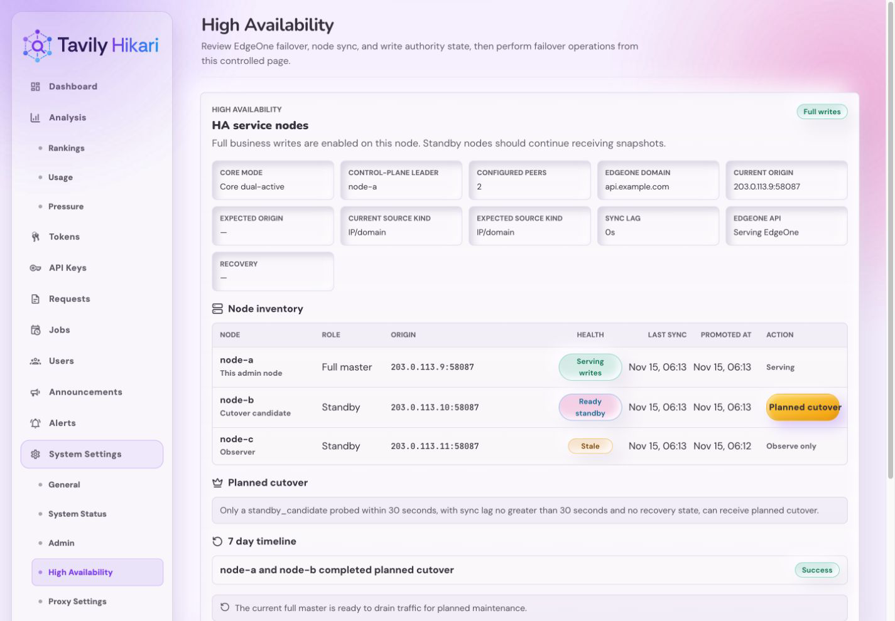
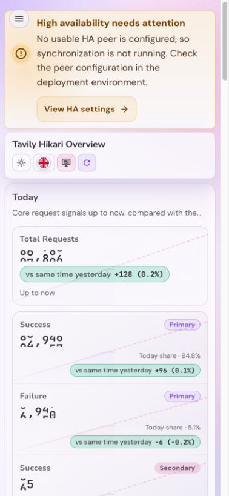

# Tavily Hikari 基于 EdgeOne 源站切换的双活高可用改造

## Summary

Tavily Hikari 的高可用方案采用核心业务双活 + 控制面单写，而不是单纯放开 standby 入口或做一主多从负载均衡。`full_master` 仍是唯一控制面写节点，`standby` 在 `HA_CORE_DUAL_ACTIVE=1` 且 `HA_SOURCE_KIND=origin_group` 时也可以提供 `/mcp`、`/api/tavily/*`、`/api/tavily/usage`；`recovery` 继续 fenced。`ha_full_master_node_id_v1` 是控制面当前领导者的权威标识，`billing` 与 `runtime` 通过 peer 双向同步，`research_requests` 归入 `runtime` truth set，`mcp_sessions` 与 `research_requests` 读路径在本地 miss 时允许 peer lookup 回填。同时，管理员现在必须能在当前 active 节点直接查看真实 peer 状态、执行 `planned cutover`，并查看 7 天 HA 控制面时间线。

## Goals

- 单域名永久双活通过 EdgeOne `origin_group` 落地，`direct` 继续保留现有单活主备语义。
- 容忍 active 或 standby 任一节点离线 24 小时。
- 双活服务面只保证核心业务正确和最终一致，账本允许边缘误差，但不能多扣、漏扣。
- 自动 failover 继续只恢复基础 API/MCP、鉴权和 quota 扣减；`full_master` 之外的控制面写入仍然受限。
- 注册、充值、配置写入、上游 key 管理等高风险写入仍只允许 `full_master`。
- 旧主恢复后只补传可幂等合并数据，不覆盖新主配置类状态。
- 当前 active 节点 HA 页面必须展示真实 peer 列表，而不是基于 EdgeOne 字段推断的占位节点。
- 提供计划内维护切流入口 `planned cutover`，dual-active 下直接切换 `ha_full_master_node_id_v1`；legacy `direct` 路径继续走 EdgeOne 切流 + finalize。
- 提供 7 天 HA 控制面时间线，覆盖切流、手工 failover、EdgeOne 调用、同步异常和 recovery/角色变化。

## Non-Goals

- 不实现一主多从负载均衡。
- 不实现跨从额度租约或 token 配额派发。
- 不合并多从 rebalance 映射状态。
- 不依赖 EdgeOne 免费版的原生负载均衡能力。
- 不在本轮实现 UI 内 cluster membership 编辑。
- 不在本轮让多个 standby 都具备自动接管能力；只有一个 `standby_candidate` 可作为计划内切流目标。

## EdgeOne Control Plane

- `DescribeAccelerationDomains` 用于查询加速域名当前源站，并判断当前 active 节点。
- `ModifyAccelerationDomain` 用于将源站切换到目标节点 `IP:port`。
- 直连源站切换到 EdgeOne 控制面时，`OriginInfo.OriginType` 必须发送 provider 兼容的字面值 `IP_DOMAIN`；小写 `ip_domain` 视为无效请求。
- 节点切换必须记录 operation、请求、响应、错误和操作者审计。
- 首个上线门槛是验证 EdgeOne 是否接受带端口的 origin；若不支持，主备节点必须监听相同端口。

## Node State Machine

- `full_master`：唯一控制面写节点，允许高风险写入、HA 控制面变更和业务后台任务。
- `standby`：在 dual-active 模式下可提供核心业务服务，但不拥有控制面写资格。
- `provisional_master`：仅保留给 legacy `direct` 路径。
- `recovery`：继续 fenced，不参与核心业务双活服务面。

## Data Sync And Recovery

- HA 同步的目标是保活服务，不复制完整历史分析库。
- `billing` 与 `runtime` 按 peer 双向同步，`control` 继续只从当前 `full_master` 单向同步。
- `mcp_sessions` / `research_requests` 在本地 miss 时统一走 peer lookup，5 秒预算内首个命中回填本地；`mcp_sessions` miss 允许 session_unavailable 重建，`research_requests` miss 必须确定性失败。
- 禁止通过 HA 同步传输全量 SQLite 数据库文件。
- 状态基线与事件流使用 versioned zstd NDJSON，基线压缩后上限 `64MiB`，事件批次压缩后上限 `4MiB`。
- HA baseline/export/import 必须保持有界内存：active 侧不得整批 materialize 单个 channel
  的全量 NDJSON 再整体压缩；standby 侧不得先 `response.bytes()`、`decode_all()`、整块
  UTF-8，再统一收集成 `Vec` 后一次 apply。可接受实现是逐行生成、逐行压缩、逐行解压和
  单事务增量 apply。
- `billing_ledger` 等大表必须复用同一条流式 baseline 导出路径，避免 active 重复导出时出现
  持续抬升的 GiB 级内存峰值。
- HA wire contract 按三个正式 channel 拆分：`control`、`billing`、`runtime`。每个 channel 独立导出 baseline、独立拉取 events、独立记录 peer watermark，不支持 mixed-version HA。
- `control` 只同步控制面小状态，事件流写入 `ha_outbox`，保留窗口为 72 小时；超过窗口必须重新拉取该 channel 的状态基线。
- `billing` 与 `runtime` 事件流保留 14 天；过期 cursor 必须返回 `410 Gone`，standby 重新拉取该 channel baseline 后继续同步，不得阻止过期事件清理。
- `billing` 只同步 `billing_ledger` 完整账本行历史，事件流写入 `ha_billing_outbox`，不再通过 `ha_outbox` 复制账本。
- `runtime` 只同步 failover 后若不恢复就会影响基础 API/MCP 正确性的最小运行态，事件流写入 `ha_runtime_outbox`。允许的最小运行态包括 quota 当前状态与 bucket、token/account 月额度、MCP 当前会话必要状态、forward proxy 亲和与节点 override、以及主/次 API key affinity。
- Online outbox GC is admitted as single-instance `maintenance_bulk`, never by acquiring a special
  writer connection. A channel that sees foreground pressure, pool pressure, busy, or a slow SQL
  operation records a typed 30-second defer; other eligible channels continue independently.
- 如果 standby 在某个 channel 的 events apply 中命中 SQLite `FOREIGN KEY constraint failed`，
  该 channel 必须被视为“增量窗口不再自洽”，立即把 `baseline_applied` 与 `applied_seq`
  水位重置回 `0`，并要求下一轮重新拉取该 channel baseline；不得无限重试同一批坏 events。
- `control`/`billing`/`runtime` 三个 channel 的 baseline 和 events 都禁止包含 `request_logs`、`auth_token_logs`、请求体、响应体、path/query/IP/header 明细、dashboard recent logs、OAuth login 临时态、Web session、forward proxy runtime/attempts/hourly weight、维护审计、调度队列、请求限流快照和节点本地观测噪声。
- `HA_MODE=single` 下不得产生新的 HA 事件写入；仅保留 schema 兼容、显式 one-shot 维护工具与后续切回 `active_standby` 的启动能力。
- `standby` / `recovery` 启动时不得预热 forward-proxy runtime 或共享 `xray` 子进程；只有
  角色恢复到允许业务流量的状态后，才允许按需拉起业务 runtime。对应地，standby/recovery
  的 `/health` 不得因为 `xray` 未就绪而失败。
- `standby` / `recovery` 启动时不得拉起会持续写入主业务库的业务后台任务，例如 quota sync、
  usage rollup、request log GC、LinuxDo 同步、forward-proxy maintenance 与 DB compaction；
  这些任务只能在角色恢复到允许业务流量后再启动。standby 侧只保留 health、HA pull-sync、
  role/authority refresh 与 fencing 所需的最小后台能力。
- recovery 只允许导入幂等账本事件，不导入调用记录，不覆盖新主当前权威状态。
- recovery 完成后 quota 与 usage 聚合必须可继续滚动更新。

## API Contract

- `GET /api/admin/ha/status` 返回当前节点状态、EdgeOne 源站、同步水位、recovery 状态。
- `GET /api/admin/ha/status` 继续保留当前本机字段，并新增 `peerNodes[]` 与 `plannedCutoverEligible`。
- `GET /api/admin/ha/nodes/:node_id` 只返回 URL 指定的 peer `node`、当前管理节点
  `currentNodeId` 与二者交互时间线；不得返回当前节点的 EdgeOne 域名、生效目标、源站类型或
  有效源站配置。
- `GET /api/admin/ha/status` additionally exposes `peerCount` and
  `syncDisabledReason=no_configured_peers` when `active_standby` has no configured remote peer and
  no usable sync path. A legacy `HA_SYNC_SOURCE_URL` is a usable path only outside dual-active
  peer-sync mode. This is diagnostic only: the service remains healthy and does not invent a peer
  or disable its local serving role.
- Admin and public Web clients must normalize every HA status response through one rolling-upgrade
  boundary. Current responses preserve `dualActiveEnabled`, `fullMasterNodeId`, `peerCount`, and
  `syncDisabledReason`; older responses default to `false`, `null`, `peerNodes.length`, and `null`
  respectively. Individual fetch and mutation call sites must not invent their own defaults.
- `GET /api/admin/ha/status` 的 `peerNodes[]` 需要同时返回对外入口 `publicOrigin` 与节点私有源站配置目标 `sourceConfigTarget`；节点清单中的“源站”列展示节点源站配置，而不是当前 EdgeOne 路由或 peer 的对外入口。
- `GET /api/ha/status` 返回可公开给用户控制台的降级摘要，不包含 secret 或 expected origin。
- `GET /api/admin/ha/status` 还要返回当前/预期源站类型、本地默认源站、本地覆盖源站和当前 EdgeOne target。
- `PUT /api/admin/ha/source` 保存当前服务节点私有源站配置，可在 `IP/域名` 与 `源站组` 间切换，并可选择保存后立即应用到 EdgeOne。
- HA 源站设置的 `directOriginScheme` JSON wire 值固定为小写 `http|https|follow`。`PUT /api/admin/ha/source` 请求体、成功响应以及后续 `GET /api/admin/ha/status` 返回值都必须维持同一套小写语义；仅下游 EdgeOne 控制面 payload 可以继续映射成 `HTTP|HTTPS|FOLLOW`。
- `GET`/`PUT /api/admin/ha/snapshot` 是废弃接口，必须返回 `410 Gone`，不得读写 SQLite 数据库文件。
- `GET /api/admin/ha/baseline?channel=<control|billing|runtime>` 仅内部或管理员认证可调用，在 active/provisional 节点输出对应 channel 的 zstd NDJSON 状态基线，并在响应头返回该 channel 的 high watermark。
- `GET /api/admin/ha/events?channel=<control|billing|runtime>&after=<seq>&limit=<n>` 仅内部或管理员认证可调用，输出对应 channel 在 `after` 之后且仍位于 retention 窗口内的 zstd NDJSON outbox 事件；该读路径不得隐式删行，若 `after` 已落到 retention 窗口之外则返回 `410 Gone` 并要求先重拉该 channel baseline。
- `POST /api/admin/ha/events/ack` 仅内部或管理员认证可调用，请求体必须显式携带 `channel`，用于记录 standby 已应用的该 channel outbox seq。
- 管理员 HA 节点状态必须按 peer/channel 暴露 `ackedSeq`、`highWatermark`、`ackLag`、`cursorState`、`retentionSecs` 与 `expiredBacklog`；该查询只能使用 watermark、retention 边界和 `EXISTS`，不得执行全表计数。
- `GET /api/internal/ha/mcp-sessions/:proxy_session_id` 仅供节点间内部控制调用，返回本地或 peer 命中的 active MCP 会话绑定，供 follow-up 和 retry window 继续使用。
- `GET /api/internal/ha/research-requests/:request_id` 仅供节点间内部控制调用，返回本地或 peer 命中的 `{ key_id, token_id, expires_at }`，供 research 结果拉取路径继续绑定原上游 key。
- `POST /api/admin/ha/promote` 在 legacy `direct` 路径保持 `provisional_master` 语义；dual-active 下仅作为 `force=true` takeover 入口，必须拒绝普通 promote，且探测到可达 peer 仍允许 full-write 时必须拒绝并要求使用 `planned cutover`。
- `POST /api/admin/ha/finalize` 在 dual-active 下返回 `409`；legacy `direct` 路径继续保持管理员 finalize 语义。
- `POST /api/admin/ha/planned-cutover` 在 dual-active 下直接切换 `ha_full_master_node_id_v1`；legacy `direct` 路径仍按现有 EdgeOne 预检 + finalize 流程执行。
- `GET /api/admin/ha/timeline` 返回最近 7 天 HA 控制面事件，支持 `cursor`、`limit`、`nodeId`、`category` 过滤。
- `GET /api/internal/ha/status` 和 `POST /api/internal/ha/finalize` 仅供节点间内部控制使用。
- `POST /api/admin/ha/recovery/import` 导入旧主 recovery 账本批次，仅允许内部或管理员认证调用；调用记录字段必须被拒绝。

## Runtime Configuration

- `HA_MODE=single|active_standby`
- `NODE_ID`
- `HA_SOURCE_KIND=direct|origin_group`
- `HA_SOURCE_ORIGIN_GROUP_ID`
- `HA_CORE_DUAL_ACTIVE`
- `NODE_PUBLIC_SCHEME=http|https|follow`
- `NODE_PUBLIC_HOST`
- `NODE_PUBLIC_PORT`
- `EDGEONE_ZONE_ID`
- `EDGEONE_DOMAIN`
- `EDGEONE_EXPECTED_ORIGIN_SCHEME=http|https|follow`
- `EDGEONE_EXPECTED_ORIGIN_HOST`
- `EDGEONE_EXPECTED_ORIGIN_PORT`
- 节点私有源站保存值优先于 Env/CLI 默认值，但只作用于当前实例，不参与 HA 同步。`EDGEONE_EXPECTED_ORIGIN_*` 仍只表示直连预期源站。
- `EDGEONE_SECRET_ID`
- `EDGEONE_SECRET_KEY`
- `HA_SYNC_SOURCE_URL`（standby 拉取 active 的内部 URL）
- `HA_INTERNAL_TOKEN`
- `HA_SYNC_INTERVAL_SECS`
- `HA_PEER_NODES_JSON`：peer inventory 唯一真相源，元素固定为 `nodeId`、`adminBaseUrl`、`publicOrigin`、`roleHint`，且当前版本只允许一个 `standby_candidate`。

## UI Contract

### Per-channel GC health

The administrator-only peer detail exposes `gcState`, `oldestAgeSecs`, `lastProgressAt`,
`lastDeferReason`, `nextRetryAt`, and `batchSize` beside the existing ACK watermark fields for
control, billing, and runtime. It also exposes `gcDebtMode`, `gcObservedAt`,
`gcDeletedRowsPerMinute`, `gcRecoveryDeadlineAt`, `gcSloState`, and `gcForegroundRps`. The public
`/api/ha/status` response remains unchanged.

Online GC persists per-channel attempt and progress state. Normal slices are DEBUG-level events;
stalled, deferred, SLO-breached, and recovered states are logged only on persisted state
transitions. A transient continuation-write failure keeps the one representative claim in a
same-generation, capped-cadence recovery loop until persistence succeeds or stale recovery fences
the claim. It never fans out retry tasks; the stale-job reaper remains the independent final
recovery path.

Online retention debt is self-healing through a persisted per-channel controller. It keeps one
channel per slice, starts at an adaptive `25..250` batch size, and measures each active database
micro-batch without counting the outbox. A productive slice whose slowest micro-batch stays within
the `50ms` active-work budget continues in five seconds; a slow slice, lease conflict, or SQLite
writer conflict yields for 30 seconds. A
valid legacy-resource cursor is intentionally lower priority and continues at five minutes, so
legacy verification cannot turn an otherwise clean large outbox into a perpetual write loop. The
hourly baseline sweep discovers newly expired rows. Between sweeps, the five-minute scheduler
watchdog coalesces with the representative job only when durable GC state still reports channel
debt, so it can rediscover a lost continuation without creating clean-state GC work.

The same state records `totalDeletedRows`, the most recent channel high watermark, ingress sequence
delta, and estimated net-row delta. `ha_outbox_cleanup_once --dry-run --json` exposes these fields
when the schema is present. They are sequence-based progress estimates, not a substitute for an
expensive exact row count; operators must not describe them as an exact global backlog total.

The online reconciliation controller preserves its local pressure and retry metadata in the HA meta
baseline and incremental stream. A standby takeover therefore resumes the existing local backoff
instead of immediately recreating the pressure loop.

Sampled HA export and sync diagnostics use `outbox_sequence_span_estimate` plus
`outbox_high_watermark`, never an exact `outbox_row_count`. The span is an upper bound when
sequence holes exist and must not be presented as inventory.

When the foreground request meter stays at or below `5` requests per second for five minutes, the
admin detail marks the channel as recovering and shows the recovery deadline and observed deletion
rate. Recovery can continue its next fair slice after one second; normal productive work continues
after five seconds. A request burst, SQLite busy result, or slow micro-batch changes the affected
channel debt mode to deferred and its next retry to 30 seconds. Foreground work observed between
batches prevents a new GC SQL batch from starting; no channel may be hidden by a clean-state exact
count.

- 用户控制台在 failover、provisional、recovery、同步滞后时显示降级警告。
- 管理员控制台的完整 HA 服务节点管理面板只出现在系统设置的高可用二级界面，包含节点清单、角色、源站、健康状态、同步水位、promote/finalize 操作和 EdgeOne 当前源站摘要。
- 管理员控制台的 HA 页面必须稳定分成三块：真实节点清单、`planned cutover` 操作区、7 天时间线；dual-active 模式下还要显示当前 leader key 语义下的控制面写节点。
- HA 管理页还要提供当前节点源站配置入口，允许在 `IP/域名` 与 `源站组` 之间切换，并在 active/provisional 时支持保存后切换 EdgeOne 到此源站。
- 节点详情只服务于 URL 指定的目标节点：节点信息、同步/健康、权限与交互日志可以展示目标
  节点，当前管理节点只保留在介绍和交互关系语义中；当前节点 EdgeOne 设置及“配置源站”入口
  只能保留在 HA 总览。
- 节点清单的“源站”列统一显示节点源站配置：当前节点显示本机 `haSourceEffective.target`，peer 节点显示 peer 自己上报的 `sourceConfigTarget`；`publicOrigin` 只作为对外入口信息保留给其他交互，不占用该列。
- 节点清单必须直接展示 peer eligibility、最后探测时间、同步状态、恢复状态，以及哪个 peer 是当前允许切流的目标。
- `planned cutover` 必须通过明确确认流展示目标节点、当前路由和预检语义。
- 时间线默认展示运维摘要，原始 EdgeOne 请求/响应与内部错误细节放进 disclosure。
- HA 源站设置弹窗的本地校验必须贴近字段本身：`host`、`port`、`origin group` 错误继续绑定各自控件并保留 `aria-invalid`，不得与远端提交失败共用同一块文案区域。
- HA 源站设置弹窗的远端提交失败必须使用正式 destructive alert，包含任务相关标题、简短修复提示，以及默认折叠的“技术详情”展开区；原始后端文本只在展开后展示。
- 管理员业务页面在 `full_master` 正常态不得显示 HA 面板；在 failover、standby、recovery 或写入受限时，只显示紧凑异常提示并链接到系统设置的高可用界面，不直接执行 promote/finalize。
- `active_standby` 缺少可用 peer 时，即使本机仍是健康 `full_master`，管理员业务页面也必须显示紧凑提醒；HA 设置页必须展示核心模式、当前控制面主节点、配置 peer 数量和固定的“未配置 peer”诊断。未知 `syncDisabledReason` 只能映射为通用脱敏文案，不得直接渲染原始值；用户侧 HA 提示不得暴露这些管理员诊断。
- `provisional_master` 阶段必须明确提示注册、充值和配置写入仍被禁用。

## Visual Evidence

PR: include

- source_type: `storybook_canvas`
- target_program: `mock-only`
- story_id_or_title: `Admin/Pages/System Settings Ha`
- scenario: healthy dual-active topology diagnostics
- requested_viewport: `1440x1000`
- viewport_strategy: `storybook-viewport`
- capture_scope: `browser-viewport`
- margin_policy: `trim_only`
- evidence_surface: `page`
- evidence_note: Captured from final UI source SHA `8343fc74c479cfa3eafe217d8094468abad19436`. The HA
  settings summary adds core mode, the current control-plane leader, and the configured peer count.

PR: include

- source_type: `storybook_canvas`
- target_program: `mock-only`
- story_id_or_title: `Admin/Pages/Dashboard Ha Attention Mobile`
- scenario: no configured peer diagnostic
- requested_viewport: `393x852`
- viewport_strategy: `storybook-viewport`
- capture_scope: `browser-viewport`
- margin_policy: `trim_only`
- evidence_surface: `page`
- evidence_note: Captured from final UI source SHA `8343fc74c479cfa3eafe217d8094468abad19436`. The compact Dashboard attention state identifies that no usable HA peer is
  configured and links directly to HA settings without exposing administrator diagnostics to users.

- submission_gate: `owner_submission_approved`

## Acceptance

- `standby/recovery` 禁止外部业务写入。
- `planned cutover` 验收必须覆盖 dual-active leader key 切换与 legacy direct-path EdgeOne failover 两条语义，且前者无需人工再登录目标节点执行 finalize。
- `planned cutover` 预检失败必须覆盖 stale、unreachable、同步滞后超阈值、目标处于 recovery、目标不是 `standby_candidate` 这几类拒绝路径，并保证不会修改 EdgeOne。
- `provisional_master` 允许 API/MCP/quota，禁止注册、充值、配置写入。
- `finalize` 在 dual-active 路径必须被拒绝；legacy `direct` 路径仍可恢复完整功能。
- EdgeOne 当前源站与本节点 origin 一致时，节点可识别自己为 active。
- EdgeOne API 失败、源站不匹配、并发 operation 不产生双 active。
- 旧主 recovery batch 重复导入幂等。
- 双节点 mock EdgeOne 验收必须覆盖 `pre -> failover -> recovery`：单入口业务流量、standby
  fencing、状态基线、outbox 增量 catch-up、standby promote、leader key 切换、旧主账本 recovery 和重复导入幂等。
- `GET /api/admin/ha/timeline` 分页、过滤、技术详情 disclosure 与 7 天保留清理必须有自动化覆盖。
- `GET /api/admin/ha/nodes/:node_id` 必须有响应边界回归测试，确保当前节点 EdgeOne 与源站设置
  不会重新进入 peer 节点详情。
- 大量调用记录和大请求/响应正文不得进入 HA baseline、events 或 recovery payload。
- 大量过期 HA 事件下，最慢 active-work micro-batch 低于预算的 productive online slice 必须持久化五秒
  continuation；超过预算时必须缩批并持久化 30 秒 continuation。只有 legacy cursor 仍待扫描时，
  continuation 必须是五分钟，不能形成快速 maintenance loop。post-slice probe 不得参与 active-work
  批次预算；旧的非法 resource 也不得被误判为 retention debt。
- 重启后，per-channel deletion total、high watermark 与 ingress/net estimate 必须保留；只读
  preflight 必须能报告它们，且在线路径不得为此执行精确 `COUNT(*)`。
- 正常在线 GC slice/defer 只写 DEBUG；每个 channel 最多每 60 秒输出一条聚合 INFO，包含删除量、最老可删年龄、删除速率、前台 RPS、债务模式与下次重试。慢批次、锁冲突、SLO 状态跃迁和真实错误仍立即告警。
- 聚合 INFO 同时包含 continuation delay 与计算出的 `next_retry_at`，使 deferred GC 的恢复时间
  可从低频正常日志直接判断；两者必须使用 post-slice 前台流量探测后的有效 continuation delay，
  与实际持久化的 continuation 保持一致。
- 共享 `codex-testbox` 上的 256MiB cgroup v2 合同验证必须通过：standby 首次全量 baseline
  sync 成功、active 连续 billing baseline 导出成功，且主备进程组 `memory.current` 峰值都不
  得超过 `268435456` bytes。
