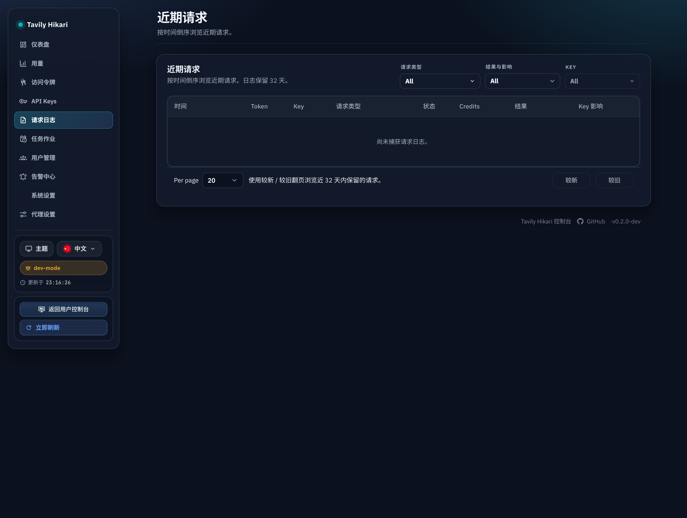
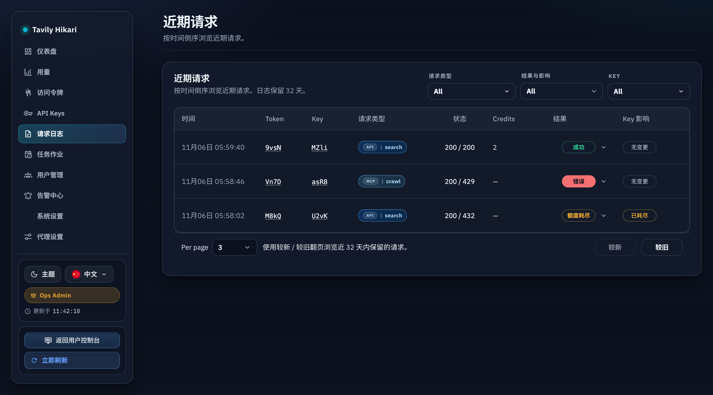
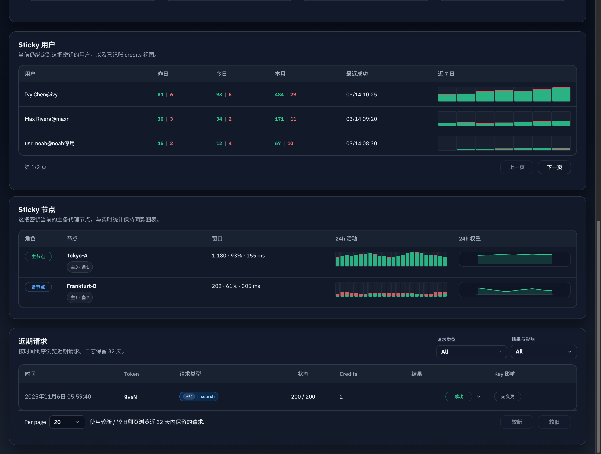
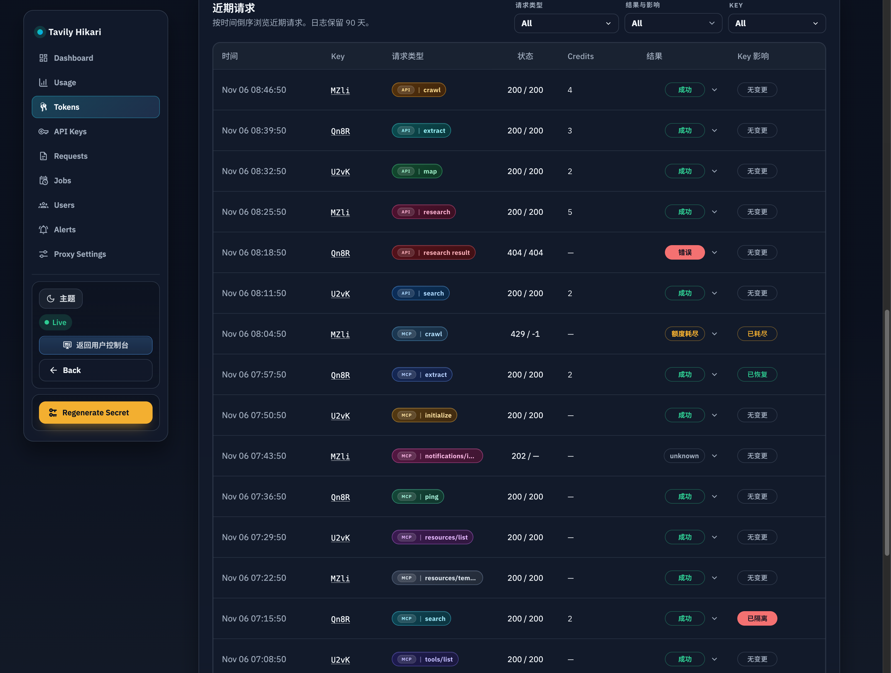
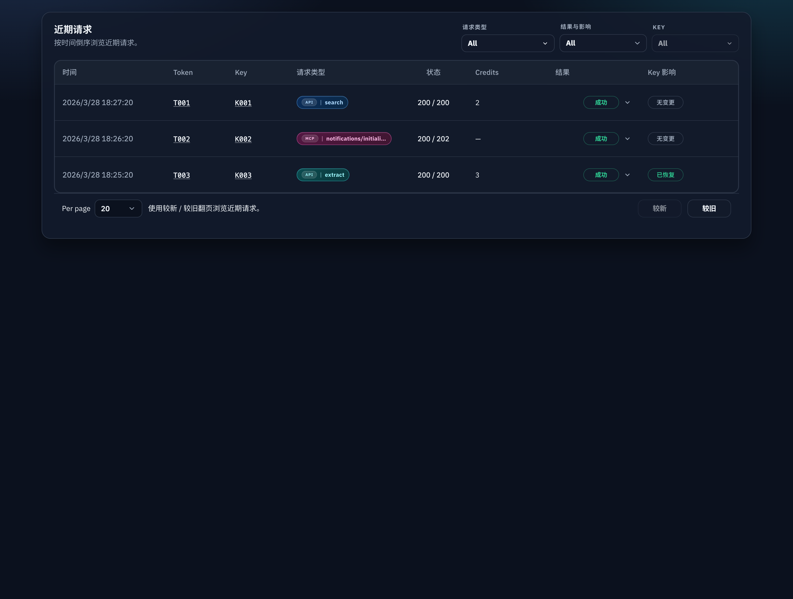
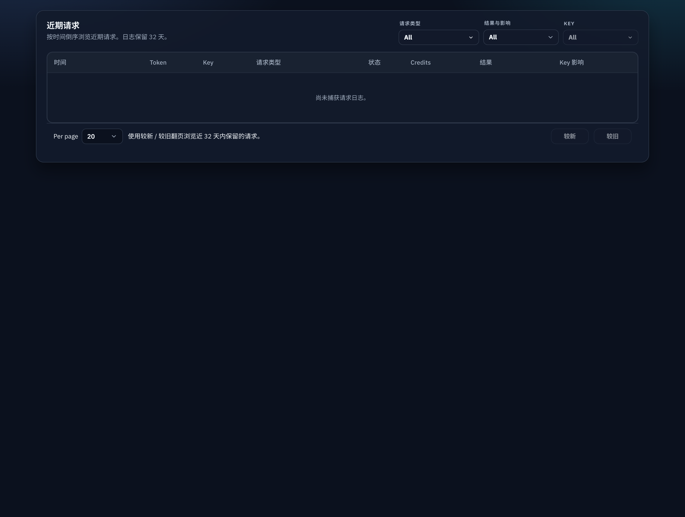
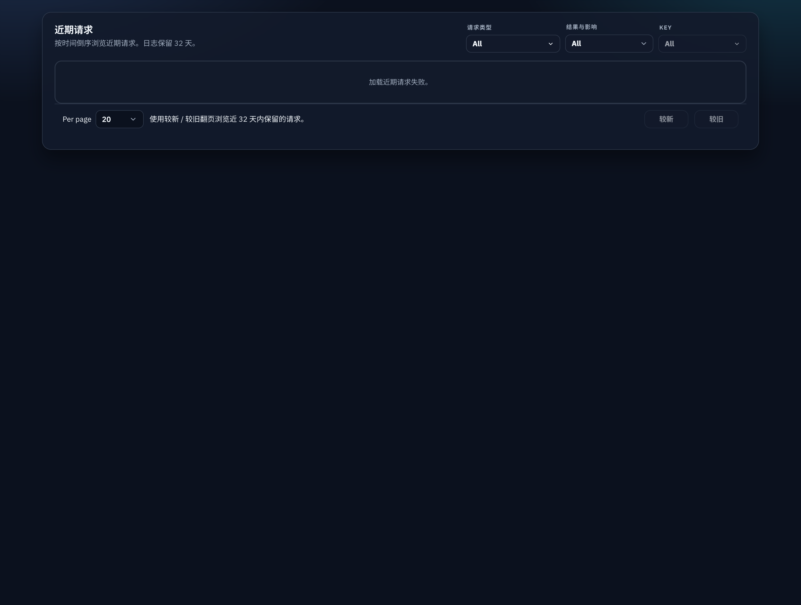

# 管理台近期请求文案纠正与性能重构（#ev4td）

## 状态

- Status: 待实现
- Created: 2026-04-06
- Last: 2026-04-06

## 背景 / 问题陈述

- `docs/specs/wnzdr-admin-recent-requests-unification/SPEC.md` 已把 `/admin/requests`、`/admin/keys/:id`、`/admin/tokens/:id` 的近期请求面板统一成共享组件，但 admin 侧仍保留了过时的“最多 200 条 / 最多 10 页”文案，和当前按 retention 保留的真实行为不一致。
- 当前 admin 全局请求页的 `/api/logs` 会在单次请求里同时计算列表、`COUNT(*)`、request-kind catalog 与多个 facets，导致 `/admin/requests` 首屏长期被重查询阻塞。
- `/admin/requests` 路由首屏还会顺手请求 summary / tokens / token groups 等与当前页面无关的数据，进一步放大了首屏等待。
- 共享 recent requests 组件仍基于页码总数展示 `Page x / y`，这在高 churn 的 request logs 上既慢也不精确。

## 目标 / 非目标

### Goals

- 修正 admin recent requests 文案，移除硬编码“200 条 / 10 页”，改为基于运行时 retention 的真实描述。
- 为 admin 全局页、key 详情页、token 详情页新增“轻量列表 + 独立 catalog”的接口组合，避免列表首屏被 facets 与 total 统计阻塞。
- 将 admin 共享 recent requests 改为 `(created_at DESC, id DESC)` cursor 分页，只保留上一页 / 下一页语义。
- `/admin/requests` 首屏仅加载 shell 必需数据与 recent requests 的 `list/catalog`，不再拉无关 summary / tokens / token groups。
- Storybook 与 admin 中英文文案同步更新，保证 requests global / key detail / token detail 的共享面板语义一致。

### Non-goals

- 不修改 request log retention 策略本身，也不改变最小 32 天约束。
- 不重写 dashboard overview 的 mini recent requests 卡片数据契约。
- 不改变 public / user console 中“最近 20 条请求”的产品语义与文案。
- 不在本轮把 catalog facets 改造成“随当前筛选动态收窄计数”。

## 范围（Scope）

### In scope

- `src/models.rs`
  - 新增 admin recent requests cursor/list/catalog 响应模型。
- `src/store/mod.rs`
  - 新增 admin 全局 / key / token 的 cursor 列表查询。
  - 新增 admin 全局 / key / token catalog 聚合查询。
- `src/tavily_proxy/mod.rs`
  - 暴露 admin recent requests `list/catalog` 接口。
  - 提供 30s scope 级 catalog cache，并在 request log 新写入和 `request_logs_gc` 后失效。
- `src/server/dto.rs`
  - 定义 admin list/catalog DTO 与 cursor 查询参数。
  - 新增 `/api/logs/list`、`/api/logs/catalog`、`/api/keys/:id/logs/list`、`/api/keys/:id/logs/catalog`、`/api/tokens/:id/logs/list`、`/api/tokens/:id/logs/catalog`。
- `src/server/serve.rs`
  - 挂载上述新路由。
- `web/src/api.ts`
  - 新增 admin recent requests list/catalog 类型与请求函数。
- `web/src/components/AdminRecentRequestsPanel.tsx`
  - 共享面板切换到 cursor 分页与“list 先渲染 / catalog 后补齐”的模型。
- `web/src/AdminDashboard.tsx`
  - `/admin/requests` 改成按路由懒加载，仅拉 shell 必需数据与 recent requests list/catalog。
- `web/src/pages/TokenDetail.tsx`
  - token 详情页共享面板接入新 list/catalog 契约。
- `web/src/i18n.tsx`
  - 修正文案，改为 retention-aware 描述与无 catalog 时的安全兜底。
- `web/src/components/AdminRecentRequestsPanel.stories.tsx`
- `web/src/admin/AdminPages.stories.tsx`
  - 补齐 global / key detail / token detail、catalog loading、empty、error 等 Storybook 入口。

### Out of scope

- 删除 legacy `/api/logs`、`/api/keys/:id/logs/page`、`/api/tokens/:id/logs/page` 或其它既有 consumer。
- 改造 token detail 的日期窗口、summary、usage chart 查询策略。
- 对 request log 聚合结果增加后台物化表或离线 job。

## 接口契约（Interfaces & Contracts）

### `GET /api/logs/list`

### `GET /api/keys/:id/logs/list`

### `GET /api/tokens/:id/logs/list`

- 查询参数：
  - `limit`
  - `cursor`
  - `direction`：`older | newer`
  - 继续支持共享 recent requests 已有筛选：
    - `request_kind`（可重复）
    - `result`
    - `key_effect`
    - `auth_token_id`（global / key）
    - `key_id`（global / token）
    - `operational_class`
    - `since` / `until`（token 作用域沿用现有时间窗）
- 响应：
  - `items[]`
  - `pageSize`
  - `nextCursor`
  - `prevCursor`
  - `hasOlder`
  - `hasNewer`
- 不返回：
  - `total`
  - `page`
  - `totalPages`
  - `requestKindOptions`
  - `facets`
- `items[].request_body` 与 `items[].response_body` 固定返回 `null`；详情 bodies 继续走既有 details endpoint。

### `GET /api/logs/catalog`

### `GET /api/keys/:id/logs/catalog`

### `GET /api/tokens/:id/logs/catalog`

- 响应：
  - `retentionDays`
  - `requestKindOptions`
  - `facets.results`
  - `facets.keyEffects`
  - `facets.tokens`
  - `facets.keys`
- catalog 仅按 scope 预计算：
  - global 带 tokens + keys
  - key scope 仅带 tokens
  - token scope 仅带 keys
- catalog 采用 30 秒 TTL 的 scope 级缓存。
- 新写入 request log 或执行完 `request_logs_gc` 后，cache 必须失效。

### Legacy compatibility

- legacy `/api/logs`、`/api/keys/:id/logs/page`、`/api/tokens/:id/logs/page` 保留，避免 dashboard mini card 与非共享 consumer 在本轮受影响。
- legacy 契约可继续返回 `total / page / facets`，但 admin 共享 recent requests 不再依赖它们。

## 验收标准（Acceptance Criteria）

- Given 管理员打开 `/admin/requests`
  When 页面首屏加载
  Then 网络请求不再包含 `summary`、`tokens`、`token groups`，仅保留 shell 必需数据与 recent requests `list/catalog`。

- Given 管理员打开 `/admin/requests`、`/admin/keys/:id`、`/admin/tokens/:id`
  When recent requests 面板渲染
  Then 页面不再出现任何“最多 200 条 / 最多 10 页 / latest 200”文案，并在 catalog 已到达时展示真实 retention 天数。

- Given catalog 响应比列表慢
  When recent requests 面板首屏渲染
  Then 表格先由 `list` 数据渲染，筛选项与 retention 文案在 catalog 到达后再补齐，不因 catalog 阻塞整块面板。

- Given 管理员在 global / key / token 三个作用域中翻页
  When 使用上一页 / 下一页导航
  Then 列表使用 cursor 语义稳定翻页，且不会因为新增日志造成明显重复或漏行。

- Given request log 新写入或 `request_logs_gc` 执行完成
  When 下一次获取同 scope catalog
  Then 返回的 retention/facets 已反映最新状态，而不是继续使用旧缓存。

- Given public home / user console 渲染最近请求
  When 本轮改动合入
  Then 仍保持“最近 20 条”语义与原有文案，不被 admin 改动误伤。

## 测试与证据

- `cargo test admin_logs_cursor_and_catalog_endpoints_expose_retention_without_blocking_page_counts -- --nocapture`
- `cargo test key_and_token_logs_catalog_scope_and_cache_invalidation_work -- --nocapture`
- `cargo test admin_and_key_log_details_return_scoped_bodies_while_list_pages_keep_null_payloads -- --nocapture`
- `cargo test token_log_details_return_linked_bodies_and_page_results_keep_null_payloads -- --nocapture`
- `cargo clippy -- -D warnings`
- `cargo test`
- `cd web && bun test`
- `cd web && bun run build`
- `cd web && bun run build-storybook`
- Storybook / 浏览器验证 `requests global`、`key detail recent requests`、`token detail recent requests` 的 catalog loading / empty / error / cursor paging / retention copy。

## Visual Evidence

- Live `/admin/requests`：真实页面首屏仅请求 `profile`、`version`、`logs/list`、`logs/catalog`，并展示基于运行时 retention 的文案。

  

- Storybook `requests global`：共享 recent requests 面板改为 cursor 导航，不再展示伪精确总页数，文案改为按时间倒序浏览并显示 retention 天数。

  

- Storybook `key detail recent requests`：key 详情页复用 admin 专用 list/catalog 契约，描述与全局 requests 页保持一致。

  

- Storybook `token detail recent requests`：token 详情页同样切到 cursor 导航与 retention 文案，验证 scoped recent requests 体验一致。

  

- Storybook `catalog loading`：catalog 慢时先渲染列表与安全兜底文案，filters 元数据后补齐，不再整体阻塞首屏。

  

- Storybook `empty state` / `error state`：空态与错误态都保留可浏览的稳定容器与文案，不回退到旧的 200 条 / 10 页提示。

  

  
