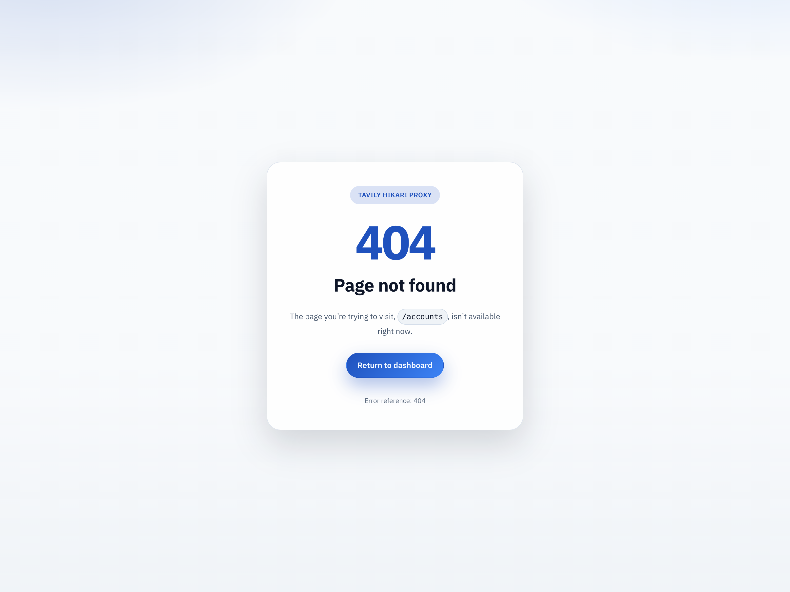
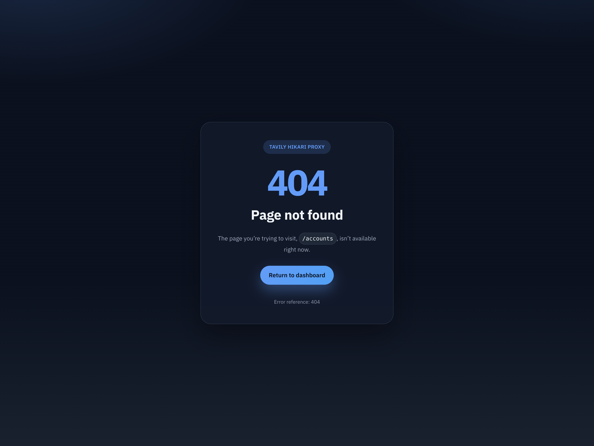
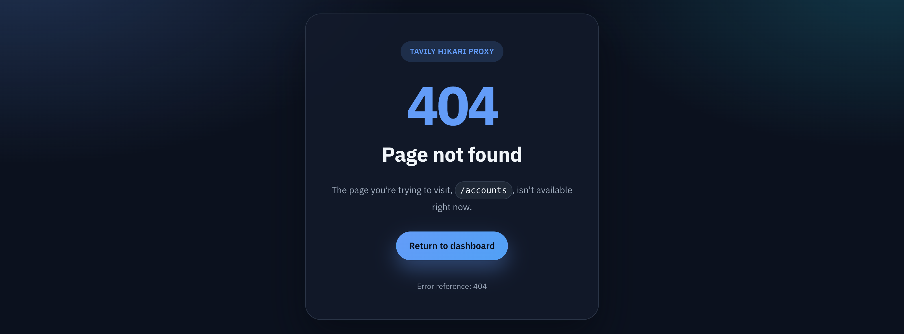

# Web 404 fallback 主题一致性修复（#g9ku2）

## 状态

- Status: 已实现（待审查）
- Created: 2026-04-07
- Last: 2026-04-07

## 背景 / 问题陈述

- 未知 HTML 路由（例如 `/accounts`）会走 Rust 侧生成的 404 fallback 页面，而不是 React 路由内的产品页。
- 该 fallback 会把前端打包 CSS 和自身内联样式拼在同一个 `<style>` 里；原实现先写 404 样式、后写前端全局 CSS，导致 `body` 的浅色背景与前景把 404 暗色外观部分覆盖。
- 实际表现是暗色卡片落在浅色背景上，标题与正文对比也会错位，和全站 light/dark 主题语义不一致。

## 目标 / 非目标

### Goals

- 让通用 404 fallback 跟随 `tavily-hikari-theme-mode` + system fallback 解析 light/dark。
- 保留 system theme 的 CSS 回退与运行时同步语义：脚本不可用时仍能按 `prefers-color-scheme` 进入 dark，脚本可用时继续跟随系统主题切换。
- 修复 404 页面背景、卡片、标题、正文、按钮在 dark 模式下的串色问题，同时保持 light 模式正常。
- 为该 fallback 提供 Storybook light/dark 验收入口和 Rust 回归测试，防止以后再被全局 `body` 覆盖。
- 补一张真实未知路由页面证据图，证明运行中的 backend 也已修好。

### Non-goals

- 不新增业务路由、React 404 页面、i18n 文案或任何新的 HTTP 接口。
- 不改动 `/__404`、`history.replaceState`、状态码、redirect 语义或返回 CTA 行为。
- 不调整 `/console`、`/admin` 或其它业务页面的主题逻辑。

## 范围（Scope）

### In scope

- `src/server/spa.rs`
- `web/src/index.css`
- `web/src/components/NotFoundFallbackPreview.tsx`
- `web/src/components/NotFoundFallbackPreview.stories.tsx`
- `web/src/components/NotFoundFallbackPreview.stories.test.ts`
- `docs/specs/README.md`

### Out of scope

- 真实 React 页面路由表与后端业务 handler。
- 404 fallback 文案本地化与信息架构扩展。

## 接口契约（Interfaces & Contracts）

- 404 fallback 仍使用现有 `tavily-hikari-theme-mode` localStorage key，并在缺省时回退到 system theme。
- 对外页面结构和行为保持不变：原路径仍显示在正文中，`Return to dashboard` 仍跳回 `/`，`history.replaceState` 仍把地址栏恢复到原始未知路径。
- 新增 Storybook 验收面只用于稳定视觉验证，不暴露新的产品 API。

## 验收标准（Acceptance Criteria）

- Given 浏览器在 dark 模式下访问未知 HTML 路由
  When backend 返回 404 fallback
  Then 页面背景、卡片、标题、正文和按钮都使用一致的 dark theme token，不再出现浅色背景串入。

- Given 浏览器在 light 模式下访问同一路由
  When 404 fallback 渲染完成
  Then 页面仍保持浅色背景与可读对比，不出现暗色残留。

- Given Storybook `Support/Pages/NotFoundFallback`
  When 验收者切换 `Light Theme` / `Dark Theme`
  Then 可以稳定看到 404 fallback 在双主题下的完整画布表现。

- Given 404 fallback 处于 `system` theme
  When 脚本不可用或系统主题在页面打开期间切换
  Then 页面仍按 `prefers-color-scheme` 保持正确的 light/dark 语义，不会卡死在旧主题。

- Given 前端全局 CSS 继续包含通用 `body` 背景规则
  When Rust fallback 生成内联 HTML
  Then 404 自身主题 bootstrap、root hook 与 override 顺序仍能保证 fallback 样式赢得最终 cascade。

## 非功能性验收 / 质量门槛（Quality Gates）

### Testing

- `cargo test`
- `cd web && bun test`

### Build

- `cd web && bun run build`
- `cd web && bun run build-storybook`

### UI / Browser proof

- Storybook light/dark 双主题画布可稳定截图。
- 真实 `GET /accounts` 暗色页与 Storybook 暗色证据在背景和卡片语义上保持一致。

## Visual Evidence

- 证据类型：`source_type=storybook_canvas`，`target_program=mock-only`，`capture_scope=element`
- 证明点：light theme 下 404 fallback 保持浅色背景、白色卡片和清晰的正文/按钮对比。

- 证据类型：`source_type=storybook_canvas`，`target_program=mock-only`，`capture_scope=element`
- 证明点：dark theme 下 404 fallback 的页面背景与卡片同时进入深色语义，不再出现浅色 page chrome。

- 证据类型：真实 backend 预览态，`target_program=current-browser-preview`，`capture_scope=element`
- 证明点：当前 worktree 的 backend 在未知路由 `/accounts` 上已应用暗色 fallback 主题，与 Storybook 暗色画布结论一致。

## 实现里程碑（Milestones / Delivery checklist）

- [x] M1: 404 fallback 在 `<head>` 提前执行主题 bootstrap，并沿用 `tavily-hikari-theme-mode`
- [x] M2: 404 页面使用专用 root hook / body class，避免全局 `body` 样式串色
- [x] M3: 前端补齐共享 404 视觉样式与 Storybook light/dark 验收入口
- [x] M4: Rust 回归测试、web tests、构建与 Storybook 构建通过

## 风险 / 开放问题 / 假设

- 假设：通用 404 fallback 应与 SPA 共用同一套主题决议语义，而不是单独依赖 `prefers-color-scheme`。
- 假设：当前变更属于通用未知 HTML 路由 fallback 修复，不需要为每个业务路径单独定制 404 页面。
- 风险：若未来 fallback 页面结构大改，需要同步更新 Rust 内联模板与 Storybook 预览组件，避免证据面和真实模板再度漂移。

## 变更记录（Change log）

- 2026-04-07: 为 Rust 404 fallback 增加主题 bootstrap、专用 root hook、更稳的 CSS override 顺序，以及 system theme 的 CSS 回退与运行时同步，修复暗色背景串色。
- 2026-04-07: 新增 Storybook light/dark 验收入口、Rust 回归测试，以及 `/accounts` 真实暗色页视觉证据。
