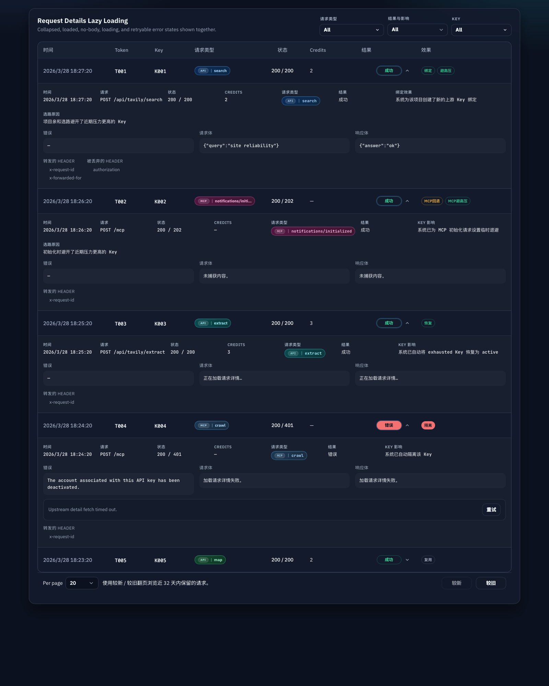

# 日志 Effect 桶拆分与分层展示（#hpwdb）

## 状态

- Status: 进行中（快车道）
- Created: 2026-04-12
- Last: 2026-04-12

## 背景 / 问题陈述

- HTTP `X-Project-ID` 项目亲和上线后，请求日志开始同时承载“key 健康动作”“项目绑定结果”“避热选路原因”三种语义。
- 现有 `key_effect_*` 是单桶模型，首绑但同时避热时只能保留一个 code，导致 `http_project_affinity_bound` 会被 `http_project_affinity_pressure_avoided` 之类的选路原因覆盖。
- 管理台和管理 API 因此只能看到“为什么没选 rank 0 key”，却看不到“这次其实完成了项目绑定”，不利于排障，也让 MCP session init 的 avoided 日志继续混在 key 健康动作里。

## 目标 / 非目标

### Goals

- 把 request log / auth token log 的 effect 语义拆成三类：
  - `key_effect_*`：key 健康动作与系统动作
  - `binding_effect_*`：HTTP project affinity 的绑定结果
  - `selection_effect_*`：HTTP project affinity / MCP session init 的避热与选路原因
- 保留对外核心行为不变：不改选 key 算法，不改 HTTP / MCP 对外协议，只提升日志可观测性与管理台展示。
- 让“首次 `bound` + 同时 `pressure_avoided`”可以在同一条日志里同时可见。
- 为管理 API 与管理台补齐新的 effect filters、facets、badge、详情字段与稳定 Storybook/mock 覆盖。
- 为历史数据库提供一次性回填迁移，把旧的 avoided / bound 语义迁入新字段并清理旧桶里的重复表达。

### Non-goals

- 不改变 HTTP project affinity / MCP session init 的候选排序、cooldown 或 retry 逻辑。
- 不修改用户控制台的精简 token 日志接口 shape。
- 不引入第四类 effect 字段；`mcp_session_init_backoff_set` 继续留在 `key_effect_*`。

## 范围（Scope）

### In scope

- `src/store/mod.rs`
  - 为 `request_logs`、`auth_token_logs` 新增 `binding_effect_code/summary`、`selection_effect_code/summary`。
  - 扩展 list/page/catalog/facets 过滤与查询。
  - 添加一次性迁移，把历史路由类 effect 从 `key_effect_*` 回填到新字段。
- `src/models.rs`
  - 扩展 `AttemptLog`、`ProxyResponse`、`RequestLogRecord`、`TokenLogRecord`、facets 模型。
- `src/tavily_proxy/mod.rs`
  - 将 HTTP project affinity 的 `bound/reused/rebound` 写入 `binding_effect_*`。
  - 将 HTTP / MCP 的 `*_avoided` 写入 `selection_effect_*`。
  - 保持 `key_effect_*` 只用于 key 健康动作与 `mcp_session_init_backoff_set`。
- `src/server/dto.rs`
  - 扩展日志 DTO、query 参数与 facets 返回值。
- `src/server/handlers/admin_resources.rs`
- `src/server/handlers/tavily.rs`
- `src/server/proxy.rs`
  - 让管理 API 和日志写入链路透传三类 effect。
- `web/src/api.ts`
- `web/src/api.test.ts`
- `web/src/admin/requestLogsUi.ts`
- `web/src/AdminDashboard.tsx`
- `web/src/pages/TokenDetail.tsx`
- `web/src/components/AdminRecentRequestsPanel.tsx`
- `web/src/components/AdminRecentRequestsPanel.stories.tsx`
- `web/src/admin/AdminPages.stories.tsx`
- `web/src/pages/TokenDetail.stories.tsx`
- `web/src/i18n.tsx`
  - 管理台列表、详情、筛选、文案与 Storybook 覆盖统一升级。

### Out of scope

- 用户控制台 `/api/user/tokens/:id/logs` 的返回字段扩容。
- HTTP project affinity / MCP session init 行为语义变化。
- release / deployment 行为调整。

## 接口契约（Interfaces & Contracts）

### Effect taxonomy

- `key_effect_code` 只允许承载：
  - `none`
  - `quarantined`
  - `marked_exhausted`
  - `restored_active`
  - `cleared_quarantine`
  - `mcp_session_init_backoff_set`
  - `mcp_session_retry_waited`
  - `mcp_session_retry_scheduled`
- `binding_effect_code` 只允许承载：
  - `none`
  - `http_project_affinity_bound`
  - `http_project_affinity_reused`
  - `http_project_affinity_rebound`
- `selection_effect_code` 只允许承载：
  - `none`
  - `mcp_session_init_cooldown_avoided`
  - `mcp_session_init_rate_limit_avoided`
  - `mcp_session_init_pressure_avoided`
  - `http_project_affinity_cooldown_avoided`
  - `http_project_affinity_rate_limit_avoided`
  - `http_project_affinity_pressure_avoided`

### Storage

- `request_logs` 新增：
  - `binding_effect_code TEXT NOT NULL DEFAULT 'none'`
  - `binding_effect_summary TEXT NULL`
  - `selection_effect_code TEXT NOT NULL DEFAULT 'none'`
  - `selection_effect_summary TEXT NULL`
- `auth_token_logs` 新增同名四列，默认与语义一致。
- 迁移必须回填历史数据：
  - `http_project_affinity_bound/reused/rebound` → `binding_effect_*`
  - `mcp_session_init_*_avoided`、`http_project_affinity_*_avoided` → `selection_effect_*`
  - 迁移后被回填到新字段的旧 `key_effect_code` 统一回到 `none`，`key_effect_summary` 清空
  - `mcp_session_init_backoff_set`、`mcp_session_retry_waited`、`mcp_session_retry_scheduled` 与 key 健康动作保持原位

### Management API

- 请求日志 list/page/catalog、token logs list/page/catalog、key logs page/catalog 统一支持新增 query：
  - `binding_effect`
  - `selection_effect`
- 为了覆盖同一条日志同时存在 `binding_effect` 与 `selection_effect` 的复合事件，API 必须允许这两个 query 同时传入并按 AND 命中；`key_effect` 仍不得与其他 effect query 并用，`result` 也不得与任意 effect query 并用。
- 响应新增：
  - `binding_effect_code`
  - `binding_effect_summary`
  - `selection_effect_code`
  - `selection_effect_summary`
  - `facets.binding_effects`
  - `facets.selection_effects`

### UI presentation

- 列表摘要与详情抽屉必须把 `key effect`、`binding effect`、`selection effect` 独立显示。
- 当 effect code 为 `none` 时，对应 badge / 详情项默认隐藏。
- 如果同一条日志同时存在 `binding_effect` 与 `selection_effect`，必须同时展示，不再互相覆盖。

## 验收标准（Acceptance Criteria）

- Given 同一非空 `X-Project-ID` 的首次请求建立了项目绑定，并且为避热选中了更冷 key
  When 日志被写入并从管理 API 读取
  Then 响应必须同时满足：
  - `key_effect_code = none`
  - `binding_effect_code = http_project_affinity_bound`
  - `selection_effect_code = http_project_affinity_pressure_avoided`

- Given 同一项目后续请求健康复用既有绑定
  When 日志被写入并读取
  Then 响应必须满足：
  - `binding_effect_code = http_project_affinity_reused`
  - `selection_effect_code = none`

- Given MCP session init 或 HTTP project affinity 命中了 cooldown / rate-limit / pressure 避让
  When 日志写入完成
  Then `*_avoided` effect 必须只出现在 `selection_effect_*`，不得再占用 `key_effect_*`。

- Given key 因 401、quota exhausted 或管理员操作触发健康状态变化
  When 日志写入完成
  Then `quarantined`、`marked_exhausted`、`restored_active`、`cleared_quarantine` 仍只出现在 `key_effect_*`。

- Given MCP follow-up 请求因 `Retry-After` 被延迟或执行了一次重试
  When 日志写入完成
  Then `mcp_session_retry_waited` / `mcp_session_retry_scheduled` 必须继续保留在 `key_effect_*`，避免丢失 Retry-After 审计痕迹。

- Given 历史数据库包含旧的 avoided / bound 日志
  When 应用启动完成迁移
  Then 历史行必须被回填到新字段，且旧新字段不能重复表达同一语义。

- Given 管理员打开 `/admin/requests`、`/admin/keys/:id`、`/admin/tokens/:id`
  When 查看结果与影响筛选和详情抽屉
  Then 页面必须能同时展示并筛选 `key effect`、`binding effect`、`selection effect` 三类信息。

## 测试与证据

- `cargo test`
- `cargo clippy --all-targets --all-features -- -D warnings`
- `cd web && bun run build`
- `cd web && bun test ./src/api.test.ts ./src/components/AdminRecentRequestsPanel.stories.test.ts ./src/admin/AdminPages.stories.test.ts ./src/pages/TokenDetail.test.ts`
- Storybook 视觉证据：管理员近期请求列表展示首绑 + 避热双 badge 与详情拆分。

## Docs to Update

- `docs/specs/README.md`

## 计划资产（Plan assets）

- Directory: `docs/specs/hpwdb-log-effect-bucket-split/assets/`
- Visual evidence source: Storybook

## Visual Evidence

- source_type: `storybook_canvas`
  story_id_or_title: `Admin/Components/AdminRecentRequestsPanel / LazyDetailsGallery`
  target_program: `mock-only`
  capture_scope: `browser-viewport`
  sensitive_exclusion: `N/A`
  submission_gate: `pending-owner-approval`
  state: `binding + selection split compact single-line badges`
  evidence_note: 验证近期请求列表在同一条 HTTP project affinity 日志上，以单行紧凑 badge 同时展示 `绑定` 与 `避高压`，并在展开详情中继续分离 `绑定效果` 与 `选路原因`。
  image:
  

## 实现里程碑（Milestones / Delivery checklist）

- [x] M1: 后端 effect taxonomy、模型与迁移回填完成
- [x] M2: HTTP / MCP 日志写入链路拆分完成
- [x] M3: 管理 API 查询、facets 与 filters 接入完成
- [x] M4: 管理台展示、文案、Storybook/mock 覆盖完成
- [x] M5: 本地测试与 clippy 通过
- [x] M6: 视觉证据落盘并回传给主人
- [ ] M7: fast-flow PR 收敛到 merge-ready

## 风险 / 开放问题 / 假设（Risks, Open Questions, Assumptions）

- 风险：历史库升级后若残留第三方查询仍只读 `key_effect_*`，会看不到已迁移的 avoided / bound 语义；本次只保证管理 API 与管理台升级完成。
- 风险：effect 三分后，前端 badge 密度会上升，需要依赖紧凑布局与 tooltip 保持可读性。
- 开放问题：None
- 假设：现有 request/token/key logs 页面就是本次 effect 三分的唯一 owner-facing 可视面，无需扩散到用户控制台。

## 变更记录（Change log）

- 2026-04-12: 新建 spec，冻结 effect taxonomy、迁移回填策略、管理 API 过滤约束与 UI 三分展示合同。
- 2026-04-12: 补充 Storybook 视觉证据，固定同条日志可同时展示 `binding_effect` 与 `selection_effect` 的 owner-facing 复核面。
- 2026-04-12: 收紧效果列为单行紧凑 badge，避免同条日志的 effect 在桌面表格中堆成两行。

## 参考（References）

- `src/store/mod.rs`
- `src/tavily_proxy/mod.rs`
- `src/server/dto.rs`
- `src/server/handlers/admin_resources.rs`
- `web/src/components/AdminRecentRequestsPanel.tsx`
- `web/src/AdminDashboard.tsx`
- `web/src/pages/TokenDetail.tsx`
