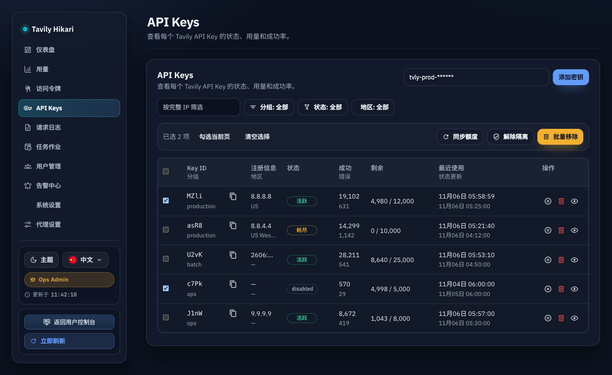
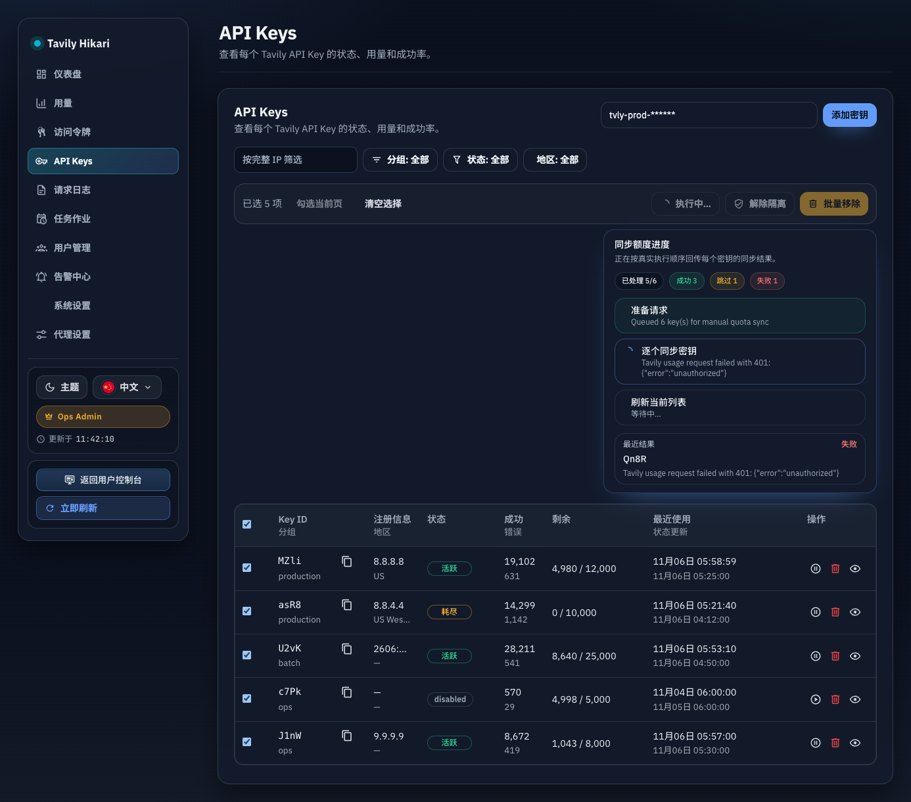
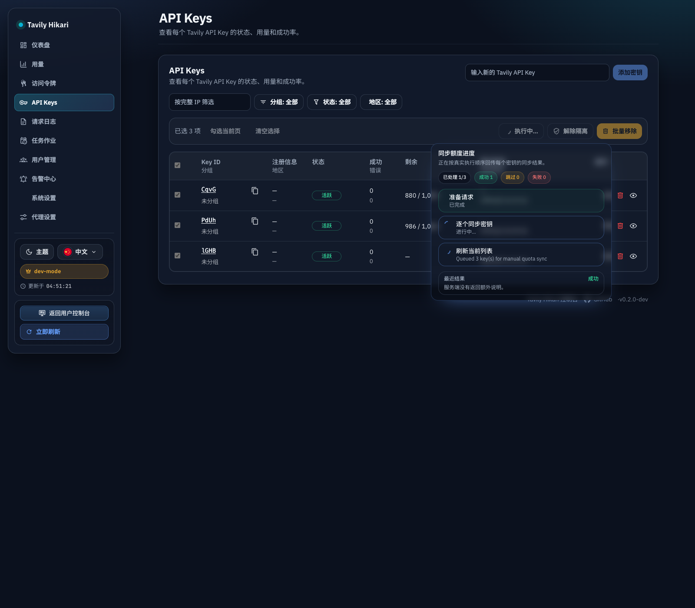
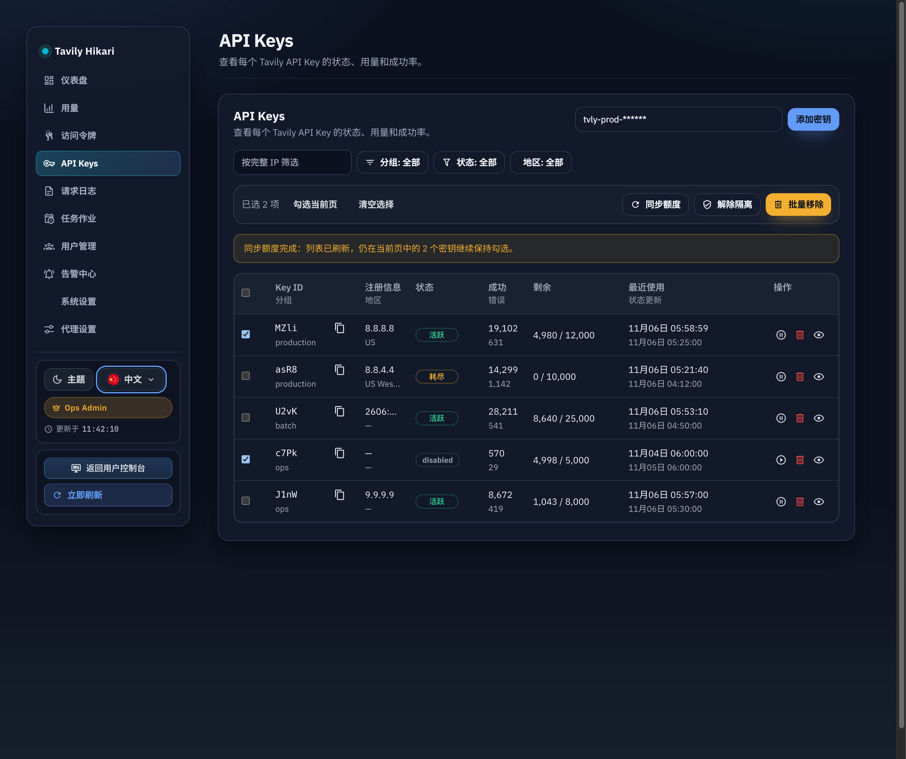
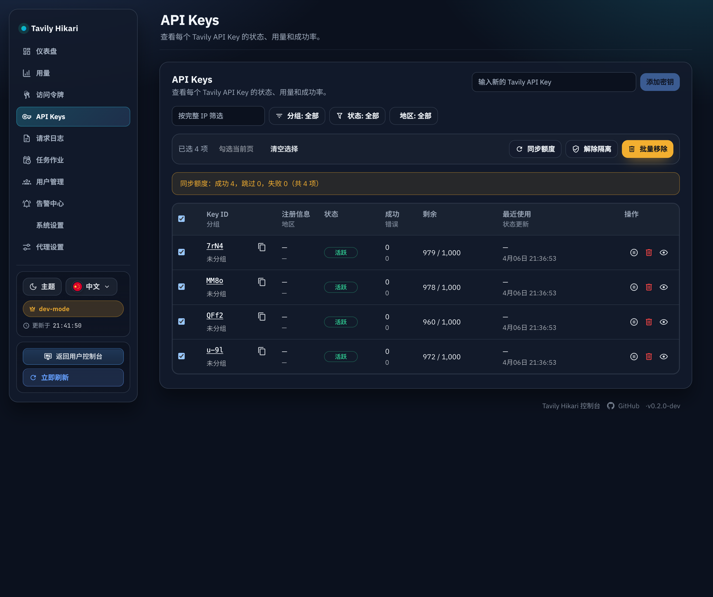

# Admin API Keys 批量维护动作与同步额度实时进度气泡（#hrre9）

## 状态

- Status: 已实现
- Created: 2026-04-04

## 背景 / 问题陈述

- `/admin/keys` 已支持当前页批量动作，但工具条在执行时缺少足够明确的动作语义与工作反馈。
- “同步额度”是最耗时的批量动作，单靠按钮 disabled 无法让管理员判断系统是否仍在推进、当前推进到哪里、哪些 key 已成功或失败。
- 上游 usage 失败仍然不能污染现有额度快照；新增实时反馈必须建立在真实服务端进度之上，而不是前端伪造百分比。

## 目标 / 非目标

### Goals

- 为 `/admin/keys` 批量工具条三个动作补齐左侧语义图标，并在执行中只让当前动作按钮显示 spinning loader。
- 为批量“同步额度”提供真实流式进度气泡，固定分成 `准备请求` → `逐 key 同步` → `刷新列表` 三段。
- 让 `POST /api/keys/bulk-actions` 在 `action=sync_usage` 时支持基于 `Accept: text/event-stream` 的 SSE content negotiation，同时保留现有 JSON fallback。
- 保持既有 summary banner、列表刷新、失败不落坏数据等行为不回退；批量动作完成后只移除已不在当前列表中的已选项。
- 补齐 Storybook 入口、测试、浏览器验收与视觉证据，收口到 latest PR `merge-ready`。

### Non-goals

- 不给“解除隔离 / 批量移除”新增实时进度气泡。
- 不新增独立 job queue、轮询接口或跨页批量协议。
- 不改变单 key 手动同步、批量删除、批量解除隔离的业务语义。

## 范围（Scope）

### In scope

- `src/server/handlers/admin_resources.rs`
  - `sync_usage` 批量动作的 SSE 事件流与 JSON fallback。
- `src/server/tests.rs`
  - 批量同步 mixed outcome 与 SSE 合同测试。
- `web/src/AdminDashboard.tsx`
  - 批量工具条图标、active spinner、同步额度实时进度气泡接线。
- `web/src/api.ts`
  - 专用 bulk sync SSE helper。
- `web/src/admin/apiKeyBulkSyncProgress.ts`
  - 前端流式状态 reducer / helpers。
- `web/src/admin/ApiKeyBulkSyncProgressBubble.tsx`
  - 进度气泡 UI。
- `web/src/admin/AdminPages.stories.tsx`
  - 批量工具条选中态与同步进行中气泡稳定证明。
- `web/src/admin/*.test.ts`
  - story exports 与 reducer 行为覆盖。
- `docs/specs/hrre9-admin-api-keys-bulk-actions/**`
  - 更新合同、规格与视觉证据。

### Out of scope

- 批量删除 / 解除隔离的流式进度展示。
- 跨页选择、筛选协议、分页 URL 契约变更。
- 后台自动调度、详情页交互重做。

## 需求（Requirements）

### MUST

- 三个批量按钮默认都有左侧图标：
  - 同步额度 = `mdi:refresh`
  - 解除隔离 = `mdi:shield-check-outline`
  - 批量移除 = `mdi:trash-can-outline`
- 任一动作执行中时，只有当前动作按钮把左图标替换为 `mdi:loading` 并旋转；其他按钮只禁用、不旋转。
- 点击“同步额度”后必须立刻在按钮锚点下方展示进度气泡。
- 进度气泡只能展示真实状态，不得伪造百分比；至少持续显示：
  - 当前阶段
  - `current/total`
  - `success/skipped/failed`
  - 最近完成 key 的结果文本
- `POST /api/keys/bulk-actions` 在 `action=sync_usage` 且 `Accept` 包含 `text/event-stream` 时必须返回可解析 SSE，事件至少覆盖：
  - `phase(prepare_request)`
  - `item`（每个 key 一条）
  - `phase(refresh_ui)`
  - `complete` 或 `error`
- `delete` / `clear_quarantine` 保持 JSON-only，原有响应结构不变。
- 批量同步失败不得写入 `api_keys.quota_limit`、`api_keys.quota_remaining`、`api_keys.quota_synced_at`，也不得写 `api_key_quota_sync_samples`。

### SHOULD

- `complete.payload` 与 JSON 路径的 `summary/results` 语义等价。
- 终态气泡在请求结束后继续保留，直到用户主动 dismiss、再次触发同步或选择上下文被重置。
- Storybook 至少提供“选中工具条”和“同步进行中气泡”两个稳定入口。

## 功能与行为规格（Functional/Behavior Spec）

### Toolbar icons and active state

- 当当前页存在选中项时，列表头部显示批量工具条。
- 三个按钮都显示左图标；文案保持不变。
- `bulkKeyActionInFlight` 只驱动当前动作按钮的 spinner，避免多个按钮同时表现为“正在工作”。
- 任一批量动作成功刷新当前页后，仍出现在当前列表中的已选 key 继续保持勾选；已不在当前列表中的 key 自动移出选择集。

### Bulk sync progress bubble

- 触发“同步额度”后立即打开锚点气泡。
- 气泡固定呈现三步：
  - `prepare_request`
  - `sync_usage`
  - `refresh_ui`
- `sync_usage` 阶段通过服务端 `item` 事件实时累积：
  - 已处理数量
  - 成功 / 跳过 / 失败计数
  - 最近一个 key 的 `success / skipped / failed` 与详情
- 流结束后，前端仍沿用现有收口：刷新当前 keys 页、展示 summary banner，并仅保留刷新后当前列表仍存在的已选 key。
- 只有在上述收口动作完成后，`refresh_ui` 步骤才进入完成态。

### SSE contract behavior

- `sync_usage` 的 SSE 流按选中 key 的归一化顺序发送事件。
- 单个 key 的上游失败通过 `item.status = failed` 表达，不升级为整个流失败。
- 只有编码/流式发送本身失败时才会发送终态 `error` 事件。
- 如果客户端未请求 SSE，仍然返回原始 JSON 聚合结果。

### Edge cases / errors

- 翻页、切换筛选、切换 `perPage`、重新进入模块后，选择态被清空，同时关闭并重置进度气泡。
- 手动刷新继续沿用现有语义：清空选择并重置批量反馈，不启用“保留勾选”。
- 如果流在 `complete` 前失败，气泡停在错误态，并保留已累积的真实计数。
- 如果流成功但列表刷新失败，气泡将错误定位到 `refresh_ui`，而不会伪装成同步成功。

## 接口契约（Interfaces & Contracts）

### 接口清单（Inventory）

| 接口（Name）                    | 类型（Kind） | 范围（Scope） | 变更（Change） | 契约文档（Contract Doc）   | 负责人（Owner） | 使用方（Consumers） | 备注（Notes）                         |
| ------------------------------- | ------------ | ------------- | -------------- | -------------------------- | --------------- | ------------------- | ------------------------------------- |
| `POST /api/keys/bulk-actions`   | HTTP API     | internal      | Modify         | `./contracts/http-apis.md` | backend         | admin web           | `sync_usage` 新增 SSE 协商与进度事件  |
| `POST /api/keys/:id/sync-usage` | HTTP API     | internal      | Existing       | `./contracts/http-apis.md` | backend         | admin web           | 单 key 手动同步语义保持状态无关与安全 |

### 契约文档（按 Kind 拆分）

- [contracts/http-apis.md](./contracts/http-apis.md)

## 验收标准（Acceptance Criteria）

- Given `/admin/keys` 当前页存在已选 key
  When 工具条显示
  Then “同步额度 / 解除隔离 / 批量移除”都带左侧语义图标。

- Given 任一批量动作正在执行
  When 查看工具条
  Then 只有当前动作按钮显示 spinning loader，其余按钮保持禁用但不旋转。

- Given 管理员点击“同步额度”
  When 请求刚发出
  Then 进度气泡立即在按钮锚点下方出现，并显示 `准备请求` 阶段与 `0/total`。

- Given 选中的 key 正在逐个同步
  When 服务端持续发送 `item` 事件
  Then 气泡实时更新 `current/total`、`success/skipped/failed` 累计值与最近完成 key 的结果文案。

- Given `sync_usage` 请求携带 `Accept: text/event-stream`
  When 服务器返回成功
  Then 返回的 SSE 事件顺序至少满足 `phase(prepare_request)` → `item*` → `phase(refresh_ui)` → `complete`，且 `complete.payload` 与 JSON 结果等价。

- Given 某个 key 的上游 usage 请求失败
  When 批量同步结束
  Then 该 key 在 `item` / `results` 中标记为 `failed`，同时它的 quota snapshot 与 quota sync sample 不被错误数据污染。

- Given 流式同步完成但用户尚未 dismiss 气泡
  When 不切换选择上下文
  Then 终态气泡继续保留，直到点外部区域、再次触发同步或上下文重置。

- Given 当前页已有多项被勾选
  When 任一批量动作成功并刷新列表
  Then 仍留在当前列表中的项继续保持勾选，已消失的项自动从选择集中移除。

- Given Storybook 与浏览器验收已完成
  When 进入 PR 收敛
  Then spec 的 `## Visual Evidence` 含有“选中工具条”、“同步进行中气泡”和“批量动作完成后保留勾选”的最终图片。

## 非功能性验收 / 质量门槛（Quality Gates）

### Testing

- Rust integration tests
  - `POST /api/keys/bulk-actions` mixed-status JSON path
  - `POST /api/keys/bulk-actions` `sync_usage` SSE 事件流顺序与终态 payload
- Frontend tests
  - bulk key selection retention helper
  - bulk sync progress reducer/helper
  - Storybook story exports 与同步气泡 / 保留勾选完成态静态文案证明

### UI / Storybook

- Stories to add/update
  - API Keys 列表选中工具条
  - API Keys 列表同步进行中气泡
  - API Keys 列表批量动作完成后的保留勾选态
- Visual evidence source
  - 优先 Storybook 稳定画面
  - 再补真实 `/admin/keys` 浏览器复核

### Quality checks

- `cargo test`
- `cargo clippy -- -D warnings`
- `cd web && bun test`
- `cd web && bun run build`
- `cd web && bun run build-storybook`

## 文档更新（Docs to Update）

- `docs/specs/hrre9-admin-api-keys-bulk-actions/contracts/http-apis.md`
- `docs/specs/hrre9-admin-api-keys-bulk-actions/SPEC.md`

## 计划资产（Plan assets）

- Directory: `docs/specs/hrre9-admin-api-keys-bulk-actions/assets/`
- In-plan references: ``
- Visual evidence source: Storybook canvas + browser validation

## Visual Evidence

- Storybook覆盖=通过
- 视觉证据目标源=storybook_canvas
- 视觉证据=存在
- 空白裁剪=已裁剪（真实 `/admin/keys` 浏览器复核图因边界不均匀保留原始外边距）
- 聊天回图=已展示
- 证据落盘=已落盘
- 证据绑定sha=319293cdfb85703925c204ede7078cb1e17c8d13

### Storybook：选中工具条

- source_type: `storybook_canvas`; target_program: `mock-only`; capture_scope: `element`; story_id_or_title: `Admin/Pages/Keys Selected`; state: `selected toolbar`; evidence_note: 验证三个批量按钮默认都带左图标，且选中工具条在稳定列表态下可读。

### Storybook：同步进行中气泡

- source_type: `storybook_canvas`; target_program: `mock-only`; capture_scope: `element`; story_id_or_title: `Admin/Pages/Keys Sync Usage In Progress`; state: `streaming progress bubble`; evidence_note: 验证同步额度按钮 spinner、三段式进度气泡、累计成功/跳过/失败计数与最近结果文案。

### 浏览器复核：真实 `/admin/keys`

- source_type: `mock_ui`; target_program: `mock-only`; capture_scope: `browser-viewport`; state: `live admin keys sync in progress`; evidence_note: 使用本地 mock upstream 复核真实 `/admin/keys` 页面中的锚点气泡定位、按钮 spinner 与当前页已选 key 收口行为。

### Storybook：批量动作完成后保留勾选

- source_type: `storybook_canvas`; target_program: `mock-only`; capture_scope: `element`; story_id_or_title: `Admin/Pages/Keys Selection Retained After Sync`; state: `bulk action completion`; evidence_note: 验证批量动作刷新完成后，仍存在于当前列表中的 key 会继续保持勾选，并与批量反馈 banner 同屏展示。

### 浏览器复核：真实 `/admin/keys` 保留勾选

- source_type: `mock_ui`; target_program: `mock-only`; capture_scope: `browser-viewport`; state: `live admin keys retained selection after bulk sync`; evidence_note: 使用本地 mock upstream 复核真实 `/admin/keys` 页面中批量同步完成后的反馈 banner、勾选计数与仍在当前列表中的已选 key 保持勾选。

## 方案概述（Approach, high-level）

- 后端在既有批量同步实现之上增加同端点 SSE 协商，避免拆出新的 polling/job API。
- 前端将 `sync_usage` 与其它 bulk action 分流：删除/解除隔离继续走原 helper，实时同步走专用 SSE helper + reducer。
- 进度气泡只消费服务端真实事件，不在客户端伪造额外阶段或百分比。

## 风险 / 假设（Risks, Assumptions）

- 风险：流式终态与前端列表刷新存在双阶段收口，若状态机处理不当，容易把“同步完成、刷新失败”错误地展示成完全成功。
- 风险：按钮 spinner 与工具条 disabled 逻辑若没有精确绑定当前 action，容易出现多个动作同时显示 working。
- 假设：仅“同步额度”需要实时进度气泡；其它 bulk action 只补图标与 active spinner。

## 参考（References）

- `docs/specs/km4gk-admin-api-keys-pagination-url-sync/SPEC.md`
- `docs/specs/kgakn-admin-api-keys-validation-dialog/SPEC.md`
