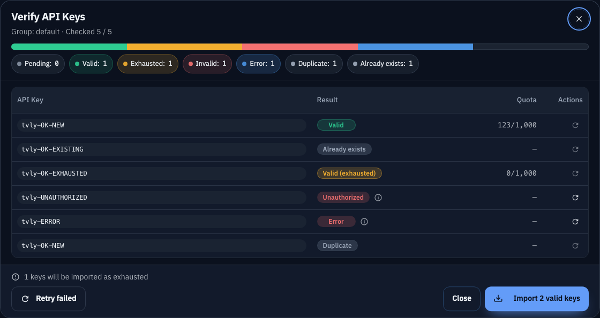

# Admin：API Keys 校验对话框与可用入库（#kgakn）

## 状态

- Status: 已完成
- Created: 2026-02-24
- Last: 2026-02-24

## 背景 / 问题陈述

- 旧流程会直接批量入库，用户无法在入库前确认 Key 的可用性与额度状态。
- 失败原因不可见，且缺少可追踪的重试入口。

## 目标 / 非目标

### Goals

- 在 `/admin` 增加 API Keys 校验对话框，先校验、后手动确认入库。
- 支持逐条状态、错误详情、批量重试与单条重试。
- 对 `remaining=0` 的可用 key 以 exhausted 状态入库。

### Non-goals

- 不改动权限模型（继续沿用 admin-only 校验）。
- 不引入后台异步任务与新的前端测试框架。

## 范围（Scope）

### In scope

- Backend:
  - `POST /api/keys/validate`
  - 扩展 `POST /api/keys/batch` 支持 `exhausted_api_keys`
- Frontend:
  - 新增 `ApiKeysValidationDialog`
  - 支持 Retry failed / Retry one / Import valid keys

### Out of scope

- 不调整现有 `/api/keys/batch` 的默认兼容行为。
- 不做 SSE 推送或后台轮询任务。

## 接口契约（Interfaces & Contracts）

### 接口清单（Inventory）

| 接口（Name）                                  | 类型（Kind） | 范围（Scope） | 变更（Change） | 契约文档（Contract Doc） | 负责人（Owner） | 使用方（Consumers） | 备注（Notes）      |
| --------------------------------------------- | ------------ | ------------- | -------------- | ------------------------ | --------------- | ------------------- | ------------------ |
| `POST /api/keys/validate`                     | HTTP API     | external      | New            | None                     | backend         | admin web           | 入库前校验         |
| `POST /api/keys/batch` (`exhausted_api_keys`) | HTTP API     | external      | Modify         | None                     | backend         | admin web           | 可选字段，保持兼容 |

## 验收标准（Acceptance Criteria）

- Given 管理员粘贴多行 key
  When 点击 Add Key
  Then 弹出校验对话框并显示分段进度、结果列表与状态统计。
- Given 存在失败项
  When 点击 Retry failed 或单条重试
  Then 仅对应条目重新校验并更新状态。
- Given 校验完成后存在可用项
  When 点击 Import valid keys
  Then 只导入可用 key，并将 exhausted 可用项标记为 exhausted。

## 实现里程碑（Milestones / Delivery checklist）

- [x] M1: Backend 实现 `POST /api/keys/validate` 与状态映射
- [x] M2: Backend 扩展 `POST /api/keys/batch` exhausted 标记
- [x] M3: Frontend 对话框与重试/导入交互落地
- [x] M4: 回归验证（cargo test + web build）

## Visual Evidence

- Storybook canvas: `Admin/Components/ApiKeysValidationDialog/MixedResults`
  - source_type: `storybook_canvas`
  - target_program: `mock-only`
  - capture_scope: `element`
  - requested_viewport: `1440-device-desktop`
  - viewport_strategy: `storybook-viewport`
  - sensitive_exclusion: `N/A`
  - submission_gate: `pending-owner-approval`
  - state: mixed validation results with an already-existing key
  - evidence_note: verifies the neutral Already exists chip appears next to Duplicate and that the import CTA excludes the existing key.

## 变更记录（Change log）

- 2026-02-24: 由 `docs/plan/kgakn:admin-api-keys-validation-dialog/PLAN.md` 迁移为规格文档。
