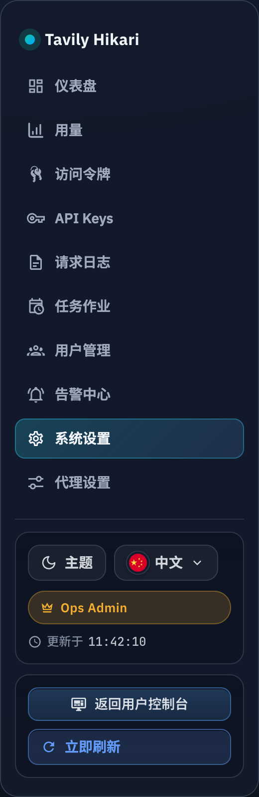

# Web 前端运行时图标内置（#kjdm5）

## 状态

- Status: 已实现（待审查）
- Created: 2026-03-15
- Last: 2026-04-08

## 背景 / 问题陈述

- 当前 Web 前端同时依赖两类 Iconify 运行时远程加载：一类是 `@iconify/react` 的字符串图标在未预载时会回退请求 Iconify API，另一类是 `PublicHome` 与 `UserConsole` 直接拼接 `https://api.iconify.design/...` 图片 URL。
- 这会让生产构建产物仍依赖公网图标服务，增加首屏不稳定性、离线不可用风险与外部请求噪音。
- 本轮目标是把所有前端运行时图标改为随构建产物一起交付，不改后端协议、不改 favicon 现有静态资源路径。

## 目标 / 非目标

### Goals

- 让前端构建产物自带当前 UI 实际使用到的运行时图标，不再依赖 Iconify 公网 API。
- 保留现有按钮、导航、状态、语言切换与 guide 品牌图标语义，不改变页面交互路径。
- 用按需注册方式收口图标依赖，只打包 `mdi`、`simple-icons`、`circle-flags` 中实际使用到的图标。

### Non-goals

- 不修改 Rust 后端接口、数据库 schema、token / quota / auth 逻辑。
- 不调整 `web/public/favicon.svg` 与其它已存在静态资源装配方式。
- 不借机重做页面样式、文案或信息架构。

## 范围（Scope）

### In scope

- `web/src/lib/icons.tsx`
- `web/src/PublicHome.tsx`
- `web/src/UserConsole.tsx`
- 其余使用 `@iconify/react` 的前端组件/页面导入路径
- `web/src/lib/icons.test.tsx`
- `web/package.json`
- `web/bun.lock`
- `docs/specs/kjdm5-web-bundled-runtime-icons/SPEC.md`
- `docs/specs/README.md`

### Out of scope

- `src/**` 后端与服务端静态资源路由。
- `web/public/favicon.svg`、`web/public/linuxdo-logo.svg` 的内容与 URL。
- 任意新的远程图标供应商或运行时 CDN 回退策略。

## 需求（Requirements）

### MUST

- 所有当前前端运行时使用的 Iconify 图标必须在本地注册并随构建产物打包。
- `PublicHome` 与 `UserConsole` 的 mobile guide dropdown 不得再拼接 `api.iconify.design` URL。
- `PublicHome` footer 的 GitHub 图标不得再走远程图片。
- 对于现有业务代码中的稳定图标字符串（例如 `mdi:trash-outline`），如上游集合无同名条目，必须在本地提供兼容别名，避免改动业务调用点。
- `bun run build` 后的 `web/dist/**` 不得再包含 `api.iconify.design`。

### SHOULD

- 图标注册层集中在单一共享模块，避免各页面重复维护图标列表。
- 品牌图标缺失时使用本地 fallback 图标，而不是保留远程 404 风险。

### COULD

- 为后续新增图标提供可复用 helper（例如 guide client 图标映射）。

## 功能与行为规格（Functional/Behavior Spec）

### Core flows

- 任意前端页面首次渲染带 Iconify 图标的组件时
  - 图标数据直接来自打包进前端 bundle 的本地注册表。
  - 页面不再发起任何 Iconify 域名请求。
- 用户打开 Public Home / User Console 的 guide mobile dropdown 时
  - 当前客户端图标与下拉箭头都由本地 `Icon` 组件渲染。
  - guide 各客户端条目继续显示原有品牌/语义图标。
- 用户访问语言切换、复制按钮、状态图标、管理端导航等已有图标位点时
  - 图标语义与布局保持不变。

### Edge cases / errors

- 若某个品牌图标不存在于计划使用的本地集合中，使用预先定义的本地 fallback 图标，不允许回退远程请求。
- 若已有业务代码引用历史字符串别名（如 `mdi:trash-outline`），共享注册层必须映射到本地可用图标数据，避免运行时缺图。

## 接口契约（Interfaces & Contracts）

### 接口清单（Inventory）

| 接口（Name）           | 类型（Kind） | 范围（Scope） | 变更（Change） | 契约文档（Contract Doc） | 负责人（Owner） | 使用方（Consumers）                                | 备注（Notes）            |
| ---------------------- | ------------ | ------------- | -------------- | ------------------------ | --------------- | -------------------------------------------------- | ------------------------ |
| Frontend icon registry | ui-runtime   | internal      | New            | None                     | web             | public/admin/console/login pages, Storybook, tests | 只影响前端图标数据来源   |
| `/api/**`              | http-api     | external      | None           | None                     | server          | web                                                | 无接口变更               |
| `/favicon.svg`         | static-asset | internal      | None           | None                     | web/server      | browser                                            | 继续沿用既有静态资源路径 |

### 契约文档（按 Kind 拆分）

None

## 验收标准（Acceptance Criteria）

- Given 用户打开 public、console、admin、login 页面
  When 首屏与关键交互完成渲染
  Then 网络面板中不出现任何 `api.iconify.design` 请求。

- Given 前端执行 `bun run build`
  When 构建完成并检查 `web/dist`
  Then 构建产物中不包含 `api.iconify.design` 字符串。

- Given 用户访问语言切换、guide 客户端选择、复制/显隐/状态按钮与管理端导航
  When 页面渲染图标
  Then 图标继续可见且语义不变，不出现空白、破图或 404。

- Given 代码仍保留 `mdi:trash-outline` 这类历史字符串
  When 组件渲染该图标
  Then 共享图标层使用本地别名映射提供兼容渲染。

- Given 本轮实现完成
  When 运行前端质量门槛
  Then `cd web && bun test` 与 `cd web && bun run build` 通过。

## 实现前置条件（Definition of Ready / Preconditions）

- 已确认本轮不修改后端协议、不修改 favicon 路径。
- 已确认需要覆盖全部运行时图标，而不是仅处理外链 ``。
- 已确认按需注册优先于整包预载入。

## 非功能性验收 / 质量门槛（Quality Gates）

### Testing

- Unit tests: `cd web && bun test`
- Build artifact check: `rg -n "api\\.iconify\\.design" -S web/dist`

### UI / Storybook (if applicable)

- Storybook 与页面运行时共享同一图标注册层，确保 story 渲染不再依赖公网 Iconify。

### Quality checks

- Build: `cd web && bun run build`

## 文档更新（Docs to Update）

- `docs/specs/README.md`: 新增本 spec 索引并在收口时写回状态/备注

## 计划资产（Plan assets）

- Directory: `docs/specs/kjdm5-web-bundled-runtime-icons/assets/`
- In-plan references: ``
- PR visual evidence source: maintain `## Visual Evidence (PR)` in this spec when PR screenshots are needed.
- If an asset must be used in impl (runtime/test/official docs), list it in `资产晋升（Asset promotion）` and promote it to a stable project path during implementation.

## Visual Evidence

- 2026-04-08：`Admin/Pages` → `System Settings` Storybook canvas（`admin-pages--system-settings`）
  - source_type: `storybook_canvas`
  - story_id_or_title: `admin-pages--system-settings`
  - evidence_note: 证明管理端侧栏里的「系统设置」入口已经恢复本地 bundle 的齿轮 SVG，不再出现空白占位。
  - 

## 资产晋升（Asset promotion）

None

## 实现里程碑（Milestones / Delivery checklist）

- [x] M1: 新建 spec 并冻结“运行时图标内置、favicon 不动、后端无改动”的边界
- [x] M2: 新增共享离线图标注册层并收口现有 Iconify React 导入
- [x] M3: PublicHome/UserConsole 改为本地图标映射并移除远程 Iconify URL
- [x] M4: 补齐自动化验证并确认构建产物无 `api.iconify.design`
- [x] M5: 完成浏览器验收、PR、checks 与 review-loop 收敛

## 方案概述（Approach, high-level）

- 新增单一 `web/src/lib/icons.tsx`，集中注册当前 UI 实际使用到的 `mdi`、`simple-icons`、`circle-flags` 图标，并复用原有稳定字符串名称。
- 对已有组件调用点尽量保持不变，只把 `Icon` 导入统一切到共享模块，降低改动面。
- 对外链 `` 图标位点改为直接渲染本地图标组件，并用共享 helper 保持 guide 客户端图标映射一致。

## 风险 / 开放问题 / 假设（Risks, Open Questions, Assumptions）

- 风险：若漏注册某个字符串图标，运行时可能重新触发 Iconify API 请求或出现缺图。
- 风险：Simple Icons / Circle Flags 图标数据升级后，个别品牌视觉可能发生轻微变化。
- 假设：当前业务中动态用户标签图标并未直接走 Iconify 远程加载路径，本轮无需扩展到任意用户自定义图标集合。

## 变更记录（Change log）

- 2026-03-15: 创建 spec，冻结运行时图标内置目标与按需注册策略。
- 2026-03-15: 完成共享图标注册层、导入路径收口与 PublicHome/UserConsole 外链图标替换。
- 2026-03-15: 通过 `cd web && bun test`、`cd web && bun run build` 与浏览器网络面板复核，确认构建产物和运行时页面均无 Iconify 外链请求。
- 2026-03-15: PR #135 全部 checks 通过，补齐 `mdi:tray-arrow-down` 离线清单与覆盖测试后，review-loop 收敛完成。
- 2026-04-08: follow-up 修复 `mdi:cog-outline` 漏登记，并补齐 `mdi:alert-circle`、`mdi:check-circle`、`mdi:circle-outline`、`mdi:lock-outline`、`mdi:map-marker-radius-outline`、`mdi:minus-circle-outline` 的本地 bundle。
- 2026-04-08: 将 Forward Proxy 相关模块残留的 `@iconify/react` 入口切回共享离线 `Icon`，重新确认 `cd web && bun run build` 与 `cd web && bun run build-storybook` 产物均不包含 `api.iconify.design`。
- 2026-04-08: 为 `Admin/Pages` 的 `System Settings` Storybook 页面补充侧栏图标显式断言，并新增本地视觉证据资产 `system-settings-nav-icon.png`。

## 参考（References）

- `web/src/PublicHome.tsx`
- `web/src/UserConsole.tsx`
- `web/src/lib/icons.tsx`
- [Iconify React bundler usage](https://github.com/iconify/iconify/blob/main/components/react/readme.md)
