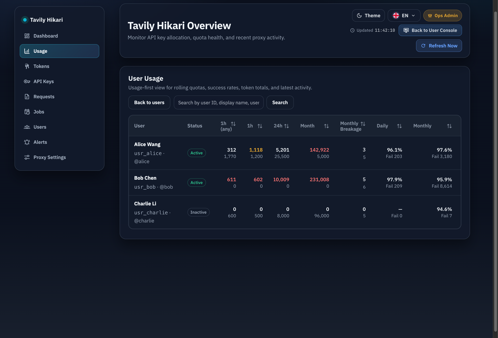
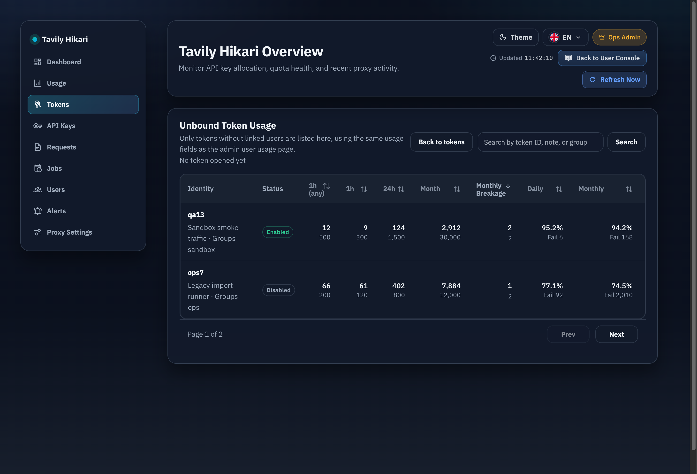
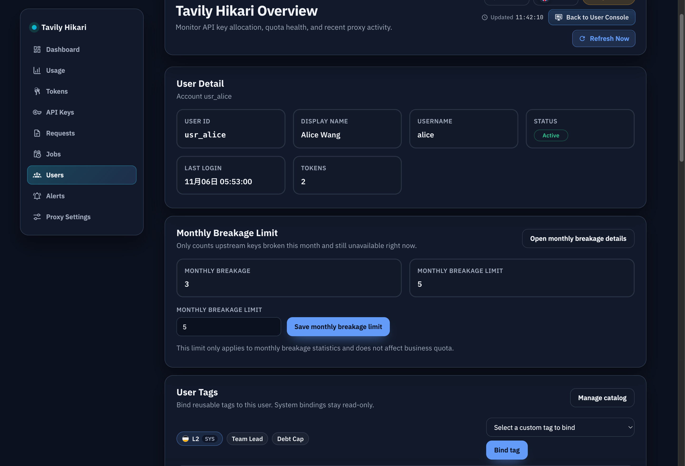
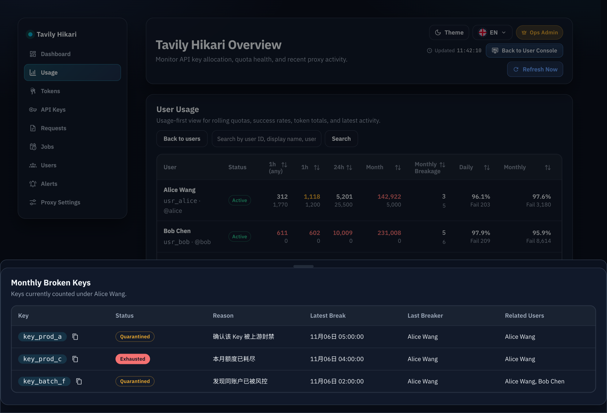
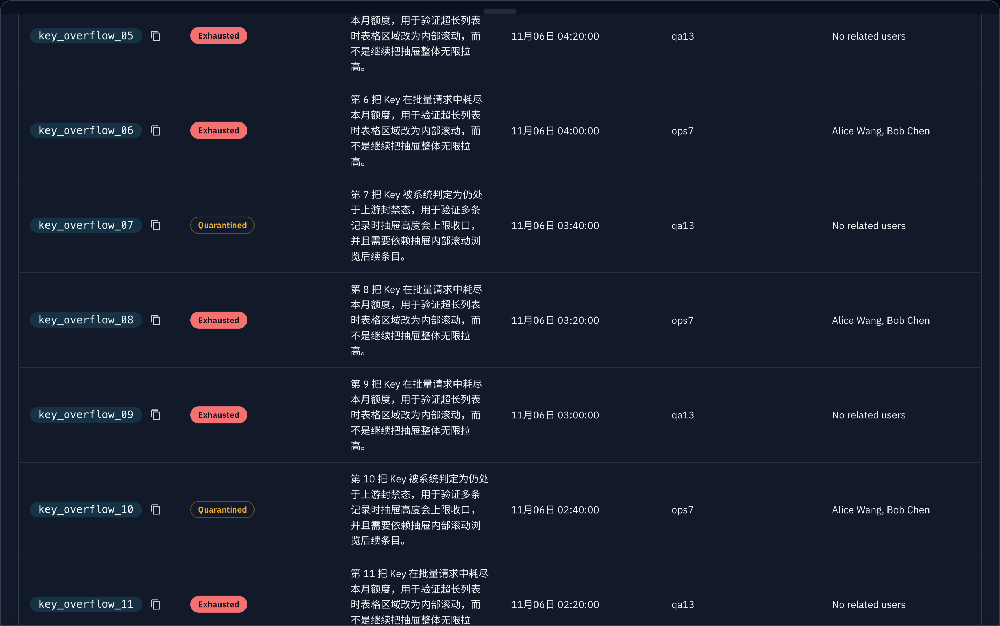

# 封禁数统计与上游 Key 归因（#ksbxf）

## 状态

- Status: 已完成（快车道）
- Created: 2026-03-27
- Last: 2026-03-30

## 背景 / 问题陈述

- 现有 `/admin/users/usage` 与 `/admin/tokens/leaderboard`（当前语义为“未关联 Token 用量列表”）只能展示请求量、额度与成功率，管理员无法直接看到“本月哪些用户或 token 把上游 Key 封禁了多少把”。
- 系统已经有 key 隔离、额度耗尽与维护审计，但缺少面向 `user` / `token` 主体的月度归因账本，无法把自动事件与管理员手动维护统一折算到具体主体头上。
- 用户详情页曾暴露单用户“封禁数限额”入口；现在改为系统设置维护全局基础值，用户附加额度隐藏。

## 目标 / 非目标

### Goals

- 在 `/admin/users/usage` 新增可排序的 `封禁数` 列，第一行显示本月唯一坏 key 数，第二行显示该用户限额；数量可点击打开抽屉查看明细。
- 在 `/admin/tokens/leaderboard` 的未关联 Token 用量列表新增可排序的 `封禁数` 列，按 token 计数；仅对有相关记录的 token 显示数量/配额，无记录显示 `—`。
- 新增 `token_api_key_bindings` 与 `subject_key_breakages` 两个持久化真相层，统一承接自动维护与管理员手动维护归因。
- 用户封禁数限额由系统设置里的全局基础值 `5` 加隐藏用户附加额度得出，附加额度可正可负且有效值不低于 `0`；用户详情不展示该附加额度；无主 token 固定限额为 `2` 且不提供配置入口。
- 抽屉明细统一展示 `keyId`、当前状态、不可用原因、最后封禁时间、最后封禁者、关联用户。

### Non-goals

- 不改公开用户控制台、PublicHome 或任何用户侧额度文案。
- 不把 `disabled`、delete、group 变更等非“进入上游封禁/失效”动作纳入封禁数。
- 不回填历史手动维护的主体级归因；仅对当前月可可靠推导的自动事件做回补。
- 不给无主 token 增加可配置限额入口。

## 范围（Scope）

### In scope

- `src/store/mod.rs`
  - 新增 `token_api_key_bindings` / `subject_key_breakages` schema、索引、upsert、查询与当前月自动事件回补。
  - 在成功计费后刷新 token ↔ key 绑定，并限制到最近 3 把 key。
  - 在管理员手动标记 exhausted / quarantine 时，对当时仍关联该 key 的全部用户与 token 做 fan-out 归因。
- `src/tavily_proxy/mod.rs`
  - 暴露封禁数计数、明细、限额查询与更新接口。
  - 在人工维护路径接入 fan-out 归因。
- `src/server/handlers/admin_resources.rs`
  - 扩展 `/api/users`、`/api/users/:id`、`PATCH /api/users/:id/broken-key-limit`、`GET /api/users/:id/broken-keys`。
  - 新增 `/api/users` 的 `monthlyBrokenCount` 排序。
  - 新增 `/api/tokens/unbound-usage` 的 `monthlyBrokenCount` 排序。
- `src/server/dto.rs` / `src/server/serve.rs`
  - 扩展 `/api/tokens/unbound-usage` 与 `GET /api/tokens/:id/broken-keys`。
- `web/src/AdminDashboard.tsx`
  - 用户用量页新增 `封禁数` 列与抽屉。
  - 未关联 Token 用量页新增可排序的 `封禁数` 列与抽屉。
  - 用户详情页不展示封禁数限额编辑区；系统设置页展示全局封禁数基础值。
- `web/src/api.ts` / `web/src/i18n.tsx`
  - 扩展前端契约与文案。
- `web/src/admin/AdminPages.stories.tsx`
  - 补 users usage、user detail、unbound token usage 的稳定 Storybook 入口与抽屉展示。

### Out of scope

- 历史月份主体级封禁回填。
- 新增单独的管理员维护页面或批量修正工具。
- token 自身的独立限额配置模型。

## 接口契约（Interfaces & Contracts）

### 接口清单（Inventory）

| 接口（Name）                            | 类型（Kind） | 范围（Scope） | 变更（Change） | 契约文档（Contract Doc）   | 负责人（Owner） | 使用方（Consumers）       | 备注（Notes）                                    |
| --------------------------------------- | ------------ | ------------- | -------------- | -------------------------- | --------------- | ------------------------- | ------------------------------------------------ |
| `GET /api/users`                        | HTTP API     | internal      | Modify         | `./contracts/http-apis.md` | server          | admin users usage         | 新增 `monthlyBrokenCount` / `monthlyBrokenLimit` |
| `GET /api/users/:id`                    | HTTP API     | internal      | Modify         | `./contracts/http-apis.md` | server          | admin user detail         | 新增 `monthlyBrokenLimit`                        |
| `PATCH /api/users/:id/broken-key-limit` | HTTP API     | internal      | Compatibility  | `./contracts/http-apis.md` | server          | internal/legacy           | 写入隐藏用户附加额度；用户详情不再调用           |
| `GET /api/users/:id/broken-keys`        | HTTP API     | internal      | Add            | `./contracts/http-apis.md` | server          | admin users usage/detail  | 用户主体封禁数抽屉明细                           |
| `GET /api/tokens/unbound-usage`         | HTTP API     | internal      | Modify         | `./contracts/http-apis.md` | server          | admin unbound token usage | 新增 nullable `monthlyBroken*` 字段              |
| `GET /api/tokens/:id/broken-keys`       | HTTP API     | internal      | Add            | `./contracts/http-apis.md` | server          | admin unbound token usage | token 主体封禁数抽屉明细                         |

### 契约文档（按 Kind 拆分）

- [contracts/README.md](./contracts/README.md)
- [contracts/http-apis.md](./contracts/http-apis.md)
- [contracts/db.md](./contracts/db.md)

## 核心口径

- 封禁数仅统计“当前 UTC 月进入上游封禁/失效，且当前仍不可用”的唯一上游 key。
- 计入口径仅包含当前 active quarantine，且 `reason_code` 属于 `account_deactivated` / `key_revoked` / `invalid_api_key`；明确排除用户业务额度耗尽、本地限流、上游用量 432、`quota_exhausted` 与 `api_keys.status = exhausted`。
- 同一主体在同一自然月内反复把同一 key 封禁，只记 1 个唯一 key；后续只刷新 `latest_break_at` 与“最后封禁者”字段。
- 自动事件写账本可保留历史 `marked_exhausted` 记录，但封禁数只读取白名单 active quarantine；额度耗尽记录不计入封禁数。
- 管理员手动维护事件的归属规则为：操作发生时，所有仍关联该 key 的用户与 token 都计入该 key。
- key 恢复 active 或 clear quarantine 后，不再出现在当前统计与抽屉明细中。

## 验收标准（Acceptance Criteria）

- Given 成功计费请求命中了某把 key
  When settlement 完成
  Then `token_api_key_bindings` 刷新 token ↔ key 绑定，并保留最近成功的 3 把 key。
- Given 请求真正触发白名单封禁/失效 quarantine
  When 当前月账本写入
  Then 触发该请求的 user 与 token 主体各获得 1 条 `(subject, key, month_start)` 唯一记录，并计入封禁数。
- Given 请求只触发业务额度耗尽、上游 432 或 `marked_exhausted`
  When 查询封禁数
  Then 不增加 `monthlyBrokenCount`，也不出现在封禁数抽屉。
- Given 管理员手动让 key 进入上游封禁/失效状态
  When fan-out 写账本
  Then 当时仍关联该 key 的全部用户与 token 都会记录该 key。
- Given 管理员手动让 key 进入上游封禁/失效状态
  When 查看用户或 token 的封禁数抽屉
  Then `最后封禁者` 归因到当时仍绑定该 key 的主体，不展示维护人的身份。
- Given 某主体本月坏 key 记录存在但对应 key 已恢复可用
  When 查询 `/api/users`、`/api/tokens/unbound-usage` 或抽屉详情
  Then 该 key 不计入数量，也不出现在返回列表中。
- Given 管理员查看 `/admin/users/usage`
  When 排序字段为 `monthlyBrokenCount`
  Then 排序按“数量、限额、userId ASC”作用于过滤后的全量命中集。
- Given 管理员查看 `/admin/tokens/leaderboard`
  When 排序字段为 `monthlyBrokenCount`
  Then 排序按“有记录优先、数量、限额、tokenId ASC”作用于过滤后的全量命中集。
- Given 管理员查看 `/admin/tokens/leaderboard`
  When token 没有任何封禁数记录
  Then `monthlyBrokenCount` 与 `monthlyBrokenLimit` 为 `null`，界面显示 `—`。
- Given 管理员在系统设置修改封禁数基础值
  When 保存成功
  Then `/api/users/:id` 与 `/api/users` 返回按 `max(0, base + hidden_delta)` 计算的 `monthlyBrokenLimit`，用户详情不出现限额编辑卡片。

## 非功能性验收 / 质量门槛（Quality Gates）

### Testing

- `cargo test`
- `cargo clippy -- -D warnings`
- `cd web && bun test`
- `cd web && bun run build`
- `cd web && bun run build-storybook`

### UI / Browser

- Storybook 至少覆盖 users usage、user detail、system settings、unbound token usage 四个落点的 `封禁数` 展示/配置。
- 浏览器验收仅使用本地 / mock upstream，不触达真实 Tavily。
- 抽屉桌面表格与移动卡片都能展示同一批字段，不出现横向溢出。

## Visual Evidence

- source_type: storybook_canvas
  story_id_or_title: admin-pages--users-usage
  state: users usage monthly broken column
  target_program: mock-only
  capture_scope: browser-viewport
  sensitive_exclusion: N/A
  submission_gate: pending-owner-approval
  evidence_note: 验证 `/admin/users/usage` 的 `封禁数` 列、双行单元格与点击入口已经落在最终页面里。
  image:
  

- source_type: storybook_canvas
  story_id_or_title: admin-pages--unbound-token-usage-monthly-broken-sort-proof
  state: unbound token usage monthly broken column
  target_program: mock-only
  capture_scope: browser-viewport
  sensitive_exclusion: N/A
  submission_gate: pending-owner-approval
  evidence_note: 验证 `/admin/tokens/leaderboard` 的未关联 token 用量页里，`封禁数` 列可排序，且默认证据源固定在按封禁数降序的状态。
  image:
  

- source_type: storybook_canvas
  story_id_or_title: admin-pages--user-detail
  state: user detail breakage limit section
  target_program: mock-only
  capture_scope: browser-viewport
  sensitive_exclusion: N/A
  submission_gate: pending-owner-approval
  evidence_note: 验证用户详情页不再展示封禁数限额编辑区。
  image:
  

- source_type: storybook_canvas
  story_id_or_title: admin-pages--users-usage-breakage-drawer-proof
  state: standard drawer with three items
  target_program: mock-only
  capture_scope: element
  sensitive_exclusion: N/A
  submission_gate: pending-owner-approval
  evidence_note: 验证抽屉在 2 到 3 条记录时按内容自然收口，并展示可点击 key 与复制按钮。
  image:
  

- source_type: storybook_canvas
  story_id_or_title: admin-pages--monthly-broken-drawer-overflow
  state: drawer body scrolled with overflow list
  target_program: mock-only
  capture_scope: element
  sensitive_exclusion: N/A
  submission_gate: pending-owner-approval
  evidence_note: 验证记录过多时抽屉高度封顶，列表区域进入内部滚动，而不是继续无限增高。
  image:
  

## 实现里程碑（Milestones / Delivery checklist）

- [x] M1: spec 与 contracts 冻结
- [x] M2: schema、绑定刷新、账本写入与查询接口完成
- [x] M3: admin users / tokens API 与排序扩展完成
- [x] M4: AdminDashboard、i18n、Storybook 展示完成
- [ ] M5: checks、浏览器验收、review-loop 与 merge-ready PR 收敛

## 风险 / 开放问题 / 假设

- 风险：手动维护 fan-out 依赖“当时仍关联该 key”的快照，因此历史人工维护无法可靠回补到主体级账本。
- 风险：当前月自动回补使用现有维护记录与现有 token/user 绑定推导，只能保证本月可恢复窗口内的可靠性。
- 假设：无主 token 只在出现封禁数记录时展示固定限额 `2`，无记录时前端直接显示 `—`。

## 变更记录（Change log）

- 2026-03-27: 创建快车道 spec，冻结封禁数口径、主体归属、用户/token 抽屉字段与限额规则。
- 2026-04-26: 修正封禁数口径，排除额度耗尽/432/exhausted；用户限额改为系统基础值 + 隐藏附加额度，用户详情删除配置卡片。
