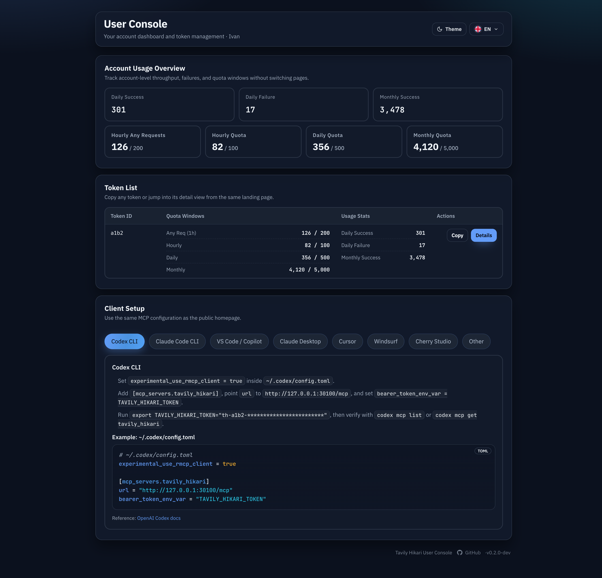

# 用户控制台单 Token 首页接入指南前移（#m1f8v）

## 状态

- Status: 已完成（5/5）
- Created: 2026-03-17
- Last: 2026-03-18

## 背景 / 问题陈述

- `2nx74` 已将 `/console` landing 合并为“账户概览 + Token 列表”单页，但客户端接入指南仍只出现在 `#/tokens/:id` detail 页。
- 当用户实际上只拥有 1 个可见 token 时，首页已经具备足够上下文，却仍需要额外进入 detail 页才能看到接入方法，增加首次接入路径。
- 多 token 用户仍需要在 detail 视图中按 token 区分接入上下文，因此本轮不能把 landing 逻辑扩展为“所有 token 都显示一份通用指南”。

## 目标 / 非目标

### Goals

- 当 `/api/user/tokens` 返回并渲染出的 token 列表长度恰好为 1 时，在 `/console` merged landing 的 Token 列表后追加客户端接入指南。
- landing guide 复用现有 detail guide 的 tabs、文案、代码片段与 Cherry Studio mock，只替换示例中的 masked token 为唯一 token 的 id。
- 保持 token detail 视图中的 guide、probe、日志与 token secret 行为不变。
- 用 Storybook 与自动化测试显式覆盖 single / multiple / empty 三种 landing token 状态。

### Non-goals

- 不修改 `/api/user/*` 后端接口、鉴权策略、hash 路由语义或 token 数据结构。
- 不把 landing guide 扩展为多 token 共享入口，也不新增用户侧 token 创建、删除、轮换能力。
- 不重做 public home 的 guide 内容或 admin 端信息架构。

## 范围（Scope）

### In scope

- `web/src/UserConsole.tsx`
- `web/src/UserConsole.stories.tsx`
- `web/src/UserConsole.stories.test.ts`
- `web/src/UserConsole.test.ts`
- `docs/specs/m1f8v-user-console-single-token-home-guide/SPEC.md`
- `docs/specs/README.md`

### Out of scope

- `src/**` 后端实现、数据库 schema 与 API contract。
- `/` public home、`/admin` 页面与登录路径。
- token detail 内 probe / logs / copy recovery 的行为设计。

## 需求（Requirements）

### MUST

- `/console` landing 在且仅在 `tokens.length === 1` 时渲染接入指南区块，位置固定在 Token 列表之后。
- landing guide 使用唯一 token 的 masked id（如 `th-a1b2-************************`），不读取 token secret 明文。
- `/console#/tokens/:id` 保留现有独立 detail guide；本轮不移除、不替换。
- Storybook controls 与 preset stories 必须能区分 `Single Token` / `Multiple Tokens` / `Empty`。
- 自动化测试必须覆盖 landing guide 的显示条件与示例 token 解析逻辑。

### SHOULD

- landing guide 采用用户控制台现有文案 `客户端接入 / 沿用首页的 MCP 配置方式即可接入`，避免与 detail 页标题混淆。
- 复用同一段 JSX/渲染逻辑，避免 detail 与 landing 出现分叉实现。

## 功能与行为规格（Functional/Behavior Spec）

### Core flows

- 用户访问 `/console#/tokens`，且 token 列表只有 1 条
  - 页面顺序为：账户概览 → Token 列表 → 客户端接入。
  - guide 中的示例 token 使用唯一 token id 的 masked 形式。
- 用户访问 `/console#/tokens`，且 token 列表多于 1 条
  - 仍只显示账户概览与 Token 列表；landing 不出现 guide。
- 用户访问 `/console#/tokens/:id`
  - detail 页继续展示原有 guide、probe、logs 与 token secret 交互。

### Edge cases / errors

- token 列表为空或仍在首屏加载时，landing 不提前渲染 guide 占位。
- 若 route 为 token detail，即便缓存中的 landing token 数量为 1，也只使用 detail token 作为 guide 示例来源。

## 验收标准（Acceptance Criteria）

- Given 用户进入 `/console#/tokens` 且只有 1 个 token
  When 页面渲染完成
  Then Token 列表下方出现 `客户端接入` 区块，并包含现有 guide tabs/片段。

- Given 用户进入 `/console#/tokens` 且有 2 个 token
  When 页面渲染完成
  Then landing 不出现 `客户端接入` 区块。

- Given 用户进入 `/console#/tokens/:id`
  When 页面渲染完成
  Then token detail 仍显示原有 guide 区块，且示例 token 取自 detail token id。

- Given 本轮实现完成
  When 运行前端质量门槛
  Then `cd web && bun test`、`cd web && bun run build`、`cd web && bun run build-storybook` 通过。

## 非功能性验收 / 质量门槛（Quality Gates）

### Testing

- `cd web && bun test`

### Build

- `cd web && bun run build`
- `cd web && bun run build-storybook`

## Visual Evidence (PR)

- 2026-03-17：使用本地静态 Storybook（端口 `30100`）验证：
  - `http://127.0.0.1:30100/iframe.html?id=user-console-userconsole--console-home-tokens-focus&viewMode=story`：single-token landing 在 Token 列表后显示 `Client Setup` 区块，示例 token 为 `th-a1b2-************************`。
  - `http://127.0.0.1:30100/iframe.html?id=user-console-userconsole--console-home-multiple-tokens&viewMode=story`：multiple-token landing 仅显示概览与两条 token 记录，不出现 guide 区块。
- 2026-03-18：补充 single-token landing 的完整 Storybook canvas 截图，证明首页顺序为“概览 → Token 列表 → Client Setup”，且 guide 示例 token 已替换为唯一 token 的 masked id。

## 实现里程碑（Milestones / Delivery checklist）

- [x] M1: 在 UserConsole landing 中增加单 token guide 显示条件与唯一 token 示例解析
- [x] M2: 抽出 guide 渲染复用，保持 detail guide 行为不变
- [x] M3: Storybook 增加 Single / Multiple / Empty token landing 验收态
- [x] M4: 新增 landing guide helper 测试并通过前端验证
- [x] M5: PR 创建并收敛到 merge-ready

## 风险 / 假设（Risks / Assumptions）

- 假设：用户“只有一个 token”的产品口径等同于当前 `/api/user/tokens` 返回并在前端渲染出的 token 数量为 1。
- 风险：若后续 landing 和 detail 分别继续演化 guide 样式，重复渲染片段可能再次产生漂移；本轮通过复用渲染函数降低该风险。

## 变更记录（Change log）

- 2026-03-17：创建 follow-up spec，冻结“single-token landing 追加 guide、多 token 不显示、detail 维持现状”的边界。
- 2026-03-17：完成 UserConsole landing 条件渲染、Storybook single/multiple/empty 场景与 helper tests，并通过 `bun test`、`bun run build`、`bun run build-storybook`。
- 2026-03-17：PR #147 rebased onto `main` 并补齐 `type:patch` + `channel:stable`；CI Pipeline、label gate 与 review-loop 已收敛到 merge-ready。
- 2026-03-18：为 single-token landing 验收态补充完整 Storybook canvas 截图并嵌入 spec。

## 参考（References）

- `docs/specs/2nx74-user-console-single-page-landing/SPEC.md`
- `docs/specs/45squ-account-quota-user-console/SPEC.md`
