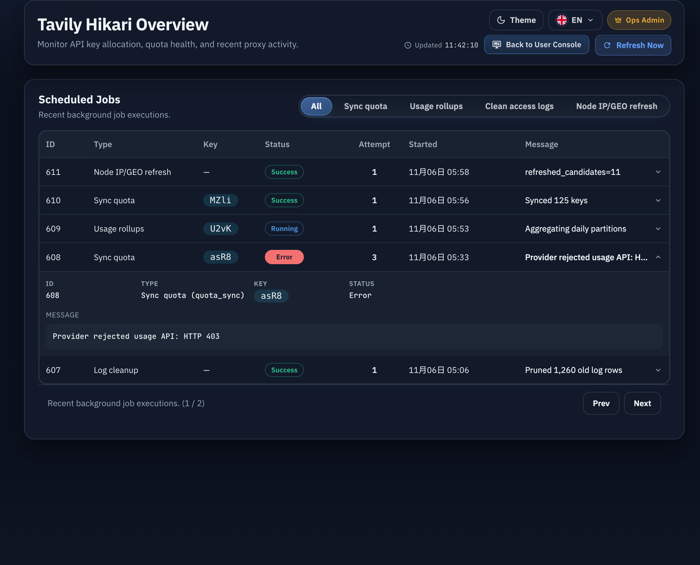

# Admin Jobs 节点 IP/GEO 刷新任务可见性（#m8p4q）

## 状态

- Status: 已完成（merge-ready）
- Created: 2026-03-19
- Last: 2026-03-19

## 背景 / 问题陈述

- 后端已经存在 `forward_proxy_geo_refresh` 定时任务，会周期性刷新非 Direct 节点的出口 IP 与地区元数据。
- 管理台“计划任务”目前只有 `全部 / 同步额度 / 用量聚合 / 清理日志` 四个筛选，没有给该任务独立入口。
- 该任务类型也缺少本地化映射，导致它即使出现在列表里，也更像一条原始内部 job type，而不是可识别的运维动作。

## 目标 / 非目标

### Goals

- 为 `/api/jobs` 增加 `group=geo` 分组，只返回 `forward_proxy_geo_refresh`。
- 管理台 jobs 区块新增独立“节点 IP/GEO 刷新”筛选入口。
- `forward_proxy_geo_refresh` 在中文和英文界面都显示为可读的本地化名称。
- 补齐最小回归测试与 Storybook fixture，避免后续再次“看起来不存在”。

### Non-goals

- 不修改 GEO refresh scheduler 的执行周期、触发时机或任务消息格式。
- 不改 `scheduled_jobs` 表结构、分页规则或 jobs 详情布局。
- 不把该任务并入 dashboard 之外的其它全新入口。

## 范围（Scope）

### In scope

- `src/lib.rs`
  - jobs 分页查询支持 `geo` 分组，并补充覆盖 `all` + `geo` 的回归测试。
- `web/src/api.ts`
  - `JobGroup` 联合类型新增 `geo`。
- `web/src/AdminDashboard.tsx`
  - jobs 筛选 tabs 新增 `geo` 选项。
- `web/src/i18n.tsx`
  - jobs filter / type 映射补齐 `forward_proxy_geo_refresh` 的中英文文案。
- `web/src/admin/AdminPages.stories.tsx`
  - jobs 模块示例加入 `forward_proxy_geo_refresh` 记录与新筛选按钮。
- `web/src/admin/DashboardOverview.stories.tsx`
  - recent jobs fixture 包含 GEO refresh 任务样例。

### Out of scope

- 任何 forward proxy 节点调度、trace/GEO 解析、24h TTL 或数据库落库语义。
- 额外新增 jobs 页面图例、说明文案或新的详情字段。

## 接口契约（Interfaces & Contracts）

- `GET /api/jobs`
  - 新增 `group=geo`。
  - `group=geo` 仅匹配 `job_type = "forward_proxy_geo_refresh"`。
  - 现有 `all / quota / usage / logs` 结果集与分页语义保持不变。
- UI 文案
  - `forward_proxy_geo_refresh` 中文显示为 `节点 IP/GEO 刷新`。
  - `forward_proxy_geo_refresh` 英文显示为 `Node IP/GEO refresh`。

## 验收标准（Acceptance Criteria）

- Given 管理员访问 `/api/jobs?group=geo`
  When 后端返回分页结果
  Then 列表中的每一项都满足 `job_type = forward_proxy_geo_refresh`，且 `total` 统计只覆盖该类型。

- Given 管理员访问 `/api/jobs?group=all`
  When 数据中同时存在 quota、logs 与 GEO refresh 任务
  Then 返回结果继续包含全部类型，不会因为新增 `geo` 分组而遗漏既有任务。

- Given 管理员打开 `/admin/dashboard`
  When 查看 jobs 筛选条
  Then 能看到独立的“节点 IP/GEO 刷新”筛选入口。

- Given 列表里存在 `forward_proxy_geo_refresh`
  When 在桌面表格、移动卡片或详情面板中渲染该记录
  Then 类型文案显示为本地化名称，而不是裸 `forward_proxy_geo_refresh`。

## 测试与证据

- `cargo test jobs_list_key_group -- --nocapture`
- `cargo test forward_proxy_geo_refresh_job_records_scheduled_job_and_skips_direct -- --nocapture`
- `cd web && bun test ./src/api.test.ts`
- `cd web && bun run build`

## Visual Evidence (PR)

- Storybook canvas: `Admin/Pages/Jobs`
- 证据说明：证明管理台 jobs 区块已显示独立的 `Node IP/GEO refresh` 筛选，并且列表中的 GEO 刷新任务已使用本地化可读文案展示。

## 里程碑

- [x] M1: 冻结 jobs GEO refresh 可见性规格
- [x] M2: 扩展后端 `geo` 分组与回归测试
- [x] M3: 前端筛选、文案与 stories 补齐
- [x] M4: PR / review-loop 收敛到 merge-ready
