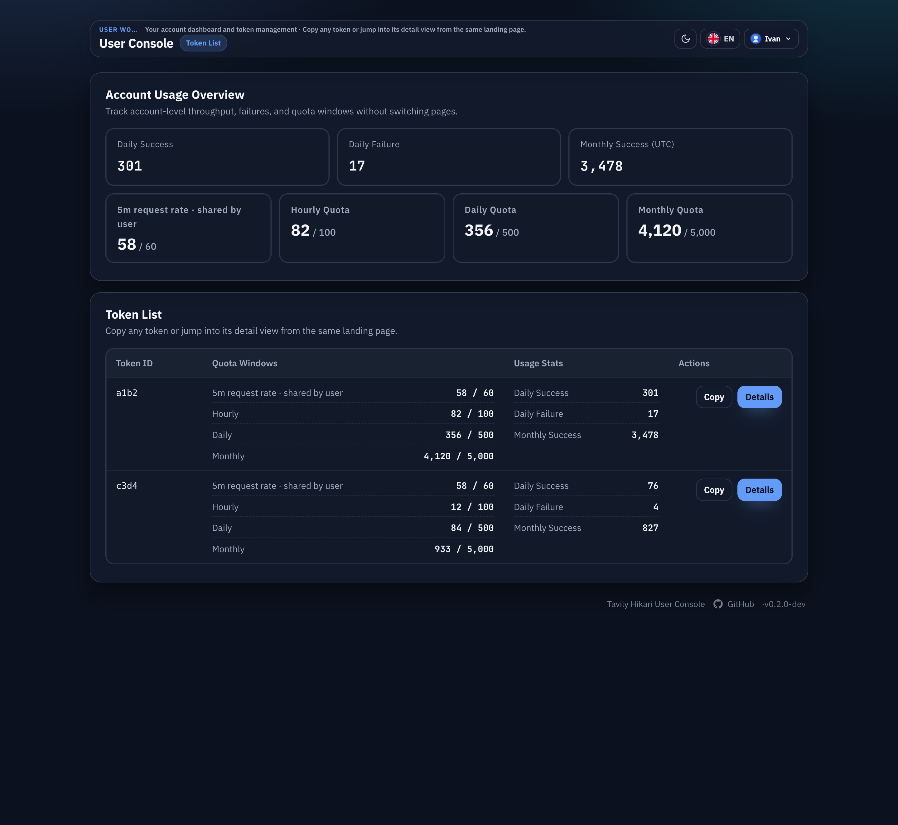
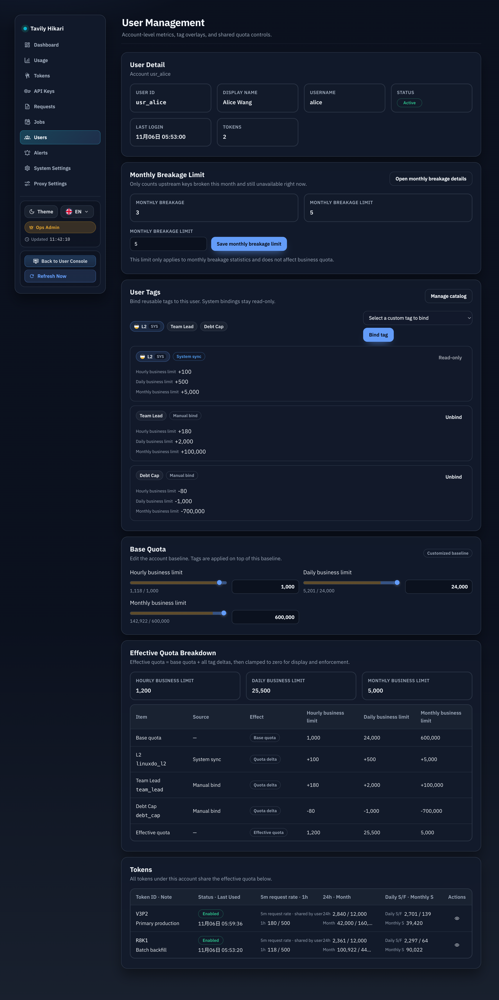
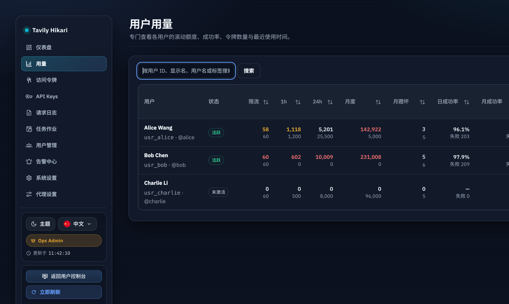
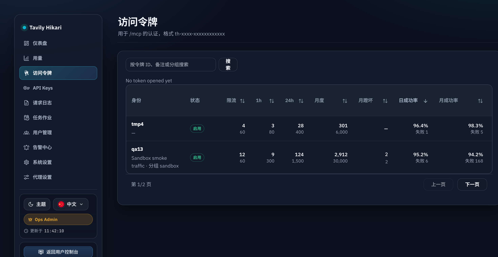
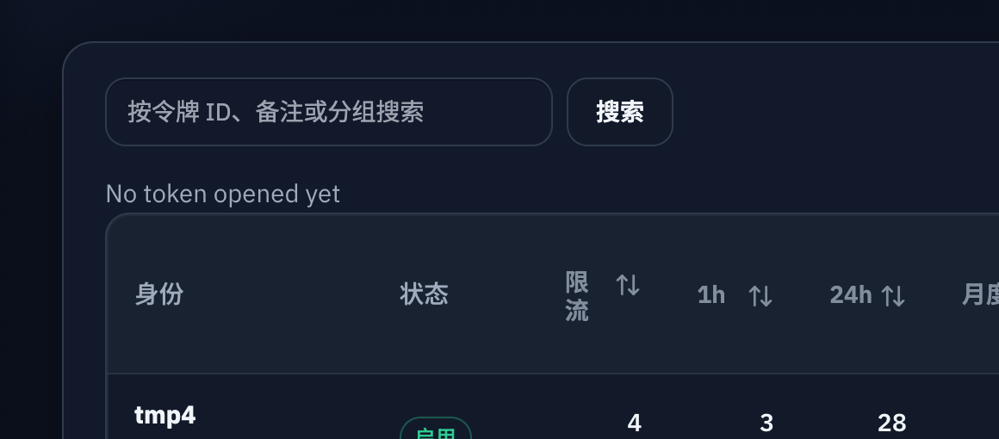

# 统一任意请求限频并改为内存统计（#q7u4m）

## 状态

- Status: 进行中（快车道）
- Created: 2026-04-13
- Last: 2026-04-13

## 背景 / 问题陈述

- 当前“任意请求频率限制”仍基于 SQLite `request_minute` bucket 做写入与聚合读取。
- 近期线上热点表明，大量 MCP control-plane 请求（`initialize` / `notifications/initialized` / `tools/list`）也会命中这条 raw limiter，导致单请求附带额外的 SQLite 读写与 WAL 压力。
- 现有 admin / user 读接口与前端仍以 `hourlyAny*` 语义暴露这条限制，和准备落地的统一 `5 分钟 60 次` 规则不一致，也让管理端继续暴露不该再编辑的 raw-limit 入口。

## Goals

- 将 raw any-request limiter 从 SQLite bucket 切换为**单实例内存滑动窗口**，统一规则固定为 **5 分钟 60 次**。
- 统一 subject 解析：绑定用户的 token 走 `user` 维度共享窗口；未绑定 token 走 `token` 维度独立窗口。
- `/mcp` 与受鉴权的 `/api/tavily/*` 都命中新 limiter，并在 429 时返回可消费的 `Retry-After` 与统一 `requestRate` 视图。
- 后端 DTO 与前端展示统一收敛到 `requestRate { used, limit, windowMinutes, scope }`；`hourlyAny*` 仅保留一轮 deprecated alias 兼容读。
- 管理端移除 raw-limit 编辑入口；legacy `hourlyAnyLimit` 写入继续兼容接收，但不再影响生效策略。

## Non-goals

- 不改业务配额（hour/day/month/credits）语义、账本真相源或 charge / settle 逻辑。
- 不重构 `request_logs` / `auth_token_logs` 双日志持久化，也不顺带处理 `summary_windows`、catalog cache 等其他热点。
- 不做多实例一致性、Redis 落地、生产部署或线上压测。
- 不删除数据库中的 `hourly_any_limit` 列，也不清扫所有历史夹具字段。

## Functional / Behavior Spec

### 1. Raw limiter backend

- 新增可扩展 limiter backend 抽象，首个实现为**精确滑动窗口**：
  - key = resolved subject (`user:<user_id>` 或 `token:<token_id>`)
  - value = 该 subject 在过去 5 分钟窗口内的请求时间戳队列
- `check(subject)`：
  - 先裁剪窗口外时间戳
  - 若当前窗口内已达到 60 次，则返回 429 verdict，并给出 `Retry-After`
  - 否则追加当前时间戳并放行
- `snapshot(subjects)`：
  - 返回内存视图，不触发 SQLite `request_minute` 写入或聚合

### 2. Subject 规则

- token 已绑定 owner 时：
  - raw limiter subject = `user`
  - 同一用户下多个 token 共享一条 5 分钟窗口
- token 未绑定 owner 时：
  - raw limiter subject = `token`
  - 不同 unbound token 互不影响

### 3. API / DTO / UI contract

- 后端对外增加统一字段：
  - `requestRate.used`
  - `requestRate.limit`
  - `requestRate.windowMinutes`
  - `requestRate.scope` (`user` | `token`)
- 继续保留 `hourlyAnyUsed` / `hourlyAnyLimit` 作为 deprecated alias：
  - 数据来源改为同一个内存 request-rate snapshot
  - 不再表示真实“hourly configurable limiter”
- 429 payload 统一返回：
  - `requestRate`
  - `Retry-After`
  - 文案改为 rolling `5m` window 语义
- Admin / User Console 只展示新 request-rate 文案，不再显示或编辑 “hourly any”。

### 4. Legacy write compatibility

- `PATCH /api/users/:id/quota` 若收到 `hourlyAnyLimit`：
  - 继续接收，不返回 4xx
  - 后端忽略该字段，不改变 raw limiter 生效值
- 用户标签 / quota 相关 UI 不再暴露 raw-limit 可编辑入口；若 legacy payload 仍带 `hourlyAnyDelta`，前端本轮固定写 `0`。

## 范围（Scope）

### In scope

- `src/tavily_proxy/mod.rs`
  - 新内存 limiter backend、subject 解析、snapshot 路径
- `src/server/proxy.rs` / `src/server/handlers/tavily.rs`
  - raw limiter 429 输出、`Retry-After`、`requestRate`
- `src/server/handlers/user.rs` / `src/server/handlers/admin_resources.rs` / `src/server/dto.rs`
  - `requestRate` DTO 与 legacy alias 兼容
- `web/src/api.ts` / `web/src/requestRate.ts`
  - 新 request-rate 类型与展示 helper
- `web/src/UserConsole.tsx` / `web/src/AdminDashboard.tsx`
  - request-rate 展示替换旧 hourly-any 文案，移除 raw-limit 编辑入口
- `web/src/UserConsole.stories.tsx` / `web/src/admin/AdminPages.stories.tsx`
  - Storybook mock data 与展示面同步到新 contract
- `src/tests/**` / `src/server/tests.rs`
  - raw limiter 行为、429 / `Retry-After`、legacy 写兼容、subject 共享/隔离测试

### Out of scope

- `request_logs` / `auth_token_logs` 行为、表结构与历史回填
- 业务 quota 读缓存或 credits 侧优化
- Redis / multi-instance limiter backend

## Acceptance

- 同一 subject 任意连续 5 分钟内前 60 次请求放行，第 61 次返回 429，并带有效 `Retry-After`。
- 绑定到同一用户的两个 token 共享 limiter；两个 unbound token 互不干扰。
- `/mcp initialize`、`/mcp notifications/initialized`、`/mcp tools/list` 与受鉴权 `/api/tavily/*` 都命中新 limiter。
- raw any-request limiter 不再读写 SQLite `request_minute` bucket，也不再依赖对应聚合查询。
- admin / user 读接口稳定输出 `requestRate`，前端只展示新 request-rate 语义。
- `hourlyAnyLimit` legacy 写入不会 4xx，但也不会再改变 raw limiter 行为。

## Validation Plan

- Rust:
  - 单元测试滑动窗口边界、`Retry-After` 与 subject 共享/隔离
  - 集成测试覆盖 `/mcp` 与 `/api/tavily/*` raw limiter 命中
  - admin quota PATCH 忽略 `hourlyAnyLimit`
- Web:
  - `bun run build`
  - Storybook 场景验证 admin / user request-rate 展示与 raw-limit 编辑入口移除

## Visual Evidence

- source_type: storybook_canvas
  story_id_or_title: `user-console-userconsole--console-home-multiple-tokens`
  state: `ConsoleHomeMultipleTokens`
  evidence_note: User Console 已切到 `5m request rate` 语义，账户总览卡片与 token 列表均显示 `requestRate`，不再依赖旧 raw hourly-any 文案。
  PR: include

- source_type: storybook_canvas
  story_id_or_title: `admin-pages--user-detail`
  state: `UserDetail`
  evidence_note: Admin User Detail 展示 `5m request rate · shared by user`，quota 面板只保留业务配额编辑入口，raw-limit 编辑入口已移除。

- source_type: storybook_canvas
  story_id_or_title: `admin-pages--users-usage`
  state: `UsersUsage`
  evidence_note: 用户用量表头已收敛为 `限流 | 1h` 短标签，避免把 5 分钟防刷窗口写成长句，同时继续和业务额度列分开表达。
  PR: include

- source_type: storybook_canvas
  story_id_or_title: `admin-pages--unbound-token-usage`
  state: `UnboundTokenUsage`
  evidence_note: 未绑定访问令牌列表也统一为 `限流 | 1h` 命名，和用户用量页保持一致。

- source_type: storybook_canvas
  story_id_or_title: `admin-pages--unbound-token-usage`
  state: `UnboundTokenUsage search controls`
  evidence_note: 搜索按钮在中文文案下已固定为单行展示，输入框收缩、按钮不再被挤成竖排。
  PR: include

