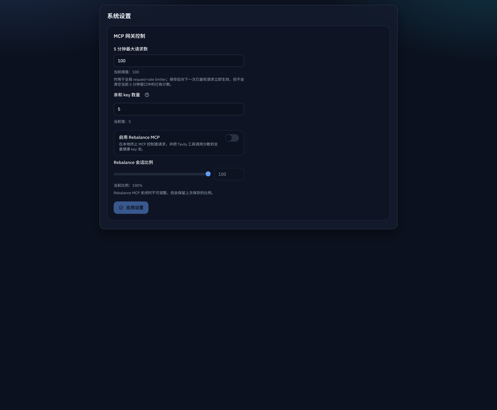
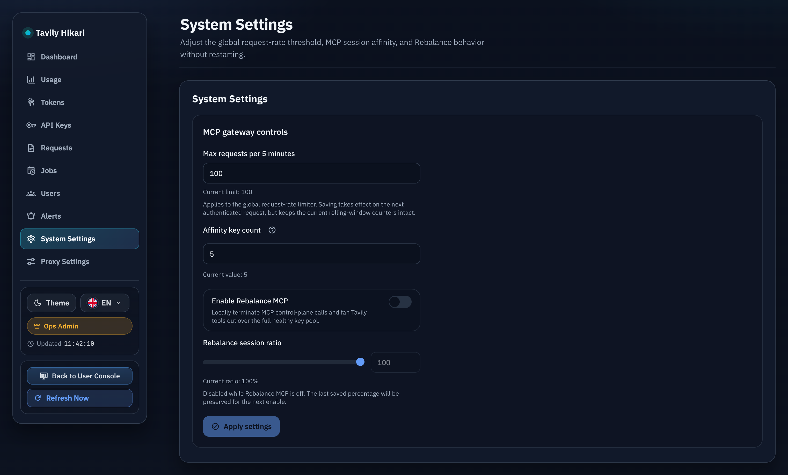

# 系统设置页增加全局请求频率阈值（#tjhrr）

## 状态

- Status: 待实现
- Created: 2026-04-19
- Last: 2026-04-19

## 背景 / 问题陈述

- `q7u4m` 已把 raw request-rate limiter 收敛为单实例内存滑动窗口，并统一固定为 `5 分钟 / 100 次`。
- 当前 Admin `System Settings` 只暴露 `MCP session affinity` 与 `Rebalance MCP`，运维无法在不重启服务的情况下调整全局 request-rate 阈值。
- 用户 / 标签 / quota 面板已经移除了 raw-limit 编辑入口，本轮不应回退到分散配置，而应新增唯一的系统级配置入口。

## 目标 / 非目标

### Goals

- 在 Admin `System Settings` 中新增“5 分钟窗口内最大请求数”设置，并持久化到现有 `SystemSettings` 契约。
- 修改后无需重启服务；下一次已鉴权 `/mcp` 与 `/api/tavily/*` 请求立即按新阈值判定。
- 保持 `5` 分钟窗口固定不变，继续沿用 `requestRate` DTO 与 `hourlyAny*` 兼容读别名。
- 补齐 Storybook / 浏览器回归与视觉证据，并按快车道推进到 merged + cleanup。

### Non-goals

- 不开放 request-rate 窗口时长配置。
- 不恢复 per-user、per-tag、per-token 的 raw-limit 编辑入口。
- 不改动业务 quota（hour/day/month/credits）语义或多实例一致性方案。

## 范围（Scope）

### In scope

- `SystemSettings` Rust/TS 契约新增 `requestRateLimit`。
- `GET /api/settings` 与 `PUT /api/settings/system` 读写新字段，并兼容旧 payload 缺省该字段。
- 内存 request-rate limiter 支持运行时热更新阈值，且不清空当前窗口计数。
- Admin `System Settings` 表单、文案、Storybook、render/browser 回归、spec 视觉证据。

### Out of scope

- `requestRate.windowMinutes` 从 `5` 改为可配置。
- 新增 Redis / 多实例共享状态。
- 重新设计用户详情、标签页或其他 quota UI。

## 需求（Requirements）

### MUST

- `requestRateLimit` 必须是正整数；前端限定为 JS safe integer，后端限定 `>= 1`。
- 旧客户端 `PUT /api/settings/system` 未携带 `requestRateLimit` 时，服务端必须保留现值。
- request-rate 429 payload、默认视图、snapshot fallback 必须反映当前生效阈值，而不是硬编码 `100` 之外的旧默认值。
- 保存设置后不得清空现有内存窗口计数；仅切换阈值。

### SHOULD

- 系统设置页显示当前阈值与适用范围提示，和现有 `System Settings` 交互风格一致。
- Storybook 页面应覆盖默认、已修改、保存中、非法值、刷新回显等稳定状态。

### COULD

- 在系统设置帮助文案中补充“仅对新请求立即生效，保留当前窗口计数”的说明。

## 功能与行为规格（Functional/Behavior Spec）

### Core flows

- Admin 打开 `/admin/system-settings` 时，现有系统设置接口返回 `requestRateLimit`，页面展示当前“5 分钟窗口内最大请求数”。
- Admin 修改阈值并保存后，服务端持久化该值、更新运行时 limiter 配置，并返回最新 `SystemSettings`。
- 同一用户下多个 token 继续共享 `user` scope 请求窗口；未绑定 token 继续按 `token` scope 独立计数，仅比较阈值发生变化。
- request-rate snapshot、用户/令牌详情、429 payload 中的 `requestRate.limit` 与兼容 `hourlyAnyLimit` 均返回当前生效阈值。

### Edge cases / errors

- 非法值（空、非整数、`< 1`、超出 JS safe integer）在前端阻止提交，并展示 inline error。
- 服务端收到非法值返回 `400`，错误信息包含 `request_rate_limit` 范围约束。
- 旧 payload 缺少 `requestRateLimit` 时，服务端按当前已保存设置保存其他字段，不回退到默认 `100`。
- 下调阈值时，当前窗口内已累积请求数保持不变；后续请求按新阈值立即判定。

## 接口契约（Interfaces & Contracts）

### 接口清单（Inventory）

| 接口（Name）                      | 类型（Kind） | 范围（Scope） | 变更（Change） | 契约文档（Contract Doc） | 负责人（Owner） | 使用方（Consumers）                          | 备注（Notes）                            |
| --------------------------------- | ------------ | ------------- | -------------- | ------------------------ | --------------- | -------------------------------------------- | ---------------------------------------- |
| `SystemSettings.requestRateLimit` | DTO          | external      | Modify         | None                     | backend + web   | admin settings UI, request-rate views        | 正整数，全局 request-rate 阈值           |
| `GET /api/settings`               | HTTP API     | external      | Modify         | None                     | backend         | admin UI                                     | `systemSettings` 新增 `requestRateLimit` |
| `PUT /api/settings/system`        | HTTP API     | external      | Modify         | None                     | backend         | admin UI / legacy clients                    | `requestRateLimit` 缺省时保留现值        |
| 内存 request-rate limiter 配置    | runtime      | internal      | Modify         | None                     | backend         | `/mcp`, `/api/tavily/*`, dashboard snapshots | 运行时热更新，不清空窗口计数             |

### 契约文档（按 Kind 拆分）

None

## 验收标准（Acceptance Criteria）

- Given Admin 打开系统设置页
  When `GET /api/settings` 返回系统设置
  Then 页面能展示 `requestRateLimit` 当前值，并提示该值作用于固定 `5` 分钟窗口。
- Given Admin 将阈值从 `100` 改为 `80`
  When 保存成功
  Then 后续已鉴权 `/mcp` 与 `/api/tavily/*` 请求的 request-rate 判定使用 `80`，无需重启服务。
- Given 旧客户端只提交 `mcpSessionAffinityKeyCount` / `rebalance*`
  When `PUT /api/settings/system` 不带 `requestRateLimit`
  Then 服务端保留已保存的 `requestRateLimit` 不变。
- Given 当前窗口内已使用 `70` 次请求，阈值从 `80` 下调到 `60`
  When 下一次请求到达
  Then 服务端立即按新阈值返回 429，并给出更新后的 `requestRate.limit=60` 与正确 `Retry-After`。
- Given 用户详情、令牌详情、用户/未绑定 token 用量视图读取 request-rate snapshot
  When 对应 subject 当前无计数
  Then fallback 视图中的 `requestRate.limit` 与 `hourlyAnyLimit` 也必须反映当前系统级阈值。

## 实现前置条件（Definition of Ready / Preconditions）

- follow-up spec 已明确只新增系统级阈值，不回退用户级 raw-limit 编辑：已满足
- `SystemSettings` 契约扩展方案、旧 payload 兼容策略、热更新语义已明确：已满足
- Storybook / 浏览器回归仍可复用现有 system-settings 页面入口：已满足

## 非功能性验收 / 质量门槛（Quality Gates）

### Testing

- Rust unit/integration tests：system settings 读写、非法值拒绝、旧 payload 兼容、request-rate 热更新与 429 合同。
- Frontend tests：`SystemSettingsModule` render/story tests、API runtime contract tests。
- Browser E2E：扩展 `tests/e2e/system_settings_browser_e2e.ts` 验证新字段编辑、保存与刷新回显。

### UI / Storybook (if applicable)

- Stories to add/update: `web/src/admin/SystemSettingsModule.stories.tsx`, `web/src/admin/AdminPages.stories.tsx` / runtime-backed system settings canvas。
- Docs pages / state galleries to add/update: 复用现有 `Admin/SystemSettingsModule` 与 `Admin/Pages / System Settings` 入口。
- `play` / interaction coverage to add/update: 现有 system settings 以 render/browser 回归为主，本轮至少补齐状态覆盖与浏览器回显。

### Quality checks

- `cargo test`
- `cargo clippy -- -D warnings`
- `cargo fmt --check`
- `cd web && bun test`
- `cd web && bun run build`
- `bun tests/e2e/system_settings_browser_e2e.ts`

## 文档更新（Docs to Update）

- `docs/specs/README.md`: 新增本 spec 索引。
- `docs/specs/q7u4m-unified-request-rate-memory-limiter/SPEC.md`: 作为 follow-up 关联，在实现说明或 change log 中保留引用即可（无需直接改写旧 spec 目标）。

## 计划资产（Plan assets）

- Directory: `docs/specs/tjhrr-system-request-rate-limit-setting/assets/`
- In-plan references: ``
- Visual evidence source: maintain `## Visual Evidence` in this spec when owner-facing or PR-facing screenshots are needed.

## Visual Evidence

- Evidence captured from Storybook on commit `c1a7d50a03795b0341bdad428e2fa6c1b71df5df`.
- Storybook coverage:
  - `web/src/admin/SystemSettingsModule.stories.tsx`
  - `web/src/admin/AdminPages.stories.tsx`

- source_type: storybook_canvas
  story_id_or_title: `Admin/SystemSettingsModule > Default`
  capture_scope: element
  requested_viewport: `none`
  viewport_strategy: `storybook-viewport`
  evidence_note: 验证系统设置模块默认展示 `100` 的全局 request-rate 阈值，以及新的“5 分钟最大请求数”输入与当前阈值 copy。
  image:
  

- source_type: storybook_canvas
  story_id_or_title: `Admin/Pages > SystemSettings`
  capture_scope: element
  requested_viewport: `1440-device-desktop`
  viewport_strategy: `storybook-viewport`
  evidence_note: 验证 route-level Admin System Settings 页面在导航语境下展示新的全局 request-rate 阈值控件。
  image:
  

## 资产晋升（Asset promotion）

None

## 实现里程碑（Milestones / Delivery checklist）

- [x] M1: 新增 spec 与 `SystemSettings.requestRateLimit` 契约、README 索引
- [x] M2: 后端持久化 / 热更新 request-rate 阈值并打通 `GET/PUT /api/settings`
- [x] M3: Admin System Settings UI、i18n 与 Storybook 覆盖完成
- [x] M4: Rust / Web / Browser E2E 回归通过
- [ ] M5: 视觉证据、PR、合并与 cleanup 完成

## 方案概述（Approach, high-level）

- 在现有 `SystemSettings` 上扩一项全局 request-rate 阈值，并复用现有 meta 存储与系统设置接口。
- request-rate limiter 改为“固定窗口分钟数 + 可热更新 limit”的运行时配置，保持当前 subject 解析与窗口状态不变。
- Admin UI 复用现有系统设置卡片布局，新增数值输入、校验与文案，不新增独立页面或用户级配置入口。

## 风险 / 开放问题 / 假设（Risks, Open Questions, Assumptions）

- 风险：旧客户端省略新字段时若直接反序列化到必填结构体，可能误把默认值写回，需要显式做 partial-update 兼容。
- 风险：request-rate 默认 fallback 分散在多个 handler / DTO 构造点，需要统一改为读取 proxy 当前设置，避免出现 100/旧值混杂。
- 假设：当前仓库只运行单实例内存 limiter，系统级阈值不需要跨进程同步。

## 变更记录（Change log）

- 2026-04-19: 创建 follow-up spec，锁定“系统级 requestRateLimit + 5 分钟固定窗口 + 旧 payload 兼容 + 热更新 + 视觉证据”执行合同。

## 参考（References）

- `docs/specs/q7u4m-unified-request-rate-memory-limiter/SPEC.md`
- `docs/specs/xm3dh-rebalance-mcp-gateway/SPEC.md`
