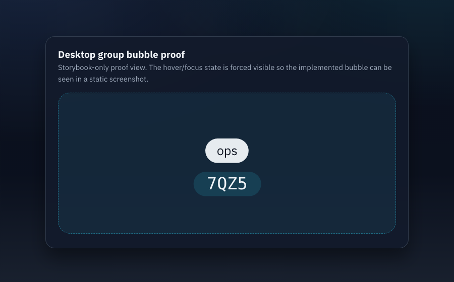
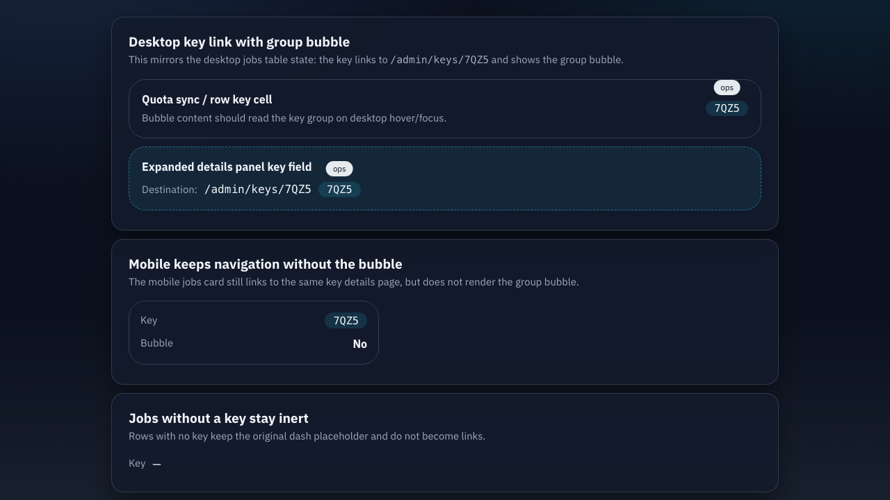
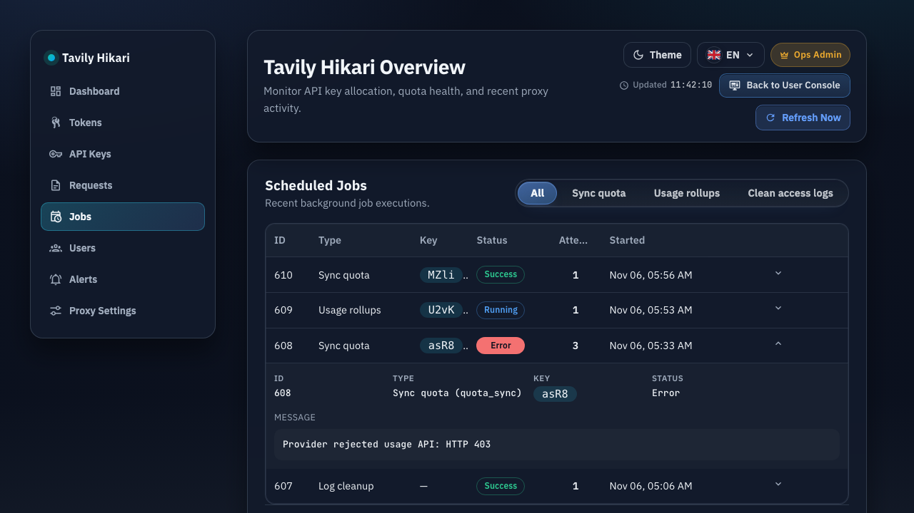

# Admin Jobs Key 跳转与分组气泡（#tz3ce）

## 状态

- Status: 部分完成（3/4）
- Created: 2026-03-13
- Last: 2026-03-13

## 背景 / 问题陈述

- `/admin/jobs` 的 Key 列当前只是纯文本，管理员在排查失败任务时还需要手动切到 API Keys 模块再查详情，路径过长。
- 任务记录已经携带 `key_id`，但 jobs 数据接口没有返回对应分组名，前端无法在 jobs 列表直接给出“这把 key 属于哪个组”的即时提示。
- 现有 admin 页面已经具备 key 详情路由与通用 tooltip/pill 样式，本次只需把 jobs 区块接上同样的运维跳转与提示能力。

## 目标 / 非目标

### Goals

- 让 `/admin/jobs` 桌面表格中的 Key 列支持直接进入 `/admin/keys/:id`。
- 让 jobs 展开详情中的 Key 与主表保持同样的跳转能力。
- 让桌面端 jobs Key 在 hover / keyboard focus 时显示 key 的分组气泡；无分组时显示本地化“未分组/Ungrouped”。
- 让移动端 jobs 卡片中的 Key 也支持进入 key 详情，但不引入 tooltip 交互。
- 扩展 `/api/jobs`，在有 `key_id` 时同步返回对应 key 的 group 信息，避免列表渲染时额外请求 key 详情。

### Non-goals

- 不修改 `/admin/jobs` 以外页面的 Key 展示模式。
- 不调整 Key 详情页内容、布局或查询逻辑。
- 不为移动端新增 hover/focus 气泡或额外浮层交互。
- 不变更 `scheduled_jobs` 表结构，也不新增数据库迁移。

## 范围（Scope）

### In scope

- `src/lib.rs`
  - jobs 查询结果补充 `key_group` 字段，并在分页查询中关联 `api_keys.group_name`。
- `src/server/dto.rs` / `src/server/handlers/admin_auth.rs`
  - `/api/jobs` 响应透传 `keyGroup`。
- `web/src/api.ts`
  - `JobLogView` 类型补充 `keyGroup`。
- `web/src/AdminDashboard.tsx`
  - jobs 主表、展开详情、移动端卡片的 Key 渲染统一为可跳转入口。
- `web/src/index.css`
  - jobs Key 链接与桌面端分组气泡样式。
- `web/src/admin/AdminPages.stories.tsx`
  - jobs mock 数据补齐 `key_group` / `keyGroup` 样例。
- tests
  - Rust jobs 查询测试；前端 API/渲染测试。

### Out of scope

- Dashboard recent jobs 卡片、Requests 列表或其他模块的 Key 提示统一。
- 任何生产上游联调；验证继续限定本地 / mock upstream。

## 实现合同（Implementation Contract）

- `GET /api/jobs` 的 item 在 `key_id != null` 时新增 `keyGroup` 字段：
  - 若该 key 有分组，返回分组名字符串。
  - 若该 key 未分组，返回 `null`。
  - 若该 job 没有关联 key，继续返回 `key_id = null` 且 `keyGroup = null`。
- jobs 主表与展开详情中的 Key 使用 anchor + SPA 导航：
  - 普通左键点击走 `navigateKey(id)`。
  - 修饰键点击、新标签页打开等浏览器默认行为保持不变。
- 桌面端 jobs Key 使用 pill 样式与 tooltip：
  - hover 与 focus-within 都能显示气泡。
  - 气泡内容优先显示 `keyGroup`，否则显示现有本地化“未分组/Ungrouped”。
- 移动端 jobs Key 仅保留跳转，不显示 tooltip 容器或 `data-tip`。
- `key_id == null` 的 jobs 行与移动端卡片继续显示 `—`，不创建空链接。

## 验收标准（Acceptance Criteria）

- Given `/api/jobs` 返回一条有关联 key 且 key 分组为 `ops`
  When 前端拉取 jobs 列表
  Then 该条记录可读取到 `keyGroup = "ops"`。

- Given `/admin/jobs` 桌面表格中存在 `key_id = "7QZ5"` 的任务
  When 管理员点击该 Key
  Then 当前页面进入 `/admin/keys/7QZ5`。

- Given `/admin/jobs` 桌面表格中存在有分组或未分组的 key
  When 鼠标悬浮或键盘 focus 到 Key pill
  Then 页面显示对应分组气泡；未分组时显示本地化未分组文案。

- Given `/admin/jobs` 的展开详情中存在 `key_id`
  When 管理员点击详情中的 Key
  Then 详情区使用与主表一致的 key 跳转和桌面端气泡行为。

- Given `/admin/jobs` 移动端卡片中存在 `key_id`
  When 管理员点击 Key
  Then 页面进入对应 key 详情，且页面不显示 tooltip 气泡。

- Given job 的 `key_id = null`
  When 渲染桌面表格、展开详情或移动端卡片
  Then 界面继续显示 `—`，不生成链接，也不显示组名提示。

## 质量门槛（Quality Gates）

- `cargo test`
- `cd web && bun test`
- `cd web && bun run build`
- 浏览器验证 `/admin/jobs` 桌面跳转、桌面气泡、移动端无气泡但可跳转。

## 当前验证记录

- `2026-03-13`：`cargo test` 通过。
- `2026-03-13`：`cd web && bun test` 通过。
- `2026-03-13`：`cd web && bun run build` 通过。
- `2026-03-13`：`cd web && bun run build-storybook` 通过；新增 Storybook 证据故事后，可从 SB 直接截图展示桌面端气泡、移动端无气泡与空 key 占位三种状态。
- `2026-03-13`：本地启动当前 worktree 的后端 `http://127.0.0.1:58089`（`DB_PATH=tavily_proxy_jobs_key_link.db`、`--dev-open-admin`），通过 `POST /api/keys` + `POST /api/keys/:id/sync-usage` 生成 jobs 记录，`GET /api/jobs?page=1&per_page=3` 返回 `keyGroup` 字段并可观察到 `quota_sync/manual` 任务带有 `keyId` + `keyGroup`。
- `2026-03-13`：由于标准端口 `127.0.0.1:58087` / `127.0.0.1:55173` 已被另一 worktree 占用，当前回合未能用浏览器 MCP 打开当前 worktree 的 UI 做最终可视化复核；需在释放标准端口或切换代理后补做。

## Visual Evidence (PR)

## 里程碑

- [x] M1: 规格冻结与 jobs API 合同补齐
- [x] M2: 后端 jobs 查询返回 `key_group`
- [x] M3: 前端 jobs Key 跳转与桌面气泡落地
- [ ] M4: 测试、浏览器验证与 review-loop 收敛
