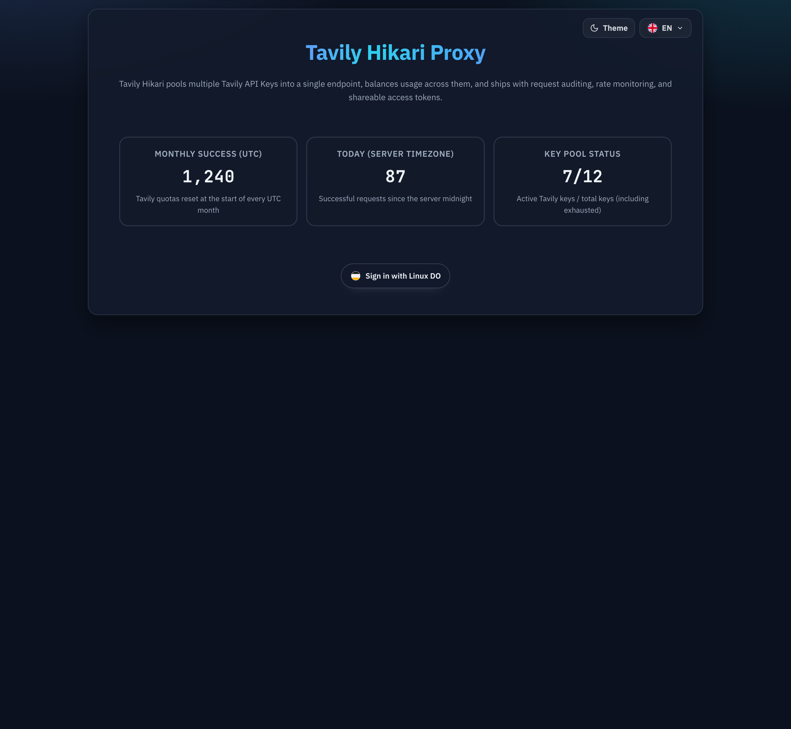
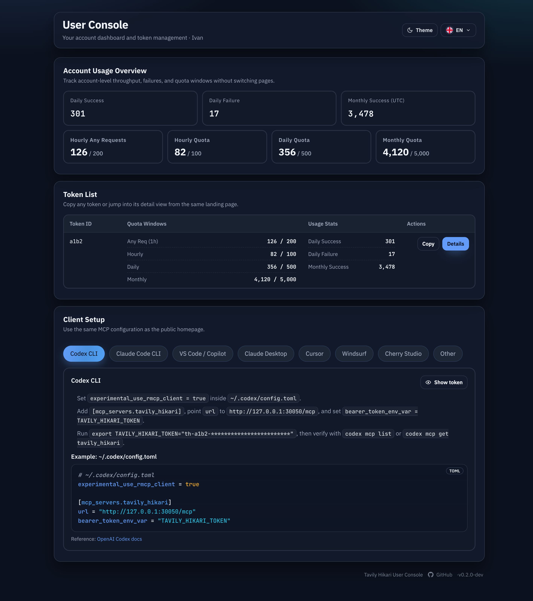

# 统计时区口径统一（#tz9kq）

## 状态

- Status: 已实现（待审查）
- Created: 2026-04-03
- Last: 2026-04-03

## 背景 / 问题陈述

- 当前系统对“今日 / 本月 / 配额”混用了多套时间口径：部分 admin 统计按服务器本地日切分，部分用户侧统计按 UTC 今日切分，日配额还保留过 rolling 24h 语义。
- 用户会在 `/console`、public 首页、token 详情与管理端之间看到彼此不一致的统计结果，难以判断 0 点分界线到底落在哪个时区。
- 现有用户界面也没有稳定、明确地标注哪些指标是 UTC 月口径，导致“本月”容易被误解成浏览器本地自然月。

## 目标 / 非目标

### Goals

- 统一并冻结三类统计口径：
  - 月度及以上：UTC。
  - 服务端 / 管理端的日维度及以下：服务器时区。
  - 用户侧“今日”类展示：浏览器时区，并通过显式 `today_start` / `today_end` 传给后端。
- 将日配额从 rolling 24h 改为服务器时区自然日。
- 让用户侧空间充裕的位置显式标注 `UTC` 月口径，避免把“今日”额外塞满说明文案。
- 保持旧客户端兼容：未传显式窗口时，用户接口回退到服务器时区今日窗口。

### Non-goals

- 不引入任意自定义统计区间，也不把 `today_start` / `today_end` 扩展成通用报表查询接口。
- 不修改 admin 紧凑列表、紧凑卡片的文案布局来强行补时区说明。
- 不改变小时配额的既有窗口语义。

## 范围（Scope）

### In scope

- `src/models.rs`
  - 统一显式今日窗口解析与服务器自然日窗口 helper。
  - 校验 `today_start` / `today_end` 的 ISO8601+offset 合同。
- `src/tavily_proxy/mod.rs`
  - `/api/summary/windows` 的 month 窗口切到 UTC 月。
  - 用户 dashboard / token / public metrics 的 daily 聚合接受显式窗口。
  - token/account 日配额计数切到服务器自然日 bucket。
- `src/store/mod.rs`
  - daily log rollup / quota repair / metrics query 对齐新窗口语义。
- `src/server/handlers/*.rs`
  - 用户侧与 public HTTP/SSE 接口接受 `today_start` / `today_end`。
  - 非法参数返回 `400` 与明确错误文本。
- `web/src/*`
  - 浏览器本地今日窗口 helper。
  - `/console`、public 首页、token metrics、public SSE 全部显式透传今日窗口。
  - 仅在用户侧宽松区域标注 `UTC` 月口径。
- `web/src/*.stories*`
  - 维持 Storybook proof，并补齐 UTC 月文案断言。

### Out of scope

- 季度 / 年度等新增报表页面。
- admin 页面额外的时区说明浮层或帮助文档。

## 接口契约（Interfaces & Contracts）

- [contracts/http-apis.md](./contracts/http-apis.md)

## 验收标准（Acceptance Criteria）

- Given 调用 `/api/summary/windows`
  When 读取 `today` / `yesterday` / `month`
  Then `today` 与 `yesterday` 仍按服务器本地 0 点切分，而 `month` 按 UTC 月初切分。

- Given 用户侧页面在浏览器本地时区生成今日 `[start, end)`
  When 调用 `/api/user/dashboard`、`/api/user/tokens*`、`/api/public/metrics`、`/api/token/metrics` 或对应 SSE
  Then daily success/failure 仅受该显式窗口影响，monthly success 保持 UTC 月口径。

- Given 用户接口缺失 `today_start` 或 `today_end`，或传入无 offset / 非自然日窗口
  When 请求到达后端
  Then 返回 `400` 与明确错误信息；若两个参数都缺失，则回退到服务器时区今日窗口。

- Given token/account 存在当日消耗
  When 服务器跨过本地 0 点
  Then 日配额从新自然日重新计数，不再表现为 rolling 24h。

- Given 用户查看 public 首页或 `/console` 的主指标卡
  When 浏览器渲染月度指标
  Then 宽松区域显式标注 `UTC`，而今日指标不追加浏览器时区说明。

## 质量门槛（Quality Gates）

- `cargo fmt --all`
- `cargo test`
- `cargo clippy -- -D warnings`
- `cd web && bun test src/api.test.ts src/PublicHome.stories.test.ts src/UserConsole.stories.test.ts`
- `cd web && bun run build`
- `cd web && bun run build-storybook`

## Visual Evidence

- Storybook `Public/PublicHomeHeroCard/Logged Out With Token`：确认 public 首页宽松 hero 区块把月指标明确标成 `MONTHLY SUCCESS (UTC)`。
- Storybook `User Console/UserConsole/Console Home`：确认 `/console` 概览卡把主月指标明确标成 `Monthly Success (UTC)`，而紧凑 token 列表继续保留简洁 `Monthly Success` 文案。

- source_type: storybook_canvas
  target_program: mock-only
  capture_scope: browser-viewport
  sensitive_exclusion: N/A
  submission_gate: approved
  story_id_or_title: public-publichomeherocard--logged-out-with-token
  scenario: public hero UTC monthly label
  evidence_note: verifies the public landing hero labels the monthly success card as UTC while keeping the day card in the spacious hero layout.
  image:
  

- source_type: storybook_canvas
  target_program: mock-only
  capture_scope: browser-viewport
  sensitive_exclusion: N/A
  submission_gate: approved
  story_id_or_title: user-console-userconsole--console-home
  scenario: console overview UTC monthly label
  evidence_note: verifies the user console overview card exposes `Monthly Success (UTC)` while the dense token table keeps the shorter monthly label.
  image:
  

## 变更记录

- 2026-04-03: 冻结统计时区口径：月度及以上改为 UTC、admin 日维度保留服务器时区、用户侧今日显式使用浏览器时区窗口。
- 2026-04-03: 完成后端窗口解析、用户/public 查询参数扩展、日配额 bucket 改造，以及用户侧 `UTC` 月文案收口。
