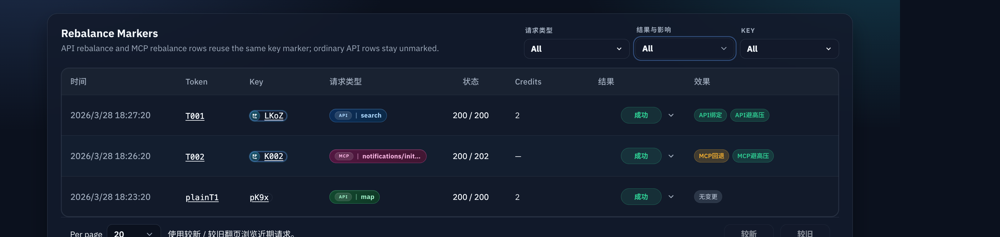

# 上游不可知 API 负载均衡（#cp8s9）

> 当前有效规范以本文为准；实现覆盖与当前状态见 `./IMPLEMENTATION.md`，关键演进原因见 `./HISTORY.md`。

## 背景 / 问题陈述

- MCP Rebalance 已经具备全池候选排序、短期 429/cooldown 避让与热度削峰。
- 普通 `/api/tavily/*` 默认仍以 user/token primary affinity 和 Tavily adapter 兼容路径为主；缺省 API 流量容易长期压在同一上游 key。
- 需要把 API 负载均衡抽成 Hikari 自己的通用能力，避免核心选路依赖某个上游供应商的 header 或 endpoint 语义。
- API Rebalance 必须可控启停，升级后不得自动切换 API 流量。

## 目标 / 非目标

### Goals

- 为普通 `/api/tavily/*` 请求引入上游不可知的通用 API selector。
- 增加全局开关，默认关闭；升级后不自动启用。
- 开关启用后的无 routing key API 请求按全池热度排序选 key，不再长期固定 user/token primary key。
- 支持 Hikari 自有 routing key：`X-Hikari-Routing-Key` 只用于本地 hash 亲和，转发上游前必须剥离。
- 保持 Tavily adapter 兼容：`X-Project-ID` 仍可作为 routing subject 输入，并继续原样透传给 Tavily 上游。
- 保留 Tavily research lifecycle pinning：`GET /api/tavily/research/:request_id` 必须使用 `POST /api/tavily/research` 创建时记录的同一个 key。

### Non-goals

- 不增加跨 key 自动重试；上游不可知模式不能假设请求幂等。
- 不移除 `/api/tavily/*` façade、Tavily 请求体兼容或现有 token 配额/计费模型。
- 不触达生产 Tavily endpoint；验证限定本地或 mock upstream。
- 不改 MCP Rebalance 的既有实现。
- 不实现 `GET /api/tavily/research/:request_id` 的随机分桶、全池重选或跨 key fallback。

## 范围（Scope）

### In scope

- 通用 API selector、backoff scope 与 request-log effect code。
- `SystemSettings` 中的 API Rebalance 开关，以及兼容 `0|100` 归一化字段。
- `X-Hikari-Routing-Key` 解析、hash、剥离与本地亲和。
- `X-Project-ID` 到通用 routing subject 的兼容映射。
- Rust 回归测试与 spec 索引。

### Out of scope

- 生产 rollout、真实 Tavily endpoint smoke。
- 新增独立设置页面或认证模型。

## 需求（Requirements）

### MUST

- API Rebalance 默认必须关闭；新安装和升级均不得自动切换 API 流量。兼容字段 `apiRebalancePercent` 的默认值必须为 `0`。
- `/api/tavily/search|extract|crawl|map|research` 仅当开关开启时使用通用 API selector；否则继续走 legacy primary / Tavily adapter 选路。
- API selector 的候选集合必须来自当前可用 key 池，排序优先级为：active `api_rebalance_http` cooldown、最近 60 秒上游 429 次数、最近 60 秒 billable/request 压力、`last_used_at` LRU、stable rank。
- `X-Hikari-Routing-Key` 必须 trim 后本地 hash；空值视为不存在；原始值不得写入数据库或 request log。
- `X-Hikari-Routing-Key` 必须在转发上游前剥离。
- `X-Project-ID` 可作为 Tavily adapter 的 routing key fallback；它仍必须按原始 header 透传给上游。
- `POST /api/tavily/research` 命中 API Rebalance 或 legacy 选路后，必须记录响应中的 `request_id -> 实际使用 key_id`。
- `GET /api/tavily/research/:request_id` 必须只使用已记录的 `request_id -> key_id`；若记录 key 不可用，必须返回错误，不得自动换 key。

### SHOULD

- 同 owner + 同 routing subject 在 key 健康时优先复用已绑定 key。
- 绑定 key 冷却或不可用时，必须在 stable pool 内重选更冷 key 并更新绑定。
- request log 应记录通用 binding / selection effect，便于 Admin 请求详情诊断。
- 管理端 System Settings 应只提供 API Rebalance Switch；兼容字段继续以 `0|100` 形式读写，但不再提供独立比例控件。

## 功能与行为规格（Functional/Behavior Spec）

### Core flows

- Activation gating:
  - `api_rebalance_enabled=false` 时，普通 API POST/JSON 请求继续走 legacy primary / Tavily adapter 选路，兼容字段 `api_rebalance_percent` 必须归一化为 `0`。
  - `api_rebalance_enabled=true` 时，普通 API POST/JSON 请求全部进入 `api_rebalance_http` selector，兼容字段 `api_rebalance_percent` 必须归一化为 `100`。
- 命中 API Rebalance 且无 routing key：
  - 本次 API 请求通过 full-pool selector 选 key。
  - 上一次 429/cooldown 或近期压力会影响后续命中 API Rebalance 的请求选路。
- 有 `X-Hikari-Routing-Key`：
  - owner subject 使用 `user:{user_id}`，无 user 时使用 `token:{token_id}`。
  - routing subject 使用 `sha256(trimmed_header_value)`。
  - 绑定仅保存 hash 与 owner subject，不保存原始 header 值。
- Tavily `X-Project-ID` 兼容：
  - 当请求命中 API Rebalance、`X-Hikari-Routing-Key` 不存在且 `X-Project-ID` 非空时，用 `X-Project-ID` 作为 generic routing subject 输入。
  - 当请求未命中 API Rebalance 时，`X-Project-ID` 继续使用 legacy Tavily project affinity adapter。
  - `X-Project-ID` 不被剥离，继续发给 Tavily upstream。
- Tavily research lifecycle:
  - `POST /api/tavily/research` 仅按开关决定是否进入 API Rebalance。
  - `POST /api/tavily/research` 成功后，必须把返回的 `request_id` 绑定到实际创建 request 的 `key_id`。
  - `GET /api/tavily/research/:request_id` 不参与 rollout gating，不重新全池选路，只使用创建时记录的 key。

### Edge cases / errors

- 所有候选都在 cooldown 时，仍选择排序后“最不差”的可用 key，而不是直接失败。
- 上游返回 429 或可临时 backoff 的 403 时，写入 `api_rebalance_http` scope，影响后续 API selector。
- selector 不做同请求自动 retry；当前请求按上游响应返回。
- Research result GET 若找不到记录 key 或记录 key 不可用，返回 proxy error，不 fallback 到其他 key。

## 接口契约（Interfaces & Contracts）

### 接口清单（Inventory）

| 接口（Name）                   | 类型（Kind）  | 范围（Scope） | 变更（Change） | 契约文档（Contract Doc） | 负责人（Owner） | 使用方（Consumers）       | 备注（Notes）                                 |
| ------------------------------ | ------------- | ------------- | -------------- | ------------------------ | --------------- | ------------------------- | --------------------------------------------- |
| `X-Hikari-Routing-Key`         | HTTP header   | external      | New            | None                     | backend         | API clients               | 可选；本地使用后剥离，不透传上游              |
| `X-Project-ID` adapter mapping | HTTP header   | external      | Modify         | None                     | backend         | Tavily-compatible clients | 继续透传，同时可作为 routing subject fallback |
| `api_rebalance_http`           | backoff scope | internal      | New            | None                     | backend         | API selector              | 通用 API selector 的 transient backoff scope  |
| `apiRebalanceEnabled`          | setting       | internal      | New            | None                     | backend/web     | admin                     | SystemSettings 开关，默认 `false`             |
| `apiRebalancePercent`          | setting       | internal      | Legacy-compat  | None                     | backend/web     | admin                     | 兼容字段；由开关归一化为 `0                   |

### 契约文档（按 Kind 拆分）

- None

## 验收标准（Acceptance Criteria）

- Given 新安装或升级后的默认设置
  When 读取 system settings
  Then `apiRebalanceEnabled=false` 且 `apiRebalancePercent=0`。

- Given 默认设置
  When 调用 `/api/tavily/search|extract|crawl|map|research`
  Then 请求不进入 API Rebalance selector，继续走 legacy primary / adapter 选路。

- Given `apiRebalanceEnabled=true`
  When 调用 `/api/tavily/search|extract|crawl|map|research`
  Then 请求进入 `api_rebalance_http` selector。

- Given 多个 healthy upstream keys、API Rebalance 命中且 API 请求无 routing key
  When 连续调用 `/api/tavily/search`
  Then 请求不应长期固定 user/token primary key，并应按 LRU/热度分散到可用 key。

- Given 某 API 请求命中 key A 且上游返回 429
  When 后续无 routing key API 请求到达
  Then selector 应避开 key A 的 active `api_rebalance_http` cooldown。

- Given API Rebalance 命中且请求带 `X-Hikari-Routing-Key`
  When mock upstream 收到转发请求
  Then 不应看到 `X-Hikari-Routing-Key`，且同 owner + 同 routing key 可复用绑定。

- Given API Rebalance 命中且请求只带 `X-Project-ID`
  When 请求被代理到 Tavily upstream
  Then `X-Project-ID` 仍透传，同时本地可用其 hash 做 routing subject。

- Given `POST /api/tavily/research` 成功创建 request
  When 调用 `/api/tavily/research/:request_id`
  Then 必须继续命中创建时记录的 key，不受当前开关变化影响。

- Given research request 记录的 key 不可用
  When 调用 `/api/tavily/research/:request_id`
  Then 返回错误，不自动 fallback 到其他 key。

## 验收清单（Acceptance checklist）

- [x] 核心路径的长期行为已被明确描述。
- [x] 关键边界/错误场景已被覆盖。
- [x] 涉及的接口/契约已写清楚或明确为 `None`。
- [x] 相关验收条件已经可以用于实现与 review 对齐。

## 非功能性验收 / 质量门槛（Quality Gates）

### Testing

- Unit/integration tests: defaults and validation, switch-only `0|100` normalization behavior, generic selector ordering, no-routing-key rebalance, routing-key stripping, `X-Project-ID` compatibility, research lifecycle pinning and pinned-key unavailable error.
- E2E tests: optional; local/mock upstream only.

### UI / Storybook (if applicable)

- Storybook story and render tests for System Settings API Rebalance controls.

### Quality checks

- `cargo fmt --check`
- targeted Rust tests for API rebalance and Tavily HTTP proxy
- `cargo clippy --all-targets --all-features -- -D warnings`

## Visual Evidence

## Related PRs

- None

## 风险 / 开放问题 / 假设（Risks, Open Questions, Assumptions）

- 风险：开关启用后，新 API 请求会整体切到 API Rebalance；需要依赖系统状态页、影子对账对比与维护窗口控制发布风险。
- 假设：普通 Tavily POST/JSON 请求不做自动重试，避免对非幂等上游操作产生副作用。

## 参考（References）

- `../rebalance-mcp-gateway/SPEC.md`
- `../http-project-affinity-x-project-id/SPEC.md`
