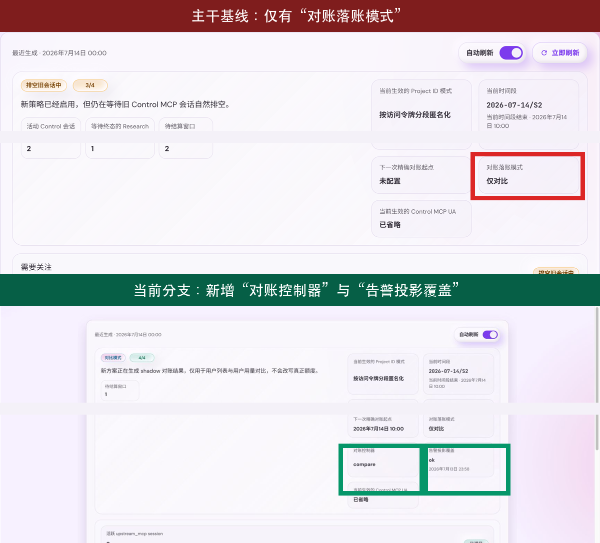
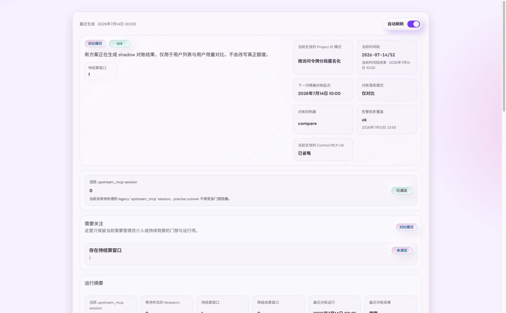
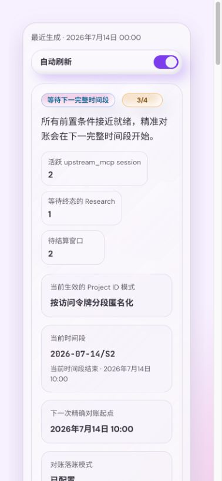
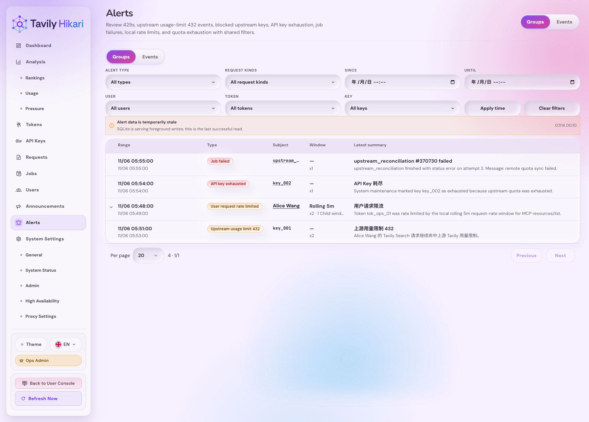
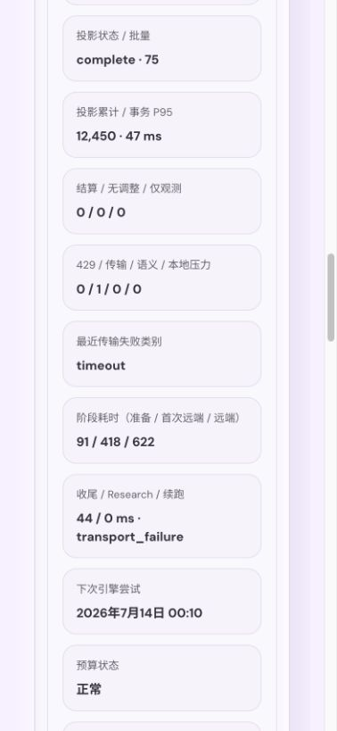
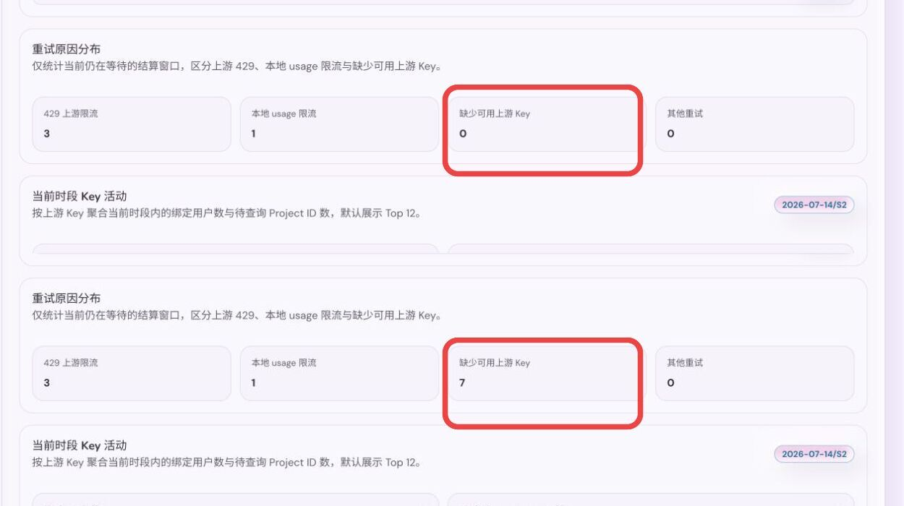
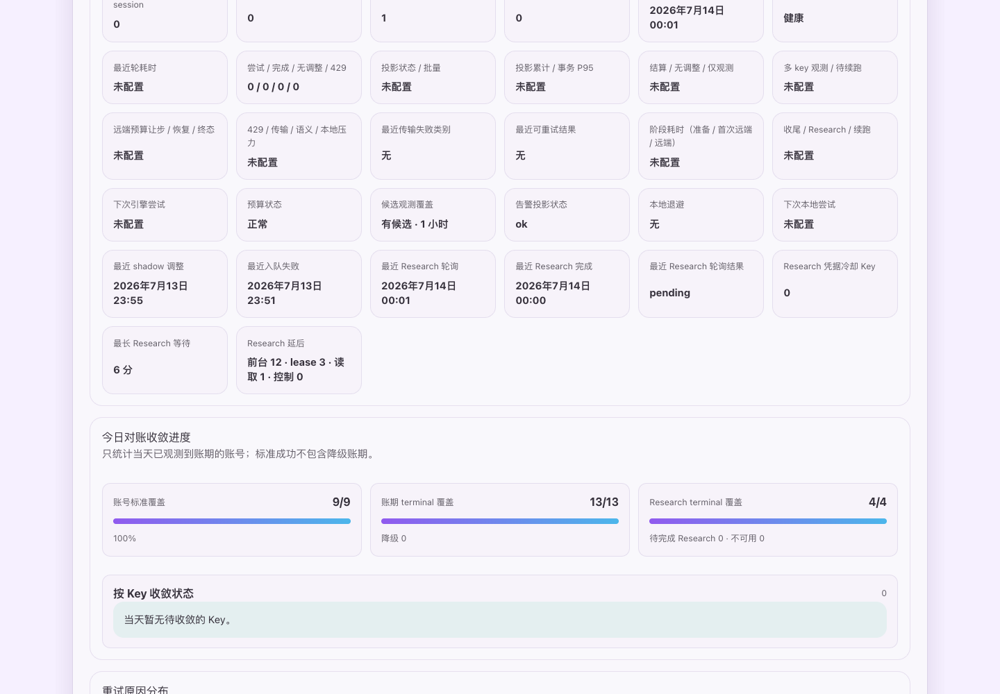
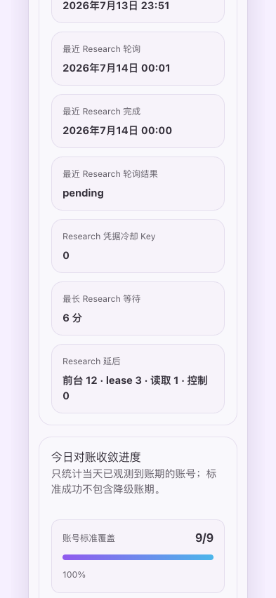

# 上游身份隐私与分段积分对账（#3s7ku）

> 当前有效规范以本文为准；实现覆盖与当前状态见 `./IMPLEMENTATION.md`，关键演进原因见 `./HISTORY.md`。

## 背景 / 问题陈述

- 现有 HTTP Header sanitizer 仍允许客户端 UA、浏览器指纹及部分未知 `x-*` 字段进入上游请求。
- 既有 HTTP 规格要求原样透传 `X-Project-ID`，固定 MCP UA 也直接暴露项目身份。
- Research 使用本地估算 credits；共享上游 Key 下无法仅靠账户累计 usage 精确归属单次请求。
- 管理员缺少系统状态与异常 `upstream_mcp` session 管理面，无法确认 shadow compare 是否在产数、precise cutover 是否被遗留 session 阻塞。

## 目标 / 非目标

### Goals

- 所有 Tavily 出站调用统一通过严格 Header 白名单。
- `X-Project-ID` 支持 `passthrough / fixed / accessToken`，默认 `accessToken`。
- 使用稳定 token id 与业务时间段派生不可逆上游项目标识，并在 HA 节点间保持一致。
- 由既有 precise-reconciliation 开关选择 compare 或 active；active 的真实账务从记录的下一完整
  业务窗口开始执行一次幂等多退少补。
- 提供“系统状态”页与隐藏的异常 `upstream_mcp` session 管理页，明确展示配置、实际生效状态、shadow/precise 门禁、结算队列与阻塞 session。

### Non-goals

- 不支持 `project` 派生模式或按原始 `X-Project-ID` 查询调用量。
- 不允许管理员编辑 Header 白名单。
- 不承诺隐藏上游通过 Key、出口 IP 或流量时序得到的统计推断。
- 不强制中断既有 Control MCP session，不对不完整窗口结算，不执行第二轮自动复核。

## 范围（Scope）

### In scope

- System settings、HA secret 同步、出站 Header policy 与三种 Project ID 模式。
- 业务时间段、使用组合追踪、Research 等待、`/usage` 限速队列与 signed adjustment 账本。
- 账户和未绑定 Token 的小时、日、月额度读取与审计整合。
- 管理状态 API、系统设置控件、状态子路由、Storybook 与视觉证据。
- README 与高匿名代理文档更新；新增可复用 solution。

### Out of scope

- Tavily 生产端点验证。
- 原始项目名的用户侧统计或任意历史窗口回填。

## 需求（Requirements）

### MUST

- HTTP API 与 Rebalance MCP 转换请求只发送必要 HTTP 字段和 Hikari 注入鉴权，永不发送 UA。
- Control MCP 只发送 MCP 协议必要字段；配置 UA 为空时省略，否则使用管理员固定值。
- 未知 `x-*`、客户端 UA、IP/CDN、浏览器、Origin/Referer、Cookie 默认丢弃。
- `accessToken` 使用 `HMAC-SHA256(secret, "v1" + token_id + period_code)` 的完整 Base64URL-no-pad 输出。
- secret 为自动生成的 32 字节 HA 同步秘密，任何 API、日志与状态页均不得返回。
- 窗口按服务器业务时区划分为 `S1=00-11`、`S2=11-22`、`S3=22-24`。
- shadow compare 仅在 `accessToken`、API Rebalance 启用、MCP Rebalance 启用时开始产数，不要求活跃 `upstream_mcp` session 清零。
- 旧 `upstreamPreciseReconciliationEnabled` 是唯一管理员模式动作：写 `true` 不执行预检，立即
  进入 replicated `active` controller state，并记录下一完整业务窗口为账务边界；写 `false` 回到
  `compare`。静态 shadow 条件仍决定能否产生 upstream observation，但不阻断该模式转换。
- 新 active controller 只允许 activation boundary 及之后的 work 写真实 billing。既有 compare
  `observed`、`no_adjustment` 和 completed historical work 永不因转换而重放。
- durable correctness/integrity 失效时 controller 进入 `active_paused`，同时把旧开关写回 false；
  只有新的 true 写入可以恢复 active。
- 结算只查询实际使用过的 `(token_id, upstream_key_id, period_code)`，每个 settlement key 只成功一次。
- adjustment 支持正负值，归属原业务窗口并参与对应额度、HA billing 同步和审计。

### SHOULD

- `/usage` 队列按 upstream Key 遵守每 10 分钟 10 次并解析 `Retry-After`。
- 无 Research 在窗口结束 10 分钟后结算；有 Research 在全部终态后 10 分钟结算，最长等待 24 小时后 degraded 结算。
- 独立 `upstream_reconciliation_research_drain` 轮询已关闭窗口中未终态的 Research；每次最多
  一个实际请求、正常间隔至少 5 秒，并沿用 v21 的 80 行索引页、每 Key 4 条和 20 条选择边界。
- Research drain 为每行保存 `poll_resolution`。默认 `pollable` 行才进入索引页；404 写入
  `unavailable`、保留 `terminal_at=NULL` 并停止该请求的后续轮询，不解除 24 小时 degraded
  保护，也不产生 billing 结果。401/403 或空本地 secret 只建立对应 Key 的六小时
  `reconciliation_research_credentials` cooldown；它与 `period_reconciliation` 的 429
  cooldown 独立，健康 Key 仍可推进。
- `429` 只对 `period_reconciliation` scope 中的对应 Key 建立持久化冷却，使用 `Retry-After` 或 `5/10/20/30` 分钟退避；不得批量把同 Key 的其他窗口写为 rate-limited，也不得影响正常 API/MCP 流量。
- 候选观测必须使用有界索引页：`queueEstimate` 可为空且最多统计 64 个候选，`hasEligible` 与最老候选年龄必须单独表达，首次观测前 coverage 为 `unknown`，不得以零伪装未观测状态。历史 degraded 状态必须由独立的索引化 `EXISTS` 探测保留，不能用当天计数替代。
- 连续三轮存在候选、未产生远端尝试且本地预算耗尽时，持久化独立的本地短退避；它不得改变任何 Key 的 429 冷却。真实远端 429 只对触发它的 `period_reconciliation` Key 按 `5/10/20/30` 分钟阶梯冷却，并以更晚的 `Retry-After` 为准；所有可选 Key 都在冷却时，使用最早到期时间保留一个 delayed representative job，非冷却 Key 不受影响。
- 主结算候选页与 key/cooldown hydrate 的本地准备预算最多 2 秒，主结算每轮仍最多两个
  `/usage` 请求。生产主路径不再预留或执行 terminal Research；独立 drain 通过唯一 durable
  representative 和请求级 lease 续跑，因此 Research 超时不改变主轮预算或 outcome。
- 远端请求启动、观察结果、结算写入和 Research 状态落盘均受同一轮截止时间约束；最后的持久化收尾预算不得被新一轮远端请求抢占。
- 在发起远端请求前必须保留两秒给持久化收尾。收尾预算、post-processing 或 retry bookkeeping
  不足时，claimed run 只能返回 `Deferred { reason, retry_at }`，不得写 terminal job error。
  Claim-fenced control transaction 必须把 deferred outcome、独立 local-backoff 元数据、local-pressure
  observation、retry time 与唯一 delayed auto representative 一起提交；该 transaction 不能开始时，保留 running claim 供
  stale recovery，而不是伪造完成或本地重试循环。
- 本地预算耗尽只推进独立 local backoff，不增加 upstream 429 压力；local backoff 的持久化元数据随 HA meta 增量和 baseline 同步，接管后继续执行原退避而不是立即重试。
- Historical usage projection has a versioned durable lifecycle. An upgraded database with legacy
  usage advances stable `(token_id, key_id, period_code)` keyset micro-slices only when no durable
  candidate is ready. A slice reads at most `25..100` rows outside the write transaction, then
  atomically merges work and advances its claim-fenced cursor in one short transaction. Candidate
  selection never aggregates raw usage. New usage is maintained by write triggers: only a logical
  usage revision or a current upstream-Key-set change, including a Key removal, opens a new work
  generation. Storage-only
  import/replay, timestamp refresh, and equal logical source payloads leave the generation and its
  partial observations intact; a logical source revision after terminal settlement opens exactly
  one new generation without reviving a completed no-adjustment period through the legacy cursor.
- Reconciliation budgets are cooperative boundaries, not cancellation timers. Foreground pressure,
  SQLite contention, and the 20-second run deadline prevent the next safe phase from starting; they
  never cancel an open transaction. An unfinished projection persists a typed continuation and
  resumes after restart without skipping work.
- Graceful process shutdown first closes admission for new reconciliation runs, then waits for both
  the active bulk slice and any already-started run to reach explicit durable boundaries. The run
  lease does not reserve the bulk permit across remote I/O; it only makes remote-result finalization
  visible to shutdown. Research does not start after shutdown begins. A rolling restart therefore
  does not use physical-connection discard as the normal projection or finalization mechanism.
- A claimed projection micro-slice owns its bulk permit in an independent task until the durable
  boundary completes. Cancelling the scheduler caller cannot release admission early or abandon an
  open projection transaction; claim and cursor fencing still reject obsolete work.
- Every reconciliation preparation source `SELECT` uses a fresh `ReconciliationReadSession` with a
  connection-local SQLite progress handler and a 250ms native read deadline. The covered reads are
  recent/backlog candidate lanes, candidate/billed-credit hydrate, Research candidates, and the
  historical projection source page; admission, claim, finish, and continuation metadata remain
  short control operations. Its own `SQLITE_INTERRUPT` is `projection_read_budget`: it stops later
  preparation and remote work, starts no merge transaction, advances no cursor, and leaves one
  claim-fenced delayed representative after 30 seconds. The handler must be removed before pool
  return; uncertainty closes the physical connection. Billed-credit hydrate is the pre-request
  source-read gate; after an observation, settlement reads current ledger state through a bounded
  finalization connection so charges recorded during HTTP are not missed.
- Administrator Alerts canonical Events reads are outside this reconciliation source contract: they
  use the independent `AdminAlertsCacheWarm` snapshot and projection time index, while reconciliation
  source reads retain their own preparation deadline and claim-fenced continuation.
- The global remote-attempt limit is one actual outbound HTTP request. Candidate selection,
  projection, hydrate, finalization, and Research bookkeeping do not hold that request lease.
  Manual work keeps priority; automatic main reconciliation and Research drain representatives
  eligible for 120 seconds compete for the next non-manual request turn. Main reconciliation is
  ordered by `available_at`; Research is ordered by its durable queue-time `queued_at` anchor, so a
  defer cannot erase its wait; main wins an exact tie. An accepted poll or Key cooldown starts a
  new Research interval. A turn is consumed only when HTTP starts.
- Projection SQL shape remains unchanged unless scoped read-deadline and connection-level evidence
  shows this source read still dominates candidate performance. A query/index rewrite requires a
  separate bounded change.
- Every attempted work generation ends as exactly one typed result. `settled`, `no_adjustment`, and
  compare-mode `observed` are terminal. `upstream_429`, `transport_failure`, `semantic_failure`, and
  `local_pressure` are retryable and keep independent durable streaks and retry deadlines.
- `missing_eligible_upstream_key` is a durable nonterminal input condition, not a semantic or
  transport failure. It keeps work incomplete with a fixed 15-minute retry and is exposed only as
  an aggregate administrator diagnostic.
- Transport failures store only a fixed local observation category: `connect`, `timeout`,
  `response_body`, `invalid_endpoint`, `credentials_or_database`, or `unknown`. They never expose
  endpoint text, response bodies, credentials, or database errors through run observation, and they
  keep work incomplete on the `30/60/120/300s` retry ladder.
- Compare-mode non-zero differences write only the shadow observation and complete as `observed`;
  they do not create an actual billing adjustment and are not included in settled totals.
- Main settlement and terminal Research use separate durable representatives. The main path never
  spends remote or local tail budget on Research. The drain owns the v21
  `(next_poll_at, key_id, request_id)` cursor, selects from an 80-row indexed page, performs at most
  one request, and atomically accepts its pending/terminal/retry result, exact cursor, Key cooldown,
  and claim fence. `foreground_pressure`, `read_budget`, and `control_defer` schedule one
  30-second continuation; `remote_lease` schedules one five-second continuation. They advance no
  cursor or retry streak. Above five instance-local foreground requests per second, only an aged
  Research turn may run one bounded poll; it does not bypass SQLite admission, the request lease,
  or claim-fenced finalization. After an accepted `remote_lease` continuation, that aged reservation
  remains held until the resumed Research run starts HTTP; ordinary automatic remote work may
  prepare locally but cannot claim the released lease. The turn identity, owner and resumable state
  transition together, so an old claim cleanup cannot corrupt a newer aged reservation.
- Research eligibility must be applied before the 80-row page limit and match hydrate eligibility.
  The cursor advances only for the exact processed candidate. A forced stable-start sweep runs at
  least every five minutes so rows that become eligible behind a busy cursor cannot starve; its
  accepted claim-fenced commit refreshes the sweep clock. If every eligible due Key is cooling, the
  wake time is the globally earliest eligible cooldown, independent of the current cursor page.
- When one candidate maps to multiple eligible upstream keys, persist each successful `/usage`
  response as a local observation keyed by `(token_id, period_code, work_generation, key_id)`. Each
  run requests at most two missing keys and returns `remote_attempt_budget` with a 30-second
  continuation while the set is incomplete. Sum usage and enter the existing compare/active terminal
  path only after all current-generation keys are observed; candidates with an existing partial
  observation are selected before fresh candidates sharing the same scheduling Key so the partial
  set can converge. A partial observation never becomes a semantic failure or terminal result.
  Terminal completion clears these node-local rows, and generation or claim fencing ignores stale
  observations. A claimed `remote_attempt_budget` defer atomically finishes only its current claim
  and leaves exactly one 30-second auto continuation; it changes neither billing truth nor
  semantic, transport, upstream-429, or local-pressure state. The observation table is derived
  state, not HA outbox truth.
- 状态页使用门禁清单和 `n/m`，同时覆盖 loading、empty、error 与 degraded 状态。

## 功能与行为规格（Functional/Behavior Spec）

### Header policy

- `HttpApi` 与 `RebalanceHttp` 白名单为 `accept`、`accept-encoding`、`content-type`；鉴权由 Hikari 独立注入。
- `ControlMcp` 白名单为 `accept`、`accept-encoding`、`cache-control`、`content-type`、`last-event-id`、
  `mcp-protocol-version`、`mcp-session-id`、`pragma`；不再允许通配 `x-mcp-*`、`x-tavily-*` 或 `tavily-*`。
- 三种模式只作用于 REST API 与 Rebalance HTTP：
  - `passthrough`: 客户端存在非空 `X-Project-ID` 时原样发送。
  - `fixed`: 发送管理员配置的合法非空固定值。
  - `accessToken`: 忽略客户端值，发送分段匿名值。
- `fixed` 最大 128 字节，UA 最大 256 字节；两者拒绝控制字符。

### 生效 epoch 与业务窗口

- Header 配置保存后立即影响新请求。
- shadow compare 在静态条件满足后立即开始记录窗口 usage。
- controller active 从保存时立即可观察；真实 billing eligibility 从记录的下一时间段边界计算，
  边界前请求只进入 shadow work。
- controller transition、activation boundary 和 integrity pause 必须纳入 HA control baseline/events，
  使 standby 接管后保持同一账务边界。
- period code 使用服务器现有业务时区，格式 `YYYY-MM-DD/S1|S2|S3`。

### 对账与 adjustment

- `upstream_reconciliation` 只在实际 outbound HTTP request 期间取得全局唯一 remote-attempt
  lease，并具有 20 秒单轮总预算；剩余预算不足时不得发起新的上游请求。candidate、projection、
  hydrate、finalization 与 Research bookkeeping 不占该 lease，因此本地 HA GC 等维护任务不被长时间
  远程 I/O 占用。
- `period_reconciliation` Key 的 429 cooldown 与 job continuation 原子持久化。单 Key 使用
  `5/10/20/30` 分钟阶梯并采用 `max(阶梯, Retry-After)`；退避期间只保留一个 delayed
  representative job。所有可选 Key 都冷却时，continuation 使用最早的 Key 到期时间。
- 遗留 global-backoff meta 仅为滚动升级兼容保留，不参与 reconciliation engine、代表任务唤醒或
  管理员 live blocker。逐 Key 429 为采样 DEBUG，只有 Key cooldown 的进入、升级和恢复产生状态跃迁日志。
- 单 Key 429 不得阻断其他未冷却 Key；仅当本轮所有可选 Key 都在 cooldown 时，才以最早到期时间
  安排 `key_cooldown` continuation，且不推进 completed generation。
- 管理员状态同时返回 `reconciliationObservation` 与 `reconciliationLocalBackoff`；未观测时
  coverage 为 `unknown`，`queueEstimate=null`，页面显示“未知”而不是“0”。
- 历史 degraded 相位由独立索引化 `EXISTS` 决定；管理员 `degradedSettlements` 为最多 64 条的
  有界观测，超过时以 `degradedSettlementsCapped=true` 和 `64+` 明示，不伪装成精确总数。

- 请求入口固定 period code；实际上游后记录所用 token、key、匿名 project id、业务 credits 与 Research 终态。
- 每个 token/period 汇总实际使用过的 key；以该匿名 project id 调用每把 key 的 `/usage`，只采用 `key.usage` 并跨 key 求和。
- `delta = upstream_usage - local_billed_credits`；正值补扣，负值返还，零值只记录 settled 状态。
- 唯一 settlement key 至少包含版本、token id、period code，重复任务与 HA 接管不得重复调整。
- S3 可在次日执行，但 adjustment 的 `attributed_at` 仍落在原业务日末，不能增加次日额度。

### Compare / precise 与异常 session 管理

- 当 shadow compare 已经产数，但 precise 仍被遗留 `upstream_mcp` session 阻塞时，系统状态主相位显示“仅对比”，不再误显示成“排空旧会话中”。
- `GET /api/settings/system/status` 与系统设置摘要都返回明确语义的活跃 `upstream_mcp` session 计数。
- 新增隐藏路由 `/admin/system-settings/mcp-session-bindings`，路径归属 `system-settings`，但不出现在系统设置子导航中。
- 管理页默认只看活跃项，支持 `active / revoked / all` 视图；筛选只包含创建时间范围、续约时间范围、状态，固定按 `updated_at desc` 排序并分页。
- 释放动作分为单条释放、勾选批量释放、按当前筛选结果释放全部活跃会话；只有最后一种需要二次确认。

### 状态页

- canonical route 为 `/admin/system-settings/status`，系统设置下级标签为“系统状态”。
- 状态 API 区分 `configured / compare / pending / active / degraded`；其中 `compare` 表示 shadow 已产数但 precise 尚未切换。
- 页面展示 Header policy、UA 实际值、Project ID 模式、API/MCP Rebalance 与 `upstream_mcp` session 门禁、下一 epoch、当前 period、
  Research 等待、usage 队列、最近 adjustment、degraded 原因与活跃异常 session 数。
- 页面展示 reconciliation 的 `rate_limited` 原因分布，必须区分上游 429、本地 usage 限流与其他重试；复杂原因留在日志与系统状态页，不进入用户列表每行。
- 页面展示当前时段按上游 Key 聚合的活动图：绑定用户数与待查询 Project ID 数默认显示 Top 12，并用一行汇总剩余 Key。
- 页面展示今日对账收敛进度：账号至少一个标准成功账期、账期 terminal、Research terminal 三个比例，以及每 Key 的 pending Research、待查询 Project ID 和 reconciliation 冷却状态。
- 系统设置页在“启用 Rebalance MCP”行只在活跃异常 session 数量大于 0 时显示 warning 图标，并跳转到隐藏管理页。
- 系统状态页始终显示“活跃 `upstream_mcp` session”统计卡；数量大于 0 时使用 warning 语义，数量为 0 时使用 neutral/success 语义。
- `/api/settings/system/privacy-status` 维持既有诊断字段并可添加 freshness 元数据。服务 ready 后以低优先级
  预热 immutable last-good；defer 后后台重试至发布或停机。有缓存的读取不得同步重建，在 refresh 或本地
  SQLite 压力下直接返回 `200 stale`，真冷缓存返回 `503 Retry-After: 1`。请求 deadline 不得取消开放的
  SQLite read snapshot。优雅停机必须 fence 新 refresh，并等待已开始的 snapshot 显式 close。

## 接口契约（Interfaces & Contracts）

### 接口清单（Inventory）

| 接口（Name）          | 类型（Kind） | 范围（Scope） | 变更（Change） | 契约文档（Contract Doc）   | 负责人（Owner） | 使用方（Consumers） | 备注（Notes）            |
| --------------------- | ------------ | ------------- | -------------- | -------------------------- | --------------- | ------------------- | ------------------------ |
| System settings       | HTTP API     | internal      | Modify         | `./contracts/http-apis.md` | backend         | admin web           | 新增三项隐私设置         |
| System status         | HTTP API     | internal      | New            | `./contracts/http-apis.md` | backend         | admin web           | 只读、脱敏状态           |
| MCP session bindings  | HTTP API     | internal      | New            | `./contracts/http-apis.md` | backend         | admin web           | 隐藏管理页查询与释放接口 |
| Reconciliation tables | SQLite/HA    | internal      | New            | `./contracts/db.md`        | backend         | quota/audit/HA      | signed adjustment 与队列 |

### 契约文档（按 Kind 拆分）

- `./contracts/http-apis.md`
- `./contracts/db.md`

## 验收标准（Acceptance Criteria）

- Given 任意客户端指纹与未知 `x-*` Header，When 请求通过三条出站路径，Then 上游只收到该路径白名单字段。
- Given UA 为空或非空，When Control MCP 新建连接，Then 分别省略 UA 或发送配置值；HTTP API 始终无 UA。
- Given token secret 轮换、HA 节点切换或相同窗口重试，When 计算匿名 ID，Then 输出稳定一致；不同 token/窗口输出不同。
- Given 遗留 `upstream_mcp` session 仍存在，但 `accessToken`、API Rebalance 与 MCP Rebalance 已启用，When 新请求进入当前窗口，Then shadow compare 持续产数且记录为 shadow settlement mode。
- Given compare-only 用户列表或用户用量页，When 当日仍有未 terminal 的 shadow 窗口，Then `新方案 24h` 显示 `当前本地 24h + 已确认 shadow delta` 的混合值，并明确提示“含未对账估算”；When 当日相关窗口均已 terminal 且 `delta=0`，Then `新方案 24h` 仍显示绝对值且不再折叠为空。
- Given active controller 尚未越过 activation boundary，When 结算调度执行，Then 不产生 precise
  adjustment，且历史 observed work 不会重放。
- Given controller 处于 `active_paused`，When durable integrity 检查失败后结算调度执行，Then 保留
  work 而不创建 representative，直到管理员再次把既有开关写为 true。
- Given 多 Key、Research 等待、Retry-After、重启或 HA 接管，When 窗口结算，Then 最终只产生一条幂等 signed adjustment。
- Given 退款或补扣，When 查询账户或未绑定 Token 的相关额度，Then 原业务窗口统计立即反映差额，S3 不增加次日额度。
- Given 状态 API 与页面，When secret、官方 key 或 token 存在，Then 任何响应与 UI 都不显示完整敏感值。
- Given privacy-status last-good 已过 60 秒且 SQLite refresh 受压或正在运行，When 管理员读取该接口，Then
  在 250ms 内返回 `200 stale`，仅启动一个后台 refresh，且不丢弃 read-session connection；Given 无
  last-good，Then 在同一预算内返回 `503 Retry-After: 1`。
- Given reconciliation backlog 中存在 `rate_limited` 窗口，When 管理员查看系统状态页，Then 能区分上游 429、本地 usage 限流与其他重试，并能看到当前时段每个上游 Key 的绑定用户数与待查询 Project ID 数分布。
- Given 近期窗口与旧 backlog 同时堆积，When reconciliation worker 选择候选窗口，Then 今日+昨日窗口优先进入 recent lane，且不会被老 backlog 长期饿死。
- Given 同一上游 Key 的多个窗口同时到期且首次 `/usage` 查询收到 429 或本地 usage 限流，When reconciliation worker 执行，Then 该 Key 的到期窗口整体进入同一 `period_reconciliation` cooldown，本轮不再反复打同一个 Key，其他非冷却 Key 的候选仍可继续结算；只有全部可选 Key 冷却时才按最早到期时间 deferred。
- Given a claimed run reaches its finalization reserve or post-processing deadline, When the scheduler
  persists the outcome, Then the job finish, local-backoff state, local-pressure observation, retry deadline, and one
  delayed representative commit in one claim-fenced control transaction; a control-acquire failure
  leaves the running claim for stale recovery and does not create a terminal error.
- Given a local-pressure representative becomes eligible after foreground activity has drained, When its
  claim remains current, Then the scheduler clears the local-pressure backoff before entering the engine;
  a fresh SQLite admission failure still returns a typed defer, while eligible shadow work can reach a
  terminal observation during the recovery tail.
- Given current-period Research has pending work but no terminal progress, When its health is
  evaluated, Then use a fixed ten-minute observation window: terminal rate must become positive and
  pending work must not grow. Treat the `upstream429` retry bucket as a separate metric, never as
  Research backlog or terminal progress.
- Given a Research poll returns 404, When the drain commits the response, Then the row is marked
  `unavailable` without `terminal_at`, is excluded from future drain polls, and remains visible in
  the additive progress diagnostics; main reconciliation keeps its pre-existing 24-hour degraded
  gate. Given a 401/403 or missing local secret, Then only that Key enters the six-hour credentials
  cooldown and another healthy Key remains selectable.
- The additive `reconciliationResearchProgressWindow` diagnostic reports the most recently completed
  ten-minute window, including terminal and pending deltas. An incomplete window is explicitly not
  healthy; a completed window is healthy only when `terminalRatePositive` and `pendingNonGrowing`
  are both true.
- Given 管理员进入隐藏 session 管理页，When 使用状态/时间筛选并执行单条、批量或按筛选释放，Then 只有命中的活跃 `upstream_mcp` session 会被释放，已过期或已释放记录不会重复处理。

## 验收清单（Acceptance checklist）

- [x] 核心路径的长期行为已被明确描述。
- [x] 关键边界/错误场景已被覆盖。
- [x] 涉及的接口/契约已写清楚。
- [x] 相关验收条件已经可以用于实现与 review 对齐。

## 非功能性验收 / 质量门槛（Quality Gates）

### Testing

- Rust unit/integration: Header 白名单、派生稳定性、边界、eligibility、限速、Research、幂等与额度整合。
- Rust unit/integration: compare-only `/api/users` confirmed/projected/null 合同、status 诊断时间戳、retry bucket / 当前时段 Key 活动字段、recent/backlog 候选公平性、`upstream_reconciliation` enqueue reuse fast-path 与 key-scoped backoff。
- Web: route、settings、status states、Storybook interaction。
- Full: `cargo test`、`cargo clippy -- -D warnings`、`bun test`、`bun run build`、`bun run build-storybook`。

### UI / Storybook

- 更新 System Settings stories；新增 system status compare、pending、active、degraded、empty、error gallery，以及隐藏 MCP session 管理页 stories。
- 手动刷新 interaction 覆盖；桌面与移动 mock-only 视觉证据。

### Quality checks

- `cargo fmt --check`
- `cargo clippy -- -D warnings`
- `cd web && bun run build`

## Visual Evidence

- source_type: `storybook_canvas`
- target_program: `mock-only`
- story_id_or_title: `Admin/Modules/SystemStatusModule/Observed`
- scenario: annotated origin/main baseline versus current reconciliation controller and alert projection
- requested_viewport: `desktop`
- viewport_strategy: `storybook-viewport`
- capture_scope: `browser-viewport`
- margin_policy: `trim_only`
- evidence_surface: `page`
- evidence_note: The red baseline marker identifies the original settlement-mode surface; the green
  current markers identify the new reconciliation controller and alert projection coverage surfaces.
- submission_gate: `approved`

- source_type: `storybook_canvas`
- target_program: `mock-only`
- story_id_or_title: `Admin/Modules/SystemStatusModule/Observed`
- scenario: compare-mode observed terminal with alert projection coverage
- requested_viewport: `desktop`
- viewport_strategy: `storybook-viewport`
- capture_scope: `browser-viewport`
- margin_policy: `trim_only`
- evidence_surface: `page`
- evidence_note: Current `135376b4` source confirms compare-mode observation does not present as
  billing settlement and exposes alert projection coverage.
- submission_gate: `approved`

- source_type: `storybook_canvas`
- target_program: `mock-only`
- story_id_or_title: `Admin/Modules/SystemStatusModule/Mobile393x852`
- scenario: responsive reconciliation and alert projection status
- requested_viewport: `393x852`
- viewport_strategy: `storybook-viewport`
- capture_scope: `browser-viewport`
- margin_policy: `trim_only`
- evidence_surface: `page`
- evidence_note: Current `135376b4` source confirms the status module remains readable in the
  required mobile viewport.
- submission_gate: `approved`

- source_type: `storybook_canvas`
- target_program: `mock-only`
- story_id_or_title: `Admin/Pages/AlertsStale`
- scenario: exact-key alert last-good state under foreground SQLite write containment
- requested_viewport: `desktop`
- viewport_strategy: `storybook_canvas`
- capture_scope: `browser-viewport`
- margin_policy: `trim_only`
- evidence_surface: `page`
- evidence_note: Current `0bf773d8` source preserves the rendered alert rows while clearly marking
  stale coverage, the last successful observation time, and the foreground-write containment reason.
- submission_gate: `approved`

- source_type: `storybook_canvas`
- target_program: `mock-only`
- story_id_or_title: `Admin/Modules/SystemStatusModule/TransportFailureMobile393x852`
- scenario: typed reconciliation transport failure with separated retry states
- requested_viewport: `393x852`
- viewport_strategy: `devtools-emulate`
- capture_scope: `browser-viewport`
- margin_policy: `trim_only`
- evidence_surface: `page`
- evidence_note: Current `0bf773d8` source distinguishes a timeout transport failure from 429,
  semantic, and local-pressure outcomes without exposing an upstream error body.
- submission_gate: `approved`

- source_type: `storybook_canvas`
- target_program: `mock-only`
- story_id_or_title: `Admin/Modules/SystemStatusModule/MissingEligibleUpstreamKey`
- scenario: marked comparison of retry reason distribution before and after the missing-key diagnostic
- requested_viewport: `desktop`
- viewport_strategy: `storybook-viewport`
- capture_scope: `browser-viewport`
- margin_policy: `trim_only`
- evidence_surface: `page`
- evidence_note: Current `89fd4b3e` adds a distinct `missing eligible upstream key` count (`0` to
  `7`) without changing the surrounding retry counters or administrator controls.
- submission_gate: `approved`

- source_type: `storybook_canvas`
- target_program: `mock-only`
- story_id_or_title: `Admin/Modules/SystemStatusModule/EvidenceResearchLivenessPressure`
- scenario: aged Research turn and defer-reason diagnostics under sustained foreground pressure
- requested_viewport: `desktop`
- viewport_strategy: `storybook-viewport`
- capture_scope: `browser-viewport`
- margin_policy: `trim_only`
- evidence_surface: `page`
- evidence_note: Current `f2e67f9b` source adds the longest eligible Research wait and separates
  foreground, remote-lease, read-budget, and control defers. The fixture shows a 6m wait with
  `12/3/1/0` defer counts; no key, token, request ID, SQL, or upstream body is rendered.
- submission_gate: `approved`

- source_type: `storybook_canvas`
- target_program: `mock-only`
- story_id_or_title: `Admin/Modules/SystemStatusModule/EvidenceResearchLivenessPressureMobile393x852`
- scenario: responsive aged Research liveness diagnostics
- requested_viewport: `393x852`
- viewport_strategy: `storybook-viewport`
- capture_scope: `browser-viewport`
- margin_policy: `trim_only`
- evidence_surface: `page`
- evidence_note: Current `f2e67f9b` source keeps the liveness counters readable at the required
  mobile viewport while preserving the existing administrator status structure.
- submission_gate: `approved`

## Related PRs

- None

## 风险 / 开放问题 / 假设（Risks, Open Questions, Assumptions）

- 风险：上游 `/usage` 为累计接口，精准归属依赖每个 token/period 使用唯一匿名 project id。
- 风险：SQLite 写竞争可能延迟结算；队列必须可恢复且不阻塞请求主路径。
- 风险：compare-only 现在始终显示混合值；如果 reconciliation 长时间积压，owner-facing 页面会持续暴露 `projected/含未对账估算`，而不是伪装成 fully confirmed。
- 假设：上游对缺失 `X-Project-ID` 与按该 Header 查询 `/usage` 均保持官方支持。

## 参考（References）

- `../mcp-session-privacy-affinity-hardening/SPEC.md`
- `../http-project-affinity-x-project-id/SPEC.md`
- `../upstream-agnostic-api-rebalance/SPEC.md`
- `../rebalance-mcp-gateway/SPEC.md`

## Finalization Boundary

- A later request timeout must not discard an earlier successful observation when the bounded
  finalization tail remains available; candidate-query timeout also counts as local pressure and
  never advances upstream 429 backoff.
- Retryable upstream responses must stop before the reserved retry-bookkeeping tail; key cooldown
  persistence and the candidate retry marker are each bounded by the remaining tail. If either
  write cannot complete within that budget, the run returns an explicit persistence error instead
  of reporting a successful reconciliation without durable retry state.
- Research diagnostics are emitted only after a claim-fenced commit receipt accepts its row
  resolution, Key state, exact cursor, ten-minute progress delta, job finish, and next unique
  representative. A deferred or stale receipt changes none of those facts.
- The additive administrator-only Research diagnostics include sanitized counts for foreground
  pressure, remote lease, read budget, and control defers; longest eligible wait; and the last
  accepted poll. `foreground_rps` is a request-rate heuristic, not CPU, SQLite, or cgroup pressure.

## Related ADRs

- [ADR 0002: Scoped SQLite and Remote Admission](../../adr/0002-scoped-sqlite-and-remote-admission.md)
- [ADR 0004: Research Uses an Independent Durable Drain](../../adr/0004-reconciliation-research-drain.md)
