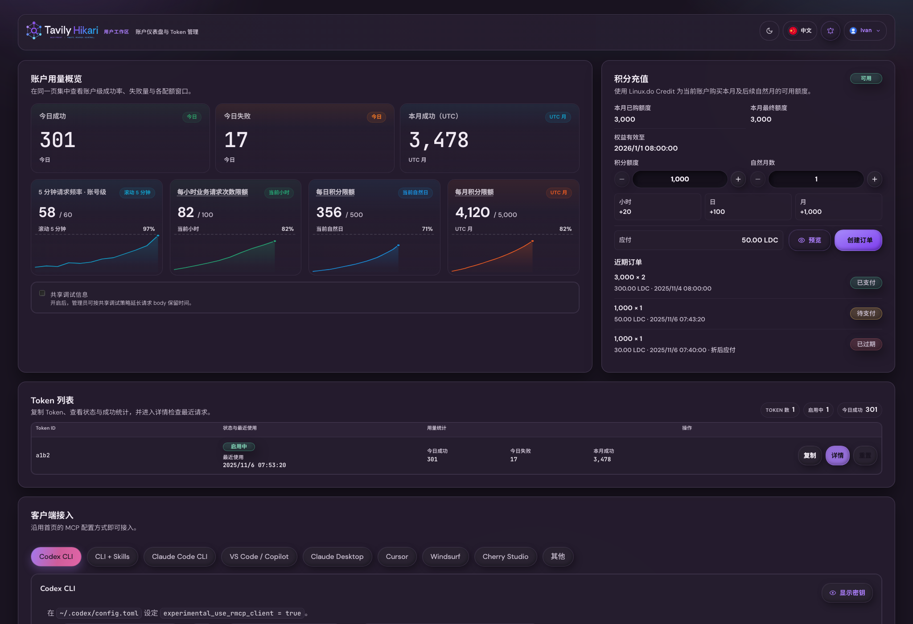
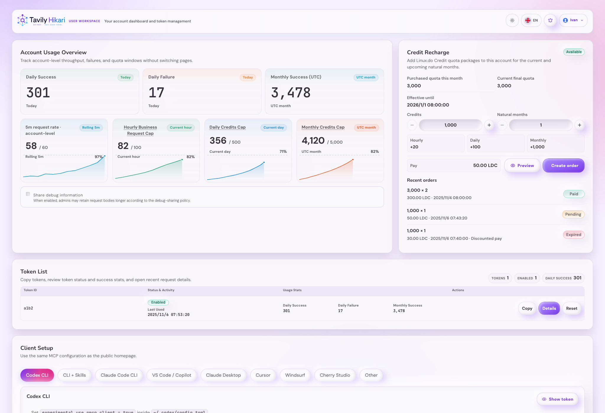
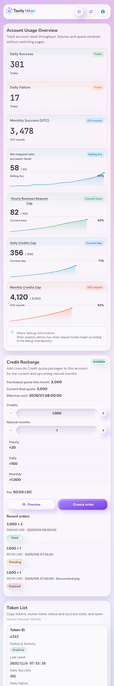
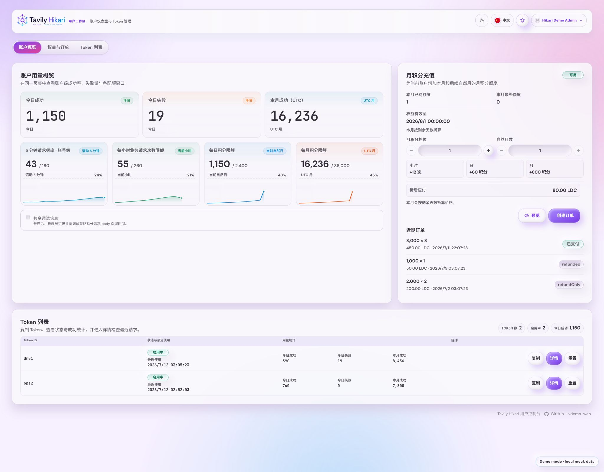

# 用户控制台单页合并（#2nx74）

## 背景 / 问题陈述

- `/console` 曾把“账户仪表盘”和“Token 管理”拆成 hash 路由；当前控制台以 pathname 路由承载同一单页体验。
- 用户进入控制台后需要先切页才能从账户概览跳到 token 列表，中间还残留一块只承载切页按钮的空白容器。
- 路由兼容边界由 `../user-console-path-routing/SPEC.md` 统一约束，本主题只负责 merged landing 的内容与定位行为。

## 目标 / 非目标

### Goals

- 将 `/console` 的 landing 体验收敛为一个纵向单页：账户概览在前，Token 列表在后。
- 充值对当前用户可见时，桌面 landing 在账户概览右侧保留完整充值卡；小屏继续按单列内容流展示。
- 访问 `/console/dashboard` 或 `/console/tokens` 时仍进入同一页，并自动定位到对应区块。
- 保留 `/console/tokens/:id` 作为独立 token detail 路由，并让 detail 返回操作固定落到单页内的 Token 列表区块。
- 同步更新 Storybook、测试与快车道交付物，使验收口径围绕 merged landing 而不是双页面切换。

### Non-goals

- 不修改 Rust 后端接口、配额计算逻辑或 `/api/user/*` 数据结构。
- 不重做 token detail 的 probe、日志或客户端接入模块。
- 不新增用户侧 token 写操作（创建、删除、轮换、禁用）。

## 范围（Scope）

### In scope

- `web/src/UserConsole.tsx`
- `web/src/lib/userConsoleRoutes.ts`
- `web/src/UserConsole.stories.tsx`
- `web/src/UserConsole.stories.test.ts`
- `web/src/lib/userConsoleRoutes.test.ts`
- `web/src/index.css`
- `docs/specs/user-console-single-page-landing/SPEC.md`
- `docs/specs/README.md`

### Out of scope

- `src/**` 后端实现与数据库 schema。
- `/admin` 管理端信息架构。
- Public Home、登录页与管理员入口权限策略。

## 需求（Requirements）

### MUST

- `/console` 首屏同时渲染账户概览区块与 Token 列表区块。
- 充值配置对当前用户可见时，`/console` 首屏还必须渲染完整充值卡及右栏布局；卡片不可见时不保留空右栏。
- `/console/dashboard` 与 `/console/tokens` 保持可访问，并自动定位到 merged landing 的对应区块。
- `/console/tokens/:id` 保持 detail 页；点击 detail 返回按钮后进入 merged landing 的 Token 列表区块。
- merged landing 与 token detail 统一渲染用户控制台 footer，包含控制台标题、GitHub 链接与版本展示/加载态。
- Storybook 与自动化断言不再把 dashboard/tokens 当成两张独立页面。

### SHOULD

- merged landing 不再保留额外的区块说明/导航条，首屏直接进入账户概览内容。
- 移动端继续沿用现有统计卡片与 token card 结构，不引入新布局分支。

### COULD

- 为 merged landing 补充更清晰的区块说明文案，帮助用户理解“概览 + Token 列表”已经合并。

## 功能与行为规格（Functional/Behavior Spec）

### Core flows

- 用户访问 `/console`
  - 默认进入 merged landing。
  - 账户概览区块位于上方，Token 列表区块位于下方。
- 用户访问 `/console/dashboard`
  - 进入 merged landing。
  - 页面自动定位到账户概览区块。
- 用户访问 `/console/tokens`
  - 进入 merged landing。
  - 页面自动定位到 Token 列表区块。
- 用户在 Token 列表点击详情
  - 进入 `/console/tokens/:id`。
  - detail 页继续保留 token probe、日志与客户端接入模块。
- 用户在 token detail 点击返回
  - 回到 `/console/tokens`。
  - merged landing 自动定位到 Token 列表区块。

### Edge cases / errors

- 若 hash 无法解析为已知 landing section，则回退到 merged landing 默认视图，不展示空白页。
- 若 token detail hash 中的 token id 解码失败，则回退到 Token 列表区块。
- 用户 OAuth 未启用时，仍显示既有 `/console` 不可用态；不渲染 merged landing 区块。

## 接口契约（Interfaces & Contracts）

### 接口清单（Inventory）

| 接口（Name）              | 类型（Kind） | 范围（Scope） | 变更（Change） | 契约文档（Contract Doc） | 负责人（Owner） | 使用方（Consumers）          | 备注（Notes）                  |
| ------------------------- | ------------ | ------------- | -------------- | ------------------------ | --------------- | ---------------------------- | ------------------------------ |
| `/console` hash semantics | route-state  | internal      | Modify         | None                     | web             | UserConsole, Storybook mocks | 仅前端 hash 解析与滚动语义变化 |
| `/api/user/dashboard`     | http-api     | external      | None           | None                     | server          | UserConsole                  | 数据契约保持不变               |
| `/api/user/tokens*`       | http-api     | external      | None           | None                     | server          | UserConsole                  | 数据契约保持不变               |

### 契约文档（按 Kind 拆分）

None

## 验收标准（Acceptance Criteria）

- Given 用户访问 `/console`
  When 页面完成首屏渲染
  Then 账户概览区块与 Token 列表区块同时存在，且不再只能显示其中一个页面状态。

- Given 用户访问 `/console/dashboard`
  When 页面渲染完成
  Then merged landing 自动定位到账户概览区块。

- Given 用户访问 `/console/tokens`
  When 页面渲染完成
  Then merged landing 自动定位到 Token 列表区块。

- Given 用户从 merged landing 的 Token 列表进入 `/console/tokens/:id`
  When 点击返回按钮
  Then 返回 `/console/tokens`，并回到 Token 列表区块而不是页面顶部。

- Given Token 列表为空
  When 用户停留在 merged landing
  Then Token 区块展示既有空态，同时账户概览区块仍保持可见。

- Given 当前用户可见充值配置
  When `/console` 在桌面宽屏完成首屏渲染
  Then 账户概览右侧显示完整充值卡，包含权益摘要、额度与月份步进器、报价预览、创建订单动作和近期订单。

- Given 当前用户不可见充值配置
  When `/console` 完成首屏渲染
  Then 不渲染充值卡，且 landing stack 不启用右栏布局。

- Given 用户访问 merged landing 或 token detail
  When 页面底部信息区完成渲染
  Then 两种视图都显示同一套用户控制台 footer，且 `/api/version` 延迟或失败不会影响主体内容显示。

- Given 本轮实现完成
  When 运行前端质量门槛
  Then `cd web && bun test` 与 `cd web && bun run build` 通过。

## 实现前置条件（Definition of Ready / Preconditions）

- 旧 hash 兼容策略已冻结为“保留并自动定位”。
- token detail 继续独立存在的边界已确认。
- Storybook 验收口径已接受从“双页面”变为“merged landing + detail”。

## 非功能性验收 / 质量门槛（Quality Gates）

### Testing

- Unit tests: `cd web && bun test`

### UI / Storybook (if applicable)

- Stories to add/update: merged landing、token focus、empty tokens、token detail 特殊态

### Quality checks

- Build: `cd web && bun run build`

## 文档更新（Docs to Update）

- `docs/specs/README.md`: 新增本 spec 索引并在完成后写回状态

## 计划资产（Plan assets）

- Directory: `docs/specs/user-console-single-page-landing/assets/`
- In-plan references: ``
- PR visual evidence source: maintain `## Visual Evidence` in this spec when PR screenshots are needed.
- If an asset must be used in impl (runtime/test/official docs), list it in `资产晋升（Asset promotion）` and promote it to a stable project path during implementation.

## Visual Evidence

- source_type=storybook_canvas
  - story_id_or_title: `User Console/UserConsole / Console Home Dark`
  - state: `desktop-dark, announcements-closed`
  - target_program: `mock-only`
  - capture_scope: `browser-viewport`
  - sensitive_exclusion: `N/A`
  - submission_gate: `approved`
  - evidence_note: 证明 landing 暗色桌面态的 overview、充值面板与 Token 表格已降低嵌套卡片边界。
  - image:
    
- source_type=storybook_canvas
  - story_id_or_title: `User Console/UserConsole / Console Home`
  - state: `desktop-light, announcements-closed`
  - target_program: `mock-only`
  - capture_scope: `browser-viewport`
  - sensitive_exclusion: `N/A`
  - submission_gate: `approved`
  - evidence_note: 证明 landing 浅色桌面态保留可扫读数据分组，同时不再叠加厚 summary/order/table 卡片。
  - image:
    
- source_type=storybook_canvas
  - story_id_or_title: `User Console/UserConsole / Console Home Tokens Focus Mobile`
  - state: `mobile-token-focus, announcements-closed`
  - target_program: `mock-only`
  - capture_scope: `browser-viewport`
  - sensitive_exclusion: `N/A`
  - submission_gate: `approved`
  - evidence_note: 证明移动端仍只保留 token item 作为重复卡片层，并且 token 数据与充值 delta 不再横向溢出。
  - image:
    
- source_type=ui_demo
  - demo_entry_or_url: `/console?demo=1&announcements=closed`
  - state: `desktop-recharge-rail`
  - target_program: `mock-only`
  - capture_scope: `browser-viewport`
  - requested_viewport: `2048x1600`
  - viewport_strategy: `browser-capability-override`
  - sensitive_exclusion: `N/A`
  - submission_gate: `approved`
  - evidence_note: 证明可见充值配置会在账户概览右侧恢复完整充值卡，包含权益摘要、档位与月数步进器、报价、预览、创建订单和近期订单；概览与 Token 列表仍保持同页结构且无横向溢出。
  - image:
    

## 资产晋升（Asset promotion）

None

## 方案概述（Approach, high-level）

- 抽离一层轻量的 user-console hash route helper，统一运行时与 Storybook 对 legacy hash 的解释。
- landing 路由不再控制“挂载哪一个页面”，而是只控制“同一页里默认聚焦哪个区块”。
- detail 页继续沿用现有数据请求与 probe 行为，减少变更半径。

## 风险 / 开放问题 / 假设（Risks, Open Questions, Assumptions）

- 风险：hash 更新与自动滚动若处理不当，可能出现双滚动或定位失效。
- 风险：Storybook 控件与 preset stories 若未同步收口，仍会泄露旧的双页面语义。
- 假设：当前用户控制台 landing 无需新增后端字段即可支撑单页合并。

## 参考（References）

- `docs/specs/account-quota-user-console/SPEC.md`
- `docs/specs/user-console-storybook-acceptance-controls/SPEC.md`
