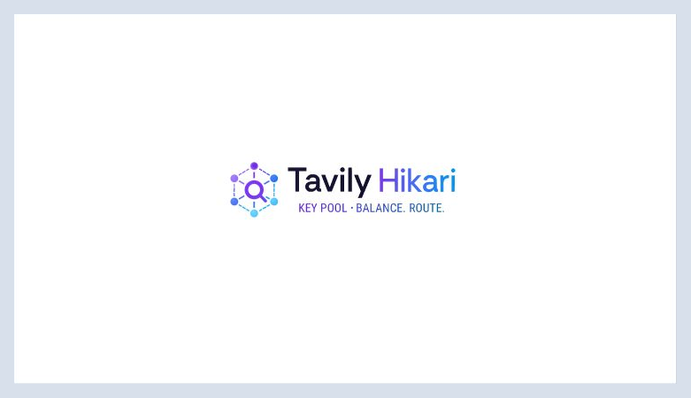
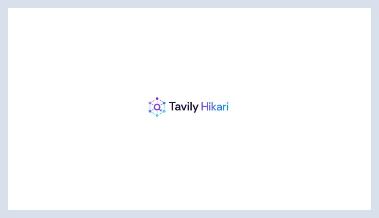
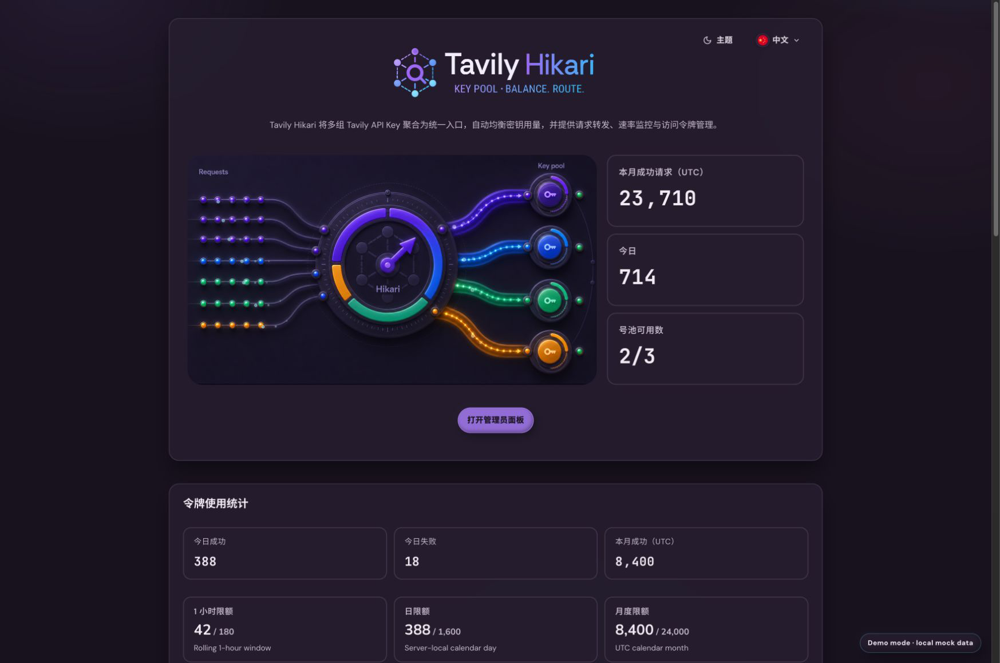
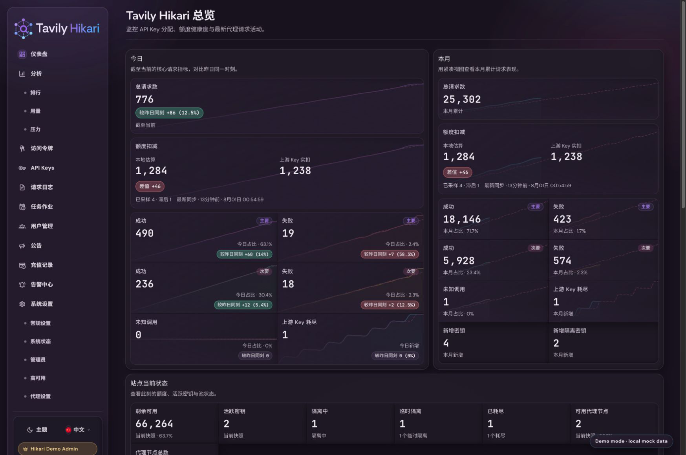
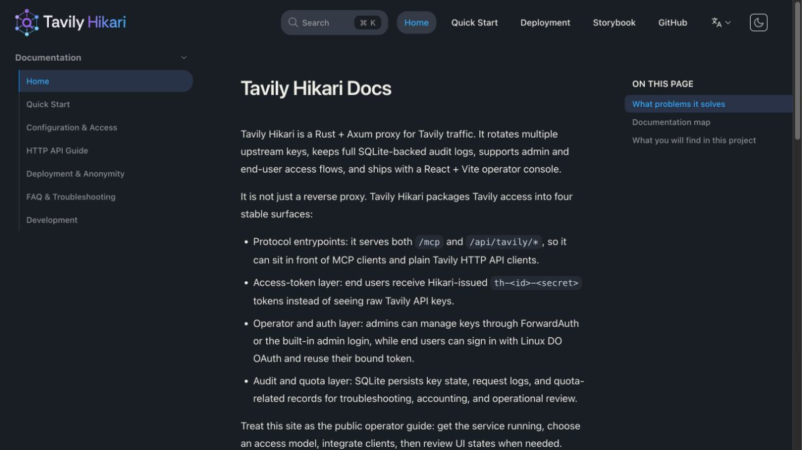
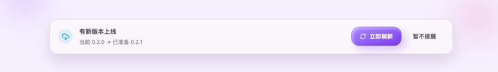
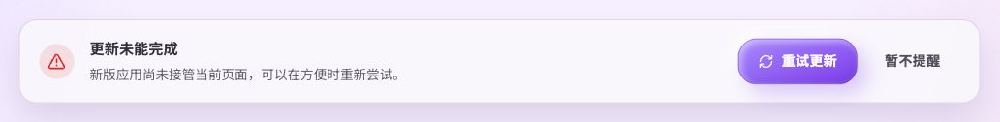
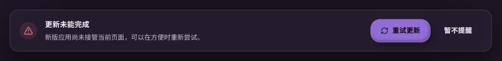
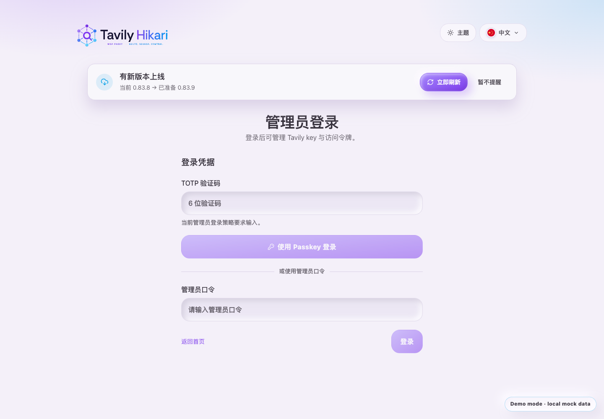
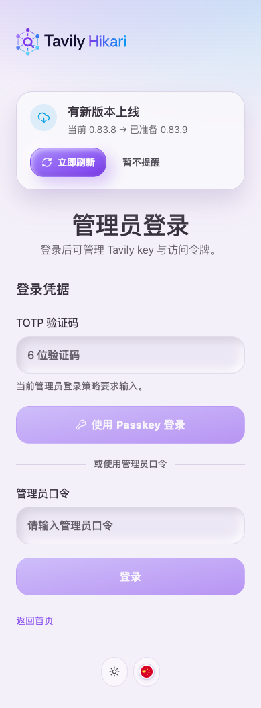

# Web PWA 双身份离线壳与管理员缓存预算控制（#2br7z）

## 背景 / 问题陈述

- 当前 Web 前台、用户控制台与管理员后台都没有真正的 PWA 合同，已访问用户在断网时只能看到浏览器级失败或空白。
- 现有静态托管是 multipage HTML，但没有 service worker、manifest、离线壳页或浏览器安装身份，因此无法为已访问用户提供“离线还能打开页面框架，但数据区明确失败”的体验。
- 你的核心资源约束不是“前端包绝对保密”，而是“不让普通用户长期缓存管理员 Web App”；这要求 admin 与 public 不能共享单一 PWA identity。

## 目标 / 非目标

### Goals

- 将公共/用户侧与管理员侧拆成两套独立 PWA identity、manifest、service worker、scope 与安装入口。
- 让已在线访问过相应页面的用户在离线时仍可打开公共首页、用户控制台与管理员后台的页面壳。
- 所有业务数据请求、SSE、MCP、登录提交与保存/操作在离线时都保持明确失败语义，不伪造成功，不回显旧快照。
- 非管理员不注册 admin service worker、不看到 admin manifest 安装入口、不在 public SW cache 中形成 admin 壳页长期缓存。
- 将 public/admin 双身份 PWA 的 regular/maskable 图标与站点 favicon 收口到 repo-local 的经批准 Relay Mesh lockup/icon 导出链，不改变 identity/scope/start_url；产品 App 不生成 Apple touch icon，docs-site 的独立图标不在本合同内。
- 安装元数据必须可重新验证：manifest 保持稳定 identity，图标 URL 随最终内容哈希变化，HTML 与 service worker 不得把旧 manifest 或旧安装图标固定在缓存链路中。
- 将完整 Relay Mesh lockup 的副标语固定为 `KEY POOL · BALANCE. ROUTE.`；完整 lockup 只在可用品牌容器宽度不小于 `260px` 时显示，较窄容器统一使用无副标语 compact 版本。
- 补齐测试、Storybook 状态、浏览器离线验证与视觉证据，并将合同冻结到本 spec。

### Non-goals

- 不实现离线业务 JSON 快照、最后成功数据回显、Background Sync、Push 或离线 mutation 队列。
- 不调整后端鉴权模型、管理员 cookie、LinuxDo OAuth 流程或 `/api/*` 返回结构。
- 不为了完全阻止普通用户瞬时下载任意 admin 前端资源而重构静态资源权限托管。
- 不把 `/login` 纳入 admin PWA scope，也不拆出第三套独立身份给 `/console`。

## 范围（Scope）

### In scope

- `web/vite.config.ts`
- `web/package.json`
- `web/scripts/**`
- `web/*.html`
- `web/public/assets/relay-mesh-lockup*.png`
- `web/public/assets/relay-mesh-icon*.png`
- `web/public/assets/relay-mesh-mark*.{png,svg}`
- `web/public/assets/linuxdo-logo.svg`
- `web/public/assets/favicon-*.png`
- `web/src/*main.tsx`
- `web/src/api/runtime.ts`
- `web/src/components/**`
- `web/src/PublicHome.tsx`
- `web/src/user-console/runtime.tsx`
- `web/src/admin/AdminDashboardRuntime.tsx`
- `docs-site/rspress.config.ts`
- `docs-site/theme/**`
- `docs-site/docs/public/assets/relay-mesh-lockup*.png`
- `docs-site/docs/public/assets/relay-mesh-icon*.png`
- `docs-site/docs/public/assets/relay-mesh-mark*.{png,svg}`
- `docs-site/docs/public/assets/favicon-*.png`
- `docs-site/docs/public/assets/apple-touch-icon.png`
- `src/server/spa.rs`
- `src/server/serve.rs`
- `docs/specs/README.md`

### Out of scope

- 后端业务 API handler 语义与数据库迁移。
- Firefox PWA 安装的正式兼容承诺。
- 新路由框架接入或单页路由体系重写。

## PWA 身份合同

### 公共 / 用户侧 identity

- `manifest.webmanifest`
- `id=/`
- `scope=/`
- `start_url=/`
- 安装入口存在于 `/`、`/console/**`、`/login`、`/registration-paused`
- public service worker 仅缓存公共/用户侧 HTML 壳与对应静态资源

### 管理员 identity

- `manifest-admin.webmanifest`
- `id=/admin/`
- `scope=/admin/`
- `start_url=/admin/`
- 安装入口只存在于 `/admin/**`
- admin service worker 只缓存 admin HTML 壳与对应静态资源

### 关键边界

- `login.html` 只归公共 identity，不暴露 admin manifest。
- `admin.html` 不承载公共 manifest。
- public service worker 不能把 `/admin/**` 作为 navigation fallback，也不能把 admin HTML 或 admin 入口图纳入 precache/runtime cache。
- admin identity 只在管理员真实进入 `/admin/**` 后才注册并形成持久缓存。

### 安装元数据与图标更新合同

- `id`、`scope` 与 `start_url` 是稳定的 identity 合同：public 固定为 `/`，admin 固定为 `/admin/`；`/admin` 仍由入口路由归一到 `/admin/`。
- 各 HTML shell 只声明自身对应的 manifest，不声明 `rel="apple-touch-icon"`。在 WebKit 中 legacy `apple-touch-icon` 会优先于 manifest 图标，因此不能让它成为未重新验证的第二套安装元数据来源。
- PWA regular/maskable PNG 必须以最终 PNG 字节的短 SHA-256 摘要命名，例如 `pwa/admin-1024-<content-hash>.png` 与 `pwa/admin-maskable-512-<content-hash>.png`；manifest 只能引用当前导出的 URL。图标 artwork 继续使用已批准的 Relay Mesh light/dark icon，不在本轮重新设计。
- 方形 launcher、maskable 与 mono 图标必须按可见前景边界居中；批准稿透明画布中的 padding 不得把 mark 推离图标画布中心。
- HTML shell、两个 manifest、两个 service worker 与 `version.json` 必须使用 `no-cache, must-revalidate`；带内容哈希的 `pwa/*.png` 使用 `public, max-age=31536000, immutable`。
- Service Worker 不得预缓存或 cache-first 固化 manifest、regular 图标、maskable 图标或产品 Apple 图标路径；只预缓存当前 identity 的应用壳及其构建依赖。manifest 与图标请求必须留在普通网络路径，分别遵守 metadata revalidation 与内容哈希 immutable 缓存。public/admin 不得互相预缓存 manifest 或图标；页面注册 worker 时使用 `updateViaCache: 'none'`。

### 平台更新边界

- Android Chrome/WebAPK 与 Chromium desktop 依赖稳定 `id` 将发布后的 manifest 继续识别为同一已安装应用；新的图标 URL 和可重新验证的 manifest 让支持这些更新语义的平台取得新安装元数据。Android/WebAPK 通常在应用被启动或浏览器执行更新检查时处理，desktop Chromium 会在应用窗口关闭后应用选定的 manifest 更新；更新交付不以重新安装作为正常机制。
- iOS/iPadOS 的新安装在支持 manifest 图标的版本上使用 manifest；但既有 Web Clip 的图标已经写入系统主屏幕，平台没有可由网站触发的强制迁移机制。若页面同时提供 `apple-touch-icon`，WebKit 可能优先使用它，因此本合同不再提供该 legacy link。
- 其他不支持或不重新同步 Web App manifest 元数据的浏览器同样不能被网站强制迁移既有安装图标。部署只能保证后续支持该合同的新安装/更新检查使用当前 manifest；不得把“重新安装”作为常规修复指引。
- 平台依据：Chromium `id` 合同参见 [Chrome manifest id guidance](https://developer.chrome.com/docs/capabilities/pwa-manifest-id)，跨平台更新行为参见 [Web App Manifest update behavior](https://web.dev/learn/pwa/update?hl=en)，WebKit 的 `apple-touch-icon` 优先级参见 [Web Push for Web Apps on iOS and iPadOS](https://webkit.org/blog/13878/web-push-for-web-apps-on-ios-and-ipados/)。

## 更新提示合同

- `sw-public.js` 与 `sw-admin.js` 安装时必须先完成 precache，再进入 waiting；不得在 install 阶段主动 `skipWaiting()`。
- 页面检测到 `/api/version.frontend` 变化时，只触发当前 identity 的 `registration.update()`；用户可见的更新提示必须以 service worker 已发现 waiting worker 且新版资源已准备完成为准。安装/缓存中的中间态保持静默，不对用户暴露“正在更新”的提示。
- 更新提示中的“当前版本”必须读取当前 HTML shell 的 `tavily-hikari-build-version` meta 标记，表示当前页面实际运行的前端 bundle 版本；“目标版本”必须表示后端当前提供、且与 waiting worker 对齐的具体版本号，不得回退为 `latest`、channel 名称或其他非版本号占位词。
- 用户点击更新时：
  - 若新 worker 已经 waiting，页面向该 worker 发送 `TAVILY_HIKARI_ACTIVATE_UPDATE`，由 worker `skipWaiting()`，并立即刷新当前页以应用新版本。
  - worker 的 activate 事件只清理旧 cache，不调用 `clients.claim()`；版本更新由目标 worker 到达 `activated` 后 reload，并在新导航中接管页面。
  - 页面只在用户主动更新后的 `controllerchange` 中 reload，避免静默打断当前任务。
  - waiting worker 已进入 `activated` 但当前页未收到 `controllerchange` 时，页面允许执行一次受 guard 保护的 reload；不得形成刷新循环。
  - 激活请求在 10 秒内既未接管页面也未确认 worker 已激活时，提示必须退出 loading 并进入可重试失败态；`redundant` 与消息发送异常同样按失败处理。
- 若用户不点击“立即刷新”，页面在下一次离开当前页或手动刷新时，会静默请求 waiting worker `skipWaiting()`，使下一次导航直接进入新版本。
- 首次安装 identity 时以当前 registration 是否已有 active worker 判定是否属于更新；public 根作用域 controller 不得让 admin 首次安装误报“有新版本”，此时 admin waiting worker 应静默激活。
- 更新提示必须覆盖 `/`、`/console`、`/login`、`/registration-paused` 与 `/admin/**`，但继续保持 public/admin 双 service worker 边界。
- 登录页的更新提示属于页面级运行状态，必须位于品牌/全局控件组成的页头之后、登录主内容之前；不得嵌入登录凭据或表单流程。桌面端使用页头级宽度，移动端操作按钮保持同行且不得造成横向溢出。
- 提示形态为 inline banner，不使用 modal，不强制用户立即刷新。

## 离线行为合同

### Public / Console

- 已访问过 `/`、`/console/**`、`/login`、`/registration-paused` 的用户，在离线时仍可打开相应壳页。
- 页面框架、主题切换、静态文案与本地 UI 状态可用。
- `/api/*`、`/mcp`、SSE、登录动作、保存动作一律 network-only，Service Worker 不得对其调用 `respondWith`，由浏览器网络栈直接处理并在失败时显示明确错误。
- 离线访问 `/admin` 时，public SW 不提供 admin shell fallback。

### Admin

- 已作为管理员在线访问过 `/admin/**` 的浏览器，在离线时可打开 admin 壳页与路由骨架。
- Dashboard、列表、HA、设置、日志流与保存动作均不展示旧业务数据快照，只显示明确失败或不可用状态。
- admin SW 只能在 admin scope 内处理 navigation fallback，不接管 `/`、`/console`、`/login`。

## 接口契约（Interfaces & Contracts）

### 产物

- `web/dist/manifest.webmanifest`
- `web/dist/manifest-admin.webmanifest`
- `web/dist/sw-public.js`
- `web/dist/sw-admin.js`
- `web/dist/pwa/public-*-<content-hash>.png`
- `web/dist/pwa/admin-*-<content-hash>.png`
- `web/public/assets/relay-mesh-lockup*.png`
- `web/public/assets/relay-mesh-icon*.png`
- `web/public/assets/relay-mesh-mark*.{png,svg}`
- `web/public/assets/linuxdo-logo.svg`
- `web/public/assets/favicon-*.png`
- `docs-site/docs/public/assets/relay-mesh-lockup*.png`
- `docs-site/docs/public/assets/relay-mesh-icon*.png`
- `docs-site/docs/public/assets/relay-mesh-mark*.{png,svg}`
- `docs-site/docs/public/assets/favicon-*.png`

### 构建输入

- Vite build manifest 必须开启，供 post-build 读取 multipage output graph。
- 生成脚本必须按 entrypoint 归类 public/admin asset graph，并输出两套 PWA 合同文件。
- Relay Mesh 资产导出链必须显式产出 light / dark / mono 变体，并保留默认亮色别名文件用于现有入口兼容。
- 完整 lockup 的 tagline 使用仓库固定、预实例化的 Roboto Condensed weight 400 与 OFL 1.1 许可证作为 outline 生成输入；发布 SVG 不得包含 `<text>`、`<image>`、`href`、data URI 或运行时字体依赖。
- 完整 lockup 必须保持批准稿的 `1000 × 310` 横向轮廓与品牌语法：Relay Mesh mark 位于左列，wordmark 与 tagline 组成共享光学中轴的右侧两行文字块；tagline 使用 `tagline-primary`、`tagline-separator`、`tagline-secondary` 三个逻辑组，其中 separator 是字间点而非竖线。Tagline outline 总高度必须保持在 `36–39` SVG units、总宽度保持在 `625–635` units，与上移后的 wordmark 保留 `20–28` units 的可见间距，水平中心限定在 `610–620` units；全文使用单一连续渐变，亮色端点为 `#6D28D9 → #0369A1`，暗色端点为 `#A78BFA → #38BDF8`，文字颜色在对应设计基准背景上必须达到 `4.5:1` 对比度。
- Web 与 docs-site 的 SVG/PNG lockup 必须从同一矢量母版导出并保持内容哈希一致；compact 资产不得包含 tagline path 或未使用的 tagline gradient。

### 品牌组件合同

- `BrandLockup.variant` 只允许 `full | compact | responsive`，默认 `full`；旧 `compact` 布尔接口不再保留。
- `responsive` 按实际可用品牌容器宽度切换：`>=260px` 使用完整 lockup，`<260px` 使用无副标语 compact lockup；亮暗主题下通过单一可访问名称暴露品牌。
- 公共首页、用户控制台、管理员后台、登录、暂停注册与 404 都使用 `responsive`；完整品牌位不小于 `260px`。
- Rspress 通过 custom theme 的 `Layout.navTitle` 插槽复用同一容器查询与主题切换合同；文档导航属于 utility 位，品牌容器固定为 `180px`，因此选择 compact lockup 而不是把完整版缩进导航栏。
- PWA manifest 必须覆盖 `64, 96, 128, 144, 152, 167, 180, 192, 256, 384, 512, 1024` 尺寸，并额外提供 `192/512` maskable 图标。

### 静态托管

- Rust 静态服务必须可直出 `.webmanifest`、`sw-public.js`、`sw-admin.js` 与 `pwa/*` 图标资产。
- `.webmanifest` 返回 `application/manifest+json`。
- HTML shell、manifest、service worker 与 `version.json` 必须要求重新验证；内容哈希 PWA 图标必须返回 immutable 缓存策略。
- service worker 脚本必须可在浏览器直接访问。
- owner-facing 品牌位统一通过 `/assets/*` 暴露；`/favicon.svg` 只作为站点 favicon 入口保留根路径合同。

## 验收标准（Acceptance Criteria）

- Given 普通用户只访问过公共页或控制台
  When 浏览器离线后访问 `/` 或 `/console/**`
  Then 页面壳可打开，数据区显示明确离线/加载失败提示。

- Given 普通用户安装了公共 PWA
  When 浏览器离线后直接访问 `/admin`
  Then 不得命中 cached admin shell，不得形成 admin 安装身份，只能得到网络失败或非 admin fallback 语义。

- Given 真实管理员已在线访问 `/admin/**`
  When 离线后重开 `/admin/**`
  Then admin 壳与导航可打开，但数据模块、保存与操作全部维持失败语义，不显示旧业务快照。

- Given 任意身份离线
  When 触发 `/api/*`、SSE、MCP、登录提交、保存动作
  Then 一律保持 network failure 语义，不返回伪成功。

- Given 同源的 network-only 请求命中 public/admin service worker fetch listener
  When 请求属于 `/api/*`、SSE、MCP、认证或写操作
  Then worker 不得调用 `respondWith`，请求必须由浏览器网络栈直接处理。

- Given 同源的未预缓存普通运行时资源被 public/admin service worker 拦截
  When 底层网络请求拒绝
  Then worker 必须返回可处理的 `503 Service Unavailable` 响应，而不是让 `FetchEvent`
  的 `respondWith` promise 拒绝。

- Given 后端报告新的 `frontend` 版本
  When 当前 identity 的 service worker 尚未完成新资源安装
  Then 页面只触发更新检查，不提示“可更新”，后台继续静默完成安装。

- Given 当前页面运行旧 bundle，而服务端已提供更新版本
  When 更新提示出现
  Then 提示中的当前/目标版本都必须是具体版本号，并准确表示“当前页版本 → 已准备的新版本”。

- Given 新 service worker 正在安装并缓存资源
  When 当前页继续工作
  Then 页面保持静默，不向用户展示安装中的中间态。

- Given 新 service worker 已经 waiting
  When 用户点击更新按钮
  Then 页面发送 `TAVILY_HIKARI_ACTIVATE_UPDATE` 并在 `controllerchange` 后 reload。

- Given 新 service worker 已经 waiting 且用户没有点击更新按钮
  When 用户随后手动刷新页面或离开后再次进入同一 identity
  Then 下次导航必须直接进入新版本，而不是继续停留在旧 bundle。

- Given 当前页面存在 SSE 或 MCP 等长连接
  When waiting worker 收到激活请求
  Then 旧 worker 不得持有这些 network-only 请求的 FetchEvent，新 worker 必须完成激活并由页面 reload 接管。

- Given 用户已请求激活 waiting worker
  When 10 秒内没有 controller 接管、worker 激活确认或可恢复终态
  Then 更新提示退出 loading，说明更新未完成，并允许用户重试或暂不提醒。

- Given admin identity 首次注册且当前页面仅由 public 根作用域 service worker 控制
  When admin worker 完成安装
  Then admin worker 静默激活，不展示版本更新提示，不触发主动 reload。

- Given 只发布了新的前端版本号且稳定静态资源内容未改变
  When post-build 写入 HTML shell meta、`version.json` 与两个 service worker
  Then 五个 HTML shell、两个 worker 与 `version.json` 携带新版本，旧 shell 仍可离线运行，且 worker cache identity 发生变化。

- Given public 或 admin 的 regular/maskable 安装图标内容发生变化
  When post-build 生成 PWA 产物
  Then 对应 manifest 的图标 URL 必须包含新内容哈希，旧 URL 不得被 manifest 继续引用，且该 identity 的 worker precache 不得包含 manifest 或当前图标 URL。

- Given 已安装 V1 的 Chromium Android/WebAPK 或 desktop Chromium identity
  When 同一 origin 发布 V2 manifest 与 content-hashed 图标并执行正常启动/更新检查
  Then 在 waiting worker 激活前后都能取得 V2 manifest 与图标，`id`、`scope`、`start_url` 保持稳定，无需卸载或重新安装。

- Given 浏览器请求 HTML、manifest、service worker、version metadata 或内容哈希 PWA 图标
  When Rust 静态服务返回资源
  Then metadata 必须要求重新验证，内容哈希图标必须允许长期 immutable 缓存。

- Given Chromium Android/WebAPK 或 desktop Chromium 检查同一稳定 `id` 的更新 manifest
  When 图标 URL 和 manifest 内容按本合同发布
  Then 平台可把新图标作为同一安装 identity 的更新元数据处理，不要求用户按常规流程重新安装。

- Given 已存在的 iOS/iPadOS Web Clip 或不支持 manifest 元数据同步的浏览器安装
  When 服务端发布新的 manifest 图标 URL
  Then 网站不得承诺强制改写既有系统图标；该平台限制必须保持文档化，且页面不得通过 legacy `apple-touch-icon` 引入跨来源覆盖。

## 非功能性验收 / 质量门槛（Quality Gates）

### Testing

- `cd web && bun test`
- `cargo test`
- 版本 A/B 构建门禁必须证明稳定 `assets/**`、`pwa/**`、favicon、两个 manifest 与 Vite manifest 不随纯版本发布变化；仅五个 HTML shell、两个 worker 与 `version.json` 可以变化。

### Build

- `cd web && bun run build`
- `cd web && bun run build-storybook`

### Browser / E2E

- `bun run test:e2e:pwa-offline`
- Chromium 自动化覆盖公共页、控制台、管理员后台三段离线路径。
- Safari/iOS 的安装与离线重开仍需手工补验；在补验前，以上述 Web Clip 无法强制迁移的限制作为明确平台边界，不把重新安装作为常规更新机制。

## Visual Evidence

- `2026-08-01` 品牌组件容器阈值（Storybook canvas，mock-only，`require_margin`）：

  `260px` 容器显示完整 lockup，`220px` 容器切换到紧凑版且在自身容器内居中。

  

  

- `2026-08-01` 品牌消费面（ui_demo / Rspress preview，mock-only，`trim_only`）：

  公共首页使用桌面完整版本；后台侧栏因实际可用宽度为 `230px` 正确切换为紧凑版本；文档站作为导航 utility 位固定为 `180px`，正确使用紧凑版本。

  

  

  

- `97cccf60` 公共首页离线壳：`docs/specs/web-pwa-split-identities-offline-shells/assets/public-offline-shell.png`
- `97cccf60` 用户控制台离线壳：`docs/specs/web-pwa-split-identities-offline-shells/assets/console-offline-shell.png`
- `97cccf60` 管理员后台离线壳：`docs/specs/web-pwa-split-identities-offline-shells/assets/admin-offline-shell.png`
- 统一离线提示 banner 图标调整：`docs/specs/web-pwa-split-identities-offline-shells/assets/offline-banner-web-off.png`
- `95768005+` Relay Mesh public 品牌入口：`docs/specs/web-pwa-split-identities-offline-shells/assets/relay-mesh-public-home.png`
- `95768005+` Relay Mesh console 品牌入口：`docs/specs/web-pwa-split-identities-offline-shells/assets/relay-mesh-console-header.png`
- `95768005+` Relay Mesh admin 品牌入口：`docs/specs/web-pwa-split-identities-offline-shells/assets/relay-mesh-admin-shell.png`
- `95768005+` Relay Mesh admin login 品牌入口：`docs/specs/web-pwa-split-identities-offline-shells/assets/relay-mesh-admin-login.png`
- `95768005+` Relay Mesh registration-paused 品牌入口：`docs/specs/web-pwa-split-identities-offline-shells/assets/relay-mesh-registration-paused.png`
- `95768005+` Relay Mesh docs-site 品牌入口：`docs/specs/web-pwa-split-identities-offline-shells/assets/relay-mesh-docs-site.png`
- `95768005+` Relay Mesh PWA/icon 导出预览：`docs/specs/web-pwa-split-identities-offline-shells/assets/relay-mesh-pwa-icons.png`
- 当前 PWA install icon 交付修复：使用上述批准预览与构建后 public light/admin dark PNG 输出做 mock-only artifact comparison；确认批准 mark artwork 未重绘，最终方形图标按可见前景边界居中，同时更新文件名、manifest 引用与缓存策略。
- `2026-06-27` 品牌静态资源 `/assets` 路由校准后的 admin 壳验证：`docs/specs/web-pwa-split-identities-offline-shells/assets/relay-mesh-admin-shell-assets-route-fixed.png`
- `2026-07-15` PWA 更新提示 ready 状态（Storybook canvas，静默更新完成后通知 + 具体版本号 + “立即刷新”按钮）：

  
- `2026-07-08` PWA 更新提示 installing/loading 状态（Storybook canvas）：`docs/specs/web-pwa-split-identities-offline-shells/assets/update-banner-installing-storybook.png`
- `2026-07-08` PWA 更新提示 dark ready 状态（Storybook canvas）：`docs/specs/web-pwa-split-identities-offline-shells/assets/update-banner-dark-ready-storybook.png`
- `2026-07-11` PWA 更新激活失败亮色态（Storybook canvas，mock-only，element capture，无敏感数据）：

  

- `2026-07-11` PWA 更新激活失败暗色态（Storybook canvas，mock-only，element capture，无敏感数据）：

  

- `2026-07-31` 管理员登录页更新提示位于页头下方（Storybook canvas，mock-only，无敏感数据）：

  

- `2026-07-31` 管理员登录页更新提示移动端布局（Storybook canvas，mock-only，无敏感数据）：

  

## Related ADRs

- None

## 风险 / 假设

- 假设：本轮“不要让非管理员缓存 admin Web App”的定义聚焦于 PWA/service worker 长期缓存与安装身份，而不是普通 HTTP 层的瞬时下载。
- 风险：Safari/iOS 对多 identity 安装入口、scope 与既有 Web Clip 元数据更新的表现比 Chromium 更保守；网站不能强制迁移既有系统图标，因此保持该平台限制并等待手工验证。
- 风险：管理员后台已有大量模块化加载状态，离线时若错误语义分散，必须通过共享错误规范避免出现局部空白。
- 假设：产品命名继续保持 `Tavily Hikari` / `Tavily Hikari Proxy`，`Relay Mesh` 仅作为视觉资产方向，不构成对外 rename。
