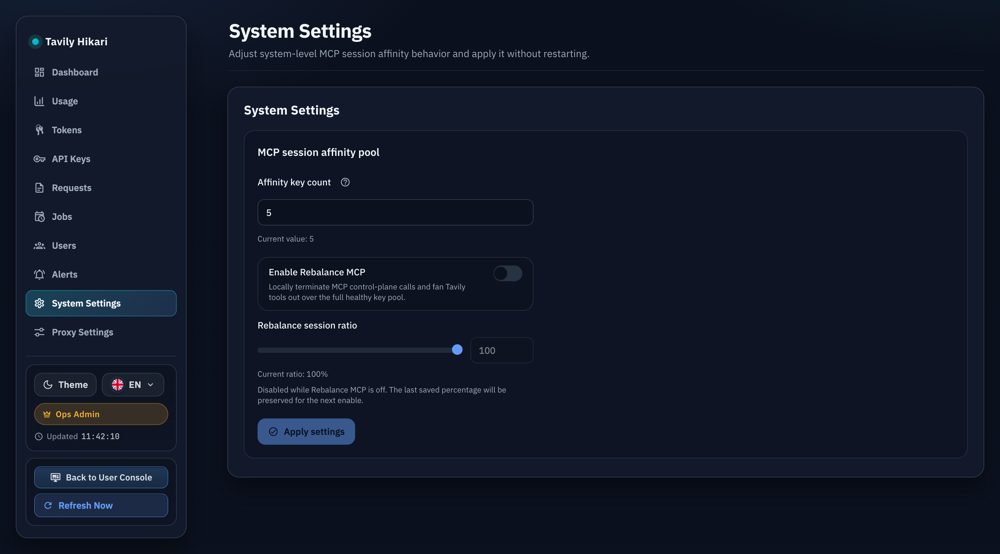
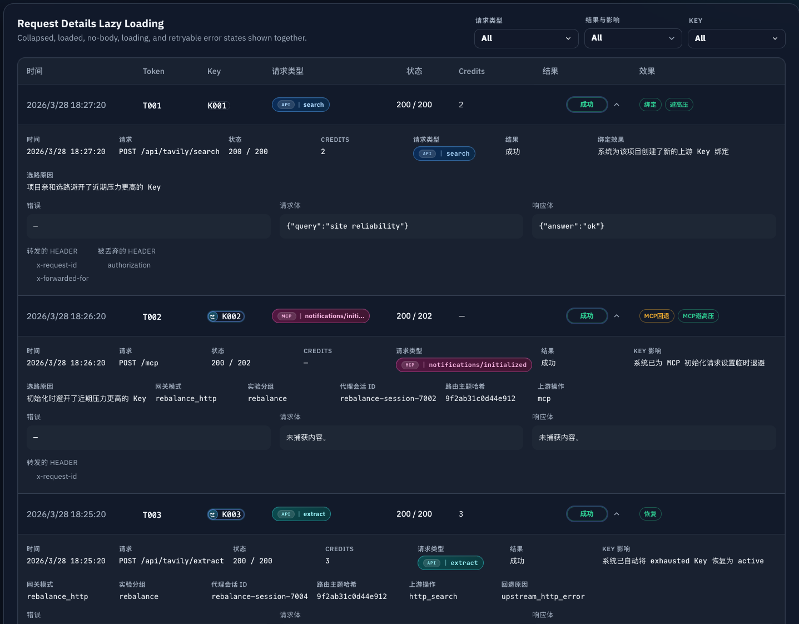

# Rebalance MCP Gateway（#xm3dh）

## 状态

- Status: 进行中（快车道）
- Created: 2026-04-13
- Last: 2026-04-27

## 背景 / 问题陈述

- 当前 `/mcp` follow-up 会话会绑定单个上游 MCP session 与单个 key，热点 key 容易放大 429。
- 我们已经具备 `/api/tavily/*` 的 HTTP 代理、全量健康号池、429 backoff 与 research usage-diff 计费能力，但 `/mcp` 仍停留在 passthrough 模式。
- 需要在不改变对外 `/mcp` URL 与鉴权格式的前提下，为 MCP 增加第二套“本地终止 + HTTP 转发”的后端执行策略，并通过开关与会话级 A/B 控制灰度。

## 目标 / 非目标

### Goals

- 把 **Rebalance MCP** 定义为 `/mcp` 的第二套后端执行策略，而不是新增公开入口。
- 扩展系统设置与 Admin UI：
  - `mcpSessionAffinityKeyCount`
  - `rebalanceMcpEnabled`
  - `rebalanceMcpSessionPercent`
- `/mcp initialize` 按会话级 A/B 固化 `control` 或 `rebalance`；已有会话不随设置变更漂移。
- `rebalance` 模式下，本地处理 `initialize / ping / tools/list / prompts/list / resources/list / resources/templates/list / notifications/* / tools/call`。
- `search / extract / crawl / map` 使用全量候选 key 排序，优先级固定为：active cooldown → 最近 60 秒 429 次数 → 最近 60 秒 billable 压力 → `last_used_at` LRU → stable rank。
- `research` 继续保留 usage-diff 计费与 request-id 亲和模型，但改为通过本地 gateway 包装为 MCP JSON-RPC 响应。
- 收紧 Rebalance HTTP 头白名单，只发送必要头字段。
- 为 `mcp_sessions`、`request_logs`、`auth_token_logs` 补齐排障字段，并在 Admin 请求详情中可见。

### Non-goals

- 不改公开 `/mcp` URL、用户 token 格式或鉴权方式。
- 不承诺完全消灭 429；目标是显著缓解单会话/单 key 热点。
- 不把 Rebalance 选路重新绑定回 `X-Project-ID` 亲和；非 research 工具调用保持“每次调用重新全池选 key”。
- CI 与回归测试限定本地 / mock upstream；允许一次受批准的官方 Remote MCP 行为对比，用于更新 schema
  snapshot 与协议证据，不把生产 Tavily endpoint 纳入自动化测试。

## 范围（Scope）

### In scope

- `src/store/mod.rs`
  - `mcp_sessions` 扩展 `gateway_mode`、`experiment_variant`、`ab_bucket`、`routing_subject_hash`、`fallback_reason`，并允许 `upstream_session_id` / `upstream_key_id` 为空。
  - `request_logs` / `auth_token_logs` 新增诊断字段并升级查询/映射。
- `src/models.rs`
  - 扩展 `AttemptLog`、`SystemSettings`、`RequestLogRecord`、`TokenLogRecord`、`McpSessionBinding`。
- `src/tavily_proxy/mod.rs`
  - 新增 Rebalance MCP HTTP full-pool selector。
  - 新增 strict Rebalance HTTP header allowlist。
  - 新增 MCP façade 用的 HTTP endpoint wrappers（含 research usage-diff）。
- `src/server/proxy.rs`
  - initialize A/B 决策。
  - local MCP façade。
  - control / rebalance follow-up 分流。
  - session create/touch/update/revoke 逻辑按 gateway mode 分化。
- `src/server/handlers/admin_resources.rs`
- `src/server/dto.rs`
- `web/src/api.ts`
- `web/src/AdminDashboard.tsx`
- `web/src/admin/SystemSettingsModule.tsx`
- `web/src/components/AdminRecentRequestsPanel.tsx`
- `web/src/admin/*.stories*`
- `web/src/i18n.tsx`

### Out of scope

- 请求日志列表新增单独筛选器或表格列。
- 第二套独立 Admin 模块或单独 `/mcp-rebalance` 路由。
- 生产 rollout 与真实流量灰度策略。

## 接口契约（Interfaces & Contracts）

### System settings

- `GET /api/settings` 与 `PUT /api/settings/system` 同步返回/更新：
  - `mcpSessionAffinityKeyCount`
  - `rebalanceMcpEnabled`
  - `rebalanceMcpSessionPercent`
- `rebalanceMcpSessionPercent` 范围固定为 `0..100`。
- 关闭功能时仍保留最近一次百分比配置，但运行时忽略该值。

### MCP session model

- `gateway_mode` 允许：
  - `upstream_mcp`
  - `rebalance_http`
- `experiment_variant` 允许：
  - `control`
  - `rebalance`
- `ab_bucket` 固定为 `0..99` 的稳定会话桶位。
- `routing_subject_hash` 只存 hash，不存原始项目路由标识。

### Rebalance MCP tool surface

- `tools/list` 发布 canonical underscore 名称：
  - `tavily_search`
  - `tavily_extract`
  - `tavily_crawl`
  - `tavily_map`
  - `tavily_research`
- `tools/list` 广播的 5 个 Tavily 工具必须带显式 `inputSchema`，字段集合锁定到一次受批准的
  `tavily-mcp v3.2.4` 官方 Remote MCP 实测 snapshot：
  - `tavily_search` required `query`; properties:
    `country,end_date,exact_match,exclude_domains,include_domains,include_favicon,include_image_descriptions,include_images,include_raw_content,max_results,query,search_depth,start_date,time_range,topic`
  - `tavily_extract` required `urls`; properties:
    `extract_depth,format,include_favicon,include_images,query,urls`
  - `tavily_crawl` required `url`; properties:
    `allow_external,extract_depth,format,include_favicon,instructions,limit,max_breadth,max_depth,select_domains,select_paths,url`
  - `tavily_map` required `url`; properties:
    `allow_external,instructions,limit,max_breadth,max_depth,select_domains,select_paths,url`
  - `tavily_research` required `input`; properties: `input,model`
- Rebalance tool surface 必须由单一 canonical schema registry 驱动；`tools/list` 广播与 `tools/call` 参数校验不得维护两份互相漂移的真相源。
- `tools/call` 同时接受 underscore 与 hyphen 工具名别名。
- `initialize / ping / tools/list / prompts/list / resources/list / resources/templates/list / notifications/*` 本地处理。
- Rebalance `/mcp` 对外响应使用官方 Remote MCP 风格的 SSE transport：
  `Content-Type: text/event-stream`，payload 包装为 `event: message` + `data: <JSON-RPC>`.
- Rebalance `tools/call` 返回的 MCP `CallToolResult` 必须始终携带顶层 `content` 数组；工具执行失败使用 HTTP 200，并设置顶层 `result.isError=true`，而不是 JSON-RPC top-level `error` 或嵌套的 `structuredContent.isError`。
- `tools/call`：
  - `search / extract / crawl / map` → HTTP full-pool 选 key，不做同请求自动重试。
  - `research` → 保留 usage-diff 计费，并把 usage delta 回填到 MCP `structuredContent.usage.credits`。
  - 对 Tavily 工具的 `arguments` 必须先做本地最小合同校验：顶层必须是 object，且必填字段存在并满足基础类型；不满足时返回 HTTP 200 的 `CallToolResult`，其中 `result.isError=true` 且 `result.content[]` 带错误文本，不得继续命中下游 Tavily HTTP，也不得被 reserved-credit / business quota 预检抢先改写成 `429`。
- `/mcp` 的本地协议拦截要求：
  - 非法 JSON → `-32700 Parse error`
  - 空 batch `[]` → 单个 `-32600 Invalid Request`
  - 单条 notification → `202` 空 body
  - response-only batch → 本地 `400` 拒绝，不伪造成 JSON-RPC 结果数组
  - Rebalance follow-up 不强制要求 `mcp-session-id`；若客户端携带旧 session header，仍按兼容路径接受并 touch 对应 session。
  - control/upstream MCP follow-up 缺失 `mcp-session-id` 且 token 已存在 active upstream session → 本地 `400`
  - 无效 / 已撤销 / 失效 session 的 follow-up 请求 → `404 Not Found`

### Rebalance HTTP headers

- 白名单仅允许：
  - `Authorization`
  - `Content-Type`
  - `Accept`
  - 固定 `User-Agent`
- 不得透传：
  - `mcp-session-id`
  - `x-forwarded-*`
  - `sec-*`
  - `cookie`
  - 其他无关头

### Diagnostics & logging

- `request_logs`、`auth_token_logs`、`mcp_sessions` 至少补齐：
  - `gateway_mode`
  - `experiment_variant`
  - `proxy_session_id`
  - `routing_subject_hash`
  - `upstream_operation`
  - `fallback_reason`
- `upstream_operation` 允许：
  - `mcp`
  - `http_search`
  - `http_extract`
  - `http_crawl`
  - `http_map`
  - `http_research`
  - `http_research_result`

## 验收标准（Acceptance Criteria）

- Given `rebalanceMcpEnabled=false` 或 `rebalanceMcpSessionPercent=0`
  When 新建 `/mcp initialize` 会话
  Then 行为必须保持 control 路径，follow-up 继续 pin 上游 session 与 key。

- Given `rebalanceMcpEnabled=true` 且 `rebalanceMcpSessionPercent=100`
  When 新建 `/mcp initialize` 会话
  Then 会话必须直接进入 `rebalance_http`，且 `upstream_session_id` / `upstream_key_id` 为空。

- Given Rebalance 会话执行 `tavily_search / extract / crawl / map`
  When 某把 key 在上一次调用中触发 429
  Then 下一次调用应避开该热 key，并从更冷候选中重新选择。

- Given Rebalance 会话执行 `tavily_research`
  When 请求成功
  Then MCP 返回体必须包含 `structuredContent.usage.credits`，其值来自 research `/usage` 差分。

- Given Rebalance 会话收到 `initialize`、`tools/list`、`ping` 或 `tools/call`
  When 客户端读取响应
  Then 响应必须使用 `text/event-stream` 的 `event: message` SSE envelope。

- Given Rebalance 会话收到 `tools/list`
  When 客户端读取 Tavily tool descriptors
  Then 5 个工具都必须带显式 `inputSchema` 与 required 字段，且字段集合与当前官方
  `tavily-mcp v3.2.4` snapshot 一致。

- Given Rebalance 会话收到 `prompts/list`、`resources/list` 或 `resources/templates/list`
  When 客户端执行控制面探测
  Then gateway 必须本地返回 `200 success` 与空列表结果，且不命中 upstream `/mcp`。

- Given Rebalance 工具调用命中上游 4xx/5xx 或本地 502 fallback
  When gateway 组装 `CallToolResult`
  Then 返回体必须包含顶层 `result.content`，并在工具执行失败时设置顶层 `result.isError=true`，而 `structuredContent` 仅保留结构化字段与状态信息。

- Given `/mcp` 收到非法 JSON、空 batch `[]` 或 response-only batch
  When gateway 在本地完成协议校验
  Then 非法 JSON 返回 `-32700 Parse error`，空 batch / response-only batch 返回 `-32600 Invalid Request`，且这些请求都不得命中 upstream。

- Given Rebalance Tavily 工具调用缺少 `arguments`、`arguments` 不是 object、缺少当前工具的必填字段，或工具名未知
  When 请求进入 gateway
  Then gateway 必须本地返回 HTTP 200 + `result.isError=true` + `result.content[]`，并且不命中下游 Tavily HTTP。

- Given Rebalance initialize 之后的 `/mcp` follow-up 请求缺少 `mcp-session-id`
  When 请求进入 gateway
  Then gateway 必须接受请求并继续走本地 Rebalance façade；`tools/list`、`ping` 与合法
  `tools/call` 不得因为缺少 session header 失败。

- Given 已存在的 proxy session 已失效、被撤销、或其上游 session 已不可用
  When 客户端继续携带旧 `mcp-session-id` 发 follow-up
  Then gateway 必须返回 `404 Not Found` 与 `session_unavailable` 语义化 body，不再返回 `409 Conflict`。

- Given 管理员查看请求详情
  When 请求来自 control 或 rebalance 路径
  Then 必须可直接看到 gateway mode、variant、proxy session、routing hash、upstream operation、fallback reason。

- Given Rebalance 工具调用
  When 观察 mock upstream 收到的请求头
  Then 只允许看到白名单头字段，不得泄露 MCP/session/forwarded/browser 头。

## 测试与证据

- `cargo fmt --check`
- `cargo test`
- `cargo clippy --all-targets --all-features -- -D warnings`
- `cd web && bun test`
- `cd web && bun run build`
- Storybook：
  - `Admin/SystemSettingsModule`
  - `Admin/Pages / SystemSettings`
  - Admin 请求详情含 Rebalance 诊断字段的稳定 story

## Docs to Update

- `docs/specs/README.md`

## 计划资产（Plan assets）

- Directory: `docs/specs/xm3dh-rebalance-mcp-gateway/assets/`
- Visual evidence source: Storybook

## Visual Evidence

- source_type: `storybook_canvas`
  story_id_or_title: `Admin/Pages / System Settings`
  target_program: `mock-only`
  capture_scope: `browser-viewport`
  sensitive_exclusion: `N/A`
  submission_gate: `approved`
  state: `admin page composition`
  evidence_note: 真实 Admin 页面组合态展示了系统设置页里新增的一键开关、比例滑块、禁用提示与保留值文案。

  

- source_type: `storybook_canvas`
  story_id_or_title: `Admin/Components/AdminRecentRequestsPanel / Lazy Details Gallery`
  target_program: `mock-only`
  capture_scope: `browser-viewport`
  sensitive_exclusion: `N/A`
  submission_gate: `approved`
  state: `request diagnostics gallery`
  evidence_note: 请求详情稳定展示了 gateway mode、experiment variant、proxy session id、routing subject hash、upstream operation、fallback reason，以及最终版 Key 路由标记样式。

  

## Change log

- 2026-04-15：补平 Rebalance MCP 的 `prompts/list`、`resources/list`、`resources/templates/list` 本地空结果协议兼容，并让 control MCP 请求日志稳定落盘 `gateway_mode` / `experiment_variant` / `proxy_session_id` / `upstream_operation`。
- 2026-04-27：按官方 Remote MCP 强一致目标更新 Rebalance transport/session/error/schema 合同；官方对比证据为
  `https://mcp.tavily.com/mcp/` 返回 SSE `event: message`、`serverInfo.name=tavily-mcp`、
  `serverInfo.version=3.2.4`、无 session header 的 `tools/list` 成功、5 个 Tavily 工具字段集合如上，缺参与未知工具均为 HTTP 200 `result.isError=true`。

## 实现里程碑（Milestones / Delivery checklist）

- [x] M1: spec 与 settings/schema 合同落盘
- [x] M2: `/mcp` control/rebalance 分流与 session 持久化完成
- [x] M3: Rebalance HTTP façade（含 research usage-diff）完成
- [x] M4: Admin settings / logs UI 与 Storybook 完成
- [x] M5: 后端/前端测试与 clippy 通过
- [x] M6: 视觉证据回传给主人
- [ ] M7: fast-track PR 收敛到 merge-ready（不自动 merge/cleanup）

## 风险 / 开放问题 / 假设（Risks, Open Questions, Assumptions）

- 风险：Rebalance batch 请求若混合多个工具调用，响应聚合与请求日志聚合语义需要保持可解释性；v1 以“正确计费与正确返回 JSON-RPC”为优先。
- 风险：research usage-diff 仍依赖 `/usage` 上游限流，无法承诺零 429。
- 假设：默认 `rebalanceMcpSessionPercent=100` 仅在功能开启时生效；默认关闭仍然是安全上线姿态。
- 开放问题：None。
